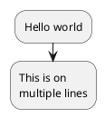
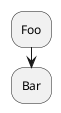
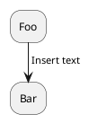
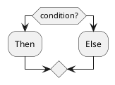
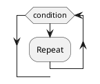
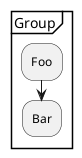
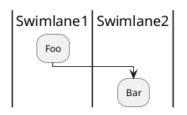
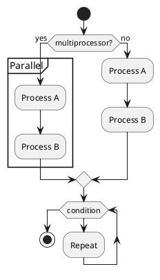

Here is a concise and simplified markdown specification for plantuml activity diagrams:

# Activity Diagrams

Activity diagrams visualize the flow of actions in a process. They consist of activities linked together with arrows showing the sequence.

## Activities

Activities are denoted by `:` and a label, ending with `;`.

## Sequence

Activities are linked sequentially in order of definition.

Use `->` to add text on arrows.

## Conditionals

Use `if`/`then`/`else` for conditionals.

## Loops

`while` loops repeat until condition is false.

## Partitions

Group activities using `partition` blocks.

## Swimlanes

Divide activities into lanes using `|` for swimlanes.

## Complete Example

