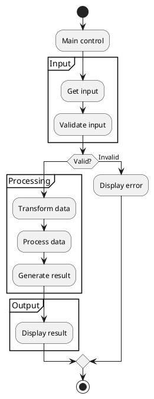

Here is a concise overview of key syntax for plantuml activity diagrams:

## Actions

Start action with `:` and end with `;`. Use creole for text styling.

```plantuml
:Hello **World**;
```

## Start/Stop/End

```plantuml
start
:Foo;
stop
``` 

## Conditional Blocks

Use `if`, `then`, `else`, `elseif` `endif`.

```plantuml  
if (test) then 
  :act;
elseif (test2) then
  :act2;
else
  :other act;
endif
```

## Loops

`while`, `repeat`

```plantuml
while (test)
  :act;
endwhile
```

## Forking

`fork`, `fork again`, `end fork`

```plantuml
fork
  :act1; 
fork again
  :act2;
end fork  
```

## Swimlanes

Pipe `|` for swimlanes. 
When swimlanes are used, a swimlane must be defined at the beginning of the diagram, before the first action.

```plantuml
@plantuml
|lane1|
start
:foo;
|lane2|
:bar;
@enduml
```

## Notes

`note left/right`

```plantuml
note right: explanation
```

## Partitions

`partition` blocks.

```plantuml
partition "foo" {
  :act; 
}
```

## Complete Example

