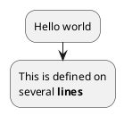
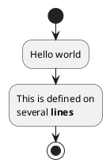
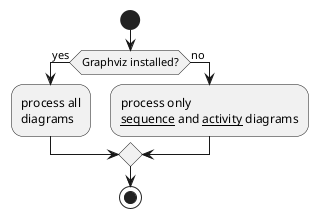
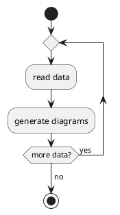
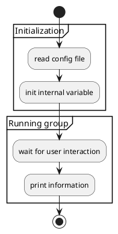
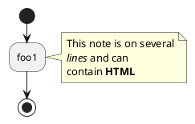
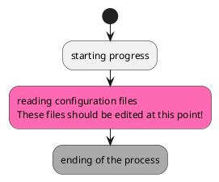
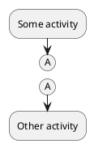

PlantUML's activity diagram allows you to visually represent workflows of stepwise activities and actions with support for choice, iteration and concurrency. It offers a new syntax that doesn't require Graphviz installation and is easier to maintain.

To define an activity, use a label that starts with `:` and ends with `;`. Activities are linked in the order they are defined. For example:

You can denote the start and end of a diagram using `start` and `stop` or `end` keywords:

Conditional statements can be added using `if`, `then` and `else` keywords:

You can use `repeat` and `repeat while` keywords to create loops:

Grouping of activities can be done using `group` or `partition`:

You can add notes using `note` keyword:

You can specify a color for some activities:

You can use parentheses to denote connector:

