Here is the plantuml activity diagram documentation converted to clean markdown:

# Activity Diagram (New Syntax)

The [previous syntax used for activity diagrams](https://plantuml.com/activity-diagram-legacy) encountered several limitations and maintainability issues. Recognizing these drawbacks, we have introduced a wholly revamped syntax and implementation that is not only user-friendly but also more stable.

## Benefits of the New Syntax

- No Dependency on Graphviz: Just like with sequence diagrams, the new syntax eliminates the necessity for Graphviz installation, thereby simplifying the setup process.

- Ease of Maintenance: The intuitive nature of the new syntax means it is easier to manage and maintain your diagrams.

## Transition to the New Syntax

While we will continue to support the old syntax to maintain compatibility, we highly encourage users to migrate to the new syntax to leverage the enhanced features and benefits it offers. Make the shift today and experience a more streamlined and efficient diagramming process with the new activity diagram syntax.

## Simple action

Activities label starts with `:` and ends with `;`. Text formatting can be done using [creole wiki syntax](https://plantuml.com/creole). They are implicitly linked in their definition order.

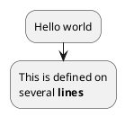

## Start/Stop/End

You can use `start` and `stop` keywords to denote the beginning and the end of a diagram.

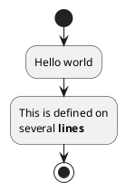

You can also use the `end` keyword.

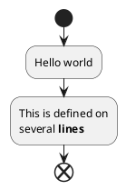

## Conditional

You can use `if`, `then` and `else` keywords to put tests in your diagram. Labels can be provided using parentheses. The 3 syntaxes are possible:

- `if (...) then (...)`

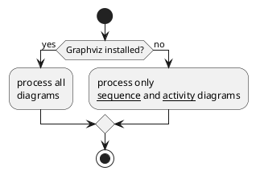

- `if (...) is (...) then`

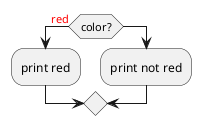

- `if (...) equals (...) then`

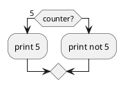

_[Ref. [QA-301](https://forum.plantuml.net/301/activity-diagram-beta?show=302#a302)]_

### Several tests (horizontal mode)

You can use the `elseif` keyword to have several tests _(by default, it is the horizontal mode)_:

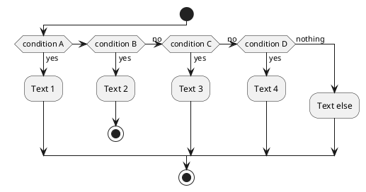

### Several tests (vertical mode)

You can use the command `!pragma useVerticalIf on` to have the tests in vertical mode:

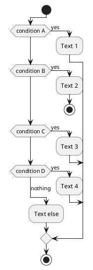

You can use the `-P`[command-line](https://plantuml.com/command-line) option to specify the pragma:

```
java -jar plantuml.jar -PuseVerticalIf=on
```

_[Ref. [QA-3931](https://forum.plantuml.net/3931/please-provide-elseif-structure-vertically-activity-diagrams), [issue-582](https://github.com/plantuml/plantuml/issues/582)]_

## Switch and case [switch, case, endswitch]

You can use `switch`, `case` and `endswitch` keywords to put switch in your diagram. Labels can be provided using parentheses.

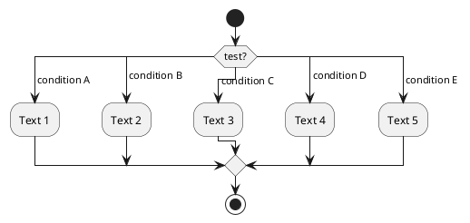

## Conditional with stop on an action [kill, detach]

You can stop action on a if loop.

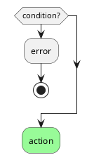

But if you want to stop at the precise action, you can use the `kill` or `detach` keyword:

- `kill`

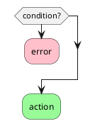

_[Ref. [QA-265](https://forum.plantuml.net/265/new-activity-diagram-syntax-direction-of-links?show=306#a306)]_

- `detach`


## Repeat loop

### Simple repeat loop

You can use `repeat` and `repeat while` keywords to have repeat loops.

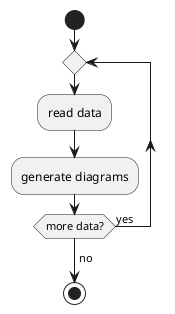

### Repeat loop with repeat action and backward action

It is also possible to use a full action as `repeat` target and insert an action in the return path using the `backward` keyword.

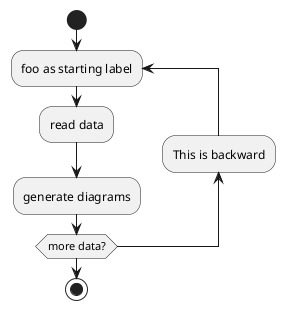

_[Ref. [QA-5826](https://forum.plantuml.net/5826/please-provide-action-repeat-loop-start-instead-condition?show=5831#a5831)]_

## Break on a repeat loop [break]

You can use the `break` keyword after an action on a loop.

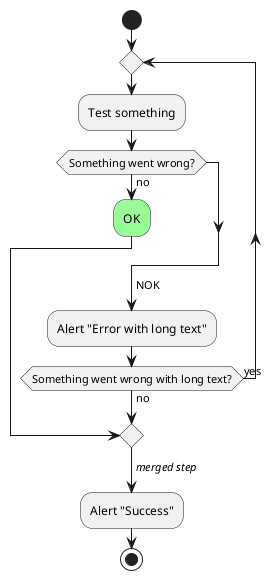

_[Ref. [QA-6105](https://forum.plantuml.net/6105/possible-to-draw-a-line-to-another-box-via-id-or-label?show=6107#a6107)]_

## Goto and Label Processing [label, goto]

⚠ It is currently only experimental 🚧 You can use `label` and `goto` keywords to denote goto processing, with:

- `label <label_name>`
- `goto <label_name>`

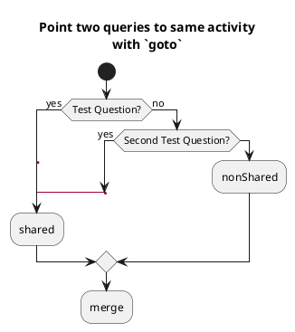

_[Ref. [QA-15026](https://forum.plantuml.net/15026/), [QA-12526](https://forum.plantuml.net/12526/) and initially [QA-1626](https://forum.plantuml.net/1626)]_

## While loop

### Simple while loop

You can use `while` and `endwhile` keywords to have while loop.

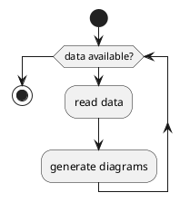

It is possible to provide a label after the `endwhile` keyword, or using the `is` keyword.

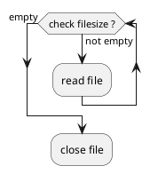

### While loop with backward action

It is also possible to insert an action in the return path using the `backward` keyword.

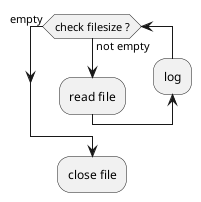

_[Ref. [QA-11144](https://forum.plantuml.net/11144/backward-for-while-endwhile)]_

### Infinite while loop

If you are using `detach` to form an infinite while loop, then you will want to also hide the partial arrow that results using `-[hidden]->`

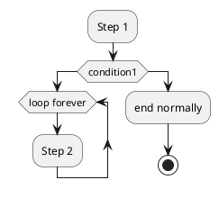

## Parallel processing [fork, fork again, end fork, end merge]

### Simple `fork`

```plantuml
@startuml
start
fork
  :action 1;
fork again
  :action 2;
end fork
stop
@enduml
```

### `fork` with end merge

```plantuml
@startuml
start
fork
  :action 1;
fork again
  :action 2;
end merge
stop
@enduml
```

_[Ref. [QA-5320](https://forum.plantuml.net/5320/please-provide-fork-without-join-with-merge-activity-diagrams?show=5321#a5321)]_

### Label on `end fork` (or UML joinspec):

```plantuml
@startuml
start
fork
  :action A;
fork again
  :action B;
end fork {or}
stop
@enduml
```

```plantuml
@startuml
start
fork
  :action A;
fork again
  :action B;
end fork {and}
stop
@enduml
```

_[Ref. [QA-5346](https://forum.plantuml.net/5346/please-inplement-joinspec-for-join-nodes?show=5348#a5348)]_

### Other example

```plantuml
@startuml

start

if (multiprocessor?) then (yes)
  fork
    :Treatment 1;
  fork again
    :Treatment 2;
  end fork
else (monoproc)
  :Treatment 1;
  :Treatment 2;
endif

@enduml
```

## Split processing

### Split

You can use `split`, `split again` and `end split` keywords to denote split processing.

```plantuml
@startuml
start
split
   :A;
split again
   :B;
split again
   :C;
split again
   :a;
   :b;
end split
:D;
end
@enduml
```

### Input split (multi-start)

You can use `hidden` arrows to make an input split (multi-start):

```plantuml
@startuml
split
   -[hidden]->
   :A;
split again
   -[hidden]->
   :B;
split again
   -[hidden]->
   :C;
end split
:D;
@enduml
```

```plantuml
@startuml
split
   -[hidden]->
   :A;
split again
   -[hidden]->
   :a;
   :b;
split again
   -[hidden]->
   (Z)
end split
:D;
@enduml
```

_[Ref. [QA-8662](https://forum.plantuml.net/8662)]_

### Output split (multi-end)

You can use `kill` or `detach` to make an output split (multi-end):

```plantuml
@startuml
start
split
   :A;
   kill
split again
   :B;
   detach
split again
   :C;
   kill
end split
@enduml
```

```plantuml
@startuml
start
split
   :A;
   kill
split again
   :b;
   :c;
   detach
split again
   (Z)
   detach
split again
   end
split again
   stop
end split
@enduml
```

## Notes

Text formatting can be done using [creole wiki syntax](https://plantuml.com/creole). A note can be floating, using `floating` keyword.

```plantuml
@startuml

start
:foo1;
floating note left: This is a note
:foo2;
note right
  This note is on several
  //lines// and can
  contain <b>HTML</b>
  ====
  * Calling the method "foo()" is prohibited
end note
stop

@enduml
```

You can add note on backward activity:

```plantuml
@startuml
start
repeat :Enter data;
:Submit;
backward :Warning;
note right: Note
repeat while (Valid?) is (No) not (Yes)
stop
@enduml
```

_[Ref. [QA-11788](https://forum.plantuml.net/11788/is-it-possible-to-add-a-note-to-backward-activity?show=11802#a11802)]_ You can add note on partition activity:

```plantuml
@startuml
start
partition "**process** HelloWorld" {
    note
        This is my note
        ----
        //Creole test//
    end note
    :Ready;
    :HelloWorld(i)>
    :Hello-Sent;
}
@enduml
```

_[Ref. [QA-2398](https://forum.plantuml.net/2398/is-it-possible-to-add-a-comment-on-top-of-a-activity-partition?show=2403#a2403)]_

## Colors

You can specify a [color](https://plantuml.com/color) for some activities.

```plantuml
@startuml

start
:starting progress;
#HotPink:reading configuration files
These files should be edited at this point!;
#AAAAAA:ending of the process;

@enduml
```

You can also use [gradient color](https://plantuml.com/color).

```plantuml
@startuml
start
partition #red/white testPartition {
        #blue\green:testActivity;
}
@enduml
```

_[Ref. [QA-4906](https://forum.plantuml.net/4906/setting-ad-hoc-gradient-backgrounds-in-activity?show=4917#a4917)]_

## Lines without arrows

You can use `skinparam ArrowHeadColor none` in order to connect activities using lines only, without arrows.

```plantuml
@startuml
skinparam ArrowHeadColor none
start
:Hello world;
:This is defined on
several **lines**;
stop
@enduml
```

```plantuml
@startuml
skinparam ArrowHeadColor none
start
repeat :Enter data;
:Submit;
backward :Warning;
repeat while (Valid?) is (No) not (Yes)
stop
@enduml
```

## Arrows

Using the `->` notation, you can add texts to arrow, and change their [color](https://plantuml.com/color). It's also possible to have dotted, dashed, bold or hidden arrows.

```plantuml
@startuml
:foo1;
-> You can put text on arrows;
if (test) then
  -[#blue]->
  :foo2;
  -[#green,dashed]-> The text can 
  also be on several lines
  and **very** long...;  
  :foo3;
else
  -[#black,dotted]->
  :foo4;
endif
-[#gray,bold]->  
:foo5;
@enduml
```

## Connector

You can use parentheses to denote connector.

```plantuml
@startuml
:Some activity;
(A)
detach
(A)
:Other activity;
@enduml
```

## Color on connector

You can add [color](https://plantuml.com/color) on connector.

```plantuml
@startuml
start
:The connector below
wishes he was blue;
#blue:(B)
:This next connector
feels that she would
be better off green;
#green:(G)
stop
@enduml
```

_[Ref. [QA-10077](https://forum.plantuml.net/10077/assigning-color-to-connectors?show=10080#c10080)]_

## Grouping or partition

### Group

You can group activity together by defining group:

```plantuml
@startuml
start
group Initialization 
    :read config file;
    :init internal variable;
end group
group Running group
    :wait for user interaction;
    :print information;
end group

stop
@enduml
```

### Partition

You can group activity together by defining partition:

```plantuml
@startuml
start
partition Initialization {
    :read config file;
    :init internal variable;
}
partition Running {
    :wait for user interaction;
    :print information;
}

stop
@enduml
```

It's also possible to change partition [color](https://plantuml.com/color):

```plantuml
@startuml
start
partition #lightGreen "Input Interface" {
    :read config file;
    :init internal variable;
}
partition Running {
    :wait for user interaction;
    :print information;
}
stop
@enduml
```

_[Ref. [QA-2793](https://forum.plantuml.net/2793/activity-beta-partition-name-more-than-one-word-does-not-work?show=2798#a2798)]_ It's also possible to add [link](https://plantuml.com/link) to partition:

```plantuml
@startuml
start
partition "[[http://plantuml.com partition_name]]" {
    :read doc. on [[http://plantuml.com plantuml_website]];
    :test diagram;
}
end
@enduml
```

_[Ref. [QA-542](https://forum.plantuml.net/542/ability-to-define-hyperlink-on-diagram-elements?show=14003#c14003)]_

### Group, Partition, Package, Rectangle or Card

You can group activity together by defining:

- group;
- partition;
- package;
- rectangle;
- card.

```plantuml
@startuml
start
group Group
  :Activity;
end group
floating note: Note on Group

partition Partition {
  :Activity;
}
floating note: Note on Partition

package Package {
  :Activity;
}
floating note: Note on Package 

rectangle Rectangle {
  :Activity;
}
floating note: Note on Rectangle 

card Card {
  :Activity;
}
floating note: Note on Card
end
@enduml
```

## Swimlanes

Using pipe `|`, you can define swimlanes. It's also possible to change swimlanes [color](https://plantuml.com/color).

```plantuml
@startuml
|Swimlane1|
start
:foo1;
|#AntiqueWhite|Swimlane2|
:foo2;
:foo3;
|Swimlane1|
:foo4;
|Swimlane2|
:foo5;
stop
@enduml
```

You can add `if` conditional or `repeat` or `while` loop within swimlanes.

```plantuml
@startuml
|#pink|Actor_For_red|
start
if (color?) is (<color:red>red) then
#pink:**action red**;
:foo1;
else (not red)
|#lightgray|Actor_For_no_red|
#lightgray:**action not red**;
:foo2;
endif
|Next_Actor|
#lightblue:foo3;
:foo4;
|Final_Actor|
#palegreen:foo5;
stop
@enduml
```

You can also use `alias` with swimlanes, with this syntax:

- `|[#<color>|]<swimlane_alias>| <swimlane_title>`

```plantuml
@startuml
|#palegreen|f| fisherman
|c| cook
|#gold|e| eater
|f|
start
:go fish;
|c|
:fry fish;
|e|
:eat fish;
stop
@enduml
```

_[Ref. [QA-2681](https://forum.plantuml.net/2681/possible-define-alias-swimlane-place-alias-everywhere-else?show=2685#a2685)]_

## Detach or kill [detach, kill]

It's possible to remove an arrow using the `detach` or `kill` keyword:

- `detach`

```plantuml
@startuml
 :start;
 fork
   :foo1;
   :foo2;
 fork again
   :foo3;
   detach
 endfork
 if (foo4) then
   :foo5;
   detach
 endif
 :foo6;
 detach
 :foo7;
 stop
@enduml
```

- `kill`

```plantuml
@startuml
 :start;
 fork
   :foo1;
   :foo2;
 fork again
   :foo3;
   kill
 endfork
 if (foo4) then
   :foo5;
   kill
 endif
 :foo6;
 kill
 :foo7;
 stop
@enduml
```

## SDL (Specification and Description Language)

### Table of SDL Shape Name

| Name | Old syntax | Stereotype syntax |
|-|-|-|  
| Input | `<` | `<<input>>` |
| Output | `>` | `<<output>>` |
| Procedure | `|` | `<<procedure>>` |
| Load | `\` | `<<load>>` |
| Save | `/` | `<<save>>` |
| Continuous | `}` | `<<continuous>>` |
| Task | `]` | `<<task>>` |

_[Ref. [QA-11518](https://forum.plantuml.net/11518/issues-with-final-separator-latex-math-expression-activity?show=17268#a17268), [GH-1270](https://github.com/plantuml/plantuml/discussions/1270)]_

### SDL using final separator (Deprecated form)

By changing the final `;` separator, you can set different rendering for the activity:

- `|`
- `<`
- `>`
- `/`
- `\\`
- `]`
- `}`

```plantuml
@startuml
:Ready;
:next(o)|
:Receiving;
split
 :nak(i)<;
 :ack(o)>
split again
 :ack(i)<;
 :next(o)
 on several lines|
 :i := i + 1]
 :ack(o)>
split again
 :err(i)<;
 :nak(o)>
split again
 :foo/
split again
 :bar\\
split again
 :i > 5}
stop
end split
:finish;
@enduml
```

### SDL using Normal separator and Stereotype (Current offiial form)

```plantuml
@startuml
start
:SDL Shape;
:input; <<input>>
:output; <<output>>
:procedure; <<procedure>>
:load; <<load>>
:save; <<save>>
:continuous; <<continuous>>
:task; <<task>>
end
@enduml
```

```plantuml
@startuml
:Ready;
:next(o); <<procedure>>
:Receiving;
split
 :nak(i); <<input>>
 :ack(o); <<output>>
split again
 :ack(i); <<input>>
 :next(o)
 on several lines; <<procedure>>
 :i := i + 1; <<task>>
 :ack(o); <<output>>
split again
 :err(i); <<input>>
 :nak(o); <<output>>
split again
 :foo; <<save>>
split again
 :bar; <<load>>
split again
 :i > 5; <<continuous>>
stop
end split
:finish;
@enduml
```

## Complete example

```plantuml
@startuml

start
:ClickServlet.handleRequest();
:new page;
if (Page.onSecurityCheck) then (true)
  :Page.onInit();
  if (isForward?) then (no)
    :Process controls;
    if (continue processing?) then (no)
      stop
    endif

    if (isPost?) then (yes)
      :Page.onPost();
    else (no)
      :Page.onGet();
    endif
    :Page.onRender();
  endif
else (false)
endif

if (do redirect?) then (yes)
  :redirect process;
else
  if (do forward?) then (yes)
    :Forward request;
  else (no)
    :Render page template;
  endif
endif

stop

@enduml
```

## Condition Style

### Inside style (by default)

```plantuml
@startuml
skinparam conditionStyle inside
start
repeat
  :act1;
  :act2;
repeatwhile (<b>end)
:act3;
@enduml
```

```plantuml
@startuml
start
repeat
  :act1;
  :act2;
repeatwhile (<b>end)
:act3;
@enduml
```

### Diamond style

```plantuml
@startuml
skinparam conditionStyle diamond
start
repeat
  :act1;
  :act2;
repeatwhile (<b>end)
:act3;
@enduml
```

### InsideDiamond (or _Foo1_) style

```plantuml
@startuml
skinparam conditionStyle InsideDiamond
start
repeat
  :act1;
  :act2;
repeatwhile (<b>end)
:act3;
@enduml
```

```plantuml
@startuml
skinparam conditionStyle foo1
start
repeat
  :act1;
  :act2;
repeatwhile (<b>end)  
:act3;
@enduml
```
