PlantUML sequence diagrams are a powerful tool for visualizing interactions between different entities or participants. They use a simple syntax to denote messages sent between participants (`->`), with optional features like dotted arrows (`-->`) for distinct visualization, and reverse arrows (`<-` or `<--`) for improved readability.

Example:
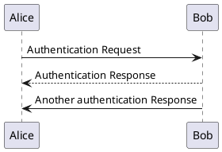

Participants can be declared using the `participant` keyword, allowing more control over their display order and visual representation. Different keywords like `actor`, `boundary`, `control`, etc., can be used to change the shape of the participant.

Example:
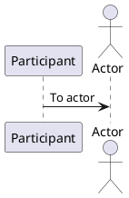

You can rename a participant using the `as` keyword and change the background color of an actor or participant.

Example:
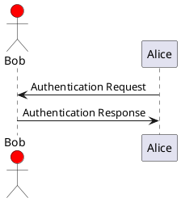

Messages can be sent to oneself and can be multiline using `\n`.

Example:
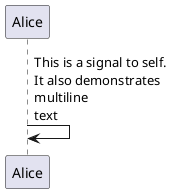

You can change the arrow style and color for better visualization.

Example:
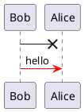

The `autonumber` keyword is used to automatically add an incrementing number to messages.

Example:
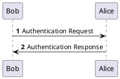

You can add a title to the page and display headers and footers using `header` and `footer`.

Example:
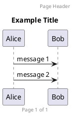

You can group messages together using keywords like `alt/else`, `opt`, `loop`, `par`, `break`, `critical`, and `group`.

Example:
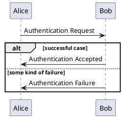

Notes can be added to messages or participants for additional information.

Example:
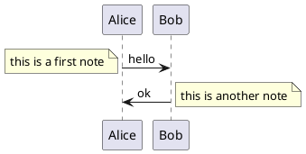

You can split a diagram using `==` separator to divide your diagram into logical steps.

Example:
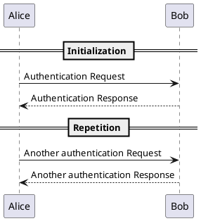

You can use reference in a diagram, using the keyword `ref over`.

Example:
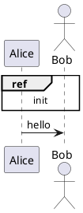