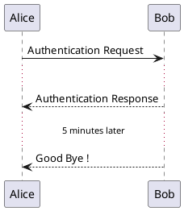

## Text wrapping

To break long messages, you can manually add `\n` in your text. Another option is to use `maxMessageSize` setting:

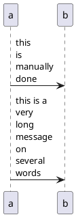

## Space

You can use `|||` to indicate some spacing in the diagram. It is also possible to specify a number of pixel to be used.

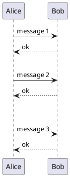

## Lifeline Activation and Destruction

The `activate` and `deactivate` are used to denote participant activation. Once a participant is activated, its lifeline appears. The `activate` and `deactivate` apply on the previous message. The `destroy` denote the end of the lifeline of a participant.

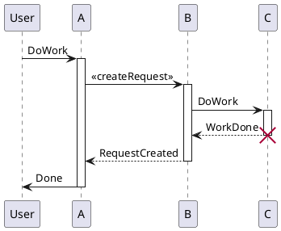

Nested lifeline can be used, and it is possible to add a [color](https://plantuml.com/color) on the lifeline.

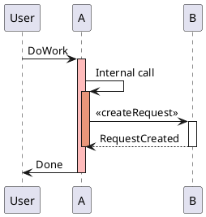

Autoactivation is possible and works with the return keywords:

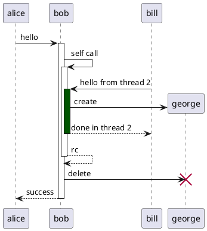

## Return

Command `return` generates a return message with optional text label. The return point is that which caused the most recent life-line activation. The syntax is `return label` where `label` if provided is any string acceptable for conventional messages.

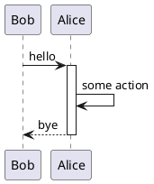

## Participant creation

You can use the `create` keyword just before the first reception of a message to emphasize the fact that this message is actually _creating_ this new object.

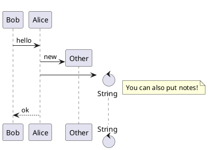

## Shortcut syntax for activation, deactivation, creation

Immediately after specifying the target participant, the following syntax can be used:

- `++` Activate the target (optionally a [color](https://plantuml.com/color) may follow this)
- `--` Deactivate the source
- `**` Create an instance of the target
- `!!` Destroy an instance of the target

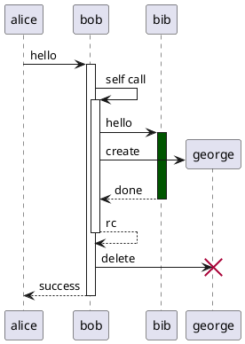

Then you can mix activation and deactivation, on same line:

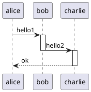

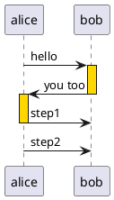

_\[Ref. [QA-4834](https://forum.plantuml.net/4834/activation-shorthand-for-sequence-diagrams?show=13054#c13054), [QA-9573](https://forum.plantuml.net/9573) and [QA-13234](https://forum.plantuml.net/13234)\]_

## Incoming and outgoing messages

You can use incoming or outgoing arrows if you want to focus on a part of the diagram. Use square brackets to denote the left "`[`" or the right "`]`" side of the diagram.

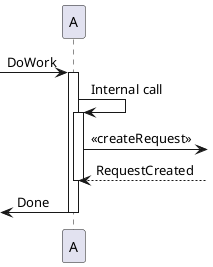

You can also have the following syntax:

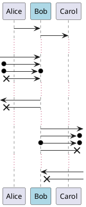

## Short arrows for incoming and outgoing messages

You can have **short** arrows with using `?`.

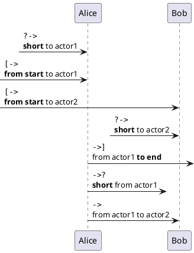

_\[Ref. [QA-310](https://forum.plantuml.net/310)\]_

## Anchors and Duration

With `teoz` it is possible to add anchors to the diagram and use the anchors to specify duration time.

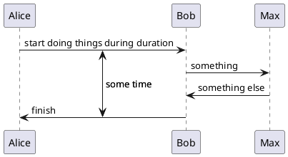

You can use the `-P`[command-line](https://plantuml.com/command-line) option to specify the pragma:

```
java -jar plantuml.jar -Pteoz=true
```

_\[Ref. [issue-582](https://github.com/plantuml/plantuml/issues/582)\]_

## Stereotypes and Spots

It is possible to add stereotypes to participants using `<<` and `>>`. In the stereotype, you can add a spotted character in a colored circle using the syntax `(X,color)`.

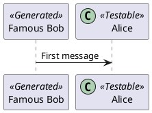

By default, the _guillemet_ character is used to display the stereotype. You can change this behavious using the skinparam `guillemet`:

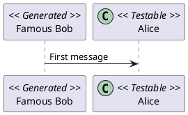

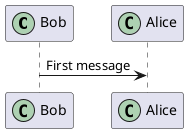

## More information on titles

You can use [creole formatting](https://plantuml.com/creole) in the title.

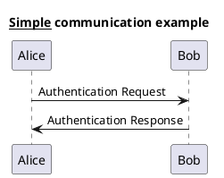

You can add newline using `\n` in the title description.

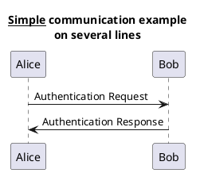

You can also define title on several lines using `title` and `end title` keywords.

```plantuml
@startuml

title
 <u>Simple</u> communication example
 on <i>several</i> lines and using <font color=red>html</font> 
 This is hosted by   
end title

Alice -> Bob: Authentication Request
Bob -> Alice: Authentication Response

@enduml
```

## Participants encompass

It is possible to draw a box around some participants, using `box` and `end box` commands. You can add an optional title or a optional background color, after the `box` keyword.

```plantuml
@startuml

box "Internal Service" #LightBlue
participant Bob
participant Alice  
end box
participant Other

Bob -> Alice : hello
Alice -> Other : hello

@enduml
```

It is also possible to nest boxes - to draw a box within a box - when using the teoz rendering engine, for example:

```plantuml
@startuml

!pragma teoz true
box "Internal Service" #LightBlue
participant Bob
box "Subteam"  
participant Alice
participant John
end box

end box
participant Other

Bob -> Alice : hello
Alice -> John : hello 
John -> Other: Hello

@enduml
```

## Removing Foot Boxes

You can use the `hide footbox` keywords to remove the foot boxes of the diagram.

```plantuml
@startuml

hide footbox
title Foot Box removed

Alice -> Bob: Authentication Request
Bob --> Alice: Authentication Response

@enduml
```

## Skinparam

You can use the [skinparam](https://plantuml.com/skinparam) command to change colors and fonts for the drawing. You can use this command:

- In the diagram definition, like any other commands,
- In an [included file](https://plantuml.com/preprocessing),
- In a configuration file, provided in the [command line](https://plantuml.com/command-line) or the [ANT task](https://plantuml.com/ant-task).

You can also change other rendering parameter, as seen in the following examples:

```plantuml
@startuml
skinparam sequenceArrowThickness 2
skinparam roundcorner 20 
skinparam maxmessagesize 60
skinparam sequenceParticipant underline

actor User
participant "First Class" as A
participant "Second Class" as B
participant "Last Class" as C

User -> A: DoWork
activate A

A -> B: Create Request
activate B

B -> C: DoWork  
activate C
C --> B: WorkDone
destroy C

B --> A: Request Created
deactivate B  

A --> User: Done
deactivate A

@enduml
```

```plantuml
@startuml
skinparam backgroundColor #EEEBDC
skinparam handwritten true

skinparam sequence {
ArrowColor DeepSkyBlue
ActorBorderColor DeepSkyBlue
LifeLineBorderColor blue
LifeLineBackgroundColor #A9DCDF

ParticipantBorderColor DeepSkyBlue
ParticipantBackgroundColor DodgerBlue
ParticipantFontName Impact
ParticipantFontSize 17
ParticipantFontColor #A9DCDF

ActorBackgroundColor aqua
ActorFontColor DeepSkyBlue  
ActorFontSize 17
ActorFontName Aapex
}

actor User
participant "First Class" as A
participant "Second Class" as B 
participant "Last Class" as C

User -> A: DoWork
activate A 

A -> B: Create Request
activate B

B -> C: DoWork
activate C
C --> B: WorkDone
destroy C

B --> A: Request Created  
deactivate B

A --> User: Done
deactivate A

@enduml
```

## Changing padding

It is possible to tune some padding settings.

```plantuml
@startuml
skinparam ParticipantPadding 20
skinparam BoxPadding 10

box "Foo1"
participant Alice1
participant Alice2
end box
box "Foo2"
participant Bob1
participant Bob2
end box
Alice1 -> Bob1 : hello
Alice1 -> Out : out
@enduml
```

## Appendix: Examples of all arrow type

### Normal arrow

```plantuml
@startuml
participant Alice as a
participant Bob   as b
a ->     b : ""->   ""
a ->>    b : ""->>  ""
a -\     b : ""-\   ""  
a -\\    b : ""-\\\\""
a -/     b : ""-/   ""
a -//    b : ""-//  ""
a ->x    b : ""->x  ""
a x->    b : ""x->  ""
a o->    b : ""o->  ""
a ->o    b : ""->o  ""
a o->o   b : ""o->o ""
a <->    b : ""<->  ""
a o<->o  b : ""o<->o""
a x<->x  b : ""x<->x""  
a ->>o   b : ""->>o ""
a -\o    b : ""-\o  ""
a -\\o   b : ""-\\\\o""
a -/o    b : ""-/o  ""
a -//o   b : ""-//o ""
a x->o   b : ""x->o ""
@enduml
```

### Itself arrow


```plantuml
@startuml
participant Alice as a
participant Bob   as b
a ->     a : ""->   ""
a ->>    a : ""->>  ""
a -\     a : ""-\   ""
a -\\    a : ""-\\\\""
a -/     a : ""-/   ""
a -//    a : ""-//  ""
a ->x    a : ""->x  ""
a x->    a : ""x->  ""
a o->    a : ""o->  ""
a ->o    a : ""->o  ""
a o->o   a : ""o->o ""
a <->    a : ""<->  ""
a o<->o  a : ""o<->o""
a x<->x  a : ""x<->x""
a ->>o   a : ""->>o ""
a -\o    a : ""-\o  ""
a -\\o   a : ""-\\\\o""
a -/o    a : ""-/o  ""
a -//o   a : ""-//o ""
a x->o   a : ""x->o ""
@enduml

```

Here are the additional examples of arrow types in PlantUML sequence diagrams:

### Incoming and outgoing messages (with '\[', '\]')

#### Incoming messages (with '\[')

```plantuml
@startuml
participant Alice as a
participant Bob   as b
[->      b : ""[->   ""
[->>     b : ""[->>  ""  
[-\      b : ""[-\   ""
[-\\     b : ""[-\\\\""
[-/      b : ""[-/   ""
[-//     b : ""[-//  ""
[->x     b : ""[->x  ""
[x->     b : ""[x->  ""
[o->     b : ""[o->  ""
[->o     b : ""[->o  ""
[o->o    b : ""[o->o ""
[<->     b : ""[<->  ""
[o<->o   b : ""[o<->o""
[x<->x   b : ""[x<->x""
[->>o    b : ""[->>o ""
[-\o     b : ""[-\o  ""
[-\\o    b : ""[-\\\\o""
[-/o     b : ""[-/o  ""
[-//o    b : ""[-//o ""
[x->o    b : ""[x->o ""
@enduml
```

#### Outgoing messages (with '\]')

```plantuml
@startuml
participant Alice as a
participant Bob   as b
a ->]      : ""->]   ""
a ->>]     : ""->>]  ""
a -\]      : ""-\]   ""
a -\\]     : ""-\\\\]""
a -/]      : ""-/]   ""
a -//]     : ""-//]  ""
a ->x]     : ""->x]  ""
a x->]     : ""x->]  ""
a o->]     : ""o->]  ""
a ->o]     : ""->o]  ""
a o->o]    : ""o->o] ""
a <->]     : ""<->]  ""
a o<->o]   : ""o<->o]""
a x<->x]   : ""x<->x]""
a ->>o]    : ""->>o] ""
a -\o]     : ""-\o]  ""
a -\\o]    : ""-\\\\o]""
a -/o]     : ""-/o]  ""
a -//o]    : ""-//o] ""
a x->o]    : ""x->o] ""
@enduml
```

### Short incoming and outgoing messages (with '?')

#### Short incoming (with '?')

```plantuml
@startuml
participant Alice as a
participant Bob   as b
a ->     b : //Long long label//
?->      b : ""?->   ""
?->>     b : ""?->>  ""
?-\      b : ""?-\   ""
?-\\     b : ""?-\\\\""
?-/      b : ""?-/   ""
?-//     b : ""?-//  ""
?->x     b : ""?->x  ""
?x->     b : ""?x->  ""
?o->     b : ""?o->  ""
?->o     b : ""?->o  ""
?o->o    b : ""?o->o ""  
?<->     b : ""?<->  ""
?o<->o   b : ""?o<->o""
?x<->x   b : ""?x<->x""
?->>o    b : ""?->>o ""
?-\o     b : ""?-\o  ""
?-\\o    b : ""?-\\\\o ""
?-/o     b : ""?-/o  ""
?-//o    b : ""?-//o ""
?x->o    b : ""?x->o "" 
@enduml
```

#### Short outgoing (with '?')

```plantuml
@startuml
participant Alice as a
participant Bob   as b
a ->     b : //Long long label//
a ->?      : ""->?   ""  
a ->>?     : ""->>?  ""
a -\?      : ""-\?   ""
a -\\?     : ""-\\\\?"" 
a -/?      : ""-/?   ""
a -//?     : ""-//?  ""
a ->x?     : ""->x?  ""
a x->?     : ""x->?  ""
a o->?     : ""o->?  ""
a ->o?     : ""->o?  ""
a o->o?    : ""o->o? ""
a <->?     : ""<->?  ""
a o<->o?   : ""o<->o?""
a x<->x?   : ""x<->x?""  
a ->>o?    : ""->>o? ""
a -\o?     : ""-\o?  ""
a -\\o?    : ""-\\\\o?""
a -/o?     : ""-/o?  "" 
a -//o?    : ""-//o? ""
a x->o?    : ""x->o? ""
@enduml
```

Hope this helps provide a comprehensive overview of the arrow styles and options available for sequence diagrams in PlantUML! Let me know if you need any clarification or have additional questions.