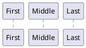

Here is the PlantUML sequence diagram documentation:

# Sequence Diagram

## Basic Examples

In PlantUML sequence diagrams, the `->` sequence denotes a message sent between two participants, which are automatically recognized and do not need to be declared beforehand. Utilize dotted arrows by employing the `-->` sequence, offering a distinct visualization in your diagrams. To improve readability without affecting the visual representation, use reverse arrows like `<-` or `<--`. However, be aware that this is specifically for sequence diagrams and the rules differ for other diagram types.

```plantuml
@startuml
Alice -&gt; Bob: Authentication Request
Bob --&gt; Alice: Authentication Response

Alice -&gt; Bob: Another authentication Request 
Alice &lt;-- Bob: Another authentication Response
@enduml
```

## Declaring participant

If the keyword `participant` is used to declare a participant, more control on that participant is possible. The order of declaration will be the (default) **order of display**. Using these other keywords to declare participants will **change the shape** of the participant representation:

- `actor`
- `boundary`
- `control`
- `entity`
- `database`
- `collections`
- `queue`

```plantuml
@startuml
participant Participant as Foo
actor       Actor       as Foo1
boundary    Boundary    as Foo2
control     Control     as Foo3
entity      Entity      as Foo4
database    Database    as Foo5
collections Collections as Foo6
queue       Queue       as Foo7
Foo -&gt; Foo1 : To actor  
Foo -&gt; Foo2 : To boundary
Foo -&gt; Foo3 : To control
Foo -&gt; Foo4 : To entity
Foo -&gt; Foo5 : To database
Foo -&gt; Foo6 : To collections
Foo -&gt; Foo7: To queue
@enduml
```

Rename a participant using the `as` keyword. You can also change the background [color](https://plantuml.com/color) of actor or participant.

```plantuml
@startuml
actor Bob #red
' The only difference between actor 
'and participant is the drawing
participant Alice
participant "I have a really\nlong name" as L #99FF99
/' You can also declare:
   participant L as "I have a really\nlong name"  #99FF99
  '/

Alice-&gt;Bob: Authentication Request
Bob-&gt;Alice: Authentication Response 
Bob-&gt;L: Log transaction
@enduml
```

You can use the `order` keyword to customize the display order of participants.



## Declaring participant on multiline

You can declare participant on multi-line.

```plantuml
@startuml
participant Participant [
    =Title
    ----
    ""SubTitle""
]

participant Bob 

Participant -&gt; Bob
@enduml
```

_\[Ref. [QA-15232](https://forum.plantuml.net/15232)\]_

## Use non-letters in participants

You can use quotes to define participants. And you can use the `as` keyword to give an alias to those participants.

```plantuml
@startuml
Alice -&gt; "Bob()" : Hello
"Bob()" -&gt; "This is very\nlong" as Long
' You can also declare:
' "Bob()" -&gt; Long as "This is very\nlong"   
Long --&gt; "Bob()" : ok
@enduml
```

## Message to Self

A participant can send a message to itself. It is also possible to have multi-line using `\n`.

```plantuml
@startuml
Alice -&gt; Alice: This is a signal to self.\nIt also demonstrates\nmultiline \ntext
@enduml
```

```plantuml
@startuml  
Alice &lt;- Alice: This is a signal to self.\nIt also demonstrates\nmultiline \ntext
@enduml
```

_\[Ref. [QA-1361](https://forum.plantuml.net/1361)\]_

## Text alignment

Text alignment on arrows can be set to `left`, `right` or `center` using `skinparam sequenceMessageAlign`. You can also use `direction` or `reverseDirection` to align text depending on arrow direction. Further details and examples of this are available on the [skinparam](https://plantuml.com/skinparam) page.

```plantuml
@startuml
skinparam sequenceMessageAlign right
Bob -&gt; Alice : Request 
Alice -&gt; Bob : Response
@enduml
```

### Text of response message below the arrow

You can put the text of the response message below the arrow, with the `skinparam responseMessageBelowArrow true` command.

```plantuml
@startuml
skinparam responseMessageBelowArrow true
Bob -&gt; Alice : hello
Alice -&gt; Bob : ok
@enduml
```

## Change arrow style

You can change arrow style by several ways:

- add a final `x` to denote a lost message
- use `\` or `/` instead of `<` or `>` to have only the bottom or top part of the arrow
- repeat the arrow head (for example, `>>` or `//`) head to have a thin drawing
- use `--` instead of `-` to have a dotted arrow
- add a final "o" at arrow head
- use bidirectional arrow `<->`

```plantuml
@startuml
Bob -&gt;x Alice
Bob -&gt; Alice
Bob -&gt;&gt; Alice
Bob -\ Alice
Bob \\- Alice  
Bob //-- Alice

Bob -&gt;o Alice
Bob o\\-- Alice

Bob &lt;-&gt; Alice
Bob &lt;-&gt;o Alice
@enduml
```

## Change arrow color

You can change the color of individual arrows using the following notation:

```plantuml
@startuml
Bob -[#red]&gt; Alice : hello
Alice -[#0000FF]-&gt;Bob : ok
@enduml
```

## Message sequence numbering

The keyword `autonumber` is used to automatically add an incrementing number to messages.

```plantuml
@startuml
autonumber
Bob -&gt; Alice : Authentication Request
Bob &lt;- Alice : Authentication Response  
@enduml
```

You can specify a startnumber with `autonumber <start>` , and also an increment with `autonumber <start> <increment>`.

```plantuml
@startuml
autonumber
Bob -&gt; Alice : Authentication Request
Bob &lt;- Alice : Authentication Response

autonumber 15 
Bob -&gt; Alice : Another authentication Request
Bob &lt;- Alice : Another authentication Response

autonumber 40 10
Bob -&gt; Alice : Yet another authentication Request 
Bob &lt;- Alice : Yet another authentication Response

@enduml
```

You can specify a format for your number by using between double-quote. The formatting is done with the Java class `DecimalFormat` (`0` means digit, `#` means digit and zero if absent). You can use some html tag in the format.

```plantuml
@startuml
autonumber "&lt;b&gt;[000]"
Bob -&gt; Alice : Authentication Request
Bob &lt;- Alice : Authentication Response

autonumber 15 "&lt;b&gt;(&lt;u&gt;##&lt;/u&gt;)"  
Bob -&gt; Alice : Another authentication Request
Bob &lt;- Alice : Another authentication Response

autonumber 40 10 "&lt;font color=red&gt;&lt;b&gt;Message 0  "
Bob -&gt; Alice : Yet another authentication Request 
Bob &lt;- Alice : Yet another authentication Response

@enduml
```

You can also use the value of `autonumber` with the `%autonumber%` variable:

```plantuml
@startuml
autonumber 10
Alice -&gt; Bob
note right
  the &lt;U+0025&gt;autonumber&lt;U+0025&gt; works everywhere.
  Here, its value is ** %autonumber% **   
end note
Bob --&gt; Alice: //This is the response %autonumber%//
@enduml
```

_\[Ref. [QA-7119](https://forum.plantuml.net/7119/create-links-after-creating-a-diagram?show=7137#a7137)\]_

## Page Title, Header and Footer

The `title` keyword is used to add a title to the page. Pages can display headers and footers using `header` and `footer`.

```plantuml

@startuml

header Page Header  
footer Page %page% of %lastpage%

title Example Title

Alice -&gt; Bob : message 1
Alice -&gt; Bob : message 2

@enduml
```

## Splitting diagrams

The `newpage` keyword is used to split a diagram into several images. You can put a title for the new page just after the `newpage` keyword. This title overrides the previously specified title if any. This is very handy with _Word_ to print long diagram on several pages. (Note: this really does work. Only the first page is shown below, but it is a display artifact.)

```plantuml
@startuml

Alice -&gt; Bob : message 1 
Alice -&gt; Bob : message 2

newpage 

Alice -&gt; Bob : message 3
Alice -&gt; Bob : message 4

newpage A title for the\nlast page

Alice -&gt; Bob : message 5
Alice -&gt; Bob : message 6
@enduml
```

## Grouping message

It is possible to group messages together using the following keywords:

- `alt/else`
- `opt`
- `loop`
- `par`
- `break`
- `critical`
- `group`, followed by a text to be displayed

It is possible to add a text that will be displayed into the header (for `group`, see next paragraph _'Secondary group label'_). The `end` keyword is used to close the group. Note that it is possible to nest groups.

```plantuml
@startuml
Alice -&gt; Bob: Authentication Request

alt successful case

    Bob -&gt; Alice: Authentication Accepted

else some kind of failure

    Bob -&gt; Alice: Authentication Failure
    group My own label
    Alice -&gt; Log : Log attack start
        loop 1000 times
            Alice -&gt; Bob: DNS Attack
        end
    Alice -&gt; Log : Log attack end 
    end

else Another type of failure

   Bob -&gt; Alice: Please repeat

end
@enduml
```

## Secondary group label

For `group`, it is possible to add, between`[` and `]`, a secondary text or label that will be displayed into the header.

```plantuml
@startuml
Alice -&gt; Bob: Authentication Request
Bob -&gt; Alice: Authentication Failure
group My own label [My own label 2]
    Alice -&gt; Log : Log attack start
    loop 1000 times
        Alice -&gt; Bob: DNS Attack
    end
    Alice -&gt; Log : Log attack end
end
@enduml 
```

_\[Ref. [QA-2503](https://forum.plantuml.net/2503)\]_

## Notes on messages

It is possible to put notes on message using the `note left` or `note right` keywords _just after the message_. You can have a multi-line note using the `end note` keywords.

```plantuml
@startuml
Alice-&gt;Bob : hello
note left: this is a first note

Bob-&gt;Alice : ok 
note right: this is another note

Bob-&gt;Bob : I am thinking
note left
a note  
can also be defined
on several lines
end note
@enduml
```

## Some other notes

It is also possible to place notes relative to participant with `note left of` , `note right of` or `note over` keywords. It is possible to highlight a note by changing its background [color](https://plantuml.com/color). You can also have a multi-line note using the `end note` keywords.

```plantuml
@startuml
participant Alice
participant Bob
note left of Alice #aqua
This is displayed  
left of Alice.
end note

note right of Alice: This is displayed right of Alice. 

note over Alice: This is displayed over Alice.

note over Alice, Bob #FFAAAA: This is displayed\n over Bob and Alice.

note over Bob, Alice  
This is yet another
example of 
a long note.
end note
@enduml
```

## Changing notes shape \[hnote, rnote\]

You can use `hnote` and `rnote` keywords to change note shapes :

- `hnote` for hexagonal note;
- `rnote` for rectangle note.

```plantuml
@startuml
caller -&gt; server : conReq
hnote over caller : idle
caller &lt;- server : conConf
rnote over server
 "r" as rectangle
 "h" as hexagon
endrnote
rnote over server
 this is
 on several
 lines
endrnote
hnote over caller
 this is
 on several
 lines
endhnote
@enduml
```

_\[Ref. [QA-1765](https://forum.plantuml.net/1765/is-it-possible-to-have-different-shapes-for-notes?show=1806#c1806)\]_

## Note over all participants \[across\]

You can directly make a note over all participants, with the syntax:

- `note across: note_description`

```plantuml
@startuml
Alice-&gt;Bob:m1
Bob-&gt;Charlie:m2
note over Alice, Charlie: Old method for note over all part. with:\n ""note over //FirstPart, LastPart//"".
note across: New method with:\n""note across""  
Bob-&gt;Alice
hnote across:Note across all part.
@enduml
```

_\[Ref. [QA-9738](https://forum.plantuml.net/9738)\]_

## Several notes aligned at the same level \[/\]

You can make several notes aligned at the same level, with the syntax `/`:

- without `/`_(by default, the notes are not aligned)_

```plantuml
@startuml
note over Alice : initial state of Alice
note over Bob : initial state of Bob
Bob -&gt; Alice : hello
@enduml
```

- with `/`_(the notes are aligned)_

```plantuml
@startuml
note over Alice : initial state of Alice 
/ note over Bob : initial state of Bob
Bob -&gt; Alice : hello
@enduml
```

_\[Ref. [QA-354](https://forum.plantuml.net/354)\]_

## Creole and HTML

[It is also possible to use creole formatting:](https://plantuml.com/creole)

```plantuml
@startuml

participant Alice
participant "The **Famous** Bob" as Bob

Alice -&gt; Bob : hello --there--
... Some ~~long delay~~ ...
Bob -&gt; Alice : ok
note left
  This is **bold**  
  This is //italics//
  This is ""monospaced""
  This is --stroked--
  This is __underlined__
  This is ~~waved~~  
end note

Alice -&gt; Bob : A //well formatted// message
note right of Alice
 This is &lt;back:cadetblue&gt;&lt;size:18&gt;displayed&lt;/size&gt;&lt;/back&gt;
 __left of__ Alice.  
end note
note left of Bob  
 &lt;u:red&gt;This&lt;/u&gt; is &lt;color #118888&gt;displayed&lt;/color&gt;
 **&lt;color purple&gt;left of&lt;/color&gt; &lt;s:red&gt;Alice&lt;/strike&gt; Bob**.
end note 
note over Alice, Bob
 &lt;w:#FF33FF&gt;This is hosted&lt;/w&gt; by &lt;img sourceforge.jpg&gt;
end note
@enduml
```

## Divider or separator

If you want, you can split a diagram using `==` separator to divide your diagram into logical steps.

```plantuml
@startuml

== Initialization ==

Alice -&gt; Bob: Authentication Request
Bob --&gt; Alice: Authentication Response

== Repetition ==

Alice -&gt; Bob: Another authentication Request
Alice &lt;-- Bob: Another authentication Response

@enduml
```

## Reference

You can use reference in a diagram, using the keyword `ref over`.

```plantuml
@startuml
participant Alice
actor Bob 

ref over Alice, Bob : init

Alice -&gt; Bob : hello

ref over Bob
  This can be on 
  several lines
end ref  
@enduml
```

## Delay

You can use `...` to indicate a delay in the diagram. And it is also possible to put a message with this delay.