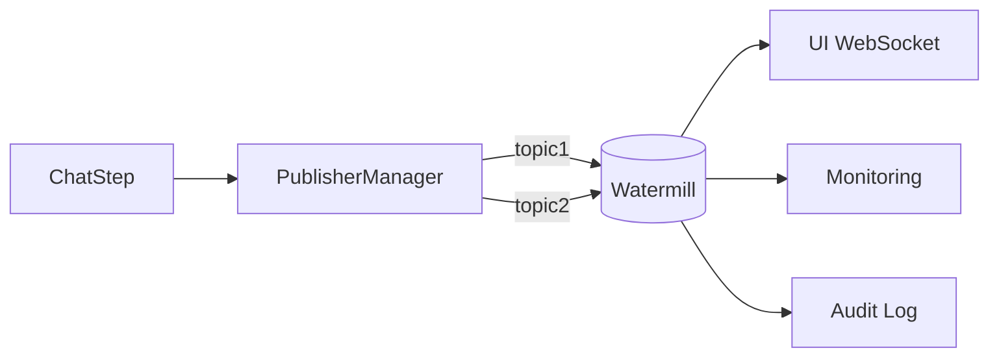

# Step Abstraction Pub/Sub Architecture with Watermill

## Core Components Interaction

![Architecture Diagram]
(Note: ASCII art placeholder - recommend generating actual diagram later)

1. **Step Implementation** (e.g. `ChatStep`)
2. **PublisherManager** (events/publish.go)
3. **Watermill** (message.Publisher interface)
4. **Event Types** (chat/events.go)

## Key Implementation Points

### 1. Event Publishing in Steps (`chat-step.go`)

The AI steps use a three-layer publishing system:

```go
// Simplified flow from chat-step.go
func (csf *ChatStep) Start(...) {
    // 1. Create metadata
    metadata := chat.EventMetadata{...}
    
    // 2. Publish start event
    csf.publisherManager.PublishBlind(
        chat.NewStartEvent(metadata, stepMetadata)
    )
    
    // 3. During streaming:
    csf.publisherManager.PublishBlind(
        chat.NewPartialCompletionEvent(...)
    )
}
```

### 2. PublisherManager Mechanics (`publish.go`)

The PublisherManager acts as a multiplexer:

```go
// Registration flow
func (s *PublisherManager) RegisterPublisher(topic string, sub message.Publisher) {
    s.Publishers[topic] = append(s.Publishers[topic], sub)
}

// Publishing sequence numbers
func (s *PublisherManager) Publish(payload interface{}) error {
    s.sequenceNumber++
    msg := message.NewMessage(..., b)
    msg.Metadata.Set("sequence_number", ...)
    
    for topic, subs := range s.Publishers {
        for _, sub := range subs {
            sub.Publish(topic, msg) // Watermill call
        }
    }
}
```

### 3. Watermill's Role

Watermill provides:
- Message routing backbone
- Publisher/subscriber interfaces
- Serialization/deserialization
- At-least-once delivery guarantees
- Pluggable backends (e.g. Kafka, Pub/Sub, NATS)

Critical integration points:
```go
// Step interface requires Watermill publisher
type Step interface {
    AddPublishedTopic(publisher message.Publisher, topic string) error
}

// Event serialization uses Watermill messages
msg := message.NewMessage(watermill.NewUUID(), b)
```

## Event Types and Flow (`events.go`)

The event system follows a state machine pattern:

```
Start → [PartialCompletion]* → (Final|Error|Interrupt)
       ↘ [ToolCall → ToolResult]*
```

Key event properties:
- Strong typing with `EventType` enum
- Zerolog integration for structured logging
- Watermill message metadata propagation

## Why This Architecture?

1. **Decoupling**: Steps don't know about subscribers
2. **Observability**: Sequence numbers enable event replay
3. **Extensibility**: New consumers can tap into existing streams
4. **Error Resilience**: Blind publishing prevents step failures from breaking event flow

## Typical Deployment Scenario



## Key Design Decisions

1. **Double Metadata**:
   - `StepMetadata` for execution context
   - `EventMetadata` for conversation tracking

2. **Sequence Numbers**:
   - Enable ordered processing despite async nature
   - Critical for replay/debugging

3. **Blind Publishing**:
   - Errors logged but don't abort step execution
   - Prevents cascading failures

## Common Patterns

**Adding a New Subscriber:**
```go
// In initialization code
step.AddPublishedTopic(watermillPublisher, "chat_events")

// Elsewhere in consumer
messages, _ := subscriber.Subscribe(ctx, "chat_events")
for msg := range messages {
    event, _ := chat.NewEventFromJson(msg.Payload)
    // Handle event...
    msg.Ack()
}
```

**Correlating Events:**
```go
// Using metadata fields
event.Metadata().ID          // Message correlation ID
event.StepMetadata().StepID  // Execution instance ID
msg.Metadata["sequence_number"] // Global ordering
```

## Limitations and Considerations

1. **Event Size**: Large messages may need chunking
2. **Backpressure**: No built-in flow control
3. **Serialization**: JSON-only without versioning
4. **Ordering Guarantees**: Only per-topic sequencing
```

This document combines analysis from:
- `chat-step.go` event publishing patterns
- `publish.go` multiplexing logic
- `events.go` type system
- `step.md` architectural concepts
