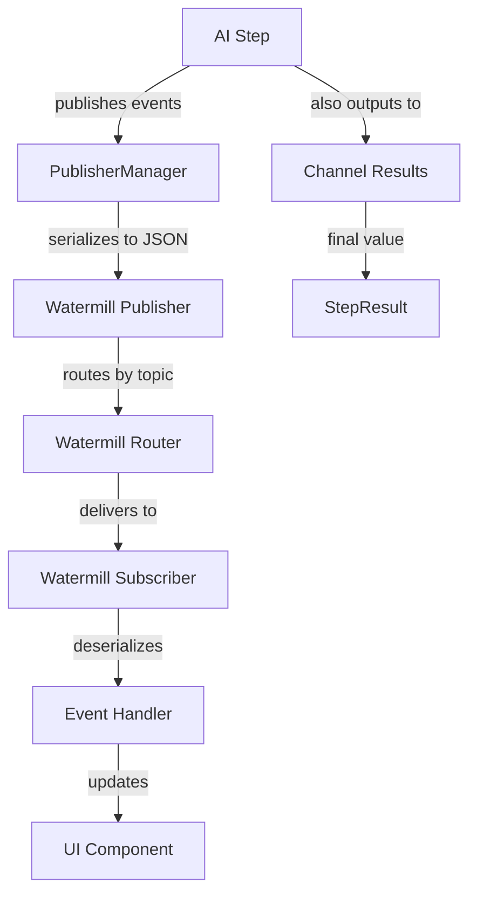
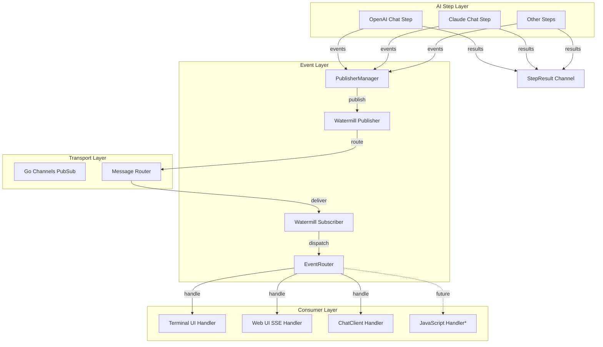
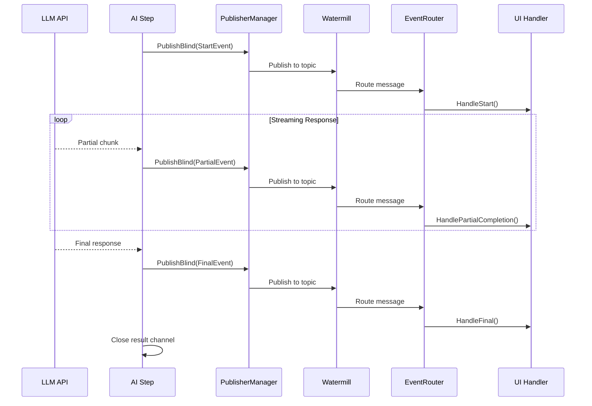
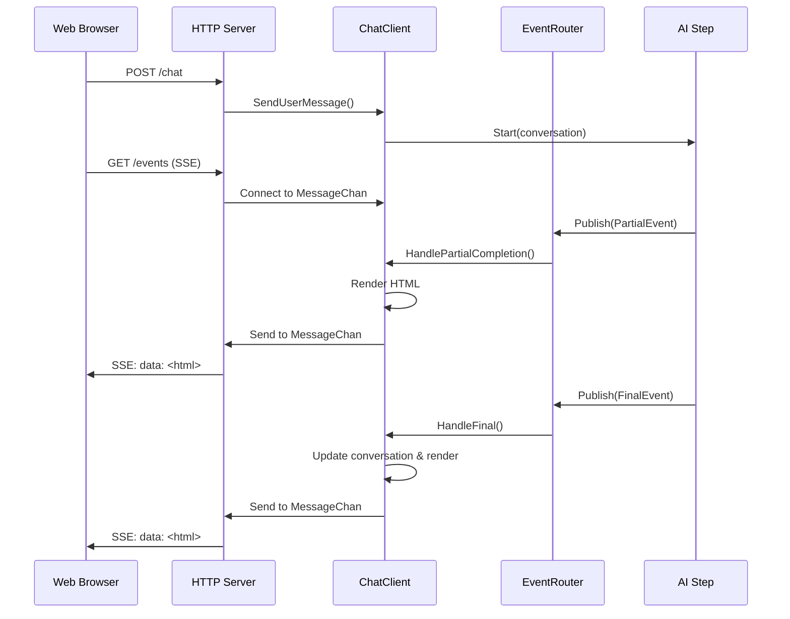

# Watermill Streaming Architecture Documentation

*Created: June 17, 2025*

## Table of Contents

1. [Overview](#overview)
2. [Core Components](#core-components)
3. [Event System Architecture](#event-system-architecture)
4. [Event Types and Structure](#event-types-and-structure)
5. [Streaming Flow: LLM to UI](#streaming-flow-llm-to-ui)
6. [Watermill Configuration and Setup](#watermill-configuration-and-setup)
7. [Publishers and Subscribers](#publishers-and-subscribers)
8. [Terminal UI Streaming Implementation](#terminal-ui-streaming-implementation)
9. [Web UI Streaming Implementation](#web-ui-streaming-implementation)
10. [Channel-Based Architecture](#channel-based-architecture)
11. [Code Examples](#code-examples)
12. [Architecture Diagrams](#architecture-diagrams)
13. [JavaScript Streaming Support Implementation Guide](#javascript-streaming-support-implementation-guide)

## Overview

The watermill streaming system in this codebase provides a robust event-driven architecture for real-time communication between AI steps (LLM inference) and user interfaces. Built on the [Watermill](https://github.com/ThreeDotsLabs/watermill) library, it enables streaming of partial results, tool calls, errors, and completion events from Go-based AI steps to various consumers including terminal UIs, web UIs, and potentially JavaScript clients.

### Key Benefits

- **Real-time streaming**: Partial completions are delivered as they arrive from LLM APIs
- **Decoupled architecture**: Publishers and subscribers are loosely coupled through Watermill topics
- **Multiple transport support**: Watermill supports various message brokers (in-memory channels, Kafka, NATS, etc.)
- **Type-safe events**: Strongly typed event system with JSON serialization
- **Cancellation support**: Steps can be interrupted with proper cleanup

## Core Components

### 1. Watermill Library
- **Publisher/Subscriber interfaces**: Standard abstractions for message transport
- **Message Router**: Routes messages between publishers and subscribers based on topics
- **Transport agnostic**: Supports Go channels, Kafka, RabbitMQ, and more
- **Message format**: UUID-identified messages with JSON payloads and metadata

### 2. Event System (`geppetto/pkg/events`)
- **Event types**: Strongly typed events for different streaming scenarios
- **Event router**: Wrapper around Watermill's router with enhanced functionality
- **Publisher manager**: Manages multiple publishers across different topics
- **JSON serialization**: Events are serialized to/from JSON for transport

### 3. Step Architecture (`geppetto/pkg/steps`)
- **Step interface**: All AI steps implement publisher topic registration
- **Step results**: Channel-based results with cancellation support
- **Metadata**: Rich metadata for tracing and monitoring

## Event System Architecture

### Event Flow Overview



### Event Router Architecture

The `EventRouter` serves as the central hub for event routing:

```go
type EventRouter struct {
    logger     watermill.LoggerAdapter
    Publisher  message.Publisher      // Publishes events
    Subscriber message.Subscriber     // Subscribes to events  
    router     *message.Router        // Watermill's message router
    verbose    bool
}
```

**Key responsibilities:**
- Creates and manages Watermill publisher/subscriber pairs
- Provides topic-based message routing
- Handles event deserialization and type dispatching
- Manages handler registration and lifecycle

## Event Types and Structure

### Base Event Interface

```go
type Event interface {
    Type() EventType
    Metadata() EventMetadata
    StepMetadata() *steps.StepMetadata
    Payload() []byte
}
```

### Core Event Types

| Event Type | Usage | Payload |
|------------|-------|---------|
| `EventTypeStart` | Signals start of streaming operation | Step metadata |
| `EventTypePartialCompletion` | Incremental text during streaming | `{delta, completion}` |
| `EventTypeToolCall` | LLM requested tool execution | `{id, name, input}` |
| `EventTypeToolResult` | Tool execution result | `{id, result}` |
| `EventTypeFinal` | Completion finished | `{text}` |
| `EventTypeError` | Error occurred | `{error_string}` |
| `EventTypeInterrupt` | User/system interrupted | `{text}` |

### Event Metadata Structure

```go
type EventMetadata struct {
    conversation.LLMMessageMetadata
    ID       conversation.NodeID `json:"message_id"`
    ParentID conversation.NodeID `json:"parent_id"`
}

type LLMMessageMetadata struct {
    Engine      string  `json:"engine"`
    Temperature *float64 `json:"temperature,omitempty"`
    TopP        *float64 `json:"top_p,omitempty"`
    MaxTokens   *int     `json:"max_tokens,omitempty"`
    Usage       *Usage   `json:"usage,omitempty"`
    StopReason  *string  `json:"stop_reason,omitempty"`
}
```

### Step Metadata Structure

```go
type StepMetadata struct {
    StepID     uuid.UUID              `json:"step_id"`
    Type       string                 `json:"type"`
    InputType  string                 `json:"input_type"`
    OutputType string                 `json:"output_type"`
    Metadata   map[string]interface{} `json:"meta"`
}
```

## Streaming Flow: LLM to UI

### 1. Step Initialization
```go
// AI step registers with publisher manager
step.AddPublishedTopic(publisher, "chat-session-123")
```

### 2. Streaming Start
```go
// Step publishes start event
publisherManager.PublishBlind(events.NewStartEvent(metadata, stepMetadata))
```

### 3. Partial Results
```go
// For each streaming chunk from LLM API
publisherManager.PublishBlind(
    events.NewPartialCompletionEvent(metadata, stepMetadata, delta, completion)
)
```

### 4. Final Result
```go
// When streaming completes
publisherManager.PublishBlind(events.NewFinalEvent(metadata, stepMetadata, fullText))
```

### 5. Error Handling
```go
// On any error
publisherManager.PublishBlind(events.NewErrorEvent(metadata, stepMetadata, err))
```

### Complete OpenAI Streaming Example

```go
func (csf *ChatStep) Start(ctx context.Context, messages conversation.Conversation) (steps.StepResult[*conversation.Message], error) {
    // Setup cancellation
    cancellableCtx, cancel := context.WithCancel(ctx)
    
    // Create event metadata
    metadata := events.EventMetadata{
        ID:       conversation.NewNodeID(),
        ParentID: parentID,
        LLMMessageMetadata: conversation.LLMMessageMetadata{
            Engine: string(*csf.Settings.Chat.Engine),
        },
    }
    
    stepMetadata := &steps.StepMetadata{
        StepID: uuid.New(),
        Type:   "openai-chat",
    }
    
    // Publish start event
    csf.publisherManager.PublishBlind(events.NewStartEvent(metadata, stepMetadata))
    
    // Create OpenAI stream
    stream, err := client.CreateChatCompletionStream(cancellableCtx, req)
    if err != nil {
        return steps.Reject[*conversation.Message](err), nil
    }
    
    // Process streaming results
    go func() {
        message := ""
        for {
            response, err := stream.Recv()
            if errors.Is(err, io.EOF) {
                // Final event
                csf.publisherManager.PublishBlind(
                    events.NewFinalEvent(metadata, stepMetadata, message)
                )
                return
            }
            if err != nil {
                csf.publisherManager.PublishBlind(
                    events.NewErrorEvent(metadata, stepMetadata, err)
                )
                return
            }
            
            // Partial completion event
            delta := response.Choices[0].Delta.Content
            message += delta
            csf.publisherManager.PublishBlind(
                events.NewPartialCompletionEvent(metadata, stepMetadata, delta, message)
            )
        }
    }()
    
    return stepResult, nil
}
```

## Watermill Configuration and Setup

### Basic EventRouter Setup
```go
router, err := events.NewEventRouter(
    events.WithLogger(watermillLogger),
    events.WithVerbose(true),
)
if err != nil {
    return fmt.Errorf("failed to create event router: %w", err)
}
```

### Default Configuration
The `NewEventRouter` function sets up:
- **Go channels pub/sub**: In-memory transport using `gochannel.NewGoChannel`
- **Message router**: Watermill's router for handler management
- **Logger**: Optional Watermill logger adapter
- **Blocking behavior**: `BlockPublishUntilSubscriberAck: true` ensures delivery

### Transport Configuration
```go
// In-memory (default)
goPubSub := gochannel.NewGoChannel(gochannel.Config{
    BlockPublishUntilSubscriberAck: true,
}, logger)

// For production, could use Kafka, NATS, etc.
// kafkaPubSub := kafka.NewPublisher(kafkaConfig, logger)
```

## Publishers and Subscribers

### PublisherManager

The `PublisherManager` distributes events to multiple publishers across topics:

```go
type PublisherManager struct {
    Publishers     map[string][]message.Publisher
    sequenceNumber uint64
    mutex          sync.Mutex
}
```

**Key features:**
- **Multi-topic support**: Register multiple publishers per topic
- **Sequence numbering**: Maintains global message ordering
- **Thread-safe**: Mutex-protected concurrent access
- **JSON serialization**: Automatically serializes payloads

**Usage:**
```go
pm := events.NewPublisherManager()
pm.RegisterPublisher("chat-events", watermillPublisher)
pm.Publish(eventObject) // Broadcasts to all registered publishers
```

### Event Handler Registration

```go
func (e *EventRouter) RegisterChatEventHandler(
    ctx context.Context,
    step chat.Step,
    id string,
    handler ChatEventHandler,
) error {
    topic := fmt.Sprintf("chat-%s", id)
    
    // Configure step to publish to this topic
    step.AddPublishedTopic(e.Publisher, topic)
    
    // Register handler for this topic
    e.AddHandler(
        fmt.Sprintf("chat-handler-%s", id),
        topic,
        createChatDispatchHandler(handler),
    )
    
    return nil
}
```

## Terminal UI Streaming Implementation

### Backend Integration (`pinocchio/pkg/ui/backend.go`)

The terminal UI uses the `StepChatForwardFunc` to transform Watermill messages into Bubbletea messages:

```go
func StepChatForwardFunc(p *tea.Program) func(msg *message.Message) error {
    return func(msg *message.Message) error {
        msg.Ack()
        
        // Deserialize event from Watermill message
        e, err := events.NewEventFromJson(msg.Payload)
        if err != nil {
            log.Error().Err(err).Msg("Failed to parse event")
            return err
        }
        
        // Create stream metadata for UI
        eventMetadata := e.Metadata()
        metadata := conversation2.StreamMetadata{
            ID:            eventMetadata.ID,
            ParentID:      eventMetadata.ParentID,
            StepMetadata:  e.StepMetadata(),
            EventMetadata: &eventMetadata,
        }
        
        // Dispatch to appropriate Bubbletea message
        switch e_ := e.(type) {
        case *events.EventPartialCompletion:
            p.Send(conversation2.StreamCompletionMsg{
                StreamMetadata: metadata,
                Delta:          e_.Delta,
                Completion:     e_.Completion,
            })
        case *events.EventFinal:
            p.Send(conversation2.StreamDoneMsg{
                StreamMetadata: metadata,
                Completion:     e_.Text,
            })
        case *events.EventError:
            p.Send(conversation2.StreamCompletionError{
                StreamMetadata: metadata,
                Err:            errors.New(e_.ErrorString),
            })
        // ... other event types
        }
        
        return nil
    }
}
```

### StepBackend Implementation

```go
type StepBackend struct {
    step       chat.Step
    stepResult steps.StepResult[*conversation.Message]
}

func (s *StepBackend) Start(ctx context.Context, msgs []*conversation.Message) (tea.Cmd, error) {
    stepResult, err := s.step.Start(ctx, msgs)
    if err != nil {
        return tea.Batch(func() tea.Msg {
            return boba_chat.BackendFinishedMsg{}
        }), nil
    }
    
    s.stepResult = stepResult
    
    // Wait for step completion in background
    return func() tea.Msg {
        stepChannel := s.stepResult.GetChannel()
        for range stepChannel {
            // Progress is handled through published events
        }
        return boba_chat.BackendFinishedMsg{}
    }, nil
}
```

## Web UI Streaming Implementation

### Server-Sent Events (SSE) Architecture

The web UI (`pinocchio/cmd/experiments/web-ui`) uses SSE for real-time streaming:

```go
func (s *Server) handleEvents(w http.ResponseWriter, r *http.Request) {
    clientID := r.URL.Query().Get("client_id")
    
    // Set SSE headers
    w.Header().Set("Content-Type", "text/event-stream")
    w.Header().Set("Cache-Control", "no-cache")
    w.Header().Set("Connection", "keep-alive")
    
    client_, _, err := s.getOrCreateClient(clientID)
    if err != nil {
        http.Error(w, "Error getting client", http.StatusInternalServerError)
        return
    }
    
    // Stream messages to client
    for {
        select {
        case msg := <-client_.MessageChan:
            fmt.Fprintf(w, "event: message\ndata: %s\n\n", msg)
            flusher.Flush()
        case <-time.After(30 * time.Second):
            fmt.Fprintf(w, "event: heartbeat\ndata: ping\n\n")
            flusher.Flush()
        }
    }
}
```

### ChatClient Event Handling

```go
type ChatClient struct {
    ID           string
    MessageChan  chan string
    router       *events.EventRouter
    step         chat.Step
}

func (c *ChatClient) HandlePartialCompletion(ctx context.Context, e *events.EventPartialCompletion) error {
    var buf strings.Builder
    err := components.AssistantMessage(time.Now(), e.Completion).Render(ctx, &buf)
    if err != nil {
        return fmt.Errorf("failed to render partial completion: %w", err)
    }
    
    // Send rendered HTML to SSE stream
    c.sendHTMLToClient(buf.String(), e.Type())
    return nil
}

func (c *ChatClient) HandleFinal(ctx context.Context, e *events.EventFinal) error {
    // Update conversation history
    c.mu.Lock()
    c.manager.AppendMessages(conversation.NewChatMessage(conversation.RoleAssistant, e.Text))
    conv := c.manager.GetConversation()
    c.mu.Unlock()
    
    // Render complete conversation
    var buf strings.Builder
    webConv, _ := web_conversation.ConvertConversation(conv)
    components.ConversationHistory(webConv, true).Render(ctx, &buf)
    
    c.sendHTMLToClient(buf.String(), e.Type())
    return nil
}
```

## Channel-Based Architecture

### StepResult Channel Pattern

The streaming architecture uses Go channels for delivering final results alongside Watermill events for progress updates:

```go
type StepResult[T any] interface {
    Return() []helpers.Result[T]          // Blocking: collect all results
    GetChannel() <-chan helpers.Result[T] // Streaming: receive as available
    Cancel()                              // Cancel the operation
    GetMetadata() *StepMetadata          // Get step information
}
```

### Dual Delivery Pattern

AI steps use a **dual delivery pattern**:

1. **Watermill events**: Real-time progress updates (partial completions, tool calls, errors)
2. **Channel results**: Final typed results for programmatic consumption

```go
// In AI step implementation
go func() {
    defer close(resultChannel)
    
    for streamChunk := range llmStream {
        // Send progress via Watermill
        publisherManager.PublishBlind(
            events.NewPartialCompletionEvent(metadata, stepMetadata, chunk.Delta, accumulated)
        )
    }
    
    // Send final result via channel
    resultChannel <- helpers.NewValueResult(finalMessage)
    
    // Send completion via Watermill
    publisherManager.PublishBlind(
        events.NewFinalEvent(metadata, stepMetadata, finalText)
    )
}()
```

### Cancellation Pattern

```go
func (m *StepResultImpl[T]) Cancel() {
    if m.cancel != nil {
        m.cancel() // Triggers context cancellation
    }
}

// In step implementation
select {
case <-cancellableCtx.Done():
    publisherManager.PublishBlind(
        events.NewInterruptEvent(metadata, stepMetadata, partialResult)
    )
    return
default:
    // Continue processing
}
```

## Code Examples

### Complete Chat Step with Streaming

```go
type ChatStep struct {
    Settings         *settings.StepSettings
    publisherManager *events.PublisherManager
}

func (csf *ChatStep) AddPublishedTopic(publisher message.Publisher, topic string) error {
    csf.publisherManager.RegisterPublisher(topic, publisher)
    return nil
}

func (csf *ChatStep) Start(ctx context.Context, messages conversation.Conversation) (steps.StepResult[*conversation.Message], error) {
    cancellableCtx, cancel := context.WithCancel(ctx)
    
    // Setup metadata
    metadata := events.EventMetadata{
        ID: conversation.NewNodeID(),
        LLMMessageMetadata: conversation.LLMMessageMetadata{
            Engine: string(*csf.Settings.Chat.Engine),
        },
    }
    
    stepMetadata := &steps.StepMetadata{
        StepID: uuid.New(),
        Type:   "openai-chat",
    }
    
    // Create result channel
    c := make(chan helpers.Result[*conversation.Message])
    ret := steps.NewStepResult[*conversation.Message](
        c,
        steps.WithCancel[*conversation.Message](cancel),
        steps.WithMetadata[*conversation.Message](stepMetadata),
    )
    
    // Start streaming
    csf.publisherManager.PublishBlind(events.NewStartEvent(metadata, stepMetadata))
    
    go func() {
        defer close(c)
        defer stream.Close()
        
        accumulated := ""
        
        for {
            select {
            case <-cancellableCtx.Done():
                csf.publisherManager.PublishBlind(
                    events.NewInterruptEvent(metadata, stepMetadata, accumulated)
                )
                c <- helpers.NewErrorResult[*conversation.Message](cancellableCtx.Err())
                return
                
            default:
                response, err := stream.Recv()
                if errors.Is(err, io.EOF) {
                    // Completion
                    csf.publisherManager.PublishBlind(
                        events.NewFinalEvent(metadata, stepMetadata, accumulated)
                    )
                    
                    message := conversation.NewMessage(
                        conversation.NewChatMessageContent(conversation.RoleAssistant, accumulated, nil),
                        conversation.WithLLMMessageMetadata(&metadata.LLMMessageMetadata),
                    )
                    c <- helpers.NewValueResult[*conversation.Message](message)
                    return
                }
                
                if err != nil {
                    csf.publisherManager.PublishBlind(
                        events.NewErrorEvent(metadata, stepMetadata, err)
                    )
                    c <- helpers.NewErrorResult[*conversation.Message](err)
                    return
                }
                
                // Partial completion
                delta := response.Choices[0].Delta.Content
                accumulated += delta
                
                csf.publisherManager.PublishBlind(
                    events.NewPartialCompletionEvent(metadata, stepMetadata, delta, accumulated)
                )
            }
        }
    }()
    
    return ret, nil
}
```

### Event Router Setup and Usage

```go
func setupEventRouting() error {
    // Create event router
    router, err := events.NewEventRouter(
        events.WithVerbose(true),
        events.WithLogger(helpers.NewWatermill(log.Logger)),
    )
    if err != nil {
        return err
    }
    
    // Create chat step
    step, err := openai.NewStep(settings)
    if err != nil {
        return err
    }
    
    // Create event handler
    handler := &MyEventHandler{}
    
    // Register chat handler
    err = router.RegisterChatEventHandler(ctx, step, "session-123", handler)
    if err != nil {
        return err
    }
    
    // Start router
    go func() {
        if err := router.Run(ctx); err != nil {
            log.Error().Err(err).Msg("Router failed")
        }
    }()
    
    // Start step
    result, err := step.Start(ctx, conversation)
    if err != nil {
        return err
    }
    
    // Process final results
    for r := range result.GetChannel() {
        if r.Error() != nil {
            log.Error().Err(r.Error()).Msg("Step error")
            continue
        }
        
        finalMessage := r.Unwrap()
        log.Info().Str("content", finalMessage.Content.GetContent()).Msg("Final result")
    }
    
    return nil
}

type MyEventHandler struct{}

func (h *MyEventHandler) HandlePartialCompletion(ctx context.Context, e *events.EventPartialCompletion) error {
    fmt.Printf("Partial: %s\n", e.Delta)
    return nil
}

func (h *MyEventHandler) HandleFinal(ctx context.Context, e *events.EventFinal) error {
    fmt.Printf("Final: %s\n", e.Text)
    return nil
}

func (h *MyEventHandler) HandleError(ctx context.Context, e *events.EventError) error {
    fmt.Printf("Error: %s\n", e.ErrorString)
    return nil
}

func (h *MyEventHandler) HandleInterrupt(ctx context.Context, e *events.EventInterrupt) error {
    fmt.Printf("Interrupted: %s\n", e.Text)
    return nil
}

func (h *MyEventHandler) HandleText(ctx context.Context, e *events.EventText) error {
    fmt.Printf("Text: %s\n", e.Text)
    return nil
}
```

## Architecture Diagrams

### Overall Streaming Architecture



### Event Flow Detail



### Web UI Streaming Detail



## JavaScript Streaming Support Implementation Guide

Based on the existing design document (`geppetto/ttmp/2025-06-16/01-design-streaming-js-api.md`), here's how to implement JavaScript streaming support for this watermill architecture:

### 1. Go Side Changes

#### Add Streaming Interface to Steps

```go
// In geppetto/pkg/steps/step.go
type StreamingStep[T any, U any] interface {
    Step[T, U]
    StartStream(ctx context.Context, input T, handler StreamEventHandler) (StreamResult[U], error)
}

type StreamEventHandler interface {
    OnStart(meta EventMetadata, stepMeta *StepMetadata) error
    OnPartialCompletion(delta, completion string, meta EventMetadata, stepMeta *StepMetadata) error
    OnToolCall(toolCall ToolCall, meta EventMetadata, stepMeta *StepMetadata) error
    OnToolResult(toolResult ToolResult, meta EventMetadata, stepMeta *StepMetadata) error
    OnFinal(text string, meta EventMetadata, stepMeta *StepMetadata) error
    OnError(err error, meta EventMetadata, stepMeta *StepMetadata) error
    OnInterrupt(text string, meta EventMetadata, stepMeta *StepMetadata) error
}

type StreamResult[T any] interface {
    StepResult[T]
    Cancel() error
}
```

#### JavaScript Bridge Implementation

```go
// In pinocchio/cmd/experiments/js/js/steps.go
func (s *StepWrapper) StartStream(call goja.FunctionCall, vm *goja.Runtime) goja.Value {
    input := call.Argument(0)
    handlerObj := call.Argument(1)
    
    // Convert handler object to Go interface
    handler := &jsStreamEventHandler{
        vm: vm,
        handlers: make(map[string]goja.Value),
    }
    
    if goja.IsObject(handlerObj) {
        obj := handlerObj.ToObject(vm)
        for _, key := range []string{"onStart", "onPartial", "onToolCall", "onFinal", "onError", "onInterrupt"} {
            if fn := obj.Get(key); !goja.IsUndefined(fn) {
                handler.handlers[key] = fn
            }
        }
    }
    
    // Start streaming
    result, err := s.step.StartStream(context.Background(), input, handler)
    if err != nil {
        panic(vm.ToValue(err))
    }
    
    // Return stream object
    return vm.ToValue(&StreamWrapper{
        result: result,
        vm: vm,
    })
}

type jsStreamEventHandler struct {
    vm       *goja.Runtime
    handlers map[string]goja.Value
}

func (h *jsStreamEventHandler) OnPartialCompletion(delta, completion string, meta EventMetadata, stepMeta *StepMetadata) error {
    if fn, ok := h.handlers["onPartial"]; ok && goja.IsFunction(fn) {
        event := map[string]interface{}{
            "type": "partial",
            "delta": delta,
            "completion": completion,
            "meta": meta,
            "step": stepMeta,
        }
        
        _, err := goja.AssertFunction(fn)(goja.Undefined(), h.vm.ToValue(event))
        return err
    }
    return nil
}

type StreamWrapper struct {
    result StreamResult[*conversation.Message]
    vm     *goja.Runtime
}

func (s *StreamWrapper) Cancel() error {
    return s.result.Cancel()
}
```

### 2. JavaScript API Design

```javascript
// JavaScript API usage
const stream = chatStep.startStream(conversation, {
    onStart: (event) => {
        console.log('Streaming started:', event.step.type);
    },
    
    onPartial: (event) => {
        // Update UI with delta
        appendToChat(event.delta);
        console.log('Partial:', event.completion);
    },
    
    onToolCall: (event) => {
        console.log('Tool call:', event.toolCall.name);
    },
    
    onFinal: (event) => {
        console.log('Final result:', event.text);
        finalizeChatMessage();
    },
    
    onError: (event) => {
        console.error('Error:', event.error);
    },
    
    onInterrupt: (event) => {
        console.log('Interrupted:', event.text);
    }
});

// Cancellation support
setTimeout(() => {
    stream.cancel();
}, 10000);

// Alternative: Async iterator support
for await (const event of chatStep.startStreamAsync(conversation)) {
    switch (event.type) {
        case 'partial':
            appendToChat(event.delta);
            break;
        case 'final':
            finalizeChatMessage(event.text);
            break;
        case 'error':
            showError(event.error);
            break;
    }
}
```

### 3. Event Type Definitions

```typescript
// geppetto.d.ts
export type StreamEvent =
    | { type: 'start'; meta: EventMetadata; step: StepMetadata }
    | { type: 'partial'; delta: string; completion: string; meta: EventMetadata; step: StepMetadata }
    | { type: 'tool-call'; toolCall: ToolCall; meta: EventMetadata; step: StepMetadata }
    | { type: 'tool-result'; toolResult: ToolResult; meta: EventMetadata; step: StepMetadata }
    | { type: 'final'; text: string; meta: EventMetadata; step: StepMetadata }
    | { type: 'error'; error: string; meta: EventMetadata; step: StepMetadata }
    | { type: 'interrupt'; text: string; meta: EventMetadata; step: StepMetadata };

export interface StreamOptions {
    onStart?: (event: Extract<StreamEvent, { type: 'start' }>) => void;
    onPartial?: (event: Extract<StreamEvent, { type: 'partial' }>) => void;
    onToolCall?: (event: Extract<StreamEvent, { type: 'tool-call' }>) => void;
    onToolResult?: (event: Extract<StreamEvent, { type: 'tool-result' }>) => void;
    onFinal?: (event: Extract<StreamEvent, { type: 'final' }>) => void;
    onError?: (event: Extract<StreamEvent, { type: 'error' }>) => void;
    onInterrupt?: (event: Extract<StreamEvent, { type: 'interrupt' }>) => void;
}

export interface StreamResult {
    cancel(): Promise<void>;
}

export interface EventMetadata {
    message_id: string;
    parent_id: string;
    engine?: string;
    temperature?: number;
    top_p?: number;
    max_tokens?: number;
    usage?: {
        input_tokens: number;
        output_tokens: number;
    };
    stop_reason?: string;
}

export interface StepMetadata {
    step_id: string;
    type: string;
    input_type: string;
    output_type: string;
    meta: Record<string, any>;
}
```

### 4. Integration with Existing Steps

Modify existing chat steps to support streaming:

```go
// In geppetto/pkg/steps/ai/openai/chat-step.go
func (csf *ChatStep) StartStream(
    ctx context.Context,
    messages conversation.Conversation,
    handler StreamEventHandler,
) (StreamResult[*conversation.Message], error) {
    
    // Use existing Start() method but add handler calls
    result, err := csf.Start(ctx, messages)
    if err != nil {
        return nil, err
    }
    
    // Create streaming wrapper that forwards events
    streamResult := &streamResultImpl[*conversation.Message]{
        StepResult: result,
        handler:    handler,
    }
    
    // Intercept events from publisher manager
    csf.publisherManager.RegisterHandler(func(event Event) {
        switch e := event.(type) {
        case *EventPartialCompletion:
            handler.OnPartialCompletion(e.Delta, e.Completion, e.Metadata(), e.StepMetadata())
        case *EventFinal:
            handler.OnFinal(e.Text, e.Metadata(), e.StepMetadata())
        // ... other event types
        }
    })
    
    return streamResult, nil
}
```

This implementation provides the foundation for JavaScript streaming support while maintaining compatibility with the existing Watermill-based architecture. The key insight is to bridge the Go event system with JavaScript callbacks, allowing JavaScript consumers to receive real-time streaming updates from AI steps.

## Conclusion

The Watermill streaming architecture provides a robust, scalable foundation for real-time AI step communication. Its event-driven design enables:

- **Decoupled components**: Steps, routers, and UIs operate independently
- **Multiple consumer support**: Terminal UI, web UI, and future JavaScript clients
- **Rich event semantics**: Typed events with comprehensive metadata
- **Transport flexibility**: Can use various message brokers through Watermill
- **Cancellation support**: Graceful interruption and cleanup

The architecture successfully bridges the gap between streaming LLM APIs and user interfaces, providing real-time feedback while maintaining clean separation of concerns. The upcoming JavaScript streaming support will extend this capability to JavaScript environments, enabling rich client-side applications with real-time AI interactions.
