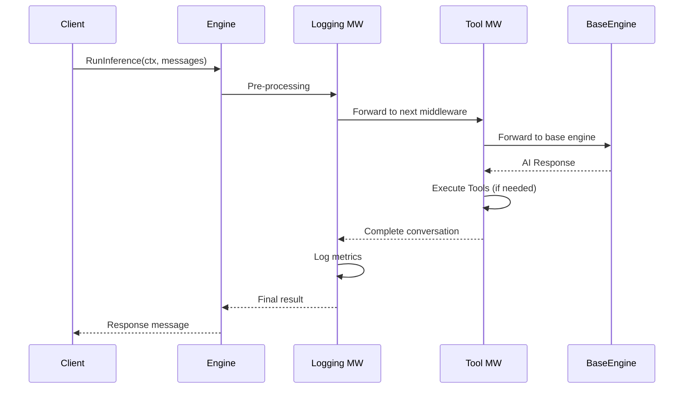

# Engine Middleware Implementation Guide

**Date:** 2025-08-03  
**Target Audience:** Developers implementing AI inference systems  
**Prerequisites:** Familiarity with Go, basic understanding of middleware patterns  

## Quick Start

Here's the minimal code to get started with middleware:

```go
package main

import (
    "context"
    "fmt"
    "log/slog"
    "os"
    "time"
    
    "github.com/go-go-golems/geppetto/pkg/inference"
    "github.com/go-go-golems/geppetto/pkg/conversation"
    "github.com/go-go-golems/geppetto/pkg/events"
)

func main() {
    // Create base engine
    factory := inference.NewStandardEngineFactory()
    baseEngine, _ := factory.CreateEngine(settings)
    
    // Create logger
    logger := slog.New(slog.NewJSONHandler(os.Stdout, nil))
    
    // Add simple logging middleware
    loggingMw := NewLoggingMiddleware(&StructuredLogger{logger: logger}, nil)
    engine := NewEngineWithMiddleware(baseEngine, loggingMw)
    
    // Use normally
    messages := conversation.New(
        conversation.NewUserMessage("Hello, world!"),
    )
    response, err := engine.RunInference(context.Background(), messages)
    if err != nil {
        fmt.Printf("Error: %v\n", err)
        return
    }
    fmt.Printf("Response: %s\n", response.Content.View())
    // Logging middleware automatically logs request/response
}
```

**Key Terms:**

- **Engine**: Core AI inference interface (`RunInference(ctx, messages) → (*Message, error)`)
- **HandlerFunc**: Function that processes conversations (`(ctx, messages) → (conversation, error)`)
- **Middleware**: Function that wraps a HandlerFunc with additional functionality
- **Conversation**: Slice of messages representing a chat history
- **EventSink**: System for publishing streaming events to UI/monitoring

## Critical Implementation Notes

### Message Mutability Rules

- **Input messages are IMMUTABLE**: Always clone before modification
- **Output conversations can be modified**: Middleware can transform the result
- **Thread Safety**: Toolbox implementations must be goroutine-safe
- **Memory Management**: Clone conversations to prevent memory leaks

### Security Considerations

- **PII Scrubbing**: Always sanitize logs to remove sensitive data
- **Tool Isolation**: Tools should run with minimal permissions
- **Input Validation**: Validate all tool arguments before execution
- **Error Disclosure**: Don't expose internal details in user-facing errors

## Introduction

The Engine middleware system extends the simple `RunInference` interface with composable functionality for tool calling, transformations, and logging. Instead of bloating the core Engine interface, middleware provides a clean way to add cross-cutting concerns while maintaining the Engine-first architecture's simplicity.

### Why Middleware Was Needed

The original Step API handled complex workflows through a chain of Steps, each implementing specific functionality like tool calling or message transformation. While powerful, this approach had significant drawbacks:

- **Complex interface contracts**: Steps required intricate lifecycle management
- **Poor composability**: Difficult to combine Steps in different ways
- **Performance overhead**: Channel-based communication for simple blocking operations
- **Testing complexity**: Integration tests required complex Step mocking

The Engine-first architecture solved these issues with a simple interface:

```go
type Engine interface {
    RunInference(ctx context.Context, messages conversation.Conversation) (*conversation.Message, error)
}
```

However, migrating from Steps revealed missing functionality: tool calling workflows, message transformations, and observability hooks. The middleware pattern bridges this gap by providing extensibility without interface complexity.

## Architecture Overview

Middleware functions intercept Engine calls to add functionality before, during, or after inference. The system uses functional composition inspired by Go's HTTP middleware pattern, enabling zero-allocation chains and excellent composability.

### Core Components

```
EngineWithMiddleware → Middleware Chain → Base Engine → AI Provider
        ↑                    ↓
   EventSink System ← Event Publishing
```

### Middleware Execution Timeline



The middleware pattern preserves the Engine interface while adding interception points for:

- **Pre-processing**: Message validation, transformation, caching checks
- **Post-processing**: Response transformation, logging, metrics collection  
- **Workflow expansion**: Tool calling loops, multi-step inference
- **Cross-cutting concerns**: Authentication, rate limiting, error handling

### Event System Integration

Middleware participates in the existing EventSink system through context propagation. Events flow to UI components, logging systems, and monitoring infrastructure without coupling middleware to specific event consumers.

## Core Implementation

### 1. Functional Middleware Interface

The system uses function-based middleware for zero-allocation composition and excellent ergonomics:

```go
// HandlerFunc represents a function that can process an inference request.
// It returns the complete conversation including any intermediate messages.
type HandlerFunc func(ctx context.Context, messages conversation.Conversation) (conversation.Conversation, error)

// Middleware wraps a HandlerFunc with additional functionality.
// Middleware are applied in order: Chain(m1, m2, m3) results in m1(m2(m3(handler))).
type Middleware func(HandlerFunc) HandlerFunc

// Chain composes multiple middleware into a single HandlerFunc.
func Chain(handler HandlerFunc, middlewares ...Middleware) HandlerFunc {
    // Apply middlewares in reverse order so they execute in correct order
    for i := len(middlewares) - 1; i >= 0; i-- {
        handler = middlewares[i](handler)
    }
    return handler
}
```

This pattern follows Go conventions established in `net/http` and provides familiar composition semantics.

### 2. Engine Adapter

Convert base Engine implementations to HandlerFunc interface:

```go
// EngineHandler adapts an Engine to HandlerFunc interface.
func EngineHandler(engine Engine) HandlerFunc {
    return func(ctx context.Context, messages conversation.Conversation) (conversation.Conversation, error) {
        response, err := engine.RunInference(ctx, messages)
        if err != nil {
            return nil, err
        }
        // Return the original conversation plus the new AI response
        return append(messages, response), nil
    }
}
```

### 3. Engine Wrapper

Implement Engine interface with middleware support:

```go
// EngineWithMiddleware wraps an Engine with a middleware chain.
type EngineWithMiddleware struct {
    handler HandlerFunc
    config  *Config
}

// NewEngineWithMiddleware creates a new engine with middleware support.
func NewEngineWithMiddleware(engine Engine, middlewares ...Middleware) *EngineWithMiddleware {
    handler := EngineHandler(engine)
    chainedHandler := Chain(handler, middlewares...)
    
    return &EngineWithMiddleware{
        handler: chainedHandler,
        config:  NewConfig(),
    }
}

// RunInference executes the middleware chain followed by the underlying engine.
func (e *EngineWithMiddleware) RunInference(ctx context.Context, messages conversation.Conversation) (*conversation.Message, error) {
    // Add EventSinks to context for middleware access
    ctx = events.WithSinks(ctx, e.config.EventSinks)
    
    // Clone messages to prevent mutation issues
    messages = conversation.Clone(messages)
    
    // Execute middleware chain and get complete conversation
    resultConversation, err := e.handler(ctx, messages)
    if err != nil {
        return nil, err
    }
    
    // Return the last message (the final AI response)
    if len(resultConversation) == 0 {
        return nil, fmt.Errorf("middleware returned empty conversation")
    }
    
    return resultConversation[len(resultConversation)-1], nil
}

// RunInferenceWithHistory returns the complete conversation including tool calls.
func (e *EngineWithMiddleware) RunInferenceWithHistory(ctx context.Context, messages conversation.Conversation) (conversation.Conversation, error) {
    ctx = events.WithSinks(ctx, e.config.EventSinks)
    messages = conversation.Clone(messages)
    return e.handler(ctx, messages)
}
```

## Tool Calling Middleware Implementation

Tool calling middleware handles function calling workflows for OpenAI and Claude, implementing the complex multi-step inference patterns that were previously handled by Step chains.

### Core Tool Calling Logic

```go
// ToolMiddleware handles function calling workflows for OpenAI/Claude.
func NewToolMiddleware(toolbox Toolbox, config ToolConfig) Middleware {
    return func(next HandlerFunc) HandlerFunc {
        return func(ctx context.Context, messages conversation.Conversation) (conversation.Conversation, error) {
            return executeToolWorkflow(ctx, messages, toolbox, config, next)
        }
    }
}

func executeToolWorkflow(
    ctx context.Context,
    messages conversation.Conversation,
    toolbox Toolbox,
    config ToolConfig,
    next HandlerFunc,
) (conversation.Conversation, error) {
    // Prevent infinite tool calling loops
    iterations := 0
    currentMessages := messages
    
    for iterations < config.MaxIterations {
        // Add tool descriptions to the conversation if needed
        enrichedMessages := addToolContext(currentMessages, toolbox)
        
        // Execute inference with tools available
        resultConversation, err := next(ctx, enrichedMessages)
        if err != nil {
            return nil, fmt.Errorf("tool inference failed: %w", err)
        }
        
        // Get the last message (AI response) from the result
        if len(resultConversation) == 0 {
            return nil, fmt.Errorf("empty conversation returned from inference")
        }
        aiResponse := resultConversation[len(resultConversation)-1]
        
        // Check if response contains tool calls
        toolCalls := extractToolCalls(aiResponse)
        if len(toolCalls) == 0 {
            // No more tool calls, return complete conversation
            return resultConversation, nil
        }
        
        // Publish tool calling event
        events.Dispatch(ctx, events.NewToolCallEvent(toolCalls))
        
        // Execute all tool calls
        toolResults, err := executeToolCalls(ctx, toolCalls, toolbox)
        if err != nil {
            return nil, fmt.Errorf("tool execution failed: %w", err)
        }
        
        // Update conversation with AI response and tool results
        currentMessages = resultConversation
        for _, result := range toolResults {
            currentMessages = append(currentMessages, result.ToMessage())
        }
        
        iterations++
    }
    
    return nil, fmt.Errorf("tool calling exceeded maximum iterations (%d)", config.MaxIterations)
}
```

### Tool Execution with Timeout Handling

```go
func executeToolCalls(ctx context.Context, toolCalls []ToolCall, toolbox Toolbox) ([]ToolResult, error) {
    results := make([]ToolResult, len(toolCalls))
    
    for i, call := range toolCalls {
        // Respect context timeout for each tool call
        childCtx, cancel := context.WithTimeout(ctx, 30*time.Second)
        defer cancel()
        
        result, err := toolbox.ExecuteTool(childCtx, call.Name, call.Arguments)
        if err != nil {
            results[i] = ToolResult{Error: err.Error()}
            events.Dispatch(ctx, events.NewToolErrorEvent(call.Name, err))
        } else {
            results[i] = ToolResult{Content: result}
            events.Dispatch(ctx, events.NewToolResultEvent(call.Name, result))
        }
    }
    
    return results, nil
}
```

### Tool Configuration

```go
type ToolConfig struct {
    MaxIterations int           // Prevent infinite loops
    Timeout       time.Duration // Per-tool execution timeout
    ToolFilter    []string      // Allow specific tools only
}

type Toolbox interface {
    ExecuteTool(ctx context.Context, name string, arguments map[string]interface{}) (interface{}, error)
    GetToolDescriptions() []ToolDescription
}
```

## Transformation Middleware Implementation

Transformation middleware applies input and output transformations while preserving the conversation flow. This replaces Step-based transformation patterns with a cleaner functional approach.

### Core Transformation Logic

```go
// NewTransformMiddleware applies transformations to input and/or output messages.
func NewTransformMiddleware(inputTransformer, outputTransformer MessageTransformer) Middleware {
    return func(next HandlerFunc) HandlerFunc {
        return func(ctx context.Context, messages conversation.Conversation) (conversation.Conversation, error) {
            // Transform input messages
            transformedMessages := messages
            if inputTransformer != nil {
                transformedMessages = make(conversation.Conversation, len(messages))
                for i, msg := range messages {
                    transformed, err := inputTransformer.Transform(msg)
                    if err != nil {
                        return nil, fmt.Errorf("input transformation failed: %w", err)
                    }
                    transformedMessages[i] = transformed
                }
            }
            
            // Execute inference
            resultConversation, err := next(ctx, transformedMessages)
            if err != nil {
                return nil, err
            }
            
            // Transform final output message if transformer provided
            if outputTransformer != nil && len(resultConversation) > 0 {
                lastIndex := len(resultConversation) - 1
                lastMessage := resultConversation[lastIndex]
                
                transformed, err := outputTransformer.Transform(lastMessage)
                if err != nil {
                    return nil, fmt.Errorf("output transformation failed: %w", err)
                }
                
                // Replace last message with transformed version
                resultConversation[lastIndex] = transformed
            }
            
            return resultConversation, nil
        }
    }
}
```

### Transformer Interface

```go
type MessageTransformer interface {
    Transform(message *conversation.Message) (*conversation.Message, error)
}

// Example: Uppercase transformer
type UppercaseTransformer struct{}

func (t *UppercaseTransformer) Transform(message *conversation.Message) (*conversation.Message, error) {
    if content, ok := message.Content.(*conversation.ChatMessageContent); ok {
        uppercased := &conversation.ChatMessageContent{
            Text: strings.ToUpper(content.Text),
        }
        return &conversation.Message{
            Role:    message.Role,
            Content: uppercased,
        }, nil
    }
    return message, nil
}

// Content filter transformer
type ContentFilterTransformer struct {
    blockedWords []string
}

func (t *ContentFilterTransformer) Transform(message *conversation.Message) (*conversation.Message, error) {
    if content, ok := message.Content.(*conversation.ChatMessageContent); ok {
        text := content.Text
        for _, word := range t.blockedWords {
            if strings.Contains(strings.ToLower(text), strings.ToLower(word)) {
                return nil, fmt.Errorf("content contains blocked word: %s", word)
            }
        }
    }
    return message, nil
}
```

### Practical Transformation Examples

```go
// Create transformers
inputFilter := &ContentFilterTransformer{
    blockedWords: []string{"inappropriate", "spam"},
}
outputFormatter := &UppercaseTransformer{}

// Create transformation middleware
transformMiddleware := NewTransformMiddleware(inputFilter, outputFormatter)

// Use in engine
engine := NewEngineWithMiddleware(baseEngine, transformMiddleware)
```

## Logging Middleware Implementation

Logging middleware provides comprehensive observability for inference operations without coupling to specific logging or metrics systems.

### Core Logging Logic

```go
// LoggingMiddleware provides request/response logging and metrics collection.
func NewLoggingMiddleware(logger Logger, metrics Metrics) Middleware {
    return func(next HandlerFunc) HandlerFunc {
        return func(ctx context.Context, messages conversation.Conversation) (conversation.Conversation, error) {
            start := time.Now()
            requestID := generateRequestID()
            
            // Add request ID to context for tracing
            ctx = context.WithValue(ctx, "request_id", requestID)
            
            // Log request
            logger.Info("inference_started", map[string]interface{}{
                "request_id":    requestID,
                "message_count": len(messages),
                "timestamp":     start,
                "user_content":  extractUserContent(messages),
            })
            
            // Execute inference
            resultConversation, err := next(ctx, messages)
            
            duration := time.Since(start)
            
            // Log response
            if err != nil {
                logger.Error("inference_failed", map[string]interface{}{
                    "request_id": requestID,
                    "error":      err.Error(),
                    "duration":   duration,
                })
                metrics.IncrementCounter("inference_errors")
                metrics.RecordDuration("inference_error_duration", duration)
            } else {
                responseSize := 0
                if len(resultConversation) > 0 {
                    responseSize = len(resultConversation[len(resultConversation)-1].Content.View())
                }
                
                logger.Info("inference_completed", map[string]interface{}{
                    "request_id":    requestID,
                    "duration":      duration,
                    "response_size": responseSize,
                    "message_count": len(resultConversation),
                })
                metrics.RecordDuration("inference_duration", duration)
                metrics.RecordGauge("response_size", float64(responseSize))
            }
            
            return resultConversation, err
        }
    }
}
```

### Logger and Metrics Interfaces

```go
type Logger interface {
    Info(message string, fields map[string]interface{})
    Error(message string, fields map[string]interface{})
    Debug(message string, fields map[string]interface{})
}

type Metrics interface {
    IncrementCounter(name string)
    RecordDuration(name string, duration time.Duration)
    RecordGauge(name string, value float64)
}

// Example implementation using structured logging
type StructuredLogger struct {
    logger *slog.Logger
}

func (l *StructuredLogger) Info(message string, fields map[string]interface{}) {
    l.logger.Info(message, fieldsToAttrs(fields)...)
}

func (l *StructuredLogger) Error(message string, fields map[string]interface{}) {
    l.logger.Error(message, fieldsToAttrs(fields)...)
}

func fieldsToAttrs(fields map[string]interface{}) []slog.Attr {
    attrs := make([]slog.Attr, 0, len(fields))
    for k, v := range fields {
        attrs = append(attrs, slog.Any(k, v))
    }
    return attrs
}
```

### Event Integration

```go
// EventLoggingMiddleware publishes detailed events for external systems
func NewEventLoggingMiddleware() Middleware {
    return func(next HandlerFunc) HandlerFunc {
        return func(ctx context.Context, messages conversation.Conversation) (conversation.Conversation, error) {
            // Publish inference start event
            events.Dispatch(ctx, events.NewInferenceStartEvent(messages))
            
            start := time.Now()
            resultConversation, err := next(ctx, messages)
            duration := time.Since(start)
            
            if err != nil {
                events.Dispatch(ctx, events.NewInferenceErrorEvent(err, duration))
            } else {
                events.Dispatch(ctx, events.NewInferenceCompleteEvent(resultConversation, duration))
            }
            
            return resultConversation, err
        }
    }
}
```

## Usage Patterns

### Basic Middleware Composition

Middleware executes in the order specified, with the first middleware executing first (outermost):

```go
// Create base engine
factory := inference.NewStandardEngineFactory()
baseEngine, err := factory.CreateEngine(settings)
if err != nil {
    return nil, err
}

// Create middleware components
toolMiddleware := NewToolMiddleware(toolbox, ToolConfig{
    MaxIterations: 5,
    Timeout:      30 * time.Second,
})
loggingMiddleware := NewLoggingMiddleware(logger, metrics)
transformMiddleware := NewTransformMiddleware(nil, &UppercaseTransformer{})

// Compose middleware chain
engine := NewEngineWithMiddleware(
    baseEngine,
    loggingMiddleware,    // Executes first (outermost)
    transformMiddleware, // Executes second  
    toolMiddleware,      // Executes third (innermost)
)

// Use like any engine - returns only final AI response
response, err := engine.RunInference(ctx, messages)

// Or get complete conversation history
fullConversation, err := engine.RunInferenceWithHistory(ctx, messages)
```

### Factory Integration

Integrate middleware through the existing EngineFactory options pattern:

```go
// Add middleware support to Config
type Config struct {
    EventSinks  []EventSink
    Middlewares []Middleware
}

func WithMiddleware(middleware Middleware) Option {
    return func(c *Config) error {
        if c.Middlewares == nil {
            c.Middlewares = make([]Middleware, 0)
        }
        c.Middlewares = append(c.Middlewares, middleware)
        return nil
    }
}

// Use through factory
engine, err := factory.CreateEngine(
    settings,
    inference.WithSink(uiSink),
    inference.WithMiddleware(NewToolMiddleware(toolbox, toolConfig)),
    inference.WithMiddleware(NewLoggingMiddleware(logger, metrics)),
)
```

### Tool Calling Workflow

Complete example of tool calling with multiple tools:

```go
// Define tools
toolbox := toolbox.New()
toolbox.RegisterTool("weather", &WeatherTool{apiKey: apiKey})
toolbox.RegisterTool("calculator", &CalculatorTool{})
toolbox.RegisterTool("database", &DatabaseTool{conn: dbConn})

// Configure tool middleware
toolConfig := ToolConfig{
    MaxIterations: 5,
    Timeout:      30 * time.Second,
    ToolFilter:   []string{"weather", "calculator"}, // Restrict available tools
}
toolMiddleware := NewToolMiddleware(toolbox, toolConfig)

// Create engine with tool support
engine := NewEngineWithMiddleware(baseEngine, toolMiddleware)

// Use with tool-capable messages
messages := conversation.New(
    conversation.NewUserMessage("What's the weather in San Francisco and what's 25 * 47?"),
)

// Get just the final response
response, err := engine.RunInference(ctx, messages)
// response.Content: "The weather in San Francisco is 72°F and sunny. 25 * 47 = 1,175."

// Get complete conversation history
fullConversation, err := engine.RunInferenceWithHistory(ctx, messages)
// fullConversation contains:
// 1. User: "What's the weather in San Francisco and what's 25 * 47?"
// 2. AI: [tool calls for weather and calculator]
// 3. Tool result: weather data
// 4. Tool result: calculation result  
// 5. AI: "The weather in San Francisco is 72°F and sunny. 25 * 47 = 1,175."
```

### Conditional Middleware

Implement middleware that executes based on context or message content:

```go
func NewConditionalMiddleware(condition func(context.Context, conversation.Conversation) bool, middleware Middleware) Middleware {
    return func(next HandlerFunc) HandlerFunc {
        return func(ctx context.Context, messages conversation.Conversation) (conversation.Conversation, error) {
            if condition(ctx, messages) {
                return middleware(next)(ctx, messages)
            }
            return next(ctx, messages)
        }
    }
}

// Example: Only apply tool middleware for specific users
userToolMiddleware := NewConditionalMiddleware(
    func(ctx context.Context, messages conversation.Conversation) bool {
        userID := ctx.Value("user_id").(string)
        return isToolUser(userID)
    },
    toolMiddleware,
)
```

## Migration from Step API

### Step-Based Tool Calling Migration

Replace Step chains with middleware composition:

**Before (Step API):**

```go
stepChain := steps.NewChain(
    steps.NewChatStep(settings),
    steps.NewToolStep(toolbox),
    steps.NewLoggingStep(logger),
)
```

**After (Middleware):**

```go
engine := NewEngineWithMiddleware(
    baseEngine,
    NewLoggingMiddleware(logger, metrics),
    NewToolMiddleware(toolbox, toolConfig),
)
```

### Transformation Step Migration

**Before:**

```go
stepChain := steps.NewChain(
    steps.NewTransformStep(transformer),
    steps.NewChatStep(settings),
)
```

**After:**

```go
engine := NewEngineWithMiddleware(
    baseEngine,
    NewTransformMiddleware(transformer, nil),
)
```

### Event Publishing Migration

**Before:**

```go
step := steps.NewChatStep(settings)
step.AddEventSink(watermillSink)
```

**After:**

```go
engine, err := factory.CreateEngine(
    settings,
    inference.WithSink(watermillSink),
    inference.WithMiddleware(NewEventLoggingMiddleware()),
)
```

## Testing Strategies

### Unit Testing Middleware

Test individual middleware components in isolation:

```go
func TestToolMiddleware(t *testing.T) {
    // Create mock engine
    mockEngine := &MockEngine{
        response: conversation.NewAssistantMessage("Use the calculator tool"),
    }
    
    // Create mock toolbox
    mockToolbox := &MockToolbox{
        tools: map[string]ToolResult{
            "calculator": {Content: "42"},
        },
    }
    
    // Create middleware
    middleware := NewToolMiddleware(mockToolbox, ToolConfig{
        MaxIterations: 3,
    })
    
    // Create handler chain
    handler := middleware(EngineHandler(mockEngine))
    
    // Test tool calling workflow
    messages := conversation.New(
        conversation.NewUserMessage("Calculate 6 * 7"),
    )
    
    result, err := handler(context.Background(), messages)
    
    assert.NoError(t, err)
    assert.Len(t, result, 4) // user + ai tool call + tool result + ai response
    assert.Contains(t, result[3].Content.View(), "42")
}
```

### Streaming Compatibility

Middleware operates at the message level and doesn't interfere with token streaming:

- EventSink system continues handling streaming events
- Middleware executes before/after streaming, not during
- No impact on streaming performance or latency

**Implementation Priority:**

1. Core middleware infrastructure (HandlerFunc, Chain, EngineWithMiddleware)
2. Tool calling middleware for OpenAI/Claude compatibility  
3. Logging middleware for observability
4. Transformation middleware for Step API migration
