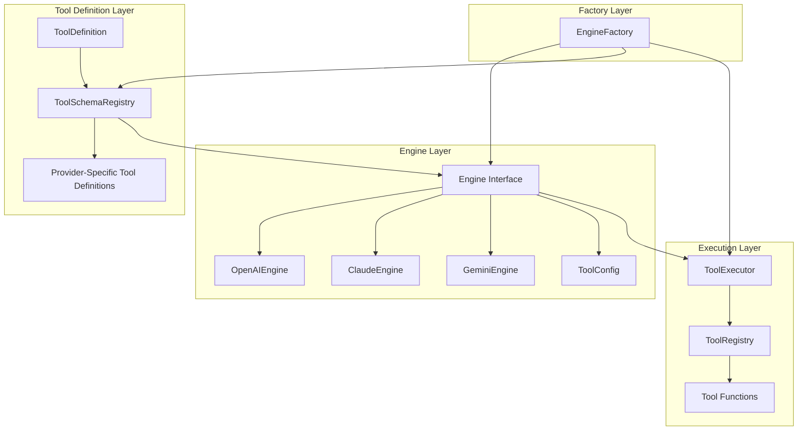

# Design for Better Tool-Calling Engine Setup

**Date**: August 6, 2025  
**Author**: AI Assistant  
**Status**: Draft  

## Executive Summary

This document outlines a design for implementing comprehensive tool-calling functionality across all AI providers in Geppetto (OpenAI, Claude, Gemini, etc.). The goal is to create a unified, provider-agnostic interface for tool calling while respecting the unique characteristics of each API.

## Current State

### What We Have
- Basic `Engine` interface that returns conversations
- Provider-specific engines (OpenAI, Claude, Gemini)
- Conversation types that support `ToolUseContent` and `ToolResultContent`
- Custom `OpenAIWithToolsEngine` prototype that demonstrates real API-level tool calling

### What We Need
- Standardized tool definition interface across providers
- Provider-agnostic tool execution workflow
- Integrated tool calling in all engine implementations
- Consistent error handling and validation
- Tool middleware that works with the new architecture

## Design Goals

1. **Provider Agnostic**: Same tool definition works across OpenAI, Claude, Gemini
2. **Type Safe**: Strong typing for tool definitions and execution
3. **Extensible**: Easy to add new providers and new tools
4. **Performant**: Minimal overhead for tool calling operations
5. **Debuggable**: Clear logging and error reporting throughout the tool calling flow
6. **Integrated**: Tool calling is a core capability of all engines, not an optional add-on


## Architecture Overview



## Core Interfaces

### 1. ToolDefinition Interface

```go
// ToolDefinition represents a tool that can be called by AI models
type ToolDefinition struct {
    Name        string                 `json:"name"`
    Description string                 `json:"description"`
    Parameters  *jsonschema.Schema     `json:"parameters"`
    Function    ToolFunc               `json:"-"` // Type-safe function wrapper
    Examples    []ToolExample          `json:"examples,omitempty"`
    Tags        []string               `json:"tags,omitempty"`
    Version     string                 `json:"version,omitempty"` // For provider compatibility
}

// ToolFunc wraps the actual function with validation and fast execution
type ToolFunc struct {
    Fn           interface{}         `json:"-"`  // The actual function
    executor     func([]byte) (interface{}, error) `json:"-"` // Pre-compiled executor
    inputType    reflect.Type        `json:"-"`  // Cached input type
    outputType   reflect.Type        `json:"-"`  // Cached output type
}

// NewToolFromFunc creates a ToolDefinition from a Go function
func NewToolFromFunc(name, description string, fn interface{}) (*ToolDefinition, error) {
    // Validate function signature, generate schema, create executor
}

type ToolExample struct {
    Input       map[string]interface{} `json:"input"`
    Output      interface{}            `json:"output"`
    Description string                 `json:"description"`
}

// ToolRegistry manages available tools with thread-safe operations
type ToolRegistry interface {
    RegisterTool(name string, def ToolDefinition) error
    GetTool(name string) (*ToolDefinition, error)
    ListTools() []ToolDefinition
    UnregisterTool(name string) error
    
    // Thread-safe registry operations
    Clone() ToolRegistry
    Merge(other ToolRegistry) ToolRegistry
}
```

### 2. Enhanced Engine Interface with Orchestration

```go
// Engine interface remains focused on provider-specific I/O
type Engine interface {
    // RunInference processes a conversation and returns the full updated conversation.
    // Does NOT handle tool execution - that's the orchestrator's job.
    RunInference(ctx context.Context, messages conversation.Conversation) (conversation.Conversation, error)
    
    // RunInferenceStream processes with streaming support
    RunInferenceStream(ctx context.Context, messages conversation.Conversation, chunkHandler StreamChunkHandler) error
    
    // GetSupportedToolFeatures returns what tool features this engine supports
    GetSupportedToolFeatures() ToolFeatures
    
    // PrepareToolsForRequest converts tools to provider-specific format
    PrepareToolsForRequest(tools []ToolDefinition, config ToolConfig) (interface{}, error)
}

// StreamChunkHandler processes streaming chunks that may include partial tool calls
type StreamChunkHandler func(chunk StreamChunk) error

type StreamChunk struct {
    Type       ChunkType       `json:"type"`
    Content    string          `json:"content,omitempty"`
    ToolCall   *PartialToolCall `json:"tool_call,omitempty"`
    IsComplete bool            `json:"is_complete"`
}

// InferenceOrchestrator handles tool execution iteration and coordination
type InferenceOrchestrator struct {
    engine       Engine
    toolRegistry ToolRegistry
    toolConfig   ToolConfig
    executor     ToolExecutor
}

func NewInferenceOrchestrator(engine Engine, registry ToolRegistry, config ToolConfig) *InferenceOrchestrator

func (o *InferenceOrchestrator) RunInference(ctx context.Context, messages conversation.Conversation) (conversation.Conversation, error)
func (o *InferenceOrchestrator) RunInferenceStream(ctx context.Context, messages conversation.Conversation, handler StreamChunkHandler) error

// ToolConfig specifies how tools should be used during inference
type ToolConfig struct {
    Enabled             bool              `json:"enabled"`
    ToolChoice          ToolChoice        `json:"tool_choice"`          
    MaxIterations       int               `json:"max_iterations"`       
    ExecutionTimeout    time.Duration     `json:"execution_timeout"`    
    MaxParallelTools    int               `json:"max_parallel_tools"`   // Replaces bool
    AllowedTools        []string          `json:"allowed_tools"`        
    ToolErrorHandling   ToolErrorHandling `json:"tool_error_handling"`  
    RetryConfig         RetryConfig       `json:"retry_config"`         
}

type RetryConfig struct {
    MaxRetries    int           `json:"max_retries"`
    BackoffBase   time.Duration `json:"backoff_base"`
    BackoffFactor float64       `json:"backoff_factor"`
}

type ToolChoice string
const (
    ToolChoiceAuto     ToolChoice = "auto"     // Let the model decide
    ToolChoiceNone     ToolChoice = "none"     // Never call tools
    ToolChoiceRequired ToolChoice = "required" // Must call at least one tool (with iteration limit)
)

type ToolErrorHandling string
const (
    ToolErrorContinue ToolErrorHandling = "continue" // Continue conversation with error message
    ToolErrorAbort    ToolErrorHandling = "abort"    // Stop inference on tool error
    ToolErrorRetry    ToolErrorHandling = "retry"    // Retry with exponential backoff
)
```

### 3. Provider-Specific Tool Adapters

```go
// ToolAdapter converts our generic ToolDefinition to provider-specific formats
type ToolAdapter interface {
    ConvertToProviderFormat(tool ToolDefinition) (interface{}, error)
    ConvertFromProviderResponse(response interface{}) ([]ToolCall, error)
    ValidateToolDefinition(tool ToolDefinition) error
    GetProviderLimits() ProviderLimits
}

type ProviderLimits struct {
    MaxToolsPerRequest    int    `json:"max_tools_per_request"`
    MaxToolNameLength     int    `json:"max_tool_name_length"`
    MaxTotalSizeBytes     int    `json:"max_total_size_bytes"`
    SupportedParameterTypes []string `json:"supported_parameter_types"`
}

// OpenAIToolAdapter converts to go_openai.Tool format
type OpenAIToolAdapter struct{}

func (a *OpenAIToolAdapter) ConvertToProviderFormat(tool ToolDefinition) (interface{}, error) {
    // Convert to go_openai.Tool with proper schema
    // Validate against OpenAI limits (64 tools, name length, etc.)
}

func (a *OpenAIToolAdapter) GetProviderLimits() ProviderLimits {
    return ProviderLimits{
        MaxToolsPerRequest: 64,
        MaxToolNameLength: 64,
        SupportedParameterTypes: []string{"string", "number", "integer", "boolean", "object", "array"},
    }
}

// ClaudeToolAdapter converts to Claude's tool format
type ClaudeToolAdapter struct{}

func (a *ClaudeToolAdapter) GetProviderLimits() ProviderLimits {
    return ProviderLimits{
        MaxToolsPerRequest: 20,
        MaxTotalSizeBytes: 51200, // 50KB total
        SupportedParameterTypes: []string{"string", "number", "integer", "boolean", "object", "array"},
    }
}

// GeminiToolAdapter converts to Gemini's function calling format  
type GeminiToolAdapter struct{}
```

### 4. Type-Safe Tool Execution Engine

```go
// ToolExecutor handles the execution of tool calls
type ToolExecutor interface {
    ExecuteToolCall(ctx context.Context, toolCall ToolCall, registry ToolRegistry) (*ToolResult, error)
    ExecuteToolCalls(ctx context.Context, toolCalls []ToolCall, registry ToolRegistry) ([]*ToolResult, error)
}


type ToolCall struct {
    ID        string          `json:"id"`
    Name      string          `json:"name"`
    Arguments json.RawMessage `json:"arguments"`
}

type ToolResult struct {
    ID       string      `json:"id"`
    Result   interface{} `json:"result"`
    Error    string      `json:"error,omitempty"`
    Duration time.Duration `json:"duration"`
    Retries  int         `json:"retries,omitempty"`
}


```

### 5. Enhanced ToolFeatures

```go
type ToolFeatures struct {
    SupportsParallelCalls   bool             `json:"supports_parallel_calls"`
    SupportsToolChoice      bool             `json:"supports_tool_choice"`
    SupportsSystemTools     bool             `json:"supports_system_tools"`
    SupportsStreaming       bool             `json:"supports_streaming"`
    Limits                  ProviderLimits   `json:"limits"`
    SupportedChoiceTypes    []ToolChoice     `json:"supported_choice_types"`
}
```

## Implementation Plan

### Phase 1: Core Infrastructure

1. **Define Core Interfaces**
   - Implement `ToolDefinition`, `ToolRegistry`, `ToolEngine` interfaces
   - Create provider-specific tool adapters
   - Implement `ToolExecutor` with proper error handling

2. **Enhanced Conversation Types**
   - Ensure `ToolUseContent` and `ToolResultContent` work across all providers
   - Add validation and serialization support
   - Create helper functions for tool message creation

3. **Provider-Specific Adapters**
   - OpenAI: Convert to `go_openai.Tool` format
   - Claude: Convert to Claude's tool format
   - Gemini: Convert to Gemini's function calling format

### Phase 2: Engine Implementations

1. **OpenAI Engine Enhancement**
   - Integrate tool calling into existing `OpenAIEngine`
   - Support streaming and non-streaming modes with tools
   - Handle parallel tool calls and tool choice options
   - Implement automatic tool calling iteration

2. **Claude Engine Enhancement**
   - Add tool calling to existing `ClaudeEngine`
   - Handle Claude's tool use format and expectations
   - Implement tool result formatting for Claude API

3. **Gemini Engine Enhancement**
   - Add tool calling to existing `GeminiEngine`
   - Handle Gemini's function declaration and response format
   - Support Gemini's function calling workflow

### Phase 3: Factory Integration

1. **Enhanced Engine Factory**
   - Add tool-related factory options (`WithToolRegistry`, `WithToolConfig`)
   - Support tool configuration in parsed layers
   - Handle provider-specific tool configurations
   

2. **Configuration Support**
   - Add tool settings to provider configurations
   - Support tool filtering and selection per engine
   - Add tool execution timeouts and limits
   - Support different tool configurations per provider

### Phase 4: Developer Experience

1. **Tool Registration Helpers**
   - Auto-generate schemas from Go function signatures
   - Support for common parameter types and validation
   - Helper functions for registering tools from struct methods

2. **Debugging and Monitoring**
   - Comprehensive logging throughout tool execution
   - Tool call performance metrics
   - Error tracking and reporting

## Detailed Design

### Tool Registration Pattern

```go
// Example: Registering a weather tool
weatherTool := ToolDefinition{
    Name:        "get_weather",
    Description: "Get current weather for a location",
    Parameters: &jsonschema.Schema{
        Type: "object",
        Properties: map[string]*jsonschema.Schema{
            "location": {
                Type:        "string",
                Description: "City name or coordinates",
            },
            "units": {
                Type:        "string",
                Description: "Temperature units (celsius/fahrenheit)",
                Enum:        []interface{}{"celsius", "fahrenheit"},
                Default:     "celsius",
            },
        },
        Required: []string{"location"},
    },
    Function: func(location string, units string) (*WeatherResult, error) {
        // Implementation
    },
}

registry.RegisterTool("get_weather", weatherTool)
```

### Engine Usage Pattern

```go
// Create engine and orchestrator with immutable configuration
toolRegistry := NewInMemoryToolRegistry()
toolRegistry.RegisterTool("get_weather", weatherTool)

// Create base engine
engine, err := factory.NewEngineFromParsedLayers(parsedLayers)
if err != nil {
    return err
}

// Create orchestrator with tool configuration
toolConfig := ToolConfig{
    Enabled:           true,
    ToolChoice:        ToolChoiceAuto,
    MaxIterations:     5,
    ExecutionTimeout:  30 * time.Second,
    MaxParallelTools:  3,
}

orchestrator := NewInferenceOrchestrator(engine, toolRegistry, toolConfig)

// Use orchestrator - tools are automatically available
conversation, err := orchestrator.RunInference(ctx, messages)
// Tool calls are automatically detected, executed, and results added to conversation

// For streaming
err = orchestrator.RunInferenceStream(ctx, messages, func(chunk StreamChunk) error {
    // Handle streaming chunks including partial tool calls
    return nil
})
```

### Alternative Factory Pattern with Options

```go
// Or configure tools at creation time via factory options
orchestrator, err := factory.NewInferenceOrchestratorFromParsedLayers(
    parsedLayers,
    factory.WithToolRegistry(toolRegistry),
    factory.WithToolConfig(toolConfig),
)
```


### Provider-Specific Considerations

#### OpenAI
- Supports parallel tool calls
- Has tool choice options (`auto`, `none`, specific tool)
- Tools defined as `functions` with JSON Schema parameters
- Streaming support for tool calls

#### Claude
- Tools defined with `input_schema`
- Supports tool use blocks in responses
- Tool results must be formatted specifically
- No native parallel calling (simulate with multiple requests)

#### Gemini  
- Functions defined with `FunctionDeclaration`
- Parameters use Gemini's schema format
- Function responses in specific format
- Built-in function calling support

### Error Handling Strategy

```go
type ToolError struct {
    ToolName string  `json:"tool_name"`
    ToolID   string  `json:"tool_id,omitempty"`
    Type     string  `json:"type"` // "validation", "execution", "timeout", "not_found"
    Message  string  `json:"message"`
    Details  interface{} `json:"details,omitempty"`
}


```
