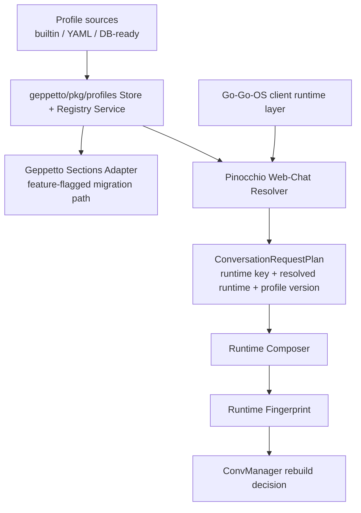

# ProfileRegistry Implementation Postmortem and Intern Guide

## 1. How to Read This Document

This is a deep handoff document for engineers who need to understand the full implementation arc of ticket `GP-01-ADD-PROFILE-REGISTRY`. It is written to serve two audiences simultaneously:

- contributors who need architecture context before writing code;
- maintainers who need operational understanding for debugging and review.

If you are new to the codebase, read Sections 2-4 first before reading implementation details. Those sections define the vocabulary and runtime model used throughout the rest of the document. If you are already familiar with Geppetto/Pinocchio internals, start at Section 5 (What We Built) and then jump to the API reference and testing sections.

> **Fundamental:** This migration is not just “new structs for profiles.”  
> It changes the control surface for runtime configuration from distributed command flags to a reusable registry domain with explicit resolution semantics.

## 2. Background and Problem Statement

Before this work, profile behavior existed in three different styles:

- Geppetto CLI profile file parsing and middleware injection (`GatherFlagsFromProfiles` style flow);
- Pinocchio web-chat local in-memory profile structs (`chatProfile`, `chatProfileRegistry`);
- Go-Go-OS client runtime flows that did not yet have a complete explicit profile/registry transport contract.

This fragmentation created predictable pain:

- duplicated policy logic;
- unclear precedence across flags/config/env/profile;
- many AI engine/provider flags exposed in binaries instead of profile-first configuration;
- no single reusable persistence abstraction for profiles across file/database backends.

The ticket objective was to converge these seams into a shared ProfileRegistry model centered in Geppetto, then consume that model from Pinocchio web-chat and prepare Go-Go-OS integration.

## 3. Required Foundations (Intern Primer)

### 3.1 Runtime Model Fundamentals

At runtime, the system composes a conversation engine from these conceptual layers:

1. base StepSettings (command/config defaults);
2. profile runtime defaults (system prompt, middlewares, tools, step patch);
3. request overrides (if policy allows);
4. fingerprint generation for rebuild detection.

If you misunderstand this layering, you will likely introduce precedence regressions.

### 3.2 Terminology

- `Registry`: named container of profiles (for example `default`, `team`, `org-prod`).
- `Profile`: named runtime preset inside a registry (for example `default`, `agent`, `analyst`).
- `RuntimeSpec`: profile runtime payload (`system_prompt`, `middlewares`, `tools`, `step_settings_patch`).
- `PolicySpec`: profile mutation/override rules (`allow_overrides`, allow/deny keys, read-only).
- `ResolvedProfile`: effective profile result after precedence + policy + metadata.
- `RuntimeFingerprint`: deterministic payload used by `ConvManager` to decide when runtime changed enough to rebuild.

### 3.3 Strong Slug Types

This migration introduced typed slug wrappers (`RegistrySlug`, `ProfileSlug`, `RuntimeKey`) instead of raw strings. These types normalize and validate slug values and provide JSON/YAML codecs.

> **Fundamental:** Typed slugs are boundary safety.  
> They keep invalid identifiers from leaking into persistence APIs, HTTP handlers, and resolver logic.

Example:

```go
registrySlug, err := gepprofiles.ParseRegistrySlug(rawRegistry)
if err != nil {
  return badRequest("invalid registry")
}
profileSlug, err := gepprofiles.ParseProfileSlug(rawProfile)
if err != nil {
  return badRequest("invalid profile")
}
```

## 4. High-Level Architecture (Before vs After)

### 4.1 Before

```text
CLI flags/config/env -> middleware profile parsing (legacy) -> StepSettings
Pinocchio local web-chat profile structs -> override maps -> runtime composer
Go-Go-OS -> mostly runtime key transport, limited profile API semantics
```

### 4.2 After (Current State)



This is not the final destination (full CRUD + DB + client UX work remains), but the backbone is now in place.

## 5. What We Built (Phase-by-Phase Postmortem)

This section records exactly what was implemented and why the sequence mattered.

### 5.1 Phase 1 and 1A: Domain Core and Slug Safety

Implemented in `geppetto/pkg/profiles`:

- domain types for profile/registry/runtime/policy/metadata;
- store and registry interfaces;
- typed errors;
- validation helpers;
- overlay abstraction;
- strong slug types with codec support.

Why first: every downstream integration depends on stable domain contracts.

### 5.2 Phase 2: Persistence Foundations

Implemented:

- thread-safe in-memory store;
- YAML codec for canonical and legacy formats;
- file-backed store with atomic writes;
- migration helper from legacy flat maps.

Why second: integration requires backends; compatibility with existing user profile files was mandatory.

### 5.3 Phase 3: Resolver and Effective Runtime Construction

Implemented in `service.go`:

- `ResolveEffectiveProfile`;
- override policy enforcement;
- runtime fingerprint generation;
- metadata emission (`profile.registry`, `profile.slug`, `profile.version`, `profile.source`);
- golden compatibility tests against legacy behavior.

Why third: this is the semantic heart of the migration.

### 5.4 Phase 4: Geppetto CLI Middleware Integration

Implemented:

- registry-backed sections adapter;
- temporary feature-flagged migration seam (later removed for always-on registry path);
- integration precedence tests (`config/profile/env/flags`);
- profile-first migration notes in help text.

Why fourth: this allowed safe migration without breaking existing CLI behavior.

### 5.5 Phase 5 (Completed Subset): Pinocchio Web-Chat Integration

Completed tasks so far:

- replace local profile structs with shared registry service;
- resolver accepts explicit `profile` + `registry` in body/query;
- runtime composer consumes typed resolved runtime;
- profile version participates in fingerprint, with rebuild verification test.

Remaining Phase 5 work is primarily profile CRUD endpoint expansion and broader precedence/validation endpoint coverage.

## 6. Detailed Runtime Flow (Current Implementation)

### 6.1 Request Resolution

`webChatProfileResolver` now resolves:

- registry slug from body/query/default;
- profile slug from path/body/query/runtime/cookie/default;
- profile runtime spec and metadata version;
- overrides map with policy enforcement.

Pseudocode:

```text
resolve(req):
  body := decode ChatRequestBody for POST
  registry := chooseRegistry(body.registry, query.registry, defaultRegistry)
  profile  := chooseProfile(pathSlug, body.profile, query.profile, query.runtime, cookie, registry.default)
  profileObj := registryService.GetProfile(registry, profile)
  overrides := merge(profile runtime defaults, request overrides with policy checks)
  return plan{
    conv_id,
    runtime_key = profile,
    profile_version = profileObj.metadata.version,
    resolved_runtime = profileObj.runtime,
    overrides,
    prompt,
  }
```

### 6.2 Runtime Composition

`webChatRuntimeComposer` now consumes `RuntimeComposeRequest` with:

- `RuntimeKey`
- `ResolvedRuntime`
- `ProfileVersion`
- `Overrides`

It seeds composition from `ResolvedRuntime`, then overlays request overrides, then builds engine and fingerprint.

Example key path:

```go
systemPrompt := req.ResolvedRuntime.SystemPrompt
middlewares := runtimeMiddlewaresFromProfile(req.ResolvedRuntime)
tools := runtimeToolsFromProfile(req.ResolvedRuntime)

applyOverrideIfPresent(&systemPrompt, req.Overrides["system_prompt"])
applyMiddlewareOverrideIfPresent(&middlewares, req.Overrides["middlewares"])
applyToolsOverrideIfPresent(&tools, req.Overrides["tools"])

fingerprint := runtimeFingerprint(req.RuntimeKey, req.ProfileVersion, systemPrompt, middlewares, tools, stepSettings)
```

### 6.3 Rebuild Behavior in ConvManager

`ConvManager.GetOrCreate` composes runtime and compares new fingerprint against current conversation fingerprint.

- Same fingerprint: keep existing runtime engine/session components.
- Changed fingerprint: rebuild stream/engine/sink wiring.

Because profile version is now part of fingerprint input, profile updates trigger rebuilds deterministically.

## 7. Data Contracts and API Reference

### 7.1 Chat Request Body (Current)

`pinocchio/pkg/webchat/http/api.go`

```json
{
  "prompt": "hello",
  "text": "optional legacy alias",
  "conv_id": "conv-123",
  "profile": "analyst",
  "registry": "team",
  "overrides": {
    "system_prompt": "optional override",
    "middlewares": [{"name": "agentmode", "config": {}}],
    "tools": ["calculator"]
  },
  "idempotency_key": "optional"
}
```

### 7.2 ConversationRequestPlan (Internal Handler Contract)

Important fields:

- `RuntimeKey` (selected profile slug);
- `ProfileVersion` (resolved profile metadata version);
- `ResolvedRuntime` (typed runtime defaults from profile);
- `Overrides` (merged/effective overrides for runtime call path).

### 7.3 Profile Endpoints (Current State)

Implemented compatibility layer today:

- `GET /api/chat/profiles`
- `GET /api/chat/profile`
- `POST /api/chat/profile` (cookie-based selection)

Phase 5 remaining work (`GP01-505`) will add full CRUD endpoints under `/api/chat/profiles...`.

### 7.4 WebSocket Profile Selection

Current resolver accepts:

- `/ws?conv_id=...&profile=...&registry=...`

and falls back to cookie/default behavior when explicit selectors are missing.

## 8. Testing Strategy and How to Run It

### 8.1 Test Layers

- unit tests in `geppetto/pkg/profiles/*` for domain/store/resolver semantics;
- integration-style tests in `geppetto/pkg/sections` for precedence order;
- pinocchio resolver/composer tests for request parsing and runtime behavior;
- conversation-service tests for lifecycle/rebuild behavior.

### 8.2 High-Value Commands

Geppetto:

```bash
cd geppetto
go test ./pkg/profiles -count=1
go test ./pkg/sections -count=1
go test ./pkg/steps/ai/settings -count=1
```

Pinocchio:

```bash
cd pinocchio
go test ./cmd/web-chat -count=1
go test ./pkg/webchat/... -count=1
go test ./... -count=1
```

Ticket hygiene:

```bash
cd geppetto
docmgr doctor --ticket GP-01-ADD-PROFILE-REGISTRY --stale-after 30
```

### 8.3 Rebuild Semantics Test (Key Example)

`TestConversationService_ResolveAndEnsureConversation_RebuildsOnProfileVersionChange` validates:

- version `1` then version `1` -> engine reused;
- version `1` then version `2` -> engine replaced.

This test should be treated as a regression guardrail for runtime lifecycle behavior.

## 9. Usage Guide (Developer and Reviewer)

### 9.1 Selecting a Profile Explicitly

HTTP chat:

```bash
curl -X POST http://localhost:8080/chat \
  -H 'Content-Type: application/json' \
  -d '{
    "conv_id":"conv-1",
    "prompt":"Summarize this ticket",
    "registry":"team",
    "profile":"analyst"
  }'
```

WebSocket:

```text
ws://localhost:8080/ws?conv_id=conv-1&registry=team&profile=analyst
```

### 9.2 Keeping Legacy Flow Compatible

If no explicit registry/profile is supplied:

- resolver checks cookie/default behavior;
- default registry slug is still used;
- endpoints remain compatible with existing UI flows.

### 9.3 Running With Registry Adapter in Geppetto

Current state: registry-backed middleware is always enabled. There is no environment toggle for old/new middleware selection.

Then run command parsing path as usual. Precedence behavior is preserved by integration tests.

## 10. Operational Debugging Guide

### 10.1 Common Failure Modes

- `invalid profile: ...`  
  Usually bad slug format or typo.

- `invalid registry: ...`  
  Registry slug fails validation.

- `profile not found: ...`  
  Slug parsed successfully but not present in target registry.

- `profile registry is not configured`  
  Registry store not initialized or missing configured registry.

### 10.2 Practical Debug Checklist

1. Confirm selected registry and profile slugs after normalization.
2. Confirm registry exists in active store backend.
3. Confirm default profile slug exists in registry.
4. Confirm policy allows requested override keys.
5. Inspect runtime fingerprint payload for expected `profile_version`.
6. Verify `ConvManager` sees fingerprint change when expected.

### 10.3 Logging Signals Worth Watching

- resolver errors and status code mapping;
- runtime fingerprint payload changes after profile update;
- `runtime config changed, rebuilding engine` event in webchat logs.

## 11. Design Tradeoffs and Rationale

### 11.1 Why Remove Feature Flag in Geppetto Sections?

Early migration used a temporary feature-flag seam to compare behavior. Final implementation removed this toggle to avoid permanent dual-path complexity.

Final rollout strategy relies on:

- strong regression/e2e coverage,
- migration tooling + storage backups,
- release rollback by version rather than runtime branching.

### 11.2 Why Include Profile Version in Fingerprint?

Without version, two profile revisions with same slug might not trigger runtime rebuild if effective visible payload appears identical in current request. Including version provides explicit lifecycle intent: “profile changed” means “evaluate runtime as changed.”

### 11.3 Why Keep Compatibility Endpoint `/api/chat/profile`?

It avoids breaking existing clients while we add richer CRUD and explicit profile UX flows.

## 12. What Is Still Missing (Honest Gap List)

Open tasks most relevant to intern onboarding:

- `GP01-505`: full CRUD HTTP endpoints for profiles;
- `GP01-506`: preserve and test compatibility endpoint behavior as CRUD expands;
- `GP01-507`: explicit resolver precedence matrix tests across cookie/query/body/path;
- `GP01-508`: endpoint validation/policy/version-conflict tests;
- `GP01-600+`: SQLite store and optimistic concurrency for profile persistence;
- `GP01-700+`: Go-Go-OS client slice/hooks/UI integration for explicit profile selection.

## 13. Intern Onboarding Runbook

### 13.1 Day 1 Reading Order

1. `geppetto/pkg/profiles/types.go`
2. `geppetto/pkg/profiles/service.go`
3. `pinocchio/cmd/web-chat/profile_policy.go`
4. `pinocchio/cmd/web-chat/runtime_composer.go`
5. `pinocchio/pkg/webchat/conversation.go`
6. this postmortem end-to-end
7. ticket diary for command-level history and pitfalls

### 13.2 Day 2 Hands-On Exercises

- run and inspect resolver tests:
  - `go test ./cmd/web-chat -run ProfileResolver -count=1`
- trace profile version through runtime request contracts;
- add a failing test for a precedence edge case, then fix it.

### 13.3 Day 3 Starter Task Suggestion

Implement `GET /api/chat/profiles/{slug}` (a safe subset of `GP01-505`) with:

- strict slug validation;
- registry selector support;
- stable error mapping;
- tests for not-found and invalid slug.

## 14. Reference Diagrams

### 14.1 Contract Propagation Path

```text
HTTP/WS request
  -> webChatProfileResolver.Resolve
    -> ConversationRequestPlan {
         runtime_key,
         profile_version,
         resolved_runtime,
         overrides
       }
      -> ConversationService/StreamHub
        -> ConvManager.GetOrCreate
          -> RuntimeComposer.Compose
            -> runtime_fingerprint(profile_version + runtime payload)
              -> rebuild decision
```

### 14.2 Precedence Model (Current)

```text
Registry/default profile
  < selected profile runtime
    < request overrides (subject to policy)
      < runtime fingerprint + conversation lifecycle
```

> **Fundamental:** policy checks happen before applying request overrides.  
> Never move override application ahead of policy validation.

## 15. Practical API Examples

### 15.1 Set Current Profile (Compatibility Endpoint)

```bash
curl -X POST http://localhost:8080/api/chat/profile \
  -H 'Content-Type: application/json' \
  -d '{"slug":"agent"}'
```

### 15.2 Get Available Profiles

```bash
curl http://localhost:8080/api/chat/profiles
```

### 15.3 Explicit Chat With Overrides (Policy-Dependent)

```bash
curl -X POST http://localhost:8080/chat \
  -H 'Content-Type: application/json' \
  -d '{
    "conv_id":"conv-policy",
    "registry":"default",
    "profile":"agent",
    "prompt":"help",
    "overrides":{"system_prompt":"Custom prompt"}
  }'
```

If profile policy disallows engine overrides, expect `400` with a clear message.

## 16. Code Review Checklist for This Migration

When reviewing changes in this area, check these invariants:

- resolver slug parsing uses typed `Parse*Slug` helpers;
- unknown registry and invalid registry format are not conflated;
- runtime composer inputs are derived from `ResolvedRuntime` first;
- profile version is included in fingerprint path;
- conversation rebuild behavior is tested for version changes;
- precedence tests exist for any new selector source;
- compatibility endpoints remain stable unless explicitly deprecating.

## 17. Lessons Learned

1. Migration speed improved once we treated profile handling as a domain service instead of middleware glue.
2. Typed identifiers reduced a class of boundary bugs early.
3. Most regressions were precedence regressions, not syntax/runtime crashes.
4. Full-stack contract changes are safer when tests are added at each layer boundary.
5. Diary + task granularity made continuation and review significantly easier.

## 18. Recommended Next Implementation Order

1. Complete CRUD endpoints (`GP01-505`), starting with read-only detail endpoint.
2. Add robust precedence matrix tests (`GP01-507`).
3. Add endpoint validation/policy/version-conflict suite (`GP01-508`).
4. Build SQLite store (`GP01-600..604`) and switch a dev profile registry to DB backend.
5. Wire Go-Go-OS explicit profile UX (`GP01-700+`) only after server CRUD contracts are stable.

## 19. Final Summary

The project has moved from fragmented profile behavior toward a unified profile registry architecture with stable domain contracts, typed slug safety, compatibility-preserving middleware migration, and profile-aware runtime lifecycle semantics in Pinocchio.

For interns, the key mental model is this:

- profile selection and policy belong in resolver/service layers;
- runtime composition consumes resolved data, not ad-hoc local assumptions;
- conversation lifecycle decisions are fingerprint-based, and fingerprint inputs must encode profile change semantics (including version).

If you keep those three principles intact, future work on CRUD, DB storage, and client UX can be added incrementally without breaking runtime behavior.
