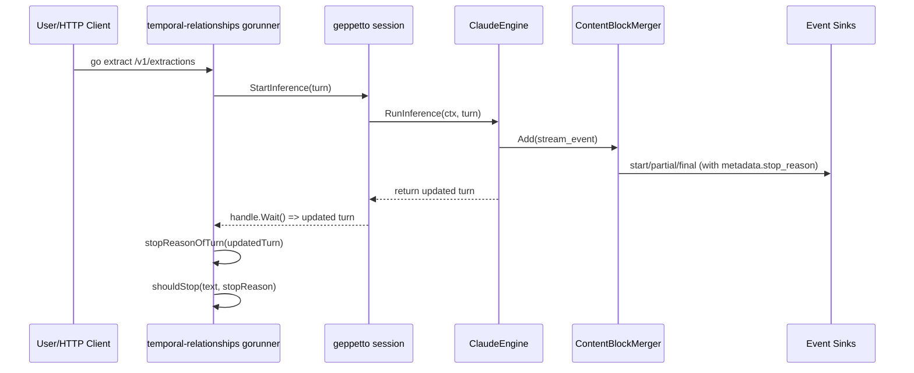

# Max-tokens stop-reason propagation architecture and intern implementation guide

## Executive Summary

This document describes why `max_tokens` stop reasons are not reliably available to the Go extraction loop, despite being visible in Claude streaming events, and how to fix the architecture so stop-policy behavior is deterministic.

The root issue is a metadata contract gap between provider engines and `Turn.Metadata`: engines publish stop-reason in event metadata, but most engines do not persist that same value into `turn.metadata.stop_reason` before returning from `RunInference`. The Go runner currently reads stop reason from turn metadata only, so it can miss real provider stop reasons.

A one-off mitigation already exists in `temporal-relationships` (`continueOnFirstMaxTokens`) to continue after first-iteration token exhaustion. The recommended durable fix is to make geppetto engines consistently write completion metadata (`stop_reason`, usage, model) into `Turn.Metadata` for every provider path.

## Problem Statement And Scope

### Problem

When Claude streaming truncates output due to max token cap, the stream includes `message_delta.delta.stop_reason = "max_tokens"`, but the Go extraction loop may still see an empty turn stop reason and classify runs as `max_iterations` instead of `stopped` (or any intended policy outcome).

### Scope

1. Engine internals in geppetto (`Claude`, `OpenAI`, `OpenAI Responses`, parity with `Gemini`).
2. Loop behavior in `temporal-relationships/internal/extractor/gorunner`.
3. API and operator impact in `temporal-relationships` CLI and REST/SSE server.
4. Reproducible experiments and test plan for intern execution.

### Non-goals

1. Redesigning structured sink parsing.
2. Redesigning `temporal-relationships` UI.
3. Changing provider API semantics.

## Fundamentals For New Interns

### Core Objects

1. `Turn` is the canonical conversation state unit. Engines mutate and return it.
2. `Turn.Metadata` stores durable keys like `stop_reason` via typed keys.
3. Event stream (`start`, `partial`, `final`, `tool-call`, etc.) is runtime telemetry.
4. Loop stop policy in temporal-relationships checks assistant text plus stop reason.

### Key Metadata Contracts

1. Turn key constant for stop reason is `stop_reason` (`geppetto/pkg/turns/keys_gen.go:45,71`).
2. Event metadata also has `stop_reason` (`geppetto/pkg/events/metadata.go:20`).
3. If the loop reads only turn metadata, engines must persist stop reason into turn metadata before return.

### Runner Surface Area

The single binary has these groups:

1. `temporal-relationships js extract`
2. `temporal-relationships go extract`
3. `temporal-relationships serve`

Relevant entrypoints:

1. `cmd/temporal-relationships/main.go`
2. `cmd/temporal-relationships/cmd_go.go`
3. `internal/extractor/gorunner/run.go`
4. `internal/extractor/httpapi/server.go`

## Current-State Architecture (Evidence)

### End-to-End Flow



### Where Stop Reason Is Produced

1. Claude stream event model includes `delta.stop_reason` (`geppetto/pkg/steps/ai/claude/api/streaming.go:89-95`).
2. Claude merger copies `delta.stop_reason` into `cbm.metadata.StopReason` (`.../content-block-merger.go:157-163`).
3. Claude merger emits final event with this metadata (`.../content-block-merger.go:200`).

### Where Stop Reason Is Lost For Loop Logic

1. Claude engine finalizes a local `metadata` from `response.StopReason` (`.../engine_claude.go:185-196`).
2. `response.StopReason` can be empty in streaming path if not copied from `message_delta` into `response`.
3. More importantly, Claude engine does not call `turns.KeyTurnMetaStopReason.Set(&t.Metadata, ...)` before returning (`.../engine_claude.go:198-214`).
4. Go runner reads stop reason from turn metadata only (`temporal-relationships/internal/extractor/gorunner/run.go:781-788`).

### Cross-Provider Consistency Check

1. `Gemini` writes stop reason into turn metadata (`geppetto/pkg/steps/ai/gemini/engine_gemini.go:364-372`).
2. `OpenAI` and `OpenAI Responses` set event metadata stop reason but do not persist to turn metadata in shown code paths (`.../openai/engine_openai.go:341,398`; `.../openai_responses/engine.go:837,872`).

This inconsistency explains why stop-policy outcomes vary by provider/engine implementation details.

## Experimental Evidence (March 2, 2026)

### Reproduction Inputs

1. Longest anonymized transcript: `anonymized/a2be5ded.txt` (103910 bytes).
2. Forced low token cap in config: `engine.maxResponseTokens: 32`.
3. One-off continuation switch: `stopPolicy.continueOnFirstMaxTokens: true`.
4. Max loop iterations: `3`.

### Observed Outputs

1. CLI result summary:

```json
{
  "status": "max_iterations",
  "reason": "max_iterations",
  "iterations": 3,
  "eventCount": 0,
  "relationshipCount": 0,
  "extractionSource": "final_text_fallback",
  "structuredParseFailuresCount": 6,
  "finalAssistantTextLength": 79
}
```

2. Stderr evidence:
   - `Claude RunInference started` count = `3`
   - `"stop_reason":"max_tokens"` count = `3`

Interpretation:

1. Provider repeatedly reports `max_tokens` in stream deltas.
2. Loop iterates due continuation hack and max iteration budget.
3. Final run reason remains `max_iterations`, consistent with missing canonical stop reason at turn layer.

Repro script is stored at:

`ttmp/2026/03/02/MEN-TR-005--go-runner-max-tokens-stop-reason-propagation-and-loop-continuation-hardening/scripts/01-repro-max-tokens-stop-reason.sh`

## API And File Map

### Temporal-relationships APIs

From `internal/extractor/httpapi/server.go`:

1. `GET /healthz`
2. `GET /v1/configs`
3. `GET /v1/profiles`
4. `POST /v1/extractions`
5. `POST /v1/extractions/stream`

### Stop-Policy Call Sites

1. Loop execution and stop checks:
   - `executeLoop(...)` (`gorunner/run.go:563+`)
   - `shouldStop(...)` (`gorunner/run.go:751+`)
   - `stopReasonOfTurn(...)` (`gorunner/run.go:777+`)

2. Current one-off hack:
   - `continueOnFirstMaxTokens` config flag (`gorunner/run.go:77`)
   - first-iteration continuation gate (`gorunner/run.go:623-632`)

### Geppetto Engine Contracts

1. Claude request `max_tokens` derivation from `Chat.MaxResponseTokens`:
   - `geppetto/pkg/steps/ai/claude/helpers.go:240-243`
2. Chat settings field:
   - `geppetto/pkg/steps/ai/settings/settings-chat.go:25`
3. Event metadata definition:
   - `geppetto/pkg/events/metadata.go:14-23`
4. Turn metadata key for stop reason:
   - `geppetto/pkg/turns/keys_gen.go:45,71`

## Root Cause Analysis

### Primary Cause

`stop_reason` is not treated as a required output of `RunInference` at the turn layer for all providers.

Effects:

1. Event consumers may see stop reason.
2. Turn-only consumers may not.
3. Loop policy relying on turn metadata becomes nondeterministic across engines.

### Secondary Claude-Specific Cause

Claude stream emits stop reason on `message_delta`, not guaranteed on `message_stop` payload object. The merger records it in event metadata, but engine final metadata uses `response.StopReason`, which may stay empty unless explicitly propagated.

### Why It Matters Operationally

1. Incorrect run classification (`stopped` vs `max_iterations`).
2. Unexpected costs due unnecessary extra iterations.
3. Harder debugging when logs show max_tokens but final result reason does not.

## Proposed Solution

### Design Goal

Define and enforce one invariant:

`Every successful engine RunInference must write final stop_reason (if available) and usage into Turn.Metadata before return.`

### Phase 1 (Provider Fixes, Minimal Risk)

1. Claude:
   - In `ContentBlockMerger.Add` on `MessageDeltaType`, also write stop reason to `cbm.response.StopReason` when available.
   - In `engine_claude.go`, set turn metadata stop reason and usage from finalized values.

2. OpenAI / OpenAI Responses:
   - Mirror Gemini behavior: call `turns.KeyTurnMetaStopReason.Set(...)` and `turns.KeyTurnMetaUsage.Set(...)` before returning.

### Phase 2 (Shared Helper, Remove Drift)

Introduce helper in geppetto (exact package choice to be decided) to reduce provider drift:

```go
// sketch
func ApplyInferenceCompletionToTurn(
    t *turns.Turn,
    model string,
    stopReason string,
    usage *events.Usage,
) error
```

Responsibilities:

1. Set `KeyTurnMetaModel` if non-empty.
2. Set `KeyTurnMetaStopReason` if non-empty.
3. Set `KeyTurnMetaUsage` when present.
4. Best-effort semantics with warning logs, not hard failure.

### Phase 3 (Runner Simplification)

Once engines are consistent:

1. Keep `stopReasonOfTurn` as canonical read path.
2. Optionally retire temporary `continueOnFirstMaxTokens` hack.
3. Keep it behind feature flag until geppetto version baseline guarantees contract.

## Pseudocode

### Provider-Side Finalization

```text
on RunInference completion:
  stop_reason = derive_from_stream_or_response()
  usage = derive_usage()

  append assistant/tool blocks to turn

  apply_completion_to_turn(turn, model, stop_reason, usage)
  publish final event(metadata{stop_reason,usage}, text)
  return turn
```

### Loop Stop Decision (After Contract Fix)

```text
turn = session.run(...)
text = latestAssistantText(turn)
reason = turn.metadata.stop_reason

if text contains any stop token:
  STOP(reason = "stop_sequence")

if reason in acceptedStopReasons:
  STOP(reason = reason)

continue until maxIterations
```

### Optional Safety Fallback (Transitional)

```text
if turn.stop_reason empty:
  read latest final event stop_reason for same session/inference
  use only as temporary fallback with warning log
```

## Concrete Implementation Plan

### Work Package A: Claude correctness

1. `geppetto/pkg/steps/ai/claude/content-block-merger.go`
   - propagate delta stop reason into response object.
2. `geppetto/pkg/steps/ai/claude/engine_claude.go`
   - apply turn metadata stop reason/usage/model before return.
3. Add tests for stream path where `message_delta` contains `max_tokens` and `message_stop` has no message payload.

### Work Package B: Provider parity

1. `geppetto/pkg/steps/ai/openai/engine_openai.go`
2. `geppetto/pkg/steps/ai/openai_responses/engine.go`
3. Confirm `gemini` remains reference implementation for turn metadata persistence.

### Work Package C: temporal-relationships integration

1. Add targeted tests in `internal/extractor/gorunner`:
   - stop on `max_tokens` when accepted.
   - continue/stop behavior with and without temporary hack.
2. Add runbook command snippets in ticket docs.

## Testing Strategy

### Unit Tests

1. Claude merger test: `message_delta.stop_reason=max_tokens` updates response and metadata.
2. Engine tests: returned turn contains `stop_reason` key when provider emits one.

### Integration Tests

1. `temporal-relationships go extract` with forced low token cap.
2. Assert:
   - `iterations` and `status` align with policy.
   - stop reason recorded in result and DB rows.

### Regression Matrix

1. Provider: Claude/OpenAI/OpenAI Responses/Gemini.
2. Stop reason: `end_turn`, `stop_sequence`, `max_tokens`.
3. Loop settings: `failOnMaxIterations` true/false.

## Risks, Tradeoffs, And Mitigations

1. Risk: Provider-specific fields differ by SDK version.
   - Mitigation: derive from streamed delta + final response defensively.
2. Risk: Silent behavior changes for existing loops.
   - Mitigation: feature flag and staged rollout notes.
3. Risk: Tests rely on mocked payload shapes that drift.
   - Mitigation: fixture-based tests using captured SSE events.

## Related Documentation (Geppetto And Local)

### Geppetto docs

1. `geppetto/pkg/doc/topics/04-events.md` (event lifecycle and metadata contract)
2. `geppetto/pkg/doc/topics/08-turns.md` (turn metadata keys, correlation)
3. `geppetto/pkg/steps/ai/claude/api/doc/messages-api-message.md` (stop reason semantics)
4. `geppetto/pkg/steps/ai/claude/api/doc/streaming-messages.md` (message_delta/message_stop flow)

### Temporal-relationships docs and code

1. `internal/extractor/gorunner/run.go`
2. `internal/extractor/httpapi/server.go`
3. `config/structured-event-extraction.live.yaml`
4. `ttmp/.../scripts/01-repro-max-tokens-stop-reason.sh` (this ticket)

## Intern Runbook (Quick Start)

1. Export API key:

```bash
export ANTHROPIC_API_KEY=...
```

2. Run reproduction script:

```bash
bash ttmp/2026/03/02/MEN-TR-005--go-runner-max-tokens-stop-reason-propagation-and-loop-continuation-hardening/scripts/01-repro-max-tokens-stop-reason.sh
```

3. Inspect outputs:

```bash
cat /tmp/men-tr-005-lowtokens.stdout | jq .
rg 'stop_reason' /tmp/men-tr-005-lowtokens.stderr | head
```

4. Implement provider metadata persistence and re-run tests.

## References

1. `geppetto/pkg/steps/ai/claude/api/streaming.go`
2. `geppetto/pkg/steps/ai/claude/content-block-merger.go`
3. `geppetto/pkg/steps/ai/claude/engine_claude.go`
4. `geppetto/pkg/steps/ai/openai/engine_openai.go`
5. `geppetto/pkg/steps/ai/openai_responses/engine.go`
6. `geppetto/pkg/steps/ai/gemini/engine_gemini.go`
7. `geppetto/pkg/events/metadata.go`
8. `geppetto/pkg/turns/keys_gen.go`
9. `temporal-relationships/internal/extractor/gorunner/run.go`
10. `temporal-relationships/internal/extractor/httpapi/server.go`
