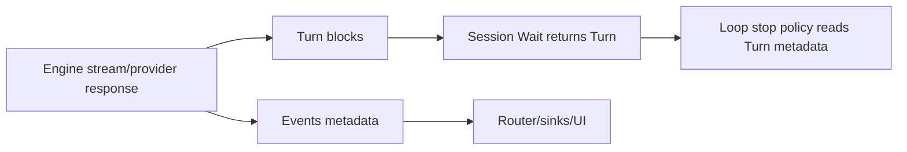
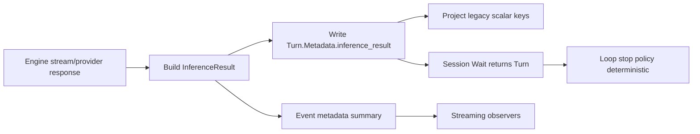

# Inference result signaling architecture study: Turn metadata sections, events, and alternative contracts

## Executive Summary

Your question is exactly the right one: yes, a dedicated “inference result section” is a better model than a loose set of ad-hoc keys. The current system already has multiple signaling channels (Turn, Blocks, Events, Session handle, snapshots, persistence), but there is no single canonical completion envelope enforced across engines.

This document evaluates current and alternative designs and recommends a hybrid contract:

1. Keep `Turn` as the canonical durable artifact.
2. Add a typed `Turn.Metadata` section key (for example `inference_result`) with a versioned structured payload.
3. Keep a small set of projected scalar keys (`stop_reason`, `model`, `usage`) for fast access/backward compatibility.
4. Keep events as streaming telemetry, not canonical storage.
5. Optionally add an enhanced execution handle and completion event for ergonomics.

This preserves compatibility with current engine/session interfaces while making loop control and debugging deterministic.

## Problem Statement

### User-Level Problem

You want to know whether inference result communication should live primarily in Turn/Block, and whether a dedicated result section is preferable.

### System-Level Problem

Current design disperses completion outcomes across several channels, with inconsistent provider behavior:

1. Engine contract returns only `*turns.Turn` (`geppetto/pkg/inference/engine/engine.go:11-16`).
2. Session completion API (`ExecutionHandle.Wait`) returns only `*turns.Turn, error` (`geppetto/pkg/inference/session/execution.go:63-71`).
3. Events carry rich completion metadata (`events.EventMetadata` contains `StopReason`, `Usage`, `DurationMs`) (`geppetto/pkg/events/metadata.go:14-23`, `geppetto/pkg/events/chat-events.go:372-423`).
4. Turn metadata has typed keys for stop reason/model/usage, but not all engines populate them consistently (`geppetto/pkg/turns/keys_gen.go:39-46`, provider evidence below).

This can produce divergent interpretations of “what happened in inference” depending on which channel a consumer reads.

## Investigation Method

I used line-anchored repository inspection plus reproducible inventory scripts.

### Commands Used

1. Static mapping with `rg` and `nl -ba` across:
   - `geppetto/pkg/turns`
   - `geppetto/pkg/inference/session`
   - `geppetto/pkg/steps/ai/*`
   - `geppetto/pkg/events`
   - `temporal-relationships/internal/extractor/gorunner`
2. Repro inventory script created in ticket:
   - `scripts/02-inventory-inference-result-signals.sh`
3. Script output artifact:
   - `/tmp/men-tr-005-inference-signals.txt`

## Current-State Signaling Channels (Deep Map)

### Channel A: Turn Return Value (Canonical-ish, but under-specified)

`RunInference(ctx, t)` returns updated turn (`geppetto/pkg/inference/engine/engine.go:11-16`).

Strengths:

1. Durable in-memory state for next turn.
2. Compatible with all orchestration layers.
3. Already central to session and toolloop behavior.

Weaknesses:

1. No explicit inference-outcome schema is required.
2. Engines can return rich text blocks but omit completion metadata fields.

### Channel B: Turn Metadata Keys (Intended durable summary)

Current canonical keys include:

1. `provider`
2. `runtime`
3. `session_id`
4. `inference_id`
5. `trace_id`
6. `usage`
7. `stop_reason`
8. `model`

Source: `geppetto/pkg/turns/keys_gen.go:39-72`.

Strengths:

1. Typed key API.
2. Durable and serializable with Turn.
3. Suitable for loop decisions.

Weaknesses:

1. Sparse semantic grouping (flat keys only).
2. No first-class “inference completed/result” object.
3. Provider consistency is not enforced.

### Channel C: Blocks (content-centric outcome)

Blocks carry assistant output/tool calls/reasoning (`geppetto/pkg/turns/types.go:8-26`, docs at `geppetto/pkg/doc/topics/08-turns.md:99-107`).

Strengths:

1. Rich content history.
2. Works naturally for replay/rendering.

Weaknesses:

1. Completion status is implicit, not explicit.
2. Aggregating usage/stop semantics from blocks is indirect.

### Channel D: Event Stream (rich runtime telemetry)

Events include start/partial/final/tool/error with metadata (`geppetto/pkg/events/chat-events.go`).

Strengths:

1. Real-time observability.
2. Rich provider metadata and lifecycle tracing.
3. Structured sinks can consume final text directly.

Weaknesses:

1. Context-bound and best-effort (`PublishEventToContext` ignores sink errors) (`geppetto/pkg/events/context.go:39-51`).
2. Not guaranteed durable unless explicitly persisted by subscribers.
3. Can diverge from turn metadata when engines don’t persist.

### Channel E: Session ExecutionHandle

`ExecutionHandle` exposes `SessionID`, `InferenceID`, `Input`, and returns `(turn,error)` (`geppetto/pkg/inference/session/execution.go:16-71`).

Strengths:

1. Async control and cancellation.
2. Good lifecycle primitive.

Weaknesses:

1. No explicit outcome envelope.
2. Forces consumers to parse returned turn manually.

### Channel F: Snapshot Hook + Step Controller (debug/control plane)

Toolloop provides snapshot phases and pause metadata (`geppetto/pkg/inference/toolloop/context.go`, `loop.go:81-169`, `step_controller.go`).

Strengths:

1. Powerful introspection and human-in-loop pause flow.
2. Explicit phases (`pre_inference`, `post_inference`, `post_tools`).

Weaknesses:

1. Optional instrumentation path.
2. Not canonical completion outcome contract.

### Channel G: Persistence Layers (app-level projections)

In temporal-relationships JS runner:

1. `runs.stop_reason` persisted separately.
2. full `turn_json` persisted.
3. timeline blocks persisted.

Source: `temporal-relationships/js/extractor/persistence.js:45-58,74-95,229-285`.

Strengths:

1. Durable audit trail.
2. Easy SQL introspection.

Weaknesses:

1. App-specific schema, not geppetto core contract.
2. Depends on what upstream actually writes.

## Evidence of Contract Drift

### Key Observation

Only some engines persist stop reason to turn metadata.

Evidence:

1. Gemini sets `KeyTurnMetaStopReason` (`geppetto/pkg/steps/ai/gemini/engine_gemini.go:364-372`).
2. Claude captures stop reason in stream/event metadata (`content-block-merger.go:157-163`) but does not currently set turn stop reason in `engine_claude.go` return path (`engine_claude.go:198-214`).
3. OpenAI/OpenAI Responses set event metadata stop reason but do not show turn stop reason persistence in completion code paths (`openai/engine_openai.go:341,398`; `openai_responses/engine.go:837,872`).

Impact:

1. Consumers reading events see a stop reason.
2. Consumers reading only turn metadata may not.
3. Loop control can become provider-dependent.

## Should We Add A Dedicated Inference Result Section?

Short answer: yes.

A dedicated section solves two problems at once:

1. Contract shape: one documented structured result object.
2. Consistency enforcement: engines either populate it or fail contract tests.

## Design Space: Options

### Option 0: Keep Flat Keys Only (status quo+cleanup)

Description:

1. Continue using flat keys (`stop_reason`, `usage`, etc.).
2. Enforce providers to populate existing keys only.

Pros:

1. Minimal change.
2. No new object schema.

Cons:

1. Grows into key sprawl for richer outcomes.
2. Harder versioning and compatibility semantics.

### Option 1: Add `Turn.Metadata.inference_result` Section (recommended core)

Description:

1. Add typed key for a structured object (map or typed struct via codegen support).
2. Store normalized + raw provider completion outcomes in one section.
3. Keep existing scalar keys as projections.

Pros:

1. Canonical envelope for completion semantics.
2. Versionable payload schema.
3. Works with existing `RunInference` signature.

Cons:

1. Requires key/codegen updates and docs.
2. Requires migration guidance.

### Option 2: New `BlockKindInferenceResult` Block

Description:

1. Append synthetic result block at end of each inference.

Pros:

1. Fits Turn/Block ordering model.
2. Explicit chronological marker.

Cons:

1. Pollutes content block stream with control metadata.
2. Harder for consumers expecting only model/tool blocks.
3. More invasive to existing rendering logic.

### Option 3: Event-only Canonical Outcome

Description:

1. Treat final events as source of truth; turn metadata optional.

Pros:

1. Rich streaming semantics already exist.

Cons:

1. Fragile for non-streaming/offline consumers.
2. Requires guaranteed event durability system-wide.

### Option 4: Change Engine Interface Return Type

Description:

1. `RunInference` returns `(turn, outcome, error)`.

Pros:

1. Strong explicit API.

Cons:

1. Breaking change across all engines/builders/middleware.
2. Large migration blast radius.

### Option 5: Add Run-level Outcome Ledger (complementary)

Description:

1. Keep turn outcome + append run-level summaries keyed by turn/inference.

Pros:

1. Better analytics and coarse-grained run introspection.

Cons:

1. `turns.Run` is currently not a primary runtime object in session code.
2. Additional persistence/orchestration complexity.

## Recommended Architecture (Hybrid)

### Core Recommendation

1. Canonical: `Turn.Metadata.inference_result` structured object.
2. Compatibility projections:
   - `stop_reason`
   - `usage`
   - `model`
3. Events remain runtime telemetry.
4. Optional enhanced handle/event for ergonomics.

### Proposed `inference_result` schema (v1)

```yaml
version: 1
status: completed | interrupted | error
provider:
  api_type: claude | openai | gemini | ...
  model: claude-haiku-4-5
  provider_message_id: msg_xxx
  provider_request_id: req_xxx
request:
  max_tokens: 1024
  temperature: 0.7
  top_p: null
completion:
  stop_reason_normalized: max_tokens
  stop_reason_raw: max_tokens
  stop_sequence: "__STOP__"
usage:
  input_tokens: 123
  output_tokens: 456
  cache_creation_input_tokens: 0
  cache_read_input_tokens: 0
timing:
  started_at_unix_ms: 0
  completed_at_unix_ms: 0
  duration_ms: 1250
tools:
  tool_call_count: 0
  tool_error_count: 0
notes:
  warnings: []
```

### Why this shape

1. Separates request settings from observed completion results.
2. Keeps both normalized and raw reasons.
3. Supports provider-specific extension via namespaced subfields if needed.

## API Sketches

### New Typed Key (Turn metadata)

Add to `geppetto/pkg/spec/geppetto_codegen.yaml` under `turn_meta`:

```yaml
- value_const: TurnMetaInferenceResultValueKey
  value: inference_result
  typed_key: KeyTurnMetaInferenceResult
  type_expr: any
  typed_owner: turns
```

Rationale:

1. codegen propagates to:
   - `pkg/turns/keys_gen.go`
   - JS const mappings (`pkg/js/modules/geppetto/consts_gen.go`, codec maps)
   - TS docs (`pkg/doc/types/*.d.ts`)
2. This is consistent with existing key lifecycle (`geppetto/pkg/turns/spec/README.md:3-18`).

### Helper API

```go
// sketch
func ApplyInferenceResultToTurn(
    t *turns.Turn,
    r *InferenceResult,
) error
```

Responsibilities:

1. Set `KeyTurnMetaInferenceResult` with structured payload.
2. Project `stop_reason`, `usage`, `model` into existing keys.
3. Best-effort logging if projection fails.

### Optional Session Ergonomics (non-breaking)

Add helper method (not interface break):

```go
// sketch
func OutcomeFromTurn(t *turns.Turn) (*InferenceResult, bool)
```

### Optional New Event Type

Introduce `EventTypeInferenceCompleted` with compact summary. Keep optional; avoid replacing final event.

## Current Design vs Modified Design

### Current Design



Issue: `B` can be richer than `F` input when metadata projection to Turn is inconsistent.

### Modified Design



Outcome: one canonical durable source + compatible projections + live telemetry.

## Alternative Communication Avenues Beyond Turn/Block

### In Current Design

1. Event stream via context sinks (`events.WithEventSinks`, `PublishEventToContext`).
2. Async handle channel (`ExecutionHandle.Wait/Cancel`).
3. Snapshot hooks (`toolloop.WithTurnSnapshotHook`).
4. Pause control metadata (`StepController` + debugger pause events).
5. App persistence tables (runs/turns/timeline).

### In Modified Design

1. Keep all above as secondary channels.
2. Add one canonical outcome section in turn metadata.
3. Optionally add run-level aggregate view in persistence (not required in core geppetto).

## Detailed Recommendation Matrix

| Criterion | Turn-only flat keys | Turn inference_result section | Block-based result | Event-only | New Engine return type |
|---|---|---|---|---|---|
| Backward compatibility | High | High | Medium | Medium | Low |
| Explicitness | Medium | High | Medium | High runtime, low durable | High |
| Storage durability | High | High | High | Low/varies | High |
| Runtime complexity | Low | Medium | Medium | Medium | High |
| Migration effort | Low | Medium | Medium | Medium | Very High |
| Recommended | Partial | Yes | No | No | Later/No |

## Implementation Plan (Phased)

### Phase 1: Contract formalization

1. Define `InferenceResult` schema in docs.
2. Add `inference_result` key via codegen spec.
3. Generate keys and JS/TS const outputs.

### Phase 2: Provider adapters

1. Claude/OpenAI/OpenAI Responses/Gemini populate result struct.
2. Add `ApplyInferenceResultToTurn` helper and use in engines.
3. Keep scalar key projections for legacy consumers.

### Phase 3: Consumer adoption

1. `temporal-relationships` gorunner first checks `inference_result.completion.stop_reason_normalized`; fallback to legacy `stop_reason`.
2. Add debug output showing both canonical and fallback sources.

### Phase 4: Validation and hardening

1. Provider contract tests ensuring result section exists on successful completion.
2. Loop integration tests for max_tokens/end_turn/stop_sequence.
3. Optional deprecation path for direct scalar-only reads.

## Pseudocode

### Engine completion path

```text
on inference completion:
  result = buildInferenceResult(provider response + stream deltas)
  set turn.metadata.inference_result = result
  set turn.metadata.stop_reason = result.completion.stop_reason_normalized
  set turn.metadata.model = result.provider.model
  set turn.metadata.usage = result.usage
  emit final event with correlated metadata
  return turn
```

### Runner stop policy read order

```text
function readStopReason(turn):
  if turn.metadata.inference_result.completion.stop_reason_normalized exists:
    return it
  if turn.metadata.stop_reason exists:
    return it
  return ""
```

## What Keys Make Sense To Add Consistently

Minimum high-value additions:

1. `inference_result` (structured section, canonical)
2. `stop_sequence` (if present)
3. `duration_ms`
4. `max_tokens` (effective request cap)
5. `temperature`
6. `top_p`
7. `provider_message_id`
8. `provider_request_id`
9. `api_type`
10. `finish_reason_raw`
11. `tool_call_count`
12. `tool_error_count`

Design note:

1. Keep these either under `inference_result` or as projection keys where high-frequency access matters.
2. Avoid adding dozens of top-level flat keys without grouped section semantics.

## Risks And Tradeoffs

1. Risk: `inference_result` payload shape drift across providers.
   - Mitigation: normalized schema + provider-specific extension field.
2. Risk: consumer confusion between scalar keys and section.
   - Mitigation: read-order contract and docs.
3. Risk: key proliferation.
   - Mitigation: section-first policy, projection-only for small stable set.

## Testing Strategy

### Unit

1. Per-engine: result section populated on success paths.
2. Per-engine: normalized stop reason matches provider raw reason mapping.

### Integration

1. `temporal-relationships` low-token run demonstrates canonical stop reason read.
2. Regression matrix across providers and stop reasons.

### Contract Tests

1. Common test helper invoked by every engine package.
2. Assert required fields in `inference_result` and scalar projections.

## Intern Onboarding Guide

### First 60 minutes

1. Read these files in order:
   - `geppetto/pkg/inference/engine/engine.go`
   - `geppetto/pkg/inference/session/execution.go`
   - `geppetto/pkg/turns/keys_gen.go`
   - `geppetto/pkg/events/metadata.go`
   - provider engines (Claude/OpenAI/OpenAI Responses/Gemini)
2. Run inventory script:

```bash
bash ttmp/2026/03/02/MEN-TR-005--go-runner-max-tokens-stop-reason-propagation-and-loop-continuation-hardening/scripts/02-inventory-inference-result-signals.sh
cat /tmp/men-tr-005-inference-signals.txt
```

3. Compare provider behavior for turn metadata stop reason.

### Implementation checklist

1. Add key in codegen spec.
2. Regenerate key artifacts.
3. Add helper + use it in engines.
4. Add tests.
5. Update consumer read path.
6. Validate with low-token repro.

## Related Documentation To Update (when implementing)

1. `geppetto/pkg/doc/topics/08-turns.md`
2. `geppetto/pkg/doc/topics/04-events.md`
3. `geppetto/pkg/doc/topics/10-sessions.md`
4. `temporal-relationships` runbooks and config reference docs

## References

1. `geppetto/pkg/inference/engine/engine.go`
2. `geppetto/pkg/inference/session/execution.go`
3. `geppetto/pkg/inference/session/session.go`
4. `geppetto/pkg/turns/types.go`
5. `geppetto/pkg/turns/keys_gen.go`
6. `geppetto/pkg/spec/geppetto_codegen.yaml`
7. `geppetto/pkg/turns/spec/README.md`
8. `geppetto/pkg/events/metadata.go`
9. `geppetto/pkg/events/chat-events.go`
10. `geppetto/pkg/events/context.go`
11. `geppetto/pkg/inference/toolloop/loop.go`
12. `geppetto/pkg/inference/toolloop/context.go`
13. `geppetto/pkg/steps/ai/claude/api/streaming.go`
14. `geppetto/pkg/steps/ai/claude/content-block-merger.go`
15. `geppetto/pkg/steps/ai/claude/engine_claude.go`
16. `geppetto/pkg/steps/ai/openai/engine_openai.go`
17. `geppetto/pkg/steps/ai/openai_responses/engine.go`
18. `geppetto/pkg/steps/ai/gemini/engine_gemini.go`
19. `temporal-relationships/internal/extractor/gorunner/run.go`
20. `temporal-relationships/js/extractor/persistence.js`
21. `ttmp/.../scripts/02-inventory-inference-result-signals.sh`
