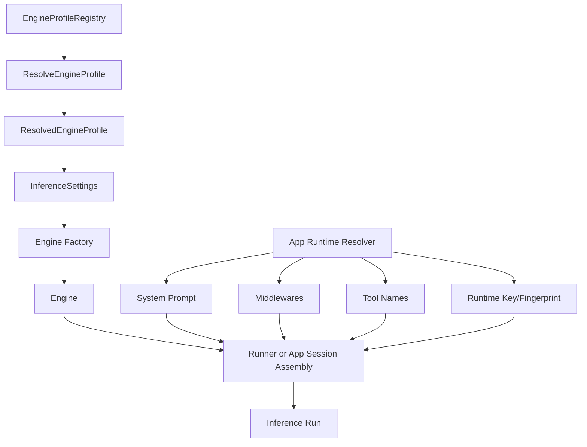
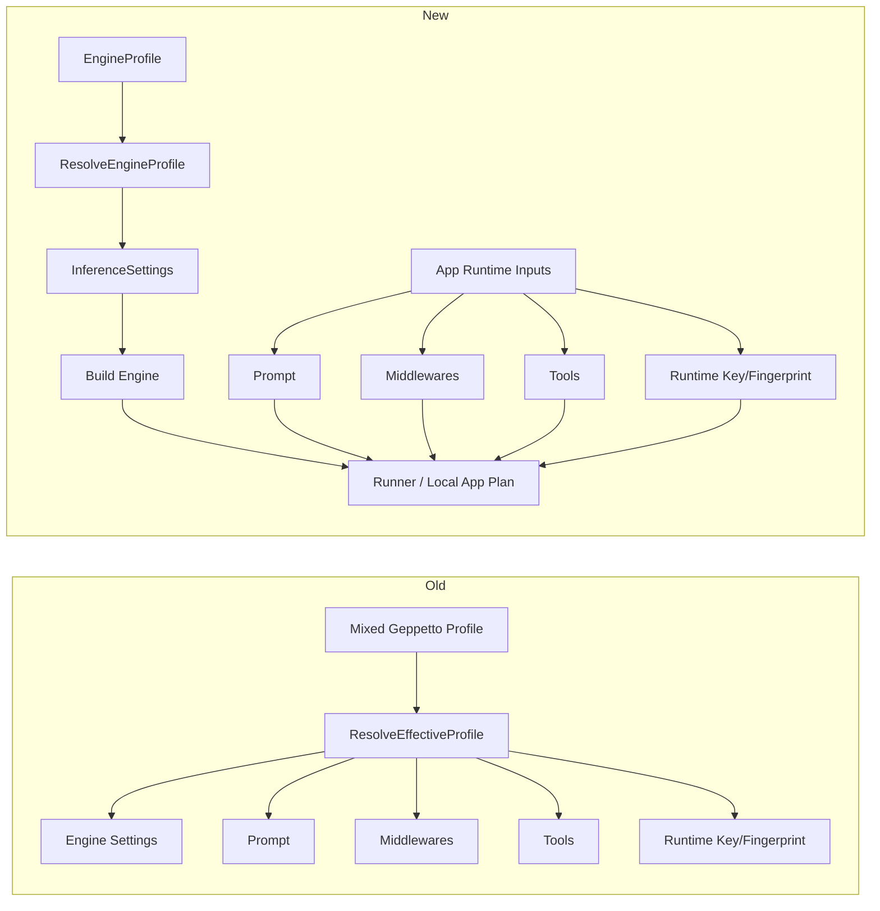

# PR 308 review guide for a tired reviewer

## Purpose

This document is a review packet, not just a design memo.

You asked for a document that lets a tired reviewer sit down, reconstruct the problem, understand the architecture, inspect the final code, compare before and after behavior, and know where to spend review energy. That is what this file is for.

More specifically, this guide is trying to remove the exhausting part of code review where you keep asking yourself basic orientation questions over and over again. In a branch this large, the tiring part is often not the syntax or the Go code itself. The tiring part is repeatedly losing the thread of the story: what used to happen, what happens now, why the old design became confusing, why the new design is stricter, and which files are actually showing the core of the change versus just reflecting it. If those orientation questions are answered clearly and repeatedly, the rest of the review becomes much more manageable.

The intended reading experience is therefore closer to reading a field guide than to reading a terse technical note. You should be able to start at the top without the repository open, let the document rebuild the mental model for you, and only then move into the heavier diff sections once the overall shape makes sense. When this guide repeats itself, that is deliberate. In a tired state, repeated framing is often more helpful than perfect concision.

The goal is that you can review the change linearly without having to mentally re-derive:

- what the old system was trying to do
- why it became confusing
- what the new system is trying to separate
- which code is core versus transitional versus downstream
- where the risky edges still are

This guide is intentionally long-form and repetitive in the places where a tired reviewer benefits from repeated framing.

## Executive summary

The main architectural rule of the migration is:

```text
Geppetto owns engine configuration.
Applications own runtime behavior.
```

Everything else is a consequence of that split.

In plain language, the old system let one concept pretend to be two concepts at the same time. A "profile" in Geppetto was not just a convenient name for a provider/model/inference preset. It was also drifting into a storage format for application-specific runtime behavior such as prompt injection, tool exposure, middleware selection, and runtime identity. That gave callers a superficially convenient object, but it also created constant ambiguity. Whenever you saw a resolved profile, you had to stop and ask: is this telling me how to build an engine, or is it telling me how this particular application wants to run? The answer was often "both," which is exactly the problem.

This branch is important because it stops tolerating that ambiguity. It says, very firmly, that engine construction and application runtime policy are different ownership domains. Geppetto is allowed to define the engine side. The host application is allowed to define the runtime side. That statement sounds simple when written as a slogan, but it has deep consequences for types, APIs, docs, tests, examples, and downstream consumers. Most of this branch is really the practical cleanup required to make that slogan true everywhere instead of only true in design discussions.

Before this migration:

- Geppetto profiles mixed engine configuration with application runtime behavior.
- The profile payload included engine settings and also application-level prompt, middleware, tools, and runtime identity behavior.
- JavaScript and downstream applications had to consume a mixed "resolved profile" object whose boundaries were blurry.

After this migration:

- Geppetto profiles are now engine-only and live in [`pkg/engineprofiles`](/home/manuel/workspaces/2026-03-17/add-opinionated-apis/geppetto/pkg/engineprofiles ).
- `StepSettings` was renamed to `InferenceSettings` in [`settings-inference.go`](/home/manuel/workspaces/2026-03-17/add-opinionated-apis/geppetto/pkg/steps/ai/settings/settings-inference.go ).
- JavaScript engine construction is engine-only, while `gp.runner` handles application-side runtime assembly.
- Pinocchio, CoinVault, and Temporal Relationships now resolve application runtime policy locally and only convert to shared transport types at the last boundary.

The reason this is a better design is not just abstract cleanliness. It is better because it makes responsibility visible. If a prompt changes, that should obviously be an application-level decision. If a tool allowlist changes, that should obviously be an application-level decision. If the OpenAI model or API type changes, that is clearly engine configuration. The branch is valuable because it tries to make the code reflect those obvious statements directly, so reviewers and future maintainers no longer have to reverse-engineer hidden ownership rules from old helper APIs.

The most important review question is not "does every rename look consistent?" The important review question is:

```text
Did we actually enforce the engine-vs-runtime split everywhere that matters?
```

## Long-form narrative walkthrough

If you read only one long section before looking at diffs, read this one.

Imagine you are maintaining a system with several applications on top of a shared inference library. One application is a chat UI, another is a retrieval-heavy app, another is a tool-driven workflow service. All of them need some common things: they need a way to talk to model providers, a way to name reusable model presets, and a way to merge configuration layers. But each application also has its own personality. One application wants a specific system prompt. Another wants a specific tool allowlist. Another wants different runtime metadata because it fingerprints requests differently for persistence or caching. Those application-side decisions are real and important, but they are not the same kind of thing as choosing `gpt-4.1-mini` versus `claude-3-7-sonnet`, or setting a timeout, or deciding whether the engine should use OpenAI or Gemini.

The old design blurred those layers together. A profile in Geppetto gradually became a place where engine settings and application runtime policy were both allowed to live. At first that probably felt useful, because a single resolved object could be passed around and many parts of the stack could get what they needed from it. But over time that convenience became expensive. Reviewers had to remember hidden rules. Callers had to know which fields were "really" core and which fields were only there because certain apps had historically stored runtime decisions in the same place. Downstream migrations became harder, because changing a host application's runtime behavior could start to look like changing Geppetto's domain model. The central problem was not that the code was large. The central problem was that the ownership story had become muddy.

This branch is an attempt to make that ownership story boring again. Boring is good here. The ideal outcome is that a new developer can ask, "what does an engine profile do?" and get a short, unsurprising answer: it resolves engine configuration. Then they can ask, "where do prompt, middleware, tools, and runtime fingerprinting live?" and get another short, unsurprising answer: in the host application or in the JS runner runtime object. That is the design this PR is trying to lock in. Once you view the branch through that lens, the large number of renames, deletions, examples, docs, and downstream migrations all become easier to interpret. They are all supporting actors in the same story.

The branch is also more practical than it may look from the outside. It does not merely delete mixed behavior and tell downstreams to figure it out. Instead, it creates a replacement path. In Go, engine profile resolution now gives you a cleaner `ResolvedEngineProfile` with `InferenceSettings` and metadata. In JavaScript, `gp.runner` gives callers a proper place to build runtime behavior explicitly. In downstream applications, local runtime plans are built first and only converted to shared transport types at the edge. So the branch is not just saying "that old shortcut was impure." It is saying "that shortcut was mixing concerns, and here is a more honest workflow that still lets real applications function."

As a reviewer, this means your job is not to memorize every file in the diff. Your job is to test whether this more honest workflow is actually present everywhere it claims to be present. When you see a type rename, ask whether the shape of the type really changed meaningfully. When you see a deleted field, ask whether it reappeared under a different name in a nearby package. When you see a new runner helper, ask whether it is truly the home for runtime behavior or whether some hidden shortcut still bypasses it. When you look at downstream migrations, ask whether they are genuinely local-first now or whether they still depend on Geppetto core to compute application runtime decisions. If you keep asking those questions, the review becomes coherent.

One useful mindset is to stop treating "more explicit" as automatically worse. A lot of the branch's design quality comes from moving implicit, blended behavior into explicit, separate steps. Explicit code can look longer on the page, but that is not the right measure here. The right measure is whether a maintainer can see what is happening without special tribal knowledge. In the old model, the code could be shorter while the mental model was murkier. In the new model, the code may be a little more deliberate, but the concepts are easier to name, easier to defend, and easier to migrate across repositories. That is a good trade if the implementation really follows through.

Finally, it is worth saying plainly what success looks like for this PR review. Success is not that every identifier now contains the word "engine" or "inference." Success is that after reading the code and the examples, you believe the following statement is true in practice and not only in documentation: Geppetto resolves engine configuration; applications resolve runtime behavior. If you believe that statement after reading the branch, the architecture probably landed correctly. If you do not believe that statement, your review comments should focus on the places where the code still contradicts it.

## What to review, at a high level

There are three related layers in the final state:

1. Geppetto core
2. Geppetto JavaScript surface
3. Downstream app migrations

They are connected, but they are not the same thing.

It helps to think of these three layers as three different kinds of evidence. Geppetto core tells you what the architecture now claims to be. The JavaScript surface tells you what kind of public behavior the maintainers now want to encourage. The downstream apps tell you whether the architecture survives contact with reality. If the core looks clean but the downstream apps had to rebuild the old mixed behavior in a hidden way, that would be a bad sign. If the JS APIs still nudge callers toward mixing concerns, that would also be a bad sign. A careful review should therefore keep checking whether all three layers are pointing in the same direction.

### Geppetto core

This is where the conceptual hard cut happened.

When you review the core, you are mostly verifying the honesty of the boundary. The question is not whether every implementation detail is elegant. The deeper question is whether the core resolved-profile contract has been made narrow enough that the package name `engineprofiles` is genuinely deserved. If the core types still carry prompt policy, tool policy, or runtime identity, then the rename would be cosmetic. If those concerns are truly absent and only inference settings plus provenance remain, then the hard cut is real.

The core changes are:

- `pkg/profiles` became [`pkg/engineprofiles`](/home/manuel/workspaces/2026-03-17/add-opinionated-apis/geppetto/pkg/engineprofiles )
- `StepSettings` became [`InferenceSettings`](/home/manuel/workspaces/2026-03-17/add-opinionated-apis/geppetto/pkg/steps/ai/settings/settings-inference.go )
- mixed runtime payload was removed from Geppetto profile resolution
- engine profile YAML now uses `inference_settings`

### JavaScript surface

This is where the new public-facing "opinionated" layer sits.

The JavaScript surface matters because it is where callers develop habits. Even if the core packages are clean, the public JS API could still quietly encourage the wrong mental model if it gives people shortcuts that recombine engine resolution and runtime policy in one step. So when you read the JS layer, do not only ask whether the functions work. Ask whether a new user would be taught the right concept boundaries simply by reading the exported names and the example scripts. Good API design does that teaching implicitly.

The JS changes are:

- engine profile resolution through `gp.profiles.resolve(...)`
- engine creation through `gp.engines.fromProfile(...)` and `gp.engines.fromResolvedProfile(...)`
- application runtime assembly through [`gp.runner`](/home/manuel/workspaces/2026-03-17/add-opinionated-apis/geppetto/pkg/js/modules/geppetto/api_runner.go )

### Downstream apps

This is where the new split had to be made real.

This layer is especially valuable for review because downstream apps are where abstractions get stress-tested. Pinocchio has prompt and middleware concerns. CoinVault has both inference profiles and application profiles. Temporal Relationships has its own run-chat transport and tool gating logic. If all of them can adopt the new split without bending Geppetto back into an application-runtime store, that is powerful evidence that the branch did something substantial rather than merely moving fields around.

The downstream changes are:

- Pinocchio CLI and JS now use engine-only profiles for engine settings
- Pinocchio web-chat builds a local resolved runtime plan first
- CoinVault builds a local resolved runtime plan first
- Temporal Relationships builds a local resolved runtime plan first

Those downstream migrations are not "nice to have." They are the proof that the new model is usable.

## Ticket and commit map

This review line spans multiple tickets and several repositories.

### Ticket map

- `GP-47`: JS runtime metadata cleanup
- `GP-46`: opinionated JavaScript runner API
- `GP-49`: engine profiles + `InferenceSettings` hard cut
- `GP-50`: Pinocchio CLI and JS migration
- `COINVAULT-021`: CoinVault migration
- `MEN-TR-074`: Temporal Relationships migration
- `GP-51`: future follow-up for shrinking the remaining shared Pinocchio runtime transport boundary

### Core Geppetto commit sequence

Use this when you want to map the history after you understand the final state:

- `677f7a2` materialize js resolved profile runtime metadata
- `b43571f` add js runner runtime resolution
- `2f052e4` add js runner prepared execution
- `099ebfb` add js runner start handle
- `c830e74` rename profiles package to engineprofiles
- `af37414` rename step settings to inference settings
- `378c9b9` rename engine profile api surface
- `993dc0a` hard cut geppetto engine profiles
- `5770ba1` export engine profile settings merge helper
- `61d8ff5` fix js runner/profile review followups

### Downstream commit sequence

Pinocchio:

- `cf01006` migrate pinocchio cli and js to engine profiles
- `d6fd5e6` fix loaded command engine profile resolution
- `37af960` hard cut shared webchat runtime
- `4076ac8` make web-chat runtime plan local-first
- `b2c892f` refresh webchat engine profile docs

CoinVault:

- `fd5a862` hard cut coinvault engine/runtime split
- `761936b` make coinvault runtime plan local-first

Temporal Relationships:

- `72b197c` fix gorunner engine profile logging
- `6d4d9f8` hard cut run-chat engine/runtime split
- `3dbd3cf` make temporal run-chat plan local-first

## Review order

If you are tired, do **not** review this in git history order first.

That is the wrong order.

The best review order is:

1. Final architecture
2. Final public contracts
3. Core implementation
4. Downstream migrations
5. Tests and examples
6. Commit history

This document follows that order.

## Final architecture

### Old model

The old conceptual shape looked like this:

```text
mixed profile registry
  -> resolve effective profile
  -> runtime payload contains:
       - engine settings patch
       - system prompt
       - middlewares
       - tools
       - runtime key/fingerprint
  -> engine construction + runtime assembly happen from one mixed object
```

The problem with that shape was not only that it was large.
The deeper problem was that it bundled two different ownership domains:

- Geppetto-owned engine construction
- app-owned runtime policy

That bundling created a very specific kind of confusion. It meant that a resolved profile was simultaneously treated as a selection result, a configuration payload, an execution plan, and a cache identity source. Those are all understandable needs on their own, but putting them behind one object makes it hard to tell which layer is allowed to evolve independently. For example, if an application wants to experiment with a different prompt or tool list, should that require a Geppetto profile change? If a host wants to choose a different base model, should that affect runtime fingerprinting rules that belong to the application? The old model made those questions harder than they needed to be.

Another way to say it is that the old model rewarded convenience in the short term but charged interest in the long term. A mixed resolved-profile object was easy to pass around because it contained "everything." But because it contained everything, every caller also inherited hidden coupling to decisions that did not really belong together. That is why the branch has such a strong emphasis on ownership boundaries. Once you see the old object as a coupling device rather than a convenience device, the motivation for the hard cut becomes much easier to understand.

### New model

The new conceptual shape is:

```text
engine profile registry (Geppetto)
  -> resolve engine profile
  -> final InferenceSettings
  -> build engine

app runtime config (Pinocchio / CoinVault / Temporal)
  -> system prompt
  -> middlewares
  -> tool exposure
  -> runtime key / fingerprint

engine + app runtime config
  -> actual run
```

The new model is intentionally a little more explicit at the call site, because explicitness is what buys you clarity. Instead of one magic object quietly smuggling engine and runtime behavior together, the system now asks the caller to express the two layers separately and then combine them in the open. That can feel slightly more verbose, but the extra verbosity is doing useful work. It forces the caller, and the reviewer, to see which decisions belong to Geppetto and which decisions belong to the host application.

This is also why `gp.runner` is so important. Without it, the branch would mostly look like a subtraction: fewer shortcuts, fewer fields, fewer mixed objects. But `gp.runner` turns the change into a reorganization instead. The runtime behavior did not disappear. It moved into a place where it can be owned honestly and assembled explicitly. That is a much healthier design, because the runtime concerns are still supported without pretending they are part of engine-profile resolution.

### Architecture diagram



### Separation rule to keep in your head

When you read code during review, use this rule:

- if the data changes which engine/provider/model/client/inference settings are built, it belongs in Geppetto engine profiles
- if the data changes prompt injection, middleware chain, tool exposure, or runtime identity, it belongs in the app

If you see code violating that rule, it deserves attention.

If you are tired and keep losing the plot, come back to this rule. It is the single most useful compression trick for the whole PR. You do not need to keep every rename, every helper, every downstream file, and every example in your head at once. You only need to keep asking one question: is this piece of data deciding the engine, or is it deciding the app runtime? Once you know the answer, most of the review comments almost write themselves. If the wrong layer owns the wrong kind of data, that is probably the real issue.

## Final public contracts

This section is the most important part of the review packet.

### 1. `InferenceSettings`

File:

- [`settings-inference.go`](/home/manuel/workspaces/2026-03-17/add-opinionated-apis/geppetto/pkg/steps/ai/settings/settings-inference.go )

This is the renamed and clarified engine-configuration object.

Important points:

- this is the replacement for `StepSettings`
- it contains provider/client/model/inference knobs
- it is still the object used to actually construct engines

The core type now looks like:

```go
type InferenceSettings struct {
    API        *APISettings
    Chat       *ChatSettings
    OpenAI     *openai.Settings
    Client     *ClientSettings
    Claude     *claude.Settings
    Gemini     *gemini.Settings
    Ollama     *ollama.Settings
    Embeddings *config.EmbeddingsConfig
    Inference  *engine.InferenceConfig
}
```

Review focus:

- did the rename stay conceptual and not just cosmetic?
- do all constructors, factories, and callers use the new name consistently?
- are there any places where old "step" semantics leaked back in?

### 2. `EngineProfile`

File:

- [`pkg/engineprofiles/types.go`](/home/manuel/workspaces/2026-03-17/add-opinionated-apis/geppetto/pkg/engineprofiles/types.go )

This is the new core profile data model.

The important shape is:

```go
type EngineProfile struct {
    Slug              EngineProfileSlug
    DisplayName       string
    Description       string
    Stack             []EngineProfileRef
    InferenceSettings *settings.InferenceSettings
    Metadata          EngineProfileMetadata
    Extensions        map[string]any
}
```

Review focus:

- verify that runtime policy fields are actually gone
- verify that the data model is narrow enough to justify the rename
- pay attention to `Extensions`, because that is still an escape hatch

### 3. `ResolvedEngineProfile`

Files:

- [`pkg/engineprofiles/registry.go`](/home/manuel/workspaces/2026-03-17/add-opinionated-apis/geppetto/pkg/engineprofiles/registry.go )
- [`pkg/engineprofiles/service.go`](/home/manuel/workspaces/2026-03-17/add-opinionated-apis/geppetto/pkg/engineprofiles/service.go )

This is the output of engine-profile resolution.

The new resolved output is intentionally engine-only:

```go
type ResolvedEngineProfile struct {
    RegistrySlug      RegistrySlug
    EngineProfileSlug EngineProfileSlug
    InferenceSettings *settings.InferenceSettings
    Metadata          map[string]any
}
```

Review focus:

- verify that runtime key/fingerprint are really gone from Geppetto core
- verify that metadata is still useful enough for observability and debugging
- verify that merged settings are clones and not shared mutable pointers

### 4. JS `gp.profiles.resolve(...)`

File:

- [`pkg/js/modules/geppetto/api_profiles.go`](/home/manuel/workspaces/2026-03-17/add-opinionated-apis/geppetto/pkg/js/modules/geppetto/api_profiles.go )

This API changed meaning.

Before:

- it resolved a mixed profile shape and callers often treated it as execution input

After:

- it resolves an engine profile and returns engine settings plus metadata
- it is mostly an inspection / engine-selection primitive

Review focus:

- verify that `effectiveRuntime` is gone
- verify that the returned object does not quietly reintroduce runtime policy

### 5. JS `gp.engines.*`

File:

- [`pkg/js/modules/geppetto/api_engines.go`](/home/manuel/workspaces/2026-03-17/add-opinionated-apis/geppetto/pkg/js/modules/geppetto/api_engines.go )

This API now has a cleaner story:

- `gp.engines.fromConfig(...)`
- `gp.engines.fromProfile(...)`
- `gp.engines.fromResolvedProfile(...)`

The important invariant is:

```text
These APIs build engines. They do not apply prompt/tool/middleware runtime policy.
```

Review focus:

- make sure these constructors stay engine-only
- make sure they build from `InferenceSettings`
- make sure they do not accidentally consume app runtime metadata

### 6. JS `gp.runner.*`

Files:

- [`pkg/js/modules/geppetto/api_runner.go`](/home/manuel/workspaces/2026-03-17/add-opinionated-apis/geppetto/pkg/js/modules/geppetto/api_runner.go )
- [`pkg/js/modules/geppetto/api_runtime_metadata.go`](/home/manuel/workspaces/2026-03-17/add-opinionated-apis/geppetto/pkg/js/modules/geppetto/api_runtime_metadata.go )

This is where application-side runtime behavior is assembled.

Main APIs:

- `gp.runner.resolveRuntime(...)`
- `gp.runner.prepare(...)`
- `gp.runner.run(...)`
- `gp.runner.start(...)`

Review focus:

- verify that `gp.runner` no longer takes profile input as a shortcut
- verify that runtime stamping and tool filtering happen here, not in engine profile resolution
- verify that prepared turns are cloned safely and have IDs cleared

## Before and after examples

### Before: mixed profile resolution drives too much

The old mental model was roughly:

```go
resolved := profiles.ResolveEffectiveProfile(...)

engine := BuildEngine(
    baseStepSettings + resolved.Runtime.StepSettingsPatch,
    resolved.Runtime.SystemPrompt,
    resolved.Runtime.Middlewares,
)

registry := FilterTools(allTools, resolved.Runtime.Tools)
runtimeKey := resolved.RuntimeKey
runtimeFingerprint := resolved.RuntimeFingerprint
```

Problems:

- one object owned too many concepts
- runtime identity came from core profile resolution
- tool exposure was treated as core-profile behavior
- engine settings patching was mixed with app prompt/tool/middleware policy

The easiest way to understand why this was fragile is to imagine trying to explain that old flow to a new teammate. You would have to keep using awkward sentences like "the profile mostly describes runtime behavior, except some of it is really engine configuration, and some of the runtime identity is derived by core resolution, and callers are expected to understand which pieces are app-specific." If a design is hard to explain simply, that is usually a warning sign. The old flow worked, but it did not produce a simple story.

### After: engine settings and runtime policy are separate

The new mental model is:

```go
resolvedEngineProfile := engineprofiles.ResolveEngineProfile(...)
finalSettings := MergeInferenceSettings(baseSettings, resolvedEngineProfile.InferenceSettings)
engine := enginefactory.NewEngineFromSettings(finalSettings)

runtimePlan := AppResolveRuntime(...)
registry := FilterTools(allTools, runtimePlan.ToolNames)
middlewares := BuildMiddlewares(runtimePlan.Middlewares)

run(engine, registry, middlewares, runtimePlan.SystemPrompt, runtimePlan.RuntimeKey)
```

Benefits:

- engine resolution is reusable and composable
- runtime policy is explicit and app-owned
- JS and downstream apps now follow the same story

This new flow is easier to explain because each step has a cleaner sentence attached to it. "Resolve the engine profile to get engine settings." "Merge with base inference settings if your app has a base." "Resolve your application runtime policy locally." "Run with the engine and the runtime." Those are short sentences, and that matters. A good architecture is often one that can be described to a new developer without hedging every sentence with exceptions.

### Before and after in JS

Before:

```javascript
const resolved = gp.profiles.resolve({ profileSlug: "assistant" });
const engine = gp.engines.fromConfig({ model: "gpt-4o-mini" });

// caller had to mentally mix runtime policy and engine policy
const out = gp.sessions.run({
  engine,
  prompt: "hello",
  resolvedProfile: resolved,
});
```

After:

```javascript
const resolved = gp.profiles.resolve({ profileSlug: "assistant" });
const engine = gp.engines.fromResolvedProfile(resolved);
const runtime = gp.runner.resolveRuntime({
  systemPrompt: "You are concise.",
  tools: ["search"],
});

const out = gp.runner.run({
  engine,
  runtime,
  prompt: "hello",
});
```

Review question:

- does the new API force the caller into the correct mental model?

That is the most valuable way to think about the JS change. The old JS surface made it easy for a caller to keep thinking in terms of "resolved profile equals runtime plan." The new JS surface is trying to retrain that instinct. The caller now has to say, explicitly, "first I resolve or build the engine, then I resolve runtime behavior, then I run." If that feels slightly more deliberate, that is a feature rather than a bug. The API is trying to teach a better habit.

## Core files to inspect carefully

If you only have enough energy to inspect a subset deeply, inspect these.

### Highest priority

- [`pkg/engineprofiles/types.go`](/home/manuel/workspaces/2026-03-17/add-opinionated-apis/geppetto/pkg/engineprofiles/types.go )
- [`pkg/engineprofiles/service.go`](/home/manuel/workspaces/2026-03-17/add-opinionated-apis/geppetto/pkg/engineprofiles/service.go )
- [`pkg/engineprofiles/inference_settings_merge.go`](/home/manuel/workspaces/2026-03-17/add-opinionated-apis/geppetto/pkg/engineprofiles/inference_settings_merge.go )
- [`pkg/steps/ai/settings/settings-inference.go`](/home/manuel/workspaces/2026-03-17/add-opinionated-apis/geppetto/pkg/steps/ai/settings/settings-inference.go )
- [`pkg/js/modules/geppetto/api_engines.go`](/home/manuel/workspaces/2026-03-17/add-opinionated-apis/geppetto/pkg/js/modules/geppetto/api_engines.go )
- [`pkg/js/modules/geppetto/api_runner.go`](/home/manuel/workspaces/2026-03-17/add-opinionated-apis/geppetto/pkg/js/modules/geppetto/api_runner.go )

### Next priority

- [`pkg/js/modules/geppetto/api_runtime_metadata.go`](/home/manuel/workspaces/2026-03-17/add-opinionated-apis/geppetto/pkg/js/modules/geppetto/api_runtime_metadata.go )
- [`pkg/js/modules/geppetto/module_test.go`](/home/manuel/workspaces/2026-03-17/add-opinionated-apis/geppetto/pkg/js/modules/geppetto/module_test.go )
- [`pkg/doc/topics/01-profiles.md`](/home/manuel/workspaces/2026-03-17/add-opinionated-apis/geppetto/pkg/doc/topics/01-profiles.md )
- [`pkg/doc/topics/13-js-api-reference.md`](/home/manuel/workspaces/2026-03-17/add-opinionated-apis/geppetto/pkg/doc/topics/13-js-api-reference.md )
- [`pkg/doc/topics/14-js-api-user-guide.md`](/home/manuel/workspaces/2026-03-17/add-opinionated-apis/geppetto/pkg/doc/topics/14-js-api-user-guide.md )

### Downstream migration files

- [`cmd/web-chat/profile_policy.go`](/home/manuel/workspaces/2026-03-17/add-opinionated-apis/pinocchio/cmd/web-chat/profile_policy.go )
- [`pkg/inference/runtime/profile_runtime.go`](/home/manuel/workspaces/2026-03-17/add-opinionated-apis/pinocchio/pkg/inference/runtime/profile_runtime.go )
- [`internal/webchat/resolver.go`](/home/manuel/workspaces/2026-03-17/add-opinionated-apis/2026-03-16--gec-rag/internal/webchat/resolver.go )
- [`internal/extractor/httpapi/run_chat_transport.go`](/home/manuel/workspaces/2026-03-17/add-opinionated-apis/temporal-relationships/internal/extractor/httpapi/run_chat_transport.go )

## What changed in downstream apps

This section exists because a careful review should confirm that the new architecture was survivable in real apps.

### Pinocchio

Pinocchio had to absorb the new split in three places:

- CLI command bootstrap
- JS runner command
- web-chat runtime composition

The current design in web-chat is:

```text
Pinocchio resolves engine profile
  -> merges final InferenceSettings
  -> resolves Pinocchio-owned runtime policy
  -> builds a local resolved plan
  -> converts once to shared transport
```

Main file:

- [`cmd/web-chat/profile_policy.go`](/home/manuel/workspaces/2026-03-17/add-opinionated-apis/pinocchio/cmd/web-chat/profile_policy.go )

Review focus:

- verify the local-first plan really exists
- verify runtime key/fingerprint are owned by the app layer
- verify Geppetto engine profiles are used only for engine settings

### CoinVault

CoinVault had to separate:

- engine profile selection
- application profile selection

That makes it a good review target, because it shows the architecture under real pressure.

Main file:

- [`internal/webchat/resolver.go`](/home/manuel/workspaces/2026-03-17/add-opinionated-apis/2026-03-16--gec-rag/internal/webchat/resolver.go )

Review focus:

- verify app prompt and tool names now come from the app profile store, not Geppetto profiles
- verify final `InferenceSettings` come from engine profiles only
- verify the local runtime plan is translated to shared transport only at the end

### Temporal Relationships

Temporal is a useful review target because it is simpler and tool-oriented.

Main file:

- [`internal/extractor/httpapi/run_chat_transport.go`](/home/manuel/workspaces/2026-03-17/add-opinionated-apis/temporal-relationships/internal/extractor/httpapi/run_chat_transport.go )

Review focus:

- verify tool exposure is now app-owned
- verify the run-chat path builds engines from merged `InferenceSettings`
- verify runtime identity is no longer coming from Geppetto core

## Places to pay extra attention

This is the "review energy allocation" section.

### 1. Merge correctness

The whole engine-profile story depends on correct merge behavior.

Pay attention to:

- clone versus mutate behavior
- nil-handling
- precedence rules in stacked profiles
- whether metadata references accidentally share mutable state

Main files:

- [`pkg/engineprofiles/inference_settings_merge.go`](/home/manuel/workspaces/2026-03-17/add-opinionated-apis/geppetto/pkg/engineprofiles/inference_settings_merge.go )
- [`pkg/engineprofiles/stack_merge.go`](/home/manuel/workspaces/2026-03-17/add-opinionated-apis/geppetto/pkg/engineprofiles/stack_merge.go )

### 2. JS boundary cleanliness

The JS API is easy to accidentally muddy again.

Pay attention to:

- whether `gp.runner` accepts anything that smells like engine-profile shortcuts
- whether `gp.engines.*` quietly apply runtime policy
- whether `gp.profiles.resolve(...)` still returns execution-shaped data

Main files:

- [`api_profiles.go`](/home/manuel/workspaces/2026-03-17/add-opinionated-apis/geppetto/pkg/js/modules/geppetto/api_profiles.go )
- [`api_engines.go`](/home/manuel/workspaces/2026-03-17/add-opinionated-apis/geppetto/pkg/js/modules/geppetto/api_engines.go )
- [`api_runner.go`](/home/manuel/workspaces/2026-03-17/add-opinionated-apis/geppetto/pkg/js/modules/geppetto/api_runner.go )

### 3. Runtime metadata stamping

This was one of the trickier edges before the hard cut.

Pay attention to:

- prepared turn cloning
- turn ID reset
- runtime metadata stamping shape
- tool filtering and middleware materialization

Main files:

- [`api_runtime_metadata.go`](/home/manuel/workspaces/2026-03-17/add-opinionated-apis/geppetto/pkg/js/modules/geppetto/api_runtime_metadata.go )
- [`api_runner.go`](/home/manuel/workspaces/2026-03-17/add-opinionated-apis/geppetto/pkg/js/modules/geppetto/api_runner.go )

### 4. Remaining escape hatches

The architecture is much cleaner, but not infinitely rigid.

Pay attention to:

- profile `Extensions`
- Pinocchio `ProfileRuntime` extension
- metadata maps that are still string-to-any bags

Those are not automatically wrong, but they are the likely places where future complexity could creep back in.

## The remaining follow-up boundary

One follow-up ticket exists because one shared boundary still remains in Pinocchio:

- [`GP-51-WEBCHAT-TRANSPORT-BOUNDARY`](/home/manuel/workspaces/2026-03-17/add-opinionated-apis/pinocchio/ttmp/2026/03/18/GP-51-WEBCHAT-TRANSPORT-BOUNDARY--remove-the-remaining-shared-runtime-transport-boundary/index.md )

The current shared type is:

- [`pkg/inference/runtime/profile_runtime.go`](/home/manuel/workspaces/2026-03-17/add-opinionated-apis/pinocchio/pkg/inference/runtime/profile_runtime.go )

That type is already app-owned and much smaller than the old model, but it is still a shared transport boundary. That is intentionally deferred future work, not a defect in the current migration.

Review focus:

- do not block this PR because `GP-51` still exists
- do make sure the current boundary is at least small, explicit, and honest

## Suggested review checklist

Use this if you want a concrete list to mark off.

1. Confirm `InferenceSettings` is the final engine-configuration type and the rename is complete.
2. Confirm `EngineProfile` contains engine settings only.
3. Confirm `ResolvedEngineProfile` contains engine settings plus metadata only.
4. Confirm runtime key/fingerprint are gone from Geppetto core profile resolution.
5. Confirm `gp.engines.*` are engine-only.
6. Confirm `gp.runner.*` is the place where runtime policy is assembled.
7. Confirm example engine profile YAML uses `inference_settings`.
8. Confirm Pinocchio web-chat builds a local runtime plan before shared conversion.
9. Confirm CoinVault and Temporal do the same.
10. Confirm docs teach the new split instead of the old mixed model.

## Validation commands

If you want to reproduce the final validation surface locally, these are the highest-signal commands.

Geppetto:

```bash
cd /home/manuel/workspaces/2026-03-17/add-opinionated-apis/geppetto
go test ./cmd/... ./pkg/...
./.bin/golangci-lint run ./cmd/... ./pkg/...
docmgr doctor --ticket GP-49-ENGINE-PROFILES --stale-after 30
```

Pinocchio:

```bash
cd /home/manuel/workspaces/2026-03-17/add-opinionated-apis/pinocchio
go test ./cmd/pinocchio/... ./cmd/web-chat ./pkg/webchat/... ./pkg/cmds/helpers -count=1
```

CoinVault:

```bash
cd /home/manuel/workspaces/2026-03-17/add-opinionated-apis/2026-03-16--gec-rag
go test ./internal/... -count=1
```

Temporal Relationships:

```bash
cd /home/manuel/workspaces/2026-03-17/add-opinionated-apis/temporal-relationships
go test ./internal/extractor/... -count=1
```

## Review hints for a tired reviewer

These are the practical hints I would personally use.

- Start with the final docs, not the commits.
- When a file feels confusing, ask one question only: "is this engine config or app runtime policy?"
- Ignore purely mechanical rename noise after you have confirmed the new conceptual boundary.
- Spend more attention on merge logic, JS boundary APIs, and downstream local-first runtime plans than on generated docs or example renames.
- Treat the existence of `Extensions` and metadata maps as "watch carefully" areas, not automatic defects.
- If you find a place where Geppetto starts deciding prompt/tools/runtime key again, that is worth flagging strongly.

## Bottom line

This review is really about one architectural claim:

```text
The system is simpler because the ownership boundary is now honest.
```

If the code, examples, docs, and downstream migrations all support that claim, then the migration succeeded.

If you find places where engine profiles still decide application runtime behavior, or where app runtime behavior still relies on hidden Geppetto profile semantics, that is where the real review findings will be.

## Branch scope snapshot

Before reading diffs, it helps to calibrate the size of the branch.

The final `origin/main..HEAD` diff in Geppetto is:

```text
151 files changed, 9499 insertions(+), 5914 deletions(-)
```

That matters because it explains why this review is tiring. This is not a one-file refactor or a purely mechanical rename. It is a broad architectural change that includes:

- new engine-profile core types
- a large type rename from `StepSettings` to `InferenceSettings`
- new JS entry points
- deleted mixed-runtime contracts
- new docs and examples
- downstream migrations proving the new split
- a final review-fix commit on top

As a reviewer, this means you should not try to "read everything equally." The branch is too large for that. You need a mental compression strategy:

1. understand the architectural claim
2. inspect the highest-risk boundaries
3. use docs/examples/tests to verify intent and external behavior
4. use downstream migrations as proof that the architecture is actually survivable

It is worth slowing down here because this is one of the places where reviewers often accidentally sabotage themselves. When a branch is this large, the natural impulse is to keep scrolling and hope the important parts will reveal themselves automatically. In practice, that usually leads to review fatigue and shallow comments, because the eye ends up treating architectural code, docs, test fixtures, and downstream migrations as if they all carried the same weight. They do not. The branch is large, but its real burden is conceptual rather than purely textual. Once you understand that, the diff stops looking like one giant wall of change and starts looking like a small number of important moves repeated across many files.

Another useful way to think about branch size is this: the branch is not large because one subsystem got complicated. It is large because one architectural decision had to be reflected everywhere that decision mattered. That includes core types, JS surfaces, docs, examples, tests, and downstream consumers. In other words, the size of the diff is partly evidence that the branch is trying to be honest. A dishonest branch would often be smaller because it would change the slogan but not the whole ecosystem around it. This one is expensive precisely because it is trying to make the new boundary real.

## Why this branch exists, in plain language

The old design let Geppetto profiles do too much. They were not just engine presets. They were also a partial application runtime plan.

That sounds convenient at first, but it creates a long-term maintenance trap. Once a profile can encode prompt policy, middleware policy, tool exposure, runtime identity, and engine selection all in one structure, every caller has to wonder which parts are safe to treat as core engine configuration and which parts are really just host-application behavior that happened to be stored in Geppetto.

That was the underlying source of confusion.

So the branch is doing a hard reset on ownership:

- Geppetto is allowed to answer "what engine should I build?"
- host applications are allowed to answer "how should this application run?"

The branch is also doing the practical work required to make that statement true:

- removing mixed runtime payloads from profile resolution
- renaming the engine-settings type so its purpose is clearer
- adding a JS runner API that handles app-side runtime composition explicitly
- migrating downstream apps so they no longer depend on hidden mixed-profile behavior

The phrase "in plain language" matters here. When a branch cannot be explained in plain language, that is often a sign that the architecture is still muddled. Here, the plain-language version is actually quite stable: Geppetto had started to accumulate application-level runtime behavior inside a profile system that should have been about engine configuration. That made the library more powerful in the moment but less trustworthy as a boundary. The branch exists to restore trust in that boundary.

This is also why the PR may feel stricter than earlier Geppetto work. A lot of prior ergonomics depended on letting one object carry more meaning than it should. Once you decide to separate those meanings, you must be willing to say "no" to certain shortcuts. That is why some APIs were removed, why `runner.resolveRuntime({ profile: ... })` is explicitly rejected, and why downstream apps now perform more local composition. The branch is doing a cleanup that inevitably makes the rules sharper.

## Ticket narrative as a story

If you only read the commit log, the branch can feel scattered. It is easier to review if you treat it as a three-act story.

### Act 1: GP-47 prepared the boundary

`GP-47` cleaned up runtime metadata resolution in the JS layer before the hard cut. That work made the runtime metadata materialization explicit enough that it could later be separated from engine-profile resolution rather than being quietly hidden inside it.

In review terms, `GP-47` is important because it explains why some runtime metadata support still exists in JS after the hard cut. The answer is not "because the cut was incomplete." The answer is "because runtime metadata is still real, but it now belongs to runtime assembly rather than engine-profile resolution."

### Act 2: GP-46 created the app-facing JS runner model

`GP-46` added the opinionated `gp.runner` surface:

- `resolveRuntime`
- `prepare`
- `run`
- `start`

That is the API that gives JS callers a new home for application-side concerns. Without it, the hard cut would have removed old shortcuts without giving callers a new way to express runtime policy. So `GP-46` is the replacement surface that makes the architecture usable.

### Act 3: GP-49 performed the hard cut

`GP-49` is where the real contract change happened.

That ticket:

- renamed `pkg/profiles` to `pkg/engineprofiles`
- renamed `StepSettings` to `InferenceSettings`
- removed mixed runtime payloads from profile resolution
- updated docs, examples, and consumers to reflect the new meaning
- exported the merge helper that downstream apps now use explicitly

Once you see the branch as "prepare the runtime story, add the new JS surface, then cut the old mixed contract," the commit arc becomes much easier to review.

This three-act framing is useful because it turns what looks like a tangled sequence of commits into a sequence of design necessities. First, the branch had to make runtime metadata explicit enough to be movable. Second, it had to create a place where runtime behavior could continue to live after the cut. Third, it had to actually remove the mixed contract from core profile resolution. That order is not arbitrary. It is the order you would expect if the maintainers were trying to avoid a vacuum where old behavior was removed before new behavior had a legitimate home.

## Commit arc with review interpretation

The raw commit list is:

- `677f7a2` materialize js resolved profile runtime metadata
- `01e2e89` document js resolved profile runtime assembly
- `4fac7e9` record gp-47 runtime metadata cleanup work
- `63999e1` track gp-47 ticket workspace readme
- `85f4024` record gp-46 implementation kickoff
- `b43571f` add js runner runtime resolution
- `2f052e4` add js runner prepared execution
- `099ebfb` add js runner start handle
- `421ff42` document js runner public surface
- `a4ff5ac` close out gp-46 js runner ticket
- `c65c2ad` support host default js profile resolution
- `c830e74` rename profiles package to engineprofiles
- `af37414` rename step settings to inference settings
- `70623b4` record gp-49 inference settings rename
- `378c9b9` rename engine profile api surface
- `993dc0a` hard cut geppetto engine profiles
- `5770ba1` export engine profile settings merge helper
- `ba205d0` close gp-49 engine profiles ticket
- `3883f85` close gp-47 runtime metadata cleanup ticket
- `61d8ff5` fix js runner/profile review followups

Here is how to interpret that list as a reviewer:

- The three most important implementation commits are `b43571f`, `993dc0a`, and `61d8ff5`.
- The rename commits are important, but mostly because they confirm the boundary was applied consistently.
- The docs/examples commits are not filler. In this branch, they are part of the public contract and are worth reading because the change is fundamentally conceptual.
- The final review-fix commit matters disproportionately because it corrected subtle behavior that was still wrong after the main architecture landed.

## Detailed diff atlas

This section is the "offline evidence" part of the guide. You said you will not have the code while reviewing, so this section includes the most important diff hunks and the explanation of why each one matters.

Think of this section as the museum tour version of the branch. The code snippets are the exhibits, but the prose is here so you do not have to do all the interpretive work yourself while tired. In a normal review, you might scan the hunk, look at surrounding lines, and reconstruct the intent from context. Since you explicitly will not have the full code in front of you, the goal here is to tell you what role each hunk plays in the larger story before you start judging whether it looks correct.

Another helpful mindset is that the diff atlas is not trying to prove every line in the branch is correct. That would be impossible in one document. Instead, it is trying to anchor you on the highest-signal moves, the places where the architecture either succeeds or fails in public. If those anchor points hold up, the rest of the branch becomes much easier to trust. If those anchor points look shaky, then no amount of rename consistency elsewhere should make you comfortable.

### 1. Module surface change in `module.go`

File:

- [`module.go`](/home/manuel/workspaces/2026-03-17/add-opinionated-apis/geppetto/pkg/js/modules/geppetto/module.go)

High-signal diff:

```diff
+	profiles "github.com/go-go-golems/geppetto/pkg/engineprofiles"
-	"github.com/go-go-golems/geppetto/pkg/profiles"

 type Options struct {
-	ProfileRegistry       profiles.RegistryReader
+	EngineProfileRegistry    profiles.RegistryReader
+	UseDefaultProfileResolve bool
+	DefaultProfileResolve    profiles.ResolveInput
 }

 	enginesObj := m.vm.NewObject()
 	m.mustSet(enginesObj, "echo", m.engineEcho)
 	m.mustSet(enginesObj, "fromConfig", m.engineFromConfig)
+	m.mustSet(enginesObj, "fromProfile", m.engineFromProfile)
+	m.mustSet(enginesObj, "fromResolvedProfile", m.engineFromResolvedProfile)

 	profilesObj := m.vm.NewObject()
-	m.mustSet(profilesObj, "listProfiles", m.profilesListProfiles)
-	m.mustSet(profilesObj, "getProfile", m.profilesGetProfile)
+	m.mustSet(profilesObj, "listProfiles", m.profilesListEngineProfiles)
+	m.mustSet(profilesObj, "getProfile", m.profilesGetEngineProfile)

+	runnerObj := m.vm.NewObject()
+	m.mustSet(runnerObj, "resolveRuntime", m.runnerResolveRuntime)
+	m.mustSet(runnerObj, "prepare", m.runnerPrepare)
+	m.mustSet(runnerObj, "run", m.runnerRun)
+	m.mustSet(runnerObj, "start", m.runnerStart)
+	m.mustSet(exports, "runner", runnerObj)
```

Why this matters:

This is the branch point where the public JS module stops being a thin accumulation of earlier concepts and starts expressing the new architecture directly.

It helps to treat this file as the front door of the JavaScript world. A great deal of architecture can be inferred from what a module chooses to export, because exports are how maintainers tell callers what concepts should exist in their heads. Before this change, the JS module still carried the smell of the older mixed model. After this change, the exports start telling a cleaner story even before a caller reads the docs. There is a `profiles` area for engine-profile interaction, an `engines` area for engine construction, and a `runner` area for application-side runtime assembly. That is an architectural lesson encoded directly into the shape of the module.

Three things happen at once:

1. the backing package changes from `profiles` to `engineprofiles`
2. the module options grow explicit host-default resolve behavior
3. the JS surface grows explicit engine-profile and runner namespaces

That is not cosmetic. It is the point where the module starts teaching callers the new mental model through API shape rather than through documentation alone.

This is important enough to say twice in different words: a good API surface can do part of the reviewer’s job for them. If the API shape itself nudges users toward the right conceptual split, that reduces the long-term risk of accidental regression. Reviewers should therefore care quite a lot about files like `module.go`, because a boundary that is visible at the export level is much more durable than a boundary that only appears in ticket docs.

As a reviewer, ask:

- Does the export layout now encourage the correct behavior?
- Would a new JS caller naturally understand that `profiles` resolves engine settings and `runner` resolves runtime behavior?
- Are there any leftover exports that still suggest the old mixed model?

### 2. `api_profiles.go` stopped returning mixed runtime data

File:

- [`api_profiles.go`](/home/manuel/workspaces/2026-03-17/add-opinionated-apis/geppetto/pkg/js/modules/geppetto/api_profiles.go)

High-signal diff:

```diff
-func (m *moduleRuntime) requireProfileRegistryReader(method string) (profiles.RegistryReader, error) {
+func (m *moduleRuntime) requireEngineProfileRegistryReader(method string) (profiles.RegistryReader, error) {
...
-func parseRequiredProfileSlug(raw any, field string) (profiles.ProfileSlug, error) {
+func parseRequiredEngineProfileSlug(raw any, field string) (profiles.EngineProfileSlug, error) {
...
-func encodeResolvedProfile(resolved *profiles.ResolvedProfile) map[string]any {
-	out := map[string]any{
-		"registrySlug":       resolved.RegistrySlug.String(),
-		"profileSlug":        resolved.ProfileSlug.String(),
-		"runtimeKey":         resolved.RuntimeKey.String(),
-		"runtimeFingerprint": resolved.RuntimeFingerprint,
-		"effectiveRuntime":   cloneJSONValue(resolved.EffectiveRuntime),
-	}
-	if len(resolved.Metadata) > 0 {
-		out["metadata"] = cloneJSONMap(resolved.Metadata)
-	}
-	return out
-}
...
-	resolved, err := registry.ResolveEffectiveProfile(context.Background(), in)
+	resolved, err := registry.ResolveEngineProfile(context.Background(), in)
...
-	return m.toJSValue(encodeResolvedProfile(resolved))
+	return m.newResolvedEngineProfileObject(resolved)
```

This is one of the most important diffs in the whole branch.

If you only remember one deletion from the entire PR, remember the deletion of `encodeResolvedProfile(...)` in its old form. That helper function was not merely a serializer. It was a compact expression of the old worldview. It took a resolved profile and presented it to JavaScript as something that already contained execution-shaped runtime information. That small convenience function quietly taught callers that "resolved profile" and "runtime-ready object" were close cousins. Deleting it is therefore much more meaningful than deleting an ordinary helper.

The deleted `encodeResolvedProfile(...)` function tells the whole story. In the old world, `profiles.resolve(...)` returned a JS object that already looked execution-ready:

- `runtimeKey`
- `runtimeFingerprint`
- `effectiveRuntime`

That meant the resolved profile object itself invited callers to use it as a runtime plan.

After the change, `profiles.resolve(...)` is no longer encoding a mixed runtime object. It returns an engine-profile result object. That is the architectural cut, expressed directly in return shape.

This is why return shapes matter so much in architecture reviews. People often focus on input parameters because they look more active, but return values are what callers end up structuring their code around. Once `profiles.resolve(...)` stops returning `effectiveRuntime`, `runtimeKey`, and `runtimeFingerprint`, it becomes much harder for callers to keep writing code as if engine-profile resolution were secretly runtime planning. The function is now less opinionated about execution because it is more honest about ownership.

This is the reviewer question to ask:

```text
Does the new return object only contain data that truly belongs to engine-profile resolution?
```

If the answer is yes, the cut is real. If the answer is no, the cut is only rhetorical.

### 3. `api_profiles.go` also gained host-default resolve semantics

Another critical hunk in the same file:

```diff
 	in := profiles.ResolveInput{}
+	if m.defaultProfileResolve.RegistrySlug != "" {
+		in.RegistrySlug = m.defaultProfileResolve.RegistrySlug
+	}
+	if m.defaultProfileResolve.EngineProfileSlug != "" {
+		in.EngineProfileSlug = m.defaultProfileResolve.EngineProfileSlug
+	}
...
-		if registrySlug, err := parseOptionalRegistrySlug(opts["registrySlug"]); err != nil {
-			panic(m.vm.NewGoError(err))
-		} else {
-			in.RegistrySlug = registrySlug
-		}
+		if rawRegistrySlug, ok := opts["registrySlug"]; ok {
+			if registrySlug, err := parseOptionalRegistrySlug(rawRegistrySlug); err != nil {
+				panic(m.vm.NewGoError(err))
+			} else {
+				in.RegistrySlug = registrySlug
+			}
+		}
```

Why this matters:

This is subtle but important. The host can configure a default registry/profile selection. The caller is then allowed to omit `registrySlug` and still inherit the host default. But if the key is present, even as an empty override, the behavior changes.

This kind of detail is exactly the sort of thing that gets lost in a big architecture branch, because it sounds smaller than the headline change. But it is actually a very good test of whether the API was designed carefully. Once the host is allowed to establish default resolution behavior, the runtime has to distinguish between "the caller did not say anything about registry selection" and "the caller intentionally provided a registry selection value." Those are not the same user action, and collapsing them together produces bugs that only show up in more realistic multi-registry setups.

This was subtle enough that it needed a final review-fix commit. That is a sign this is a correctness edge worth paying attention to. It is exactly the kind of thing a tired reviewer can miss if the document does not call it out.

It is also a useful reminder that architecture and correctness are intertwined. A branch can have the right high-level idea and still be wrong at the boundary behavior level. The fact that this needed a follow-up fix does not weaken the architecture. It tells you where the actual edge cases were once the architecture was in place.

### 4. `api_engines.go` became engine-only

File:

- [`api_engines.go`](/home/manuel/workspaces/2026-03-17/add-opinionated-apis/geppetto/pkg/js/modules/geppetto/api_engines.go)

High-signal diff:

```diff
-func (m *moduleRuntime) stepSettingsFromEngineOptions(opts map[string]any) (*aistepssettings.StepSettings, string, error) {
-	ss, err := aistepssettings.NewStepSettings()
+func (m *moduleRuntime) inferenceSettingsFromEngineOptions(opts map[string]any) (*aistepssettings.InferenceSettings, string, error) {
+	ss, err := aistepssettings.NewInferenceSettings()
...
-func (m *moduleRuntime) engineFromStepSettings(opts map[string]any) (*engineRef, error) {
-	ss, resolvedProfile, err := m.stepSettingsFromEngineOptions(opts)
+func (m *moduleRuntime) engineFromInferenceSettings(opts map[string]any) (*engineRef, error) {
+	ss, resolvedProfile, err := m.inferenceSettingsFromEngineOptions(opts)
...
-	eng, err := enginefactory.NewEngineFromStepSettings(ss)
+	eng, err := enginefactory.NewEngineFromSettings(ss)
...
+func (m *moduleRuntime) engineFromResolvedProfile(call goja.FunctionCall) goja.Value {
+	...
+	eng, err := enginefactory.NewEngineFromSettings(resolved.InferenceSettings)
+	...
+}
+
+func (m *moduleRuntime) engineFromProfile(call goja.FunctionCall) goja.Value {
+	...
+	resolved, err := registry.ResolveEngineProfile(context.Background(), in)
+	...
+	return m.engineFromResolvedProfile(...)
+}
```

The important thing here is not just the rename from step settings to inference settings. The bigger point is the narrowing of responsibility.

This is one of those sections where reading too quickly can make the change feel smaller than it really is. If you skim it as "they renamed some helper functions and swapped constructor names," you will miss the more important design move. The file is being turned into a deliberately narrower factory layer. Its job is to produce engines, not to decide the rest of the runtime environment. The rename matters because it supports that narrowing, but the real point is the narrowing itself.

`api_engines.go` is now the file where engine creation happens from either:

- explicit config
- a resolved engine profile
- a profile lookup
- a JS function

What it does not do is just as important:

- it does not inject system prompts
- it does not decide tool exposure
- it does not decide runtime identity

That is exactly what "engine-only" means in concrete code terms.

Another way to understand this file is to see it as a quarantine zone. It is where all the ways of building an engine are gathered together precisely so that runtime concerns do not stay smeared across the rest of the JS surface. If a future maintainer is tempted to slip prompt or tool policy into engine creation because it feels convenient, this file is where the temptation should be easiest to spot and reject.

### 5. `api_runner.go` was added to give runtime behavior an explicit home

File:

- [`api_runner.go`](/home/manuel/workspaces/2026-03-17/add-opinionated-apis/geppetto/pkg/js/modules/geppetto/api_runner.go)

This file did not exist before. That makes it easy to underestimate its importance. In reality, it is the key compensating structure that makes the hard cut usable.

This deserves emphasis because without `api_runner.go`, the branch would feel punitive. Reviewers would be justified in asking whether the maintainers had merely removed convenience without offering a coherent replacement path. The existence of `runner.resolveRuntime`, `runner.prepare`, `runner.run`, and `runner.start` is the answer to that concern. The branch is not trying to make runtime behavior disappear. It is trying to move runtime behavior into a place where it can be assembled explicitly and reviewed honestly.

High-signal diff:

```diff
+func (m *moduleRuntime) runnerResolveRuntime(call goja.FunctionCall) goja.Value {
+	...
+}
+
+func (m *moduleRuntime) runnerPrepare(call goja.FunctionCall) goja.Value {
+	...
+}
+
+func (m *moduleRuntime) runnerRun(call goja.FunctionCall) goja.Value {
+	...
+}
+
+func (m *moduleRuntime) runnerStart(call goja.FunctionCall) goja.Value {
+	...
+}
...
+	if profileRaw, ok := input["profile"]; ok && profileRaw != nil {
+		return nil, fmt.Errorf("runner.resolveRuntime no longer resolves engine profiles; resolve them separately and build the engine explicitly")
+	}
...
+	if runtimeKey := strings.TrimSpace(toString(input["runtimeKey"], "")); runtimeKey != "" {
+		out.RuntimeMetadata["runtime_key"] = runtimeKey
+	}
+	if fingerprint := strings.TrimSpace(toString(input["runtimeFingerprint"], "")); fingerprint != "" {
+		out.RuntimeMetadata["runtime_fingerprint"] = fingerprint
+	}
+	if version, ok := decodePositiveUint64(input["profileVersion"]); ok {
+		out.RuntimeMetadata["profile.version"] = version
+	}
```

This file is the explicit answer to the question:

```text
If engine profiles no longer carry runtime policy, where does that runtime policy go?
```

Answer:

- `runner.resolveRuntime(...)` for assembling runtime inputs
- `runner.prepare(...)` for combining engine + runtime + initial turn
- `runner.run(...)` for one-shot execution
- `runner.start(...)` for handle-based async execution

The explicit rejection of `profile` input is especially important. It is a guardrail against reintroducing the old mixed shortcut through the back door.

That rejection is easy to misread as unfriendly, but it is actually one of the most architecturally disciplined choices in the PR. A lot of systems regress not because the main code path is wrong, but because a "small convenience" gets added back later and slowly becomes the preferred path in practice. By rejecting `profile` input at this boundary, the code is protecting the new split against that exact kind of erosion.

### 6. `api_runner.go` protects turn cloning and runtime stamping

Another high-signal hunk:

```diff
+func (m *moduleRuntime) buildPreparedTurn(obj *goja.Object, runtimeMetadata map[string]any) (*turns.Turn, error) {
+	var seed *turns.Turn
+	...
+	if seed == nil && prompt == "" {
+		return nil, fmt.Errorf("runner requires prompt or seedTurn")
+	}
+	if seed == nil {
+		seed = &turns.Turn{}
+	}
+	seed = seed.Clone()
+	...
+	seed.ID = ""
+	if prompt != "" {
+		turns.AppendBlock(seed, turns.NewUserTextBlock(prompt))
+	}
+	stampTurnRuntimeMetadata(seed, runtimeMetadata)
+	return seed, nil
+}
```

Why this matters:

This is a correctness boundary, not just a convenience helper.

When tired, it is tempting to skim helper functions like this because they look mechanical. That would be a mistake here. Code that clones prepared state, resets identifiers, appends seed prompt content, and stamps metadata is exactly where subtle behavioral bugs like shared-state mutation, duplicated metadata, or confusing session history can appear. The helper may not be architecturally glamorous, but it is operationally high-value.

The prepared turn needs to:

- avoid mutating caller-owned turn objects
- avoid accidentally preserving an old turn ID
- ensure runtime metadata stamping happens on the prepared copy
- preserve the invariant that a new run starts from a clean, explicit seed

If there is a quiet bug in this branch that would lead to surprising production behavior, this kind of turn cloning/stamping logic is exactly where I would expect to find it.

In other words, this is a good example of a file section that is worth reviewing carefully even if it does not carry a big naming or package-level change. Big architecture branches often fail at small lifecycle edges, not at the slogan level.

### 7. The `systemPrompt` deduplication fix is a real behavioral correction

The final review-fix commit changed the order in `resolveRunnerRuntime(...)`.

Diff:

```diff
-	if systemPrompt := strings.TrimSpace(toString(input["systemPrompt"], "")); systemPrompt != "" {
-		setRunnerSystemPrompt(out, systemPrompt)
-	}
+	systemPrompt := strings.TrimSpace(toString(input["systemPrompt"], ""))

 	if rawMws, ok := input["middlewares"]; ok && rawMws != nil {
 		...
 		out.MiddlewareRefs = append(out.MiddlewareRefs, mwSpecs...)
 	}
+	if systemPrompt != "" {
+		setRunnerSystemPrompt(out, systemPrompt)
+	}
```

That looks tiny, but the behavior change is significant.

Many late review fixes look small in diff size and therefore get treated as harmless polish. This one should not be treated that way. It is tiny in code volume but conceptually important because it is resolving a precedence conflict between two ways of expressing system-prompt behavior. Whenever the same effect can be expressed through a top-level option and through a middleware list, the code must choose which one is authoritative. This fix makes that choice clear and stable.

Before the fix:

- direct `systemPrompt` could be inserted first
- explicit middlewares could then append another `systemPrompt`
- the resolved runtime could end up with duplicates or the wrong priority

After the fix:

- explicit middlewares are decoded first
- direct `systemPrompt` is re-applied afterward
- `setRunnerSystemPrompt(...)` strips any earlier `systemPrompt` middleware and inserts the authoritative one once

That is the correct precedence model. The direct `systemPrompt` field is the explicit top-level override, so it should win cleanly and once.

This is a good example of the kind of review question worth asking in this PR: when there are two overlapping configuration channels, does the code choose a single winner and enforce it consistently, or does it quietly allow both to survive in confusing order? The post-fix code is doing the former.

### 8. `EngineProfile` is now narrow enough to justify the new name

File:

- [`pkg/engineprofiles/types.go`](/home/manuel/workspaces/2026-03-17/add-opinionated-apis/geppetto/pkg/engineprofiles/types.go)

High-signal diff:

```diff
+type EngineProfile struct {
+	Slug              EngineProfileSlug
+	DisplayName       string
+	Description       string
+	Stack             []EngineProfileRef
+	InferenceSettings *aistepssettings.InferenceSettings
+	Metadata          EngineProfileMetadata
+	Extensions        map[string]any
+}
```

Notice what is absent:

- no `RuntimeSpec`
- no `system_prompt`
- no `middlewares`
- no `tools`
- no embedded runtime identity fields

That absence is the point.

If you are reviewing whether the rename from `profiles` to `engineprofiles` is justified, this is the file to check. The answer should come from the type shape, not from the package name.

### 9. `ResolvedEngineProfile` is the hard-cut contract

File:

- [`pkg/engineprofiles/service.go`](/home/manuel/workspaces/2026-03-17/add-opinionated-apis/geppetto/pkg/engineprofiles/service.go)

High-signal diff:

```diff
+func (r *StoreRegistry) ResolveEngineProfile(ctx context.Context, in ResolveInput) (*ResolvedEngineProfile, error) {
+	...
+	stackMerge, err := MergeEngineProfileStackLayers(stackLayers)
+	...
+	metadata := map[string]any{
+		"profile.registry":      registrySlug.String(),
+		"profile.slug":          profileSlug.String(),
+		"profile.version":       profile.Metadata.Version,
+		"profile.source":        profileMetadataSource(profile, registry),
+		"profile.stack.lineage": stackLayerLineage(stackLayers),
+	}
+
+	return &ResolvedEngineProfile{
+		RegistrySlug:      registrySlug,
+		EngineProfileSlug: profileSlug,
+		InferenceSettings: cloneInferenceSettings(stackMerge.InferenceSettings),
+		Metadata:          metadata,
+	}, nil
+}
```

This is the cleanest single proof that the mixed model is gone.

The resolved output contains:

- which registry/profile was chosen
- what final inference settings resulted
- metadata/provenance for debugging and observability

It does not contain runtime payloads. That means the core service now resolves only engine information plus provenance.

### 10. The merge helper is part of the design, not a utility detail

File:

- [`pkg/engineprofiles/inference_settings_merge.go`](/home/manuel/workspaces/2026-03-17/add-opinionated-apis/geppetto/pkg/engineprofiles/inference_settings_merge.go)

High-signal diff:

```diff
+func MergeInferenceSettings(base *aistepssettings.InferenceSettings, overlay *aistepssettings.InferenceSettings) (*aistepssettings.InferenceSettings, error) {
+	return mergeInferenceSettings(base, overlay)
+}
...
+	baseMap, err := inferenceSettingsToMap(base)
+	...
+	overlayMap, err := inferenceSettingsToMap(overlay)
+	...
+	merged := mergeExtensionValue(baseMap, overlayMap)
+	...
+	return inferenceSettingsFromMap(mergedMap)
```

This matters because once the hard cut removes runtime-side overlays and patches from core profile resolution, downstream apps still need a clear way to combine:

- host base settings
- resolved engine profile settings

Exporting `MergeInferenceSettings(...)` gives them that explicit tool.

That is not a minor convenience. It is part of how the architecture stays usable after the cut.

### 11. `StepSettings` to `InferenceSettings` is both a rename and a completion move

File:

- [`settings-inference.go`](/home/manuel/workspaces/2026-03-17/add-opinionated-apis/geppetto/pkg/steps/ai/settings/settings-inference.go)

High-signal diff:

```diff
-var inferenceSettingsYAML []byte
+var inferenceFlagsYAML []byte

-type InferenceValueSection struct {
+type InferenceValueSection struct {
 	*schema.SectionImpl `yaml:",inline"`
 }

+type InferenceSettings struct {
+	API    *APISettings
+	Chat   *ChatSettings
+	OpenAI *openai.Settings
+	Client *ClientSettings
+	Claude *claude.Settings
+	Gemini *gemini.Settings
+	Ollama *ollama.Settings
+	Embeddings *config.EmbeddingsConfig
+	Inference *engine.InferenceConfig
+}
+
+func NewInferenceSettings() (*InferenceSettings, error) {
+	...
+}
```

Why this matters:

This file did not merely change identifiers. The new file becomes the authoritative place for the full settings type and its constructors, metadata extraction, parsing, cloning, and summaries.

As a reviewer, do not dismiss this as rename noise. The reason the rename matters is that "step settings" implied an execution-step framing, while "inference settings" names the thing for what it is: engine/provider/inference configuration.

That is exactly the level that engine profiles are now supposed to own.

## Before and after, rendered as full examples

This section is here so you can answer review questions conversationally, not just mechanically.

### Before: mixed profile as execution input

A caller could previously think about a resolved profile like this:

```javascript
const resolved = gp.profiles.resolve({ profileSlug: "assistant" });

const out = gp.sessions.run({
  engine,
  prompt: "hello",
  resolvedProfile: resolved,
});
```

The problem is that the resolved profile already bundled:

- engine settings
- prompt/runtime policy
- runtime identity

So the caller did not have to decide which parts were core and which parts belonged to the app.

### After: explicit engine resolution plus explicit runtime assembly

The new happy path is:

```javascript
const resolved = gp.profiles.resolve({ profileSlug: "assistant" });
const engine = gp.engines.fromResolvedProfile(resolved);
const runtime = gp.runner.resolveRuntime({
  systemPrompt: "App-owned prompt",
  runtimeKey: resolved.profileSlug,
  metadata: {
    profileSlug: resolved.profileSlug,
    profileRegistry: resolved.registrySlug,
  },
});

const out = gp.runner.run({
  engine,
  runtime,
  prompt: "hello",
});
```

The caller now has to make the ownership boundary explicit:

- use profile resolution to choose engine settings
- use runner runtime resolution to choose app behavior

That is more explicit, but it is also more honest.

## Example diffs that prove the new semantics

Files:

- [`12_profiles_resolve_runtime_key.js`](/home/manuel/workspaces/2026-03-17/add-opinionated-apis/geppetto/examples/js/geppetto/12_profiles_resolve_runtime_key.js)
- [`21_resolved_profile_session.js`](/home/manuel/workspaces/2026-03-17/add-opinionated-apis/geppetto/examples/js/geppetto/21_resolved_profile_session.js)
- [`22_runner_run.js`](/home/manuel/workspaces/2026-03-17/add-opinionated-apis/geppetto/examples/js/geppetto/22_runner_run.js)
- [`23_runner_profile_run.js`](/home/manuel/workspaces/2026-03-17/add-opinionated-apis/geppetto/examples/js/geppetto/23_runner_profile_run.js)
- [`24_runner_start_handle.js`](/home/manuel/workspaces/2026-03-17/add-opinionated-apis/geppetto/examples/js/geppetto/24_runner_start_handle.js)

### Example 12 changed meaning completely

```diff
-assert(
-  resolved.runtimeKey === "assistant",
-  "profiles.resolve should derive runtimeKey from profileSlug"
-);
-assert(
-  resolved.effectiveRuntime.system_prompt === "User override assistant profile.",
-  "resolve should return the profile runtime"
-);
+assert(resolved.profileSlug === "assistant", "profiles.resolve should keep the selected profile slug");
+assert(resolved.inferenceSettings.chat.engine === "gpt-5-nano", "profiles.resolve should expose engine settings");
...
-console.log("profiles.resolve derived runtime key checks: PASS");
+console.log("profiles.resolve hard-cut checks: PASS");
```

This one example is worth keeping in your head during review, because it captures the semantic change in a tiny space.

Before, the example asserted runtime behavior. After, it asserts engine configuration.

That is the hard cut in miniature.

### New example 21 demonstrates "resolved profile plus app runtime"

```diff
+const resolved = gp.profiles.resolve({ profileSlug: "mutable" });
+const runtime = gp.runner.resolveRuntime({
+  systemPrompt: "App-owned prompt for the resolved-profile session example.",
+  runtimeKey: "resolved-profile-demo",
+  metadata: {
+    profileSlug: resolved.profileSlug,
+    profileRegistry: resolved.registrySlug,
+    model: resolved.inferenceSettings.chat.engine,
+  },
+});
...
+assert(payload.firstKind === "system", "session should apply the explicit app-owned system prompt");
+assert(payload.runtimeKey === "resolved-profile-demo", "runtime metadata should stay app-owned");
+assert(payload.model === "gpt-4.1-mini", "resolved profile should expose engine settings");
```

The example is doing something quite careful:

- it uses the resolved profile for engine-facing data
- it uses the runner runtime for app-facing data
- it then asserts both are present in the final turn in the right roles

That is exactly the shape reviewers should want to see.

### New example 22 proves direct runtime stamping still exists

```diff
+const runtime = gp.runner.resolveRuntime({
+  systemPrompt: "Answer in one short line.",
+  runtimeKey: "local-demo",
+  runtimeFingerprint: "local-demo-fingerprint",
+  profileVersion: 1,
+});
...
+assert(payload.runtimeKey === "local-demo", "runner.run should stamp runtime_key");
+assert(payload.runtimeFingerprint === "local-demo-fingerprint", "runner.run should stamp runtime_fingerprint");
+assert(payload.profileVersion === 1, "runner.run should stamp profile.version");
```

This matters because the hard cut did not remove runtime metadata. It relocated runtime metadata ownership.

### New example 24 proves the async handle surface was updated too

```diff
+const handle = gp.runner.start({
+  engine: gp.engines.fromFunction((turn) => {
+    ...
+  }),
+  runtime,
+  tools: registry,
+  toolLoop: { enabled: true, maxIterations: 3, toolErrorHandling: "continue" },
+  prompt: "start streaming",
+}, {
+  timeoutMs: 1000,
+  tags: { mode: "runner-start-example" },
+});
...
+assert(handle.session && handle.session.turnCount() === 1, "runner.start handle should expose the prepared session");
+assert(handle.runtime && handle.runtime.runtimeKey === "stream-demo", "runner.start handle should expose runtime");
```

This is a good example to cite if someone asks whether the new runner model only covers synchronous one-shot cases. It clearly does not.

## Documentation diffs as contract evidence

These docs are not just commentary. They are part of the review evidence because they show what the maintainers now believe the public contract is.

### `01-profiles.md` now states the split directly

```diff
-Title: Profile Registry in Geppetto
+Title: Engine Profiles in Geppetto
...
-Short: Registry-first profile model for selecting runtime defaults and composing stack-based runtime data across apps.
+Short: Engine-only profile registries for resolving `InferenceSettings` in Geppetto.
...
-This page documents the canonical, registry-first model used by current pinocchio and go-go-os integrations.
+Geppetto now treats profiles as **engine profiles** only.
...
+It does **not** answer:
+
+- what system prompt to inject
+- what middlewares to enable
+- what tools to expose
+- what runtime key or runtime fingerprint to stamp
```

If the code and the docs disagree, that is a serious review issue. In this branch, the docs appear to be aligned with the code's new intent.

### `13-js-api-reference.md` documents the removed shortcuts explicitly

```diff
+Current constructors:
+
+- `echo({ reply? })`
+- `fromFunction(fn)`
+- `fromConfig(options)`
+- `fromResolvedProfile(resolvedProfile)`
+- `fromProfile({ registrySlug?, profileSlug? })`
...
+Removed from the builder path:
+
+- `resolvedProfile`
+- `useResolvedProfile(...)`
```

The explicit list of removed shortcuts is important because it helps you review for accidental reintroduction.

### `14-js-api-user-guide.md` teaches the split instead of hiding it

```diff
-Short: Practical guide to composing engines, middlewares, tools, and sessions from JavaScript.
+Short: Practical guide to composing engines and app-owned runtime behavior from JavaScript.
...
+This guide shows the intended split after the engine-profile hard cut:
+
+- use engine profiles to resolve `InferenceSettings`
+- use the runner to assemble app-owned runtime behavior
```

This is what you want from docs after an architecture change. They should teach the new mental model, not just list renamed functions.

## Downstream migration evidence

A branch like this should not be accepted only because the Geppetto internals look cleaner. It should also show that real consuming applications can still do their jobs under the new contract.

That is why the downstream diffs matter.

This part of the guide is especially important for a tired reviewer because downstream migrations give you something more intuitive than core abstraction code: they show what actual application authors had to do after the boundary moved. If those migrations feel natural, the architecture is probably healthy. If they feel like desperate workarounds to recreate old mixed behavior, then the branch may be conceptually neat but operationally clumsy. In that sense, downstream diffs are not secondary evidence. They are proof that the architecture either did or did not survive contact with real product code.

### Pinocchio: web-chat now builds a local-first runtime plan

Files:

- [`cmd/web-chat/profile_policy.go`](/home/manuel/workspaces/2026-03-17/add-opinionated-apis/pinocchio/cmd/web-chat/profile_policy.go)
- [`pkg/inference/runtime/profile_runtime.go`](/home/manuel/workspaces/2026-03-17/add-opinionated-apis/pinocchio/pkg/inference/runtime/profile_runtime.go)

High-signal diff:

```diff
-	gepprofiles "github.com/go-go-golems/geppetto/pkg/profiles"
+	gepprofiles "github.com/go-go-golems/geppetto/pkg/engineprofiles"
+	aisettings "github.com/go-go-golems/geppetto/pkg/steps/ai/settings"
+	infruntime "github.com/go-go-golems/pinocchio/pkg/inference/runtime"
...
+type resolvedWebChatRuntime struct {
+	SystemPrompt       string
+	Middlewares        []infruntime.MiddlewareUse
+	ToolNames          []string
+	RuntimeKey         string
+	RuntimeFingerprint string
+	ProfileVersion     uint64
+	InferenceSettings  *aisettings.InferenceSettings
+	ProfileMetadata    map[string]any
+}
...
-	resolvedProfile, err := r.resolveEffectiveProfile(context.Background(), registrySlug, profileSlug, nil)
+	resolvedProfile, err := r.resolveEffectiveProfile(context.Background(), registrySlug, profileSlug)
...
+	plan, err := r.buildConversationPlan(context.Background(), convID, "", "", resolvedProfile)
+	...
+	return toResolvedConversationRequest(plan), nil
```

This is strong evidence that Pinocchio is no longer relying on Geppetto to give it a finished runtime object. Instead it:

- resolves an engine profile
- derives local runtime policy
- builds a local conversation plan
- converts to shared transport only at the edge

That is exactly the architecture this branch claims to establish.

What makes Pinocchio persuasive as evidence is that it has enough runtime complexity to expose weaknesses quickly. It is not a toy caller. It cares about system prompts, middleware use, runtime fingerprints, profile versioning, and shared transport boundaries. If Pinocchio can now build a local conversation plan cleanly without asking Geppetto core to do application-runtime planning for it, that is a strong sign the new ownership split is not just academically cleaner but practically viable.

### Pinocchio also introduced an app-owned runtime extension type

```diff
+type ProfileRuntime struct {
+	SystemPrompt string          `json:"system_prompt,omitempty" yaml:"system_prompt,omitempty"`
+	Middlewares  []MiddlewareUse `json:"middlewares,omitempty" yaml:"middlewares,omitempty"`
+	Tools        []string        `json:"tools,omitempty" yaml:"tools,omitempty"`
+}
...
+var WebChatProfileRuntimeExtension = gepprofiles.MustProfileExtensionKey[ProfileRuntime]("pinocchio", "webchat_runtime", 1)
...
+func ProfileRuntimeFromEngineProfile(profile *gepprofiles.EngineProfile) (*ProfileRuntime, bool, error) {
+	...
+}
```

This is a nuanced but important design point.

Pinocchio still wants profile-like runtime presets. It is allowed to have them. But they are now encoded as a Pinocchio-owned extension rather than as Geppetto core runtime fields. That preserves flexibility without collapsing the ownership boundary again.

That nuance is worth appreciating because it shows the branch is not dogmatic. It is not claiming that application runtime presets are bad. It is claiming that they should not be mistaken for Geppetto’s core engine-profile domain. The extension approach preserves capability while making ownership explicit, which is almost always the better long-term trade.

### CoinVault now separates application profile from inference profile

File:

- [`internal/webchat/resolver.go`](/home/manuel/workspaces/2026-03-17/add-opinionated-apis/2026-03-16--gec-rag/internal/webchat/resolver.go)

High-signal diff:

```diff
-	defaultInferenceProfile   gepprofiles.ProfileSlug
+	defaultInferenceProfile   gepprofiles.EngineProfileSlug
...
 type resolvedEffectiveRequest struct {
 	RuntimeKey         string
 	RuntimeFingerprint string
 	ProfileVersion     uint64
-	Runtime            gepprofiles.RuntimeSpec
+	InferenceSettings  *aisettings.InferenceSettings
+	Runtime            *resolvedCoinVaultRuntime
 	Metadata           map[string]any
 }
...
-	inferenceProfile, err := r.resolveEffectiveProfile(ctx, registrySlug, profileSlug, requestOverrides)
+	inferenceProfile, err := r.resolveEffectiveProfile(ctx, registrySlug, profileSlug)
...
+	finalInferenceSettings, err := gepprofiles.MergeInferenceSettings(r.baseInferenceSettings, inferenceProfile.InferenceSettings)
...
-	mergedRuntime := mergeRuntimeSpec(applicationProfile, inferenceProfile.EffectiveRuntime)
+	mergedRuntime := buildProfileRuntime(applicationProfile)
```

CoinVault is a particularly good proof case because it had its own application-profile concept already. Under the old mixed model, it was easy for engine-profile and application-profile concerns to blur together.

The new diff shows a cleaner split:

- inference profile resolves inference settings
- application profile resolves prompt/tool behavior
- the final request plan carries both explicitly

That is excellent evidence that the architecture holds up under real complexity.

CoinVault is useful precisely because it had reasons to blur the layers. A weaker architecture would often reveal itself here by forcing awkward special cases or duplicated merge paths. Instead, the diff shows a more intelligible composition story: inference settings come from inference profiles, prompt/tool behavior comes from application profiles, and the final request bundles them together transparently. That is much easier to reason about than a single inherited runtime blob.

### Temporal Relationships now fingerprints runtime from local data

File:

- [`internal/extractor/httpapi/run_chat_transport.go`](/home/manuel/workspaces/2026-03-17/add-opinionated-apis/temporal-relationships/internal/extractor/httpapi/run_chat_transport.go)

High-signal diff:

```diff
-	baseStepSettings *aisettings.StepSettings
+	baseInferenceSettings *aisettings.InferenceSettings
...
-	resolveInput := gepprofiles.ResolveInput{BaseStepSettings: r.baseStepSettings}
+	resolveInput := gepprofiles.ResolveInput{}
...
-	profile, err := r.profileRegistry.ResolveEffectiveProfile(ctx, resolveInput)
+	profile, err := r.profileRegistry.ResolveEngineProfile(ctx, resolveInput)
...
-	runtime := profile.EffectiveRuntime
-	runtime.Tools = buildRunChatAllowedTools(resolved)
+	finalInferenceSettings, err := gepprofiles.MergeInferenceSettings(r.baseInferenceSettings, profile.InferenceSettings)
+	...
+	runtime := &resolvedRunChatRuntime{
+		ToolNames:         buildRunChatAllowedTools(resolved),
+		RuntimeKey:        runtimeKey,
+		ProfileVersion:    profileVersion,
+		InferenceSettings: finalInferenceSettings,
+		ProfileMetadata:   copyStringAnyMap(profile.Metadata),
+	}
+	runtime.RuntimeFingerprint = buildRunChatRuntimeFingerprint(...)
```

This is another strong proof that runtime identity is now composed locally from local runtime inputs plus inference settings, rather than being supplied by Geppetto core profile resolution.

## Final review-fix commit explained carefully

The last commit on the branch is:

```text
61d8ff5 fix js runner/profile review followups
```

This commit is worth its own review section because it fixed the kind of issues reviewers often ask about late in a PR: not architecture, but behavioral sharp edges.

### Fix 1: preserve host default registry when `registrySlug` is omitted

Affected files:

- [`api_profiles.go`](/home/manuel/workspaces/2026-03-17/add-opinionated-apis/geppetto/pkg/js/modules/geppetto/api_profiles.go)
- [`api_engines.go`](/home/manuel/workspaces/2026-03-17/add-opinionated-apis/geppetto/pkg/js/modules/geppetto/api_engines.go)

Problem before the fix:

- host default resolve input could provide a default registry
- caller could omit `registrySlug`
- code would still parse `opts["registrySlug"]`
- missing-key decoding would flatten omission into zero value
- host default registry could be unintentionally cleared

Fix:

```diff
-		if registrySlug, err := parseOptionalRegistrySlug(opts["registrySlug"]); err != nil {
-			panic(m.vm.NewGoError(err))
-		} else {
-			in.RegistrySlug = registrySlug
-		}
+		if rawRegistrySlug, ok := opts["registrySlug"]; ok {
+			if registrySlug, err := parseOptionalRegistrySlug(rawRegistrySlug); err != nil {
+				panic(m.vm.NewGoError(err))
+			} else {
+				in.RegistrySlug = registrySlug
+			}
+		}
```

Why it matters:

Omitted key and explicitly empty key are different user intentions. After the fix, the API respects that difference.

### Fix 2: deduplicate `systemPrompt` middleware in runner runtime

Problem before the fix:

- top-level `systemPrompt` and explicit middleware list could both contribute a `systemPrompt` middleware
- the final runtime could contain duplicates or wrong precedence

Fix:

```diff
-	if systemPrompt := strings.TrimSpace(toString(input["systemPrompt"], "")); systemPrompt != "" {
-		setRunnerSystemPrompt(out, systemPrompt)
-	}
+	systemPrompt := strings.TrimSpace(toString(input["systemPrompt"], ""))
...
+	if systemPrompt != "" {
+		setRunnerSystemPrompt(out, systemPrompt)
+	}
```

Why it matters:

This is a real correctness fix, not just cleanup. It ensures the direct override wins once and cleanly.

### Fix 3: regression tests were added for all three cases

High-signal test additions:

```diff
+func TestProfilesResolvePreservesHostDefaultRegistryWhenRegistrySlugOmitted(t *testing.T) {
+	...
+}
...
+func TestEnginesFromProfilePreservesHostDefaultRegistryWhenRegistrySlugOmitted(t *testing.T) {
+	...
+}
...
+func TestRunnerResolveRuntimeDeduplicatesSystemPromptMiddleware(t *testing.T) {
+	...
+}
```

The multi-registry fixture added in the same commit is also important because it proves the first two tests are exercising real ambiguity rather than trivial single-registry behavior.

## Reviewer questions you should be able to answer

If you are reviewing this PR on GitHub and someone asks you questions in comments or in person, these are the questions you should be able to answer from this packet.

### Question: What is the actual architectural change?

Suggested answer:

The branch separates engine configuration from application runtime policy. Engine profiles now resolve only `InferenceSettings` plus provenance metadata. Prompts, middleware choices, tool exposure, runtime keys, and runtime fingerprints are now application-owned and assembled explicitly in JS `gp.runner` or in downstream app resolvers.

### Question: Why was `StepSettings` renamed?

Suggested answer:

Because the type is not about an execution step in the application sense. It is the engine/provider/inference configuration object. The new name aligns the type with the final engine-profile contract and makes the ownership boundary easier to understand.

### Question: Did we actually remove runtime behavior from Geppetto profiles, or only rename it?

Suggested answer:

We actually removed it from the core resolved-profile contract. The old JS resolved-profile encoder returned `runtimeKey`, `runtimeFingerprint`, and `effectiveRuntime`. The new engine-profile resolution path returns `InferenceSettings` and metadata only. Runtime behavior still exists, but it moved to app-owned runtime resolution and downstream extension types.

### Question: Why add `gp.runner` instead of just using the existing builder/session APIs?

Suggested answer:

Because the hard cut removed a mixed shortcut. Without `gp.runner`, callers would lose the old convenience without gaining a new explicit place to assemble runtime behavior. `gp.runner` is the app-side counterpart to engine-profile resolution.

### Question: Is the downstream migration convincing?

Suggested answer:

Yes. Pinocchio, CoinVault, and Temporal Relationships now all build local runtime plans that combine app-owned behavior with resolved inference settings, and only translate to shared transport types at the last boundary. That is concrete evidence that the new split is usable in real consumers.

### Question: What are the biggest remaining risks?

Suggested answer:

The biggest risks are merge correctness, JS boundary cleanliness, runtime metadata stamping correctness, and future complexity creeping back through `Extensions` and metadata bags. The architecture is cleaner, but those are still the places where bugs or conceptual drift could reappear.

## Things to pay extra attention to during review

This section is intentionally redundant with earlier sections. When tired, repeated guidance is useful.

### Watch for omitted-versus-empty semantics

The final review-fix commit exists because omission and explicit empty override were treated too similarly. If you see other APIs decoding optional objects and immediately flattening absent keys into zero values, check them carefully.

### Watch for runtime behavior sneaking back into engine constructors

If any future changes cause `gp.engines.*` or core engine-profile resolution to start applying prompts, tool filters, or middleware policy again, that would be a regression against this architecture.

### Watch for clone boundaries

Anything that clones or merges:

- `InferenceSettings`
- metadata maps
- middleware specs
- prepared turns

is a likely place for subtle bugs involving shared mutable state.

### Watch `Extensions` with healthy suspicion

The `Extensions` map is not wrong by itself. In fact, Pinocchio is using it responsibly to store app-owned runtime extensions. But it is an escape hatch, so it deserves more reviewer attention than ordinary typed fields.

## Pseudocode summary of the final design

If you need one page of pseudocode to keep in your head while reviewing, use this.

### Geppetto core

```text
load registry sources
  -> registry service

resolve engine profile(input)
  -> choose registry
  -> choose profile slug or registry default
  -> expand stack
  -> merge inference settings
  -> return:
       registry slug
       engine profile slug
       inference settings
       metadata
```

### JS caller

```text
gp.profiles.resolve(...)
  -> resolved engine profile

gp.engines.fromResolvedProfile(...)
  -> engine

gp.runner.resolveRuntime(...)
  -> app runtime object

gp.runner.run/start(...)
  -> combine engine + runtime + prompt/seed turn
  -> stamp runtime metadata
  -> execute
```

### Downstream app

```text
resolve engine profile
  -> merge base inference settings + profile inference settings

resolve app profile/runtime
  -> prompt
  -> tool names
  -> middleware policy
  -> runtime key/fingerprint

compose local plan
  -> transport conversion only at shared boundary
```

## Diagram: old versus new data flow



## Short offline API reference

This is the condensed reference that matters during review.

### Core Go types

- `EngineProfile`
  - `Slug`
  - `Stack`
  - `InferenceSettings`
  - `Metadata`
  - `Extensions`
- `EngineProfileRegistry`
  - `Slug`
  - `DefaultEngineProfileSlug`
  - `Profiles`
- `ResolvedEngineProfile`
  - `RegistrySlug`
  - `EngineProfileSlug`
  - `InferenceSettings`
  - `Metadata`

### JS profile APIs

- `gp.profiles.listRegistries()`
- `gp.profiles.getRegistry(registrySlug?)`
- `gp.profiles.listProfiles(registrySlug?)`
- `gp.profiles.getProfile(profileSlug, registrySlug?)`
- `gp.profiles.resolve({ registrySlug?, profileSlug? })`
- `gp.profiles.connectStack(sources)`
- `gp.profiles.disconnectStack()`
- `gp.profiles.getConnectedSources()`

### JS engine APIs

- `gp.engines.fromConfig(options)`
- `gp.engines.fromProfile({ registrySlug?, profileSlug? })`
- `gp.engines.fromResolvedProfile(resolved)`
- `gp.engines.fromFunction(fn)`
- `gp.engines.echo({ reply? })`

### JS runner APIs

- `gp.runner.resolveRuntime({ systemPrompt?, middlewares?, toolNames?, runtimeKey?, runtimeFingerprint?, profileVersion?, metadata? })`
- `gp.runner.prepare({ engine, runtime?, prompt?, seedTurn?, tools?, toolLoop?, ... })`
- `gp.runner.run({ engine, runtime?, prompt?, seedTurn?, ... }, runOptions?)`
- `gp.runner.start({ engine, runtime?, prompt?, seedTurn?, ... }, runOptions?)`

## If you only have 30 minutes

If time or energy collapses completely, use this reduced review path.

1. Read [`pkg/engineprofiles/types.go`](/home/manuel/workspaces/2026-03-17/add-opinionated-apis/geppetto/pkg/engineprofiles/types.go) and [`pkg/engineprofiles/service.go`](/home/manuel/workspaces/2026-03-17/add-opinionated-apis/geppetto/pkg/engineprofiles/service.go).
2. Read [`pkg/js/modules/geppetto/api_profiles.go`](/home/manuel/workspaces/2026-03-17/add-opinionated-apis/geppetto/pkg/js/modules/geppetto/api_profiles.go), [`pkg/js/modules/geppetto/api_engines.go`](/home/manuel/workspaces/2026-03-17/add-opinionated-apis/geppetto/pkg/js/modules/geppetto/api_engines.go), and [`pkg/js/modules/geppetto/api_runner.go`](/home/manuel/workspaces/2026-03-17/add-opinionated-apis/geppetto/pkg/js/modules/geppetto/api_runner.go).
3. Read the three doc pages in `pkg/doc/topics`.
4. Read the three tests added by `61d8ff5`.
5. Skim one downstream diff from Pinocchio or CoinVault to verify the design is used in practice.

If those five steps all check out, you will have covered most of the risk.

## If you want to leave good review comments

Strong comments for this PR are comments that test the ownership boundary or a correctness edge. Weak comments are comments that only point out rename noise after the architecture is already understood.

Good comment categories:

- "This API still seems to mix engine config with app runtime policy."
- "This merge path may share mutable state."
- "This omitted-key path may accidentally erase host defaults."
- "This docs/example/test no longer matches the claimed contract."
- "This extension mechanism risks recreating the old mixed profile model."

Lower-value comment categories:

- purely stylistic rename complaints
- line-level churn comments that do not affect the final boundary
- comments that assume preserving old shortcuts is automatically better

## Bottom-line reviewer thesis

If you need one sentence to keep yourself oriented the whole time, use this one:

```text
The success condition is not "everything got renamed"; the success condition is "engine-profile resolution no longer secretly doubles as application runtime resolution."
```

That is what this entire branch is trying to achieve.
