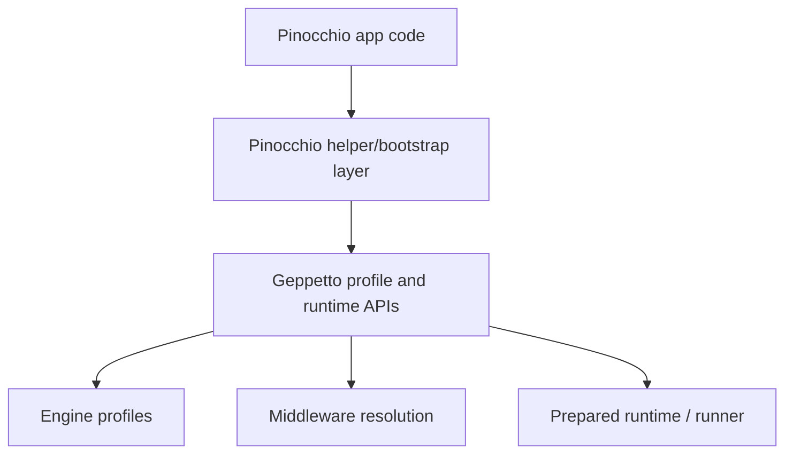
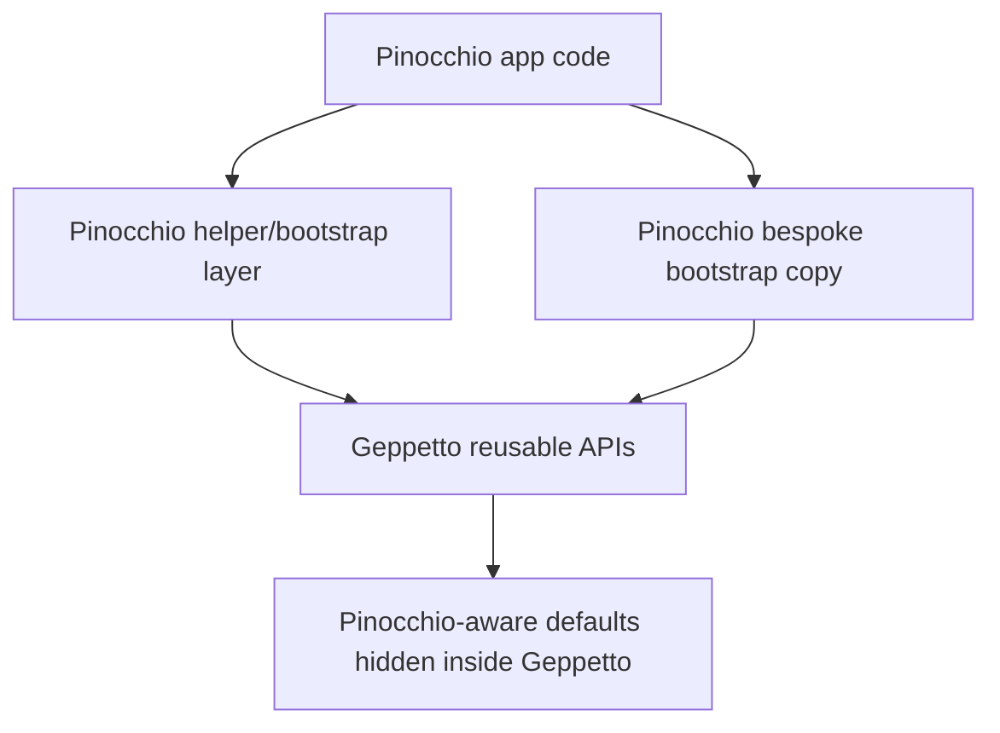
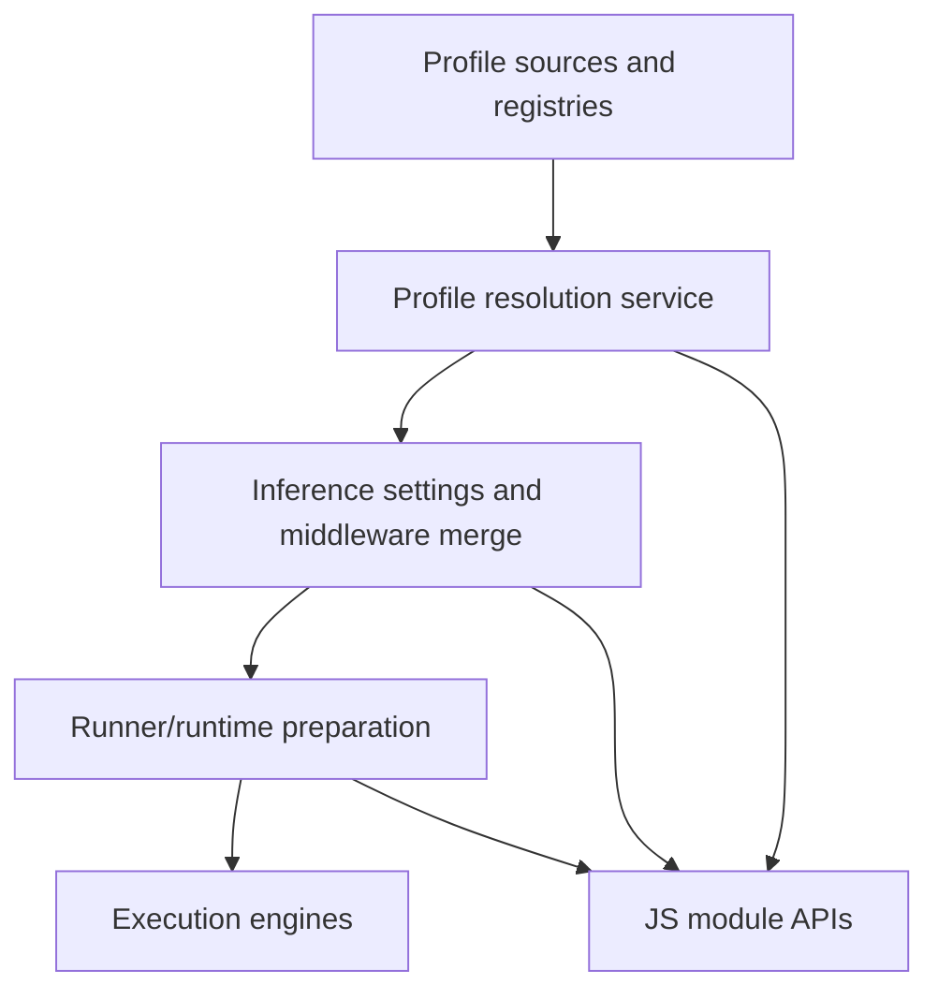
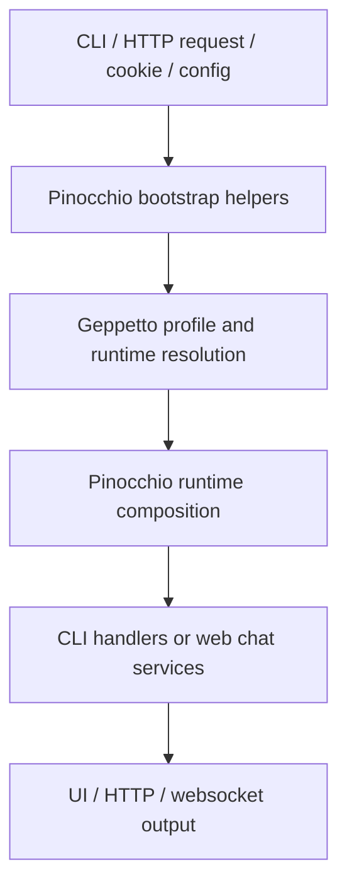

# Geppetto and Pinocchio cleanup audit and intern guide

## How to use this guide

This document is written for a new intern who has not grown up inside these repositories and who therefore does not have the usual historical shortcuts in their head. That matters, because both Geppetto and Pinocchio are repositories that have accumulated good abstractions, temporary migrations, compatibility shims, experiments, and test scaffolding over a fairly long period of time. When a system grows like that, the code stops failing in a dramatic way and starts failing in a more subtle way: it becomes harder to explain, harder to review, harder to safely change, and harder to tell which parts are truly important today versus which parts are just survivors from earlier phases.

The goal of this guide is not to mock that history or to flatten everything into a simplistic “delete old stuff” story. Quite a lot of the current architecture exists for good reasons. Some of the larger tests are valuable. Some of the ugly-looking compatibility code is buying real safety during migrations. The point of the audit is to separate three different categories that tend to get mixed together when a codebase gets old: foundational complexity that is intrinsic to the product, temporary migration complexity that should have an expiration date, and plain leftover residue that does not appear to justify its maintenance cost anymore.

If you are tired and only have limited review energy, start with the executive summary, then read the section called “The one-sentence mental model,” then jump directly to the cleanup candidates and the test triage matrix. If you have more time, read the architecture walk-through first so that the later judgments feel obvious rather than arbitrary. This guide is deliberately narrative and repetitive in the right places so you can read it in chunks without constantly reloading the whole system into your head.

## Executive summary

At a high level, Geppetto is the lower-level execution and profile-resolution library, while Pinocchio is the higher-level application layer that turns those capabilities into actual products such as CLI flows and the web chat application. The healthy version of that relationship is straightforward: Geppetto should own reusable engine/profile/runtime primitives, and Pinocchio should own product-specific bootstrapping, UX, app defaults, persistence, and compatibility decisions. The unhealthy version is what historically happened in a few places: Geppetto still knows about Pinocchio-specific defaults, Pinocchio duplicates some runtime/bootstrap logic that should be shared, and both repositories contain tests or wrappers that mostly exist because an older migration path was never fully collapsed.

The strongest low-hanging fruit in Geppetto is not flashy. It is cleanup of duplicated and Pinocchio-specific bootstrap logic in `pkg/sections`, removal of dead-looking legacy event types and interfaces in `pkg/events`, and rationalization of a few duplicated negative tests in `pkg/engineprofiles`. The strongest low-hanging fruit in Pinocchio is more structural: `pkg/cmds/cmd.go` is still a god-file that mixes multiple modes and concerns, `cmd/web-chat/main.go` duplicates profile/bootstrap helpers that already exist elsewhere, old compatibility wrappers in `pkg/webchat` are still used even though the newer dependency-based API exists, and several web-chat test suites are much wider than they need to be for present-day confidence.

The most important judgment in this document is that not all big tests are bad tests. The large Geppetto JavaScript module contract suite is big, but it is testing a public API surface and is therefore much more defensible than its size alone suggests. By contrast, several Pinocchio web-chat suites appear to be paying a very high maintenance cost for compatibility and route-shape details that are not core product behavior. The right cleanup posture is therefore not “delete the largest tests first,” but “protect contract-value tests, trim migration-value tests once the migration is over, and split giant mixed-purpose files so each remaining test tells a simpler story.”

The final practical conclusion is that these repositories do not need a heroic rewrite. They need a disciplined reduction of historical overlap. The safest order is: remove obviously unused code, centralize duplicated bootstrap logic, migrate callers off deprecated wrappers, trim obsolete compatibility paths, then simplify tests around the new steady state. That sequence matters because many of the tests only look redundant today because the product code is still carrying two or three generations of behavior simultaneously.

## The one-sentence mental model

If you remember only one thing, remember this: Geppetto should answer “how do I resolve profiles, runtimes, middleware, and engines in a reusable way,” while Pinocchio should answer “how does this particular application decide defaults, expose those choices to users, and run a chat product on top of that machinery.”

Whenever you see code violating that rule, pause and ask which side currently owns something it should not. Most of the cleanup opportunities in this audit fall directly out of that question.

## System orientation

### What Geppetto is

Geppetto is the reusable core. It provides the lower-level primitives for describing inference engines, resolving engine profiles, merging middleware or runtime settings, exposing those concepts to JavaScript, and preparing executable runtime objects. The files that most clearly express that identity are the profile and runtime pieces such as `geppetto/pkg/engineprofiles/service.go`, `geppetto/pkg/engineprofiles/source_chain.go`, `geppetto/pkg/inference/runner/prepare.go`, and the JavaScript module entrypoints in `geppetto/pkg/js/modules/geppetto/module.go`.

When Geppetto is doing its job cleanly, an application should be able to say something conceptually simple: “here are my profile registries, here is the selected profile, here are a few runtime overrides, please give me a resolved engine/runtime object I can use.” That is library work. It is product-agnostic work. It is the kind of logic that should be shared across multiple applications without those applications needing to know about each other.

This means that Geppetto is allowed to be a little abstract. It is supposed to know about engine registries, profile sources, runtime middleware, and JavaScript APIs. It is not supposed to know intimate details of one consuming application’s configuration defaults or environment naming conventions. That distinction becomes important later when we look at `pkg/sections`.

### What Pinocchio is

Pinocchio is the application layer. It is a real product and therefore has real product messiness: CLI entrypoints, mode selection, user-facing profile defaults, web chat routing, cookies, persistence, UI helpers, and compatibility bridges for earlier app behavior. The best orientation files here are `pinocchio/pkg/cmds/cmd.go`, `pinocchio/cmd/web-chat/main.go`, `pinocchio/cmd/web-chat/profile_policy.go`, `pinocchio/pkg/webchat/router.go`, and `pinocchio/pkg/webchat/router_deps.go`.

Pinocchio is where user experience decisions live. If the CLI wants to infer a default config file from a home-directory convention, that belongs here. If the web chat app wants to support a transitional cookie format during a migration, that belongs here. If the app wants to decorate Geppetto’s reusable runtime resolution with app-owned defaults, that also belongs here. What does not belong here is copy-pasted library bootstrap logic that now has to be kept in sync in two or three places.

### How the repositories fit together

The clean dependency direction is:



In prose, the intended flow is: Pinocchio gathers app-specific inputs and defaults, delegates the hard reusable profile/runtime work to Geppetto, and then continues with product-specific execution and presentation.

The messy historical version that currently exists in a few places looks more like this:



That second diagram is the architectural smell. Some defaults and resolution behaviors are duplicated in Pinocchio, and some Pinocchio-specific assumptions leaked downward into Geppetto. Both directions make the system harder to reason about.

## A simple runtime story

Before diving into cleanup candidates, it helps to tell the happy-path story slowly, because most of the later complexity is easiest to understand as distortion of this simple baseline.

Imagine a caller wants to run an inference task. In the clean model, the steps look like this:

1. The application resolves its config sources and default profile registries.
2. It chooses a profile, either explicitly or from an app default.
3. It asks Geppetto to resolve that profile into concrete engine and runtime settings.
4. It applies a small number of app- or request-specific overrides.
5. It prepares a runner/runtime.
6. It executes the task and handles the resulting events or outputs.

In pseudocode:

```text
appInputs := readCLIFlagsOrHTTPInputs()
bootstrap := resolveAppSpecificDefaults(appInputs)
profile := geppetto.ResolveProfile(bootstrap.registries, bootstrap.selectedProfile)
runtime := geppetto.PrepareRuntime(profile, bootstrap.overrides)
result := runtime.Run(task)
renderResultToCLIorWeb(result)
```

That is not the exact code shape in either repository, but it is the conceptual contract. When reviewing cleanup opportunities, keep asking whether a given file is making that story clearer or making it harder to see.

## Reading order for a new intern

If you are new and want to build a usable map quickly, read in this order:

1. `geppetto/README.md`
2. `geppetto/pkg/js/modules/geppetto/module.go`
3. `geppetto/pkg/engineprofiles/service.go`
4. `geppetto/pkg/engineprofiles/source_chain.go`
5. `geppetto/pkg/inference/runner/prepare.go`
6. `pinocchio/README.md`
7. `pinocchio/pkg/cmds/helpers/profile_runtime.go`
8. `pinocchio/cmd/web-chat/main.go`
9. `pinocchio/cmd/web-chat/profile_policy.go`
10. `pinocchio/pkg/webchat/router_deps.go`
11. `pinocchio/pkg/webchat/router.go`

That order starts with the reusable layer, then moves into the application layer, then finally into the historically messy product integration points. It is much easier to recognize accidental duplication once you already understand the intended source of truth.

## Audit method

This audit was based on a repository-wide evidence pass rather than on vague impression. The process included scanning directory structure, identifying largest files and largest tests, tracing cross-references with `rg`, and reading representative architecture files instead of only the loudest problem files. That matters because some files are large for good reasons and some small files are actually better cleanup targets because they are isolated relics.

The audit especially focused on four questions:

1. Where does one repository appear to know too much about the other?
2. Which large files are large because they genuinely own a large domain, and which are large because they never got decomposed after product evolution?
3. Which tests protect real contracts, and which tests mostly preserve transitional behavior or implementation scaffolding?
4. What can be cut with low risk before any deeper redesign?

The answer pattern is fairly consistent: the most defensible complexity is in Geppetto’s runtime/profile core and in a few high-value API contract tests. The least defensible complexity is in duplicated bootstrap logic, deprecated compatibility layers that never finished dying, and tests that mix too many concerns inside one file.

## Architecture walk-through

### Geppetto architecture spine

The Geppetto architecture spine is the combination of engine profiles, runtime preparation, and the Goja JavaScript module surface. If you want to picture the repository as a set of layers, the cleanest mental diagram is this:



`geppetto/pkg/engineprofiles/source_chain.go` and `geppetto/pkg/engineprofiles/service.go` embody the profile resolution side. `geppetto/pkg/inference/runner/prepare.go` embodies runtime preparation. `geppetto/pkg/js/modules/geppetto/module.go` and the `api_*.go` files embody the JavaScript surface that exposes those ideas to JS callers. This is a coherent center of gravity. Even when the files are large, the domain boundary is understandable: these files are mostly about reusable runtime mechanics.

That is why the main Geppetto cleanup recommendations in this document target edges rather than the core. The core needs refinement and test organization improvements, but the deepest conceptual mess in Geppetto is not in the engine profile machinery itself. It is in the leftover boundary places where application-specific assumptions have bled into the library.

### Pinocchio architecture spine

Pinocchio has a more product-shaped spine. It includes CLI execution, web chat composition, persistence, and compatibility policy. The central flow is less “one library owns one abstraction” and more “one app composes several layers to deliver a user experience.” A helpful mental map is:



In a healthy application codebase, this layer should still be decomposed so that each stage tells a focused story. The current Pinocchio state is mixed. Some files, such as `pinocchio/pkg/cmds/helpers/profile_runtime.go` and `pinocchio/pkg/webchat/router_deps.go`, push in the right direction by separating concerns. Other files, especially `pinocchio/pkg/cmds/cmd.go`, `pinocchio/cmd/web-chat/main.go`, and `pinocchio/cmd/web-chat/profile_policy.go`, still behave like historical accumulation points where several generations of decisions coexist.

That distinction is crucial. The right cleanup plan is not to distrust the whole repository. It is to notice where the codebase has already evolved toward cleaner boundaries, and then finish the migration instead of stopping halfway.

## Geppetto cleanup candidates

### 1. `pkg/sections` contains duplicated bootstrap logic and Pinocchio leakage

The strongest Geppetto cleanup candidate is the `pkg/sections` area, specifically the overlap between `geppetto/pkg/sections/profile_sections.go` and `geppetto/pkg/sections/sections.go`. The core smell is not just duplication. It is duplication of application-shaped logic inside the library repository, and the application in question is Pinocchio.

`geppetto/pkg/sections/profile_sections.go:98-266` defines `GetProfileSettingsMiddleware(...)`. A repository-wide search shows this function appears to be defined but not used internally. At the same time, `geppetto/pkg/sections/sections.go:130-299` implements `GetCobraCommandGeppettoMiddlewares(...)` with strikingly similar bootstrap logic: resolve config file, consult defaults, look at environment, determine profile registries, and build middleware or settings from that result.

The duplication would already justify cleanup, but the more interesting issue is what the duplicated code is actually doing. Both code paths refer to Pinocchio-flavored defaults and configuration resolution. There is explicit use of a `PINOCCHIO` environment prefix and Pinocchio-specific config discovery conventions. In other words, the reusable library has internal code paths that still think in terms of one consuming application’s naming and bootstrapping rules.

That is a classic sign of a boundary that was once convenient and then stopped being healthy. It likely came from a period when Pinocchio was the dominant or only consumer, so library and app concerns were allowed to blur. Over time, however, that kind of coupling becomes expensive. A new developer reading Geppetto should not have to wonder why a supposedly reusable package contains app-specific environment prefixes. It weakens the library’s story and makes downstream cleanup harder because no one is quite sure where the “real” ownership line is anymore.

Relevant references:

- `geppetto/pkg/sections/profile_sections.go:55-66`
- `geppetto/pkg/sections/profile_sections.go:98-266`
- `geppetto/pkg/sections/sections.go:130-299`

Why this matters:

- It makes the Geppetto library conceptually less reusable than it appears.
- It creates two places to update when app bootstrap rules change.
- It encourages Pinocchio to keep relying on hidden behavior rather than explicit app-layer helpers.
- It makes review harder because identical-looking logic exists under two names with slightly different intent.

Recommended action:

- Delete `GetProfileSettingsMiddleware(...)` if external consumers are not using it.
- Extract the genuinely reusable bootstrap helper into a single internal function.
- Move Pinocchio-specific defaults and config path assumptions up into Pinocchio.
- Leave Geppetto owning only generic “given these registries/settings, resolve middleware/runtime” behavior.

Pseudocode sketch:

```text
// Geppetto side
type ProfileBootstrapInputs struct {
    ConfigFile string
    Registries []string
    Env map[string]string
}

func ResolveGenericProfileBootstrap(inputs ProfileBootstrapInputs) GenericBootstrapResult

// Pinocchio side
func ResolvePinocchioBootstrap(flags, env, homeDir) PinocchioBootstrapResult {
    config := resolvePinocchioConfig(flags, env, homeDir)
    registries := defaultPinocchioProfileRegistriesIfPresent(config)
    return adaptToGenericBootstrap(config, registries)
}
```

Reviewer attention points:

- Before deleting the unused function, confirm whether external modules or old scripts import it.
- If it is public API, deprecate first rather than silently removing it.
- The more important win is not the function deletion itself; it is restoring ownership boundaries.

### 2. `pkg/events` still appears to carry dead legacy event shapes

The second strong Geppetto cleanup candidate is the events package, particularly `geppetto/pkg/events/chat-events.go` and `geppetto/pkg/events/event-router.go`. This area has the feel of a long-lived taxonomy that once supported more event shapes than the current product actually emits.

Evidence from repository search suggests that `EventTypeStatus`, `EventText`, and `NewTextEvent(...)` are defined but do not appear to have meaningful producers elsewhere in the repository. Likewise, `ChatEventHandler` in `event-router.go` includes a `HandleText(...)` method, but the interface itself does not appear to have live implementations or consumers in the current codebase. The file also contains several TODO-style notes that read like artifacts of an unfinished cleanup.

The important nuance here is that event systems often preserve more shapes than current emitters use because teams are afraid to prune anything that looks like protocol surface. That instinct is understandable, but unused event types are not harmless forever. They create false affordances. A new developer sees `EventText` and assumes text events are a supported concept they must preserve. Then they search for usage, find almost none, and lose time reconstructing a story that may no longer matter.

Relevant references:

- `geppetto/pkg/events/chat-events.go:22`
- `geppetto/pkg/events/chat-events.go:216-234`
- `geppetto/pkg/events/chat-events.go:529`
- `geppetto/pkg/events/event-router.go:17-26`

Why this matters:

- Dead event types confuse the mental model of the live protocol.
- Interfaces with dead methods increase the cost of new implementations.
- Comments such as “might be possible to delete” are signals that a cleanup stalled halfway.

Recommended action:

- Confirm whether any external consumers depend on these types.
- If not, remove `EventText`, `EventTypeStatus`, and the dead `HandleText` path.
- If external use exists, mark them explicitly deprecated and isolate them behind a compatibility section or file.

Safe deletion workflow:

```text
1. Search repo and downstream repos for symbol usage.
2. Add a small changelog note or deprecation note if public.
3. Delete dead types and simplify router/printer branching.
4. Keep one focused test proving live event types still route correctly.
```

Reviewer attention points:

- Be careful not to confuse “unused internally” with “safe to delete publicly.”
- If Geppetto is treated as a library by external repos, public type removal needs more care than internal refactors.

### 3. The JavaScript module tests are too monolithic, but not junk

`geppetto/pkg/js/modules/geppetto/module_test.go` is the largest test file in the repository at roughly 1,823 lines. That alone makes it intimidating. It covers a large amount of public JavaScript-facing API surface: turns, constants, sessions, middleware, tools, profiles, runner behavior, schema handling, and event behavior.

A tired reviewer might look at this file and conclude that it is exactly the sort of historical monster that should be cut. That would be the wrong conclusion. This suite is large because it is testing a broad public contract. The JavaScript module is precisely the kind of surface where regression tests are valuable, because callers depend on the shape and semantics of the JS API rather than on internal Go package structure.

The real problem is not usefulness but organization. A single omnibus contract file increases reviewer fatigue and makes it harder to tell which subsystem is failing when new changes land. It also makes new contributors reluctant to extend or refine the suite because the file already feels like a monolith. This is a maintainability problem, not an argument for deletion.

Relevant reference:

- `geppetto/pkg/js/modules/geppetto/module_test.go`

Recommended action:

- Keep the coverage.
- Split by API namespace or behavior family.
- Introduce shared test helpers for runtime setup.

Possible file split:

```text
module_profiles_test.go
module_runner_test.go
module_sessions_test.go
module_events_test.go
module_tools_test.go
module_helpers_test.go
```

Why this is better:

- Failures become easier to map to product areas.
- Reviewers can read only the relevant suite for a given PR.
- New contract cases can be added without growing one file into a second architecture document.

### 4. Some engine profile negative tests look redundant

The `pkg/engineprofiles` area is an example of healthy core logic with a little bit of test sprawl at the edges. The repository appears to test rejection of the legacy profile-map YAML format in multiple places: codec-level tests, file-store tests, and source-chain tests. A little overlap is fine, especially when each level is proving a different contract, but the current shape looks close to redundant repetition rather than intentional tiered coverage.

Relevant references:

- `geppetto/pkg/engineprofiles/codec_yaml_test.go:10-24`
- `geppetto/pkg/engineprofiles/file_store_yaml_test.go:54-75`
- `geppetto/pkg/engineprofiles/source_chain_test.go:44-71`

The right question here is not “should we stop testing legacy format rejection?” That behavior matters if the new format cutoff is intentional. The better question is “at which levels do we need to prove it?” Usually one low-level parser/codec test plus one higher-level integration or store-level test is enough. Three or more near-identical failure-path tests often mean the team kept adding regression coverage at the nearest convenient layer without stepping back to rationalize the total suite.

Recommended action:

- Keep one codec-level rejection test.
- Keep one higher-level store or service test.
- Remove or merge the third if it does not prove a genuinely different error surface.

### 5. Large core files are not automatically cleanup targets

It is worth saying explicitly that not every large Geppetto file is a sign of historical junk. `geppetto/pkg/steps/ai/openai_responses/engine.go` is large because provider integration logic is inherently broad. `geppetto/pkg/inference/middlewarecfg/resolver.go` is large because middleware resolution is a substantial domain. These files may benefit from future decomposition, but they do not currently read like obvious dead-weight in the same way `pkg/sections` and parts of `pkg/events` do.

This is a general review rule for both repositories: do not confuse domain richness with accidental residue. Some complexity is the product. The cleanup target is complexity that no longer buys clarity or behavior.

## Pinocchio cleanup candidates

### 1. `pkg/cmds/cmd.go` is still a god-file

The largest structural cleanup opportunity in Pinocchio is `pinocchio/pkg/cmds/cmd.go`. At roughly 881 lines, it is not just big. It is a concentration point for too many kinds of decisions: seed-turn construction, prompt templating, blocking mode, interactive mode, chat mode, profile switching, event handler setup, persistence setup, and UI orchestration. When a file handles that many responsibilities, it becomes hard to review changes safely because any edit might interact with several control paths that are only loosely related.

What makes this file feel historical is not just its size. It is the way multiple execution styles coexist in one place. There are early branches for run-mode selection, a blocking execution path, and then a much larger chat-oriented execution path with profile-switch-specific logic embedded deep inside. This often happens when a simple entrypoint keeps absorbing new product modes instead of pushing them into separate modules.

Relevant references:

- `pinocchio/pkg/cmds/cmd.go:223-272`
- `pinocchio/pkg/cmds/cmd.go:355-395`
- `pinocchio/pkg/cmds/cmd.go:397-451`
- `pinocchio/pkg/cmds/cmd.go:491-840`

Why this matters:

- It slows down every review touching command execution.
- It discourages targeted unit tests because helpers are buried in one orchestration file.
- It keeps old paths alive because deleting them requires confidence about distant branches.

Recommended action:

- Split by execution mode rather than by arbitrary helper shape.
- Keep one thin orchestration entrypoint that selects a mode.
- Move mode-specific behavior to focused files.

Suggested decomposition:

```text
pkg/cmds/cmd.go                 // top-level wiring only
pkg/cmds/run_blocking.go        // single-shot mode
pkg/cmds/run_chat.go            // chat session flow
pkg/cmds/run_interactive.go     // interactive bridge or legacy interactive mode
pkg/cmds/profile_switch.go      // profile switching conversation logic
pkg/cmds/seed_turn.go           // seed turn creation and prompt templating
pkg/cmds/ui_bootstrap.go        // UI / event handler setup
```

Pseudocode sketch:

```text
func RunCommand(ctx, opts) error {
    runtime := buildRuntime(ctx, opts)

    switch chooseMode(opts) {
    case BlockingMode:
        return runBlocking(ctx, runtime, opts)
    case ChatMode:
        return runChat(ctx, runtime, opts)
    case InteractiveMode:
        return runInteractive(ctx, runtime, opts)
    default:
        return errUnknownMode
    }
}
```

Reviewer attention points:

- Some of this file’s complexity may still be product-relevant.
- The first cleanup pass should be extraction without semantic change.
- After extraction, reassess whether all modes still deserve long-term support.

### 2. `pkg/geppettocompat` looks like an orphaned compatibility package

`pinocchio/pkg/geppettocompat/compat.go` appears to be a self-contained compatibility layer whose symbols do not appear to be used elsewhere in the repository. That does not automatically prove uselessness, because external imports are possible. But internally, it reads like a classic compatibility package that survived the migration which originally justified it.

Relevant reference:

- `pinocchio/pkg/geppettocompat/compat.go`

Why this is suspicious:

- Repository search shows only self-references.
- The package name explicitly advertises compatibility rather than current ownership.
- Small compatibility packages are easy to forget because they do not trigger failures unless a downstream consumer still cares.

Recommended action:

- Check whether other repositories import it.
- If no external use exists, delete it.
- If external use exists, add explicit deprecation comments and move it into a clearly-labeled compatibility section of the codebase rather than leaving it as an ambiguous first-class package.

### 3. The `simple-chat-agent` debug command subsystem looks like dead baggage

One of the clearest “this was once useful but may now be inert” candidates is `pinocchio/cmd/agents/simple-chat-agent/pkg/ui/debug_commands.go`. The file is very large, guarded by a `debugcmds` build tag, and its exported registration function is effectively a no-op. Repository search suggests the registration function is not actually called anywhere meaningful.

Relevant references:

- `pinocchio/cmd/agents/simple-chat-agent/pkg/ui/debug_commands.go:1-919`
- `pinocchio/cmd/agents/simple-chat-agent/pkg/ui/debug_commands.go:22-25`

This is exactly the kind of historical residue that persists because it is isolated enough not to hurt day-to-day development, while still costing mental overhead for anyone exploring the tree. A new developer sees a 919-line debug subsystem and assumes they must understand it before touching the agent UI. If it is effectively not part of the product anymore, that is pure onboarding tax.

Recommended action:

- Confirm whether anyone still builds with `debugcmds`.
- If not, remove the entire subsystem.
- If there is occasional developer use, move it behind a more explicit developer-tools location and add a short README explaining its status.

### 4. Pinocchio duplicates profile/bootstrap resolution in too many places

This is one of the most important architectural findings in the audit. Pinocchio already has a helper layer for profile and runtime resolution in `pinocchio/pkg/cmds/helpers/profile_runtime.go`, including functions such as `ResolveBaseInferenceSettings`, `ResolveEngineProfileSettings`, and `ResolveFinalInferenceSettings`. That is exactly the sort of app-owned consolidation layer the repository should have.

However, `pinocchio/cmd/web-chat/main.go` still contains its own bespoke resolution helpers such as `resolveProfileRegistriesWithSource`, `resolveWebChatConfigFiles`, and `resolveWebChatBaseInferenceSettings`. There is also duplicated logic for default Pinocchio profile registries in several locations, including both Pinocchio and Geppetto. This is a classic halfway migration: the cleaner abstraction exists, but not all callers have been moved over, so the old logic keeps living beside the new logic.

Relevant references:

- `pinocchio/pkg/cmds/helpers/profile_runtime.go:37-170`
- `pinocchio/cmd/web-chat/main.go:81-218`
- `pinocchio/pkg/cmds/helpers/parse-helpers.go:141`
- `geppetto/pkg/sections/profile_sections.go:55-66`

Why this matters:

- Small config logic forks drift over time.
- Tests start asserting helper-specific behavior instead of shared semantics.
- A reviewer cannot tell which resolution path is the source of truth.

Recommended action:

- Make `pkg/cmds/helpers` the single Pinocchio-owned source of truth for profile/bootstrap resolution.
- Refactor `cmd/web-chat/main.go` to consume those helpers rather than maintaining private copies.
- Remove the now-redundant wrapper functions and the tests that exist only to pin their behavior.

Pseudocode sketch:

```text
// Current bad shape
webChatMain.resolveProfileRegistries(...)
webChatMain.resolveWebChatBaseInferenceSettings(...)
helpers.ResolveBaseInferenceSettings(...)

// Target shape
bootstrap := helpers.ResolvePinocchioAppRuntime(inputs)
server := buildWebChatServer(bootstrap, appValues)
```

This change is bigger than a simple deletion, but it is high-value because it eliminates a whole category of recurring confusion.

### 5. `cmd/web-chat/profile_policy.go` is a compatibility knot that needs an expiration plan

`pinocchio/cmd/web-chat/profile_policy.go` is not obviously junk. In fact, it is likely protecting real user behavior today. But it is one of the most important “watch this carefully” files because it mixes current policy with migration baggage. It includes precedence logic for profile selection, cookie fallback behavior, legacy cookie parsing, and explicit rejection of older selector inputs such as `runtime_key` and `registry_slug`.

Relevant references:

- `pinocchio/cmd/web-chat/profile_policy.go:272-305`
- `pinocchio/cmd/web-chat/profile_policy.go:484-503`
- `pinocchio/cmd/web-chat/profile_policy.go:505-521`
- `pinocchio/cmd/web-chat/profile_policy.go:524-537`

When a file like this grows large, the temptation is to label it “too complex” and immediately simplify it. That can be dangerous. The better reading is: this file is carrying both today’s policy and yesterday’s migration. The cleanup question is therefore not “can we simplify this code right now,” but “which parts are protecting still-active product compatibility, and which parts were supposed to be temporary?”

This matters especially for tests. `cmd/web-chat/profile_policy_test.go` includes both current behavior and legacy rejection/fallback cases. Some of those tests are still serving as migration sentries. They should not be deleted until the associated compatibility promise has actually expired.

Recommended action:

- Add an explicit policy comment or small design note explaining which legacy paths are temporary and what event will allow removal.
- Once legacy cookie migration is complete, delete fallback parsing and its test branches together.
- Split current-policy tests from legacy-compatibility tests so it is obvious what remains after the migration.

### 6. Deprecated `pkg/webchat` wrappers are still alive because callers never finished moving

Pinocchio already has a newer dependency-oriented construction path for web chat via `BuildRouterDepsFromValues(...)` and `NewServerFromDeps(...)`. However, deprecated wrappers such as `NewRouter(...)` and `NewServer(...)` in `pkg/webchat/router.go` and `pkg/webchat/server.go` are still in use by production code and tests.

Relevant references:

- `pinocchio/pkg/webchat/router.go:43-49`
- `pinocchio/pkg/webchat/server.go:28-37`
- `pinocchio/cmd/web-chat/main.go:335`
- `pinocchio/cmd/web-chat/app_owned_chat_integration_test.go:87`
- `pinocchio/cmd/web-chat/llm_delta_projection_harness_test.go:96`

This is another halfway migration pattern. The new API exists, but the old constructors are still popular because the final caller migration never happened. As long as both remain live, every future change has to respect both shapes. That is low-grade complexity with very little upside.

Recommended action:

- Migrate `cmd/web-chat/main.go` first.
- Migrate the test suites next.
- Delete deprecated wrappers once all in-repo callers are moved.

Why this is low-hanging fruit:

- The replacement API already exists.
- The wrappers are explicitly marked deprecated.
- Deleting them simplifies both architecture and tests.

### 7. The web-chat debug surface may deserve extraction or scope reduction

`pinocchio/pkg/webchat/router_debug_routes.go` and `pinocchio/pkg/webchat/router_debug_api_test.go` are large. That alone does not prove they are unnecessary. A debug surface can be very useful in a complex interactive application. But this area stands out because it expands the core web-chat package with a large diagnostics-specific route surface and a correspondingly large test suite.

Relevant references:

- `pinocchio/pkg/webchat/router_debug_routes.go`
- `pinocchio/pkg/webchat/router_debug_api_test.go`

The right interpretation here is cautious. This may not be dead code. It appears to be referenced by frontend and documentation material, which suggests someone still values it. The likely issue is packaging rather than existence. A debug subsystem of this size may not belong in the same central package namespace as the core chat routing mechanics.

Recommended action:

- If the debug routes are still actively useful, move them into a `debug` subpackage or an app-owned layer so the core router story becomes smaller.
- If only a subset is actually used, reduce the surface to a leaner diagnostics set and drop the rest.

Reviewer attention points:

- Avoid deleting diagnostics blindly. They often become important only when things go wrong.
- The cleanup target is scope and placement, not necessarily total removal.

### 8. Some small web-chat helper tests look low-value once duplication is removed

There is a class of tests in Pinocchio that are not large and dramatic, but still feel low-value because they pin behavior of helper wrappers that should not exist long-term. The best example is a file like `cmd/web-chat/main_profile_registries_test.go`, which tests wrapper/config-resolution helpers in `cmd/web-chat/main.go`. If those helper paths are duplicates of the app-owned helper package, then preserving direct tests of the wrappers becomes less useful than moving callers to the shared helper and keeping only one shared contract test suite.

Relevant reference:

- `pinocchio/cmd/web-chat/main_profile_registries_test.go:44-155`

Recommended action:

- After consolidating on `pkg/cmds/helpers`, delete tests that exist only to pin the behavior of obsolete wrapper helpers.
- Replace them with focused tests on the shared helper package or with higher-level smoke tests at the app boundary.

### 9. Web-chat integration tests need triage, not blanket deletion

The Pinocchio web-chat area contains several heavy suites:

- `cmd/web-chat/app_owned_chat_integration_test.go`
- `cmd/web-chat/profile_policy_test.go`
- `pkg/webchat/router_debug_api_test.go`
- `cmd/web-chat/runtime_composer_test.go`
- `pkg/webchat/conversation_service_test.go`

These are not all equal. Some are broad because the underlying product behavior is broad. Some are broad because they mix current behavior, migration compatibility, route coverage, and test harness setup in one file. The right cleanup move is to distinguish which tests prove core business behavior and which prove scaffolding or temporary compatibility.

The best heuristic is:

- Keep a very small number of end-to-end smoke tests that prove the app can start, create a conversation, and stream or return a response.
- Keep focused policy tests for current selection precedence if the product depends on that behavior.
- Trim tests dedicated to legacy selectors and cookie formats once the migration window closes.
- Be skeptical of large debug-route suites unless the team actively uses those diagnostics.

## Test triage matrix

This section is intentionally blunt because test cleanup discussions become fuzzy very quickly.

### Geppetto

`pkg/js/modules/geppetto/module_test.go`

- Category: keep, but split
- Reason: public JS contract coverage
- Risk of deletion: high
- Proposed action: split into namespace-specific files and shared helpers

`pkg/engineprofiles/codec_yaml_test.go`

- Category: keep
- Reason: low-level format/codec contract
- Risk of deletion: medium
- Proposed action: keep as the canonical legacy-format rejection test

`pkg/engineprofiles/file_store_yaml_test.go`

- Category: probably keep
- Reason: higher-level store behavior
- Risk of deletion: low to medium if redundant with source-chain tests
- Proposed action: keep if it proves file-store integration rather than repeating parser failure only

`pkg/engineprofiles/source_chain_test.go`

- Category: trim if redundant
- Reason: source-chain behavior matters, but not every legacy-format rejection needs repeating
- Risk of deletion: low if another integration-level test remains
- Proposed action: keep source-chain-specific logic, remove duplicated rejection case if identical

`pkg/events/...`

- Category: simplify alongside dead event type removal
- Reason: event taxonomy is probably over-wide relative to live behavior
- Risk of deletion: low for dead paths, medium for public API compatibility
- Proposed action: align tests to live event model after confirming public usage

### Pinocchio

`cmd/web-chat/app_owned_chat_integration_test.go`

- Category: shrink, not delete
- Reason: valuable end-to-end confidence, but likely over-covers compatibility and non-core scenarios
- Risk of deletion: high if no smoke coverage remains
- Proposed action: keep 1-2 canonical happy-path tests, split or drop legacy-compat cases after migration

`cmd/web-chat/profile_policy_test.go`

- Category: split and time-box
- Reason: mixes current policy with migration behavior
- Risk of deletion: medium
- Proposed action: split into `profile_policy_current_test.go` and `profile_policy_legacy_test.go`; delete legacy file when migration ends

`pkg/webchat/router_debug_api_test.go`

- Category: evaluate aggressively
- Reason: large diagnostics-only coverage may not justify cost
- Risk of deletion: low to medium depending on operational reliance
- Proposed action: either extract to debug package or reduce route coverage to a smaller smoke set

`cmd/web-chat/runtime_composer_test.go`

- Category: likely keep
- Reason: runtime composition is core app behavior
- Risk of deletion: medium
- Proposed action: keep focused coverage, split helpers if file grows

`pkg/webchat/conversation_service_test.go`

- Category: likely keep
- Reason: central service behavior
- Risk of deletion: medium
- Proposed action: keep, but review whether any cases duplicate higher-level integration tests

`cmd/web-chat/main_profile_registries_test.go`

- Category: likely delete after consolidation
- Reason: tests wrapper helpers that should disappear
- Risk of deletion: low after helper unification
- Proposed action: delete together with duplicate helper paths

## What not to cut yet

One of the biggest risks in cleanup work is overcorrecting. A new reviewer sees complexity, becomes impatient, and starts deleting protections that were expensive to learn. To prevent that, here are the areas that currently look worth preserving until proven otherwise.

First, Geppetto’s engine profile core does not look like historical junk. It may contain some repetitive tests and some large files, but the central abstractions are coherent and reusable. That is exactly where caution is warranted, because this layer is shared infrastructure.

Second, the Geppetto JavaScript module contract tests are high-value despite being monolithic. They need reorganization, not removal. Any cleanup proposal that saves a few hundred lines by reducing contract coverage here is probably a false economy.

Third, Pinocchio’s web-chat integration layer still needs some true end-to-end smoke tests. It is easy to mock yourself into a false sense of safety in chat applications. Deleting all integration tests because they are annoying would be a mistake.

Fourth, `cmd/web-chat/profile_policy.go` should not be simplified by force until the team explicitly decides that the associated compatibility window is over. Migration code is annoying, but it only becomes junk once the migration actually ends.

## Low-risk cleanup sequence

The safest cleanup strategy is phased. Do not begin with the largest or most emotional files. Begin with the changes that improve conceptual boundaries and reduce maintenance surface without changing user-facing semantics.

### Phase 1: delete or isolate obvious residue

This phase is for code that looks unused, deprecated, or clearly misplaced.

- Investigate and likely remove `geppetto/pkg/sections/profile_sections.go:98-266` if unused.
- Remove or deprecate dead event types and interfaces in `geppetto/pkg/events`.
- Delete `pinocchio/pkg/geppettocompat` if there are no downstream imports.
- Remove the `simple-chat-agent` debug command subsystem if the build tag is no longer used.

Why start here: these changes reduce mental noise quickly and create momentum without requiring risky behavior changes.

### Phase 2: consolidate runtime/bootstrap ownership

This phase is about reducing duplicated logic rather than deleting features.

- Make `pinocchio/pkg/cmds/helpers/profile_runtime.go` the single Pinocchio source of truth.
- Refactor `cmd/web-chat/main.go` to consume shared helpers.
- Move Pinocchio-specific defaults out of Geppetto `pkg/sections`.

Why this is next: once there is one clear bootstrap path, several low-value tests and wrappers become obviously obsolete.

### Phase 3: finish deprecated API migrations

- Migrate callers from `pkg/webchat.NewRouter` to dependency-based construction.
- Migrate callers from `pkg/webchat.NewServer` to `NewServerFromDeps`.
- Delete deprecated wrappers.

Why this matters: it converts “deprecated” from an aspiration into reality. As long as deprecated constructors stay live, they are not really deprecated; they are alternate supported APIs.

### Phase 4: simplify compatibility policy and tests

- Split current-vs-legacy tests in web-chat.
- Add an explicit removal condition for legacy cookie and selector handling.
- Delete compatibility branches and their tests when the migration is finished.

Why this comes later: policy simplification is safest after structural consolidation. Otherwise you risk changing semantics while the ownership picture is still fuzzy.

### Phase 5: decompose large orchestration files

- Split `pinocchio/pkg/cmds/cmd.go`.
- Split `geppetto/pkg/js/modules/geppetto/module_test.go`.
- Consider extracting web-chat debug routes into a smaller or separate package.

Why this comes last: decomposition without a stable post-migration architecture tends to create lots of movement with low durable value.

## Detailed implementation sketches

### Sketch A: remove Pinocchio leakage from Geppetto sections

Desired outcome: Geppetto no longer has hidden knowledge of Pinocchio-specific defaults, environment prefixes, or config resolution conventions.

Implementation sketch:

```text
1. Identify the truly generic portion of the current section bootstrap logic.
2. Extract it into a helper that accepts explicit config/registry inputs.
3. Replace Pinocchio-specific resolution inside Geppetto with arguments supplied by callers.
4. Implement Pinocchio-owned helper(s) in Pinocchio for home-dir/config/env defaults.
5. Update callers and tests.
6. Delete unused duplicated middleware helper in Geppetto.
```

Success criteria:

- Geppetto code no longer says `PINOCCHIO` unless that string is part of a documented compatibility shim.
- There is one library-level bootstrap path and one app-level bootstrap path.

### Sketch B: split current and legacy web-chat policy

Desired outcome: reviewers can tell which parts of `profile_policy.go` are current product semantics and which are migration residue.

Implementation sketch:

```text
type CurrentProfilePolicy interface {
    ResolveRequestSelection(req) Selection
}

type LegacyCompatibility interface {
    ParseLegacyCookie(cookie) (Selection, bool)
    RejectLegacySelectors(req) error
}

func ResolveProfileSelection(req, state) Selection {
    current := resolveCurrentSelection(req, state)
    if current.exists {
        return current
    }
    return maybeFallbackToLegacy(req, state)
}
```

The point is not necessarily these exact interfaces. The point is to make the code tell the truth: there is a current policy and a temporary compatibility layer. Once that distinction is explicit, the eventual deletion becomes mechanically easy.

### Sketch C: turn `pkg/cmds/cmd.go` into an orchestration shell

Desired outcome: top-level command execution becomes readable and mode-specific logic becomes testable in isolation.

Implementation sketch:

```text
func Run(ctx, opts) error {
    deps := buildDeps(ctx, opts)
    mode := decideMode(opts)

    switch mode {
    case ModeBlocking:
        return runBlocking(ctx, deps, opts)
    case ModeChat:
        return runChat(ctx, deps, opts)
    case ModeInteractive:
        return runInteractive(ctx, deps, opts)
    }
}
```

Supporting extractions:

- `buildDeps` handles shared setup only.
- `runBlocking` owns single-turn execution.
- `runChat` owns session/chat orchestration.
- `runInteractive` exists only if the product still needs it.
- profile switching becomes its own helper invoked from `runChat`.

The primary benefit is reviewability. A new intern should be able to answer “what happens in chat mode?” without scrolling through unrelated blocking-mode and seed-building logic.

## Review questions for an intern

When you review cleanup work in these repositories, use questions like these instead of relying on vague taste:

1. Is this code expressing core product behavior, migration support, or leftover residue?
2. If it is migration support, what exact event would allow us to delete it?
3. Does this helper or wrapper still exist because multiple callers need it, or because a migration stalled halfway?
4. Is this test protecting a user-visible contract, or mostly preserving a private implementation path?
5. If this code disappeared tomorrow, who would notice: library consumers, product users, or only developers reading the tree?
6. Does this file make the repository’s ownership boundaries clearer or blurrier?

These questions help prevent two common mistakes:

- deleting something important because it “looks old”
- preserving something useless because it “might matter someday”

## Suggested reviewer checklist

- Confirm whether `geppetto/pkg/sections/profile_sections.go` has any external consumers.
- Confirm whether `geppetto/pkg/events` legacy types are part of a public compatibility promise.
- Confirm whether `pinocchio/pkg/geppettocompat` has downstream imports.
- Confirm whether anyone still builds or uses `simple-chat-agent` debug commands.
- Identify all in-repo callers of deprecated `pkg/webchat` constructors and schedule migration.
- Decide whether legacy cookie fallback in web-chat has an agreed expiration condition.
- Audit large web-chat tests and label each case as current behavior, migration behavior, or debug surface.

## Proposed ticketable cleanup backlog

This section turns the audit into concrete work items.

### GP-52A: Remove unused or orphaned compatibility code

- Investigate `geppetto/pkg/events` dead types.
- Investigate `pinocchio/pkg/geppettocompat`.
- Investigate `simple-chat-agent` debug command subsystem.

Expected outcome: smaller tree, less onboarding noise.

### GP-52B: Consolidate Pinocchio runtime/bootstrap helpers

- Move web-chat bootstrap logic onto `pkg/cmds/helpers`.
- Delete duplicate wrappers and tests in `cmd/web-chat/main.go`.
- Remove Pinocchio-specific leakage from Geppetto `pkg/sections`.

Expected outcome: one app-owned bootstrap story, one library-owned runtime story.

### GP-52C: Finish `pkg/webchat` dependency migration

- Migrate app and tests to dependency-based constructors.
- Delete deprecated wrappers.

Expected outcome: simpler API surface and smaller maintenance matrix.

### GP-52D: Simplify web-chat policy after migration cutoff

- Split legacy and current policy tests.
- Remove legacy selector/cookie branches when safe.

Expected outcome: smaller policy file, clearer reasoning, fewer fragile tests.

### GP-52E: Decompose large orchestration and contract files

- Split `pkg/cmds/cmd.go`.
- Split Geppetto JS module tests.
- Reassess debug-route package boundaries.

Expected outcome: better reviewability and narrower failure scope.

## Why this matters beyond tidiness

It is worth ending the technical argument with a human one. These repositories are not suffering primarily from obvious bugs. They are suffering from explanation debt. Explanation debt is what happens when the code still works, but the amount of historical context required to understand why it works keeps rising. New contributors slow down. Reviews become shorter and more superficial because no one has the stamina to reload the whole story. Temporary migrations quietly become permanent architecture because nobody has the confidence to finish them.

That is why this kind of cleanup is valuable even when it does not ship a flashy new feature. It reduces the amount of trust that has to be stored in human memory. A healthy codebase still has complexity, but it makes a clean distinction between essential complexity and historical leftovers. Right now, both Geppetto and Pinocchio are close to that healthier state, but not fully there. The main work left is to finish old migrations and make the ownership boundaries tell the truth.

## References

### Geppetto

- `geppetto/README.md`
- `geppetto/pkg/doc/topics/00-docs-index.md`
- `geppetto/pkg/js/modules/geppetto/module.go`
- `geppetto/pkg/js/modules/geppetto/module_test.go`
- `geppetto/pkg/engineprofiles/service.go`
- `geppetto/pkg/engineprofiles/source_chain.go`
- `geppetto/pkg/engineprofiles/codec_yaml_test.go`
- `geppetto/pkg/engineprofiles/file_store_yaml_test.go`
- `geppetto/pkg/engineprofiles/source_chain_test.go`
- `geppetto/pkg/inference/runner/prepare.go`
- `geppetto/pkg/sections/sections.go`
- `geppetto/pkg/sections/profile_sections.go`
- `geppetto/pkg/events/chat-events.go`
- `geppetto/pkg/events/event-router.go`

### Pinocchio

- `pinocchio/README.md`
- `pinocchio/pkg/cmds/cmd.go`
- `pinocchio/pkg/cmds/helpers/profile_runtime.go`
- `pinocchio/pkg/cmds/helpers/parse-helpers.go`
- `pinocchio/cmd/web-chat/main.go`
- `pinocchio/cmd/web-chat/main_profile_registries_test.go`
- `pinocchio/cmd/web-chat/profile_policy.go`
- `pinocchio/cmd/web-chat/profile_policy_test.go`
- `pinocchio/cmd/web-chat/app_owned_chat_integration_test.go`
- `pinocchio/pkg/webchat/router.go`
- `pinocchio/pkg/webchat/router_deps.go`
- `pinocchio/pkg/webchat/server.go`
- `pinocchio/pkg/webchat/router_debug_routes.go`
- `pinocchio/pkg/webchat/router_debug_api_test.go`
- `pinocchio/pkg/webchat/conversation_service_test.go`
- `pinocchio/pkg/geppettocompat/compat.go`
- `pinocchio/cmd/agents/simple-chat-agent/pkg/ui/debug_commands.go`
