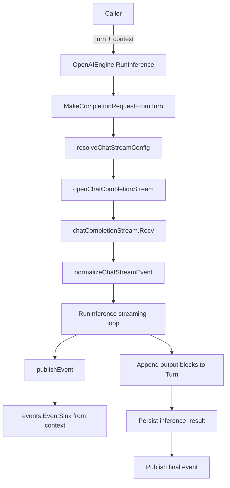
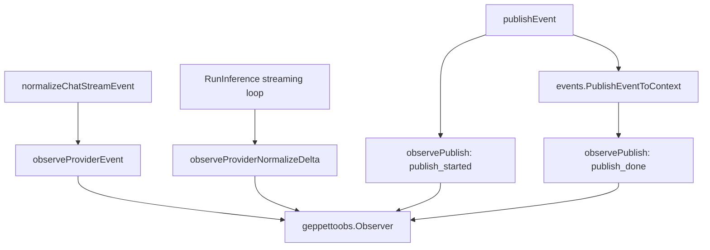

# OpenAI Chat Completions Observability Analysis and Implementation Guide

## Executive Summary

This ticket documents how to instrument Geppetto's OpenAI-compatible **Chat Completions** engine with the same observability model that already exists for the OpenAI **Responses** engine. The implementation goal is not to change inference behavior; it is to make the engine emit neutral, queryable evidence records while requests stream through the provider and while Geppetto publishes normalized events to its event sinks.

For a new intern, the most important idea is this: Geppetto has two related but separate event systems.

- The existing `pkg/events` system is the product-facing runtime event stream. It tells callers that an inference started, emitted a partial text delta, requested a tool call, produced reasoning text, errored, or completed.
- The newer `pkg/observability` system is an instrumentation/evidence stream. It tells debuggers what the provider and engine did around those events: which provider event arrived, which normalized delta was produced, which Geppetto event was about to be published, and what metadata was attached.

The OpenAI Responses path already records both provider-level events and Geppetto publish events. The OpenAI Chat Completions path currently publishes Geppetto events but does not emit observability records. This guide explains the existing pieces, the proposed API, the implementation plan, and concrete pseudocode for adding parity safely.

Recommended implementation shape:

1. Add `EngineOption`, `WithObserver`, and `WithObservabilityConfig` to `pkg/steps/ai/openai`.
2. Add `observer geppettoobs.Observer` and `observabilityConfig geppettoobs.Config` to `OpenAIEngine`.
3. Change `NewOpenAIEngine(settings)` to `NewOpenAIEngine(settings, opts ...EngineOption)` while preserving old call sites.
4. Wrap `OpenAIEngine.publishEvent` with `StageGeppettoPublishStarted` and `StageGeppettoPublishDone` records.
5. Emit provider records from the streaming loop using `chatStreamEvent.RawPayload`.
6. Wire `StandardEngineFactory` to accept OpenAI engine options just like it already accepts Responses options.
7. Add tests proving trace-off silence, event-level records, provider-level records, panic safety by delegation to `observability.Notify`, and factory option plumbing.

## Problem Statement

`pkg/steps/ai/openai/engine_openai.go` runs the OpenAI-compatible Chat Completions path. This path supports important production features:

- streaming assistant text through `events.EventPartialCompletion`;
- streaming reasoning text through `events.EventThinkingPartial`;
- provider tool call delta merging via `ToolCallMerger`;
- usage and stop reason capture;
- final `inference_result` persistence on the `Turn`;
- OpenAI-compatible providers such as OpenAI, Anyscale, Fireworks, DeepSeek-style reasoning, and Mistral-specific stream option handling.

However, it does not expose the neutral observability records that were added to the Responses engine. This creates an asymmetric debugging experience:

- If an application uses `openai_responses`, it can attach a `geppettoobs.Observer` and receive provider and publish evidence.
- If the same application uses `openai` Chat Completions, it can only observe product events through `events.EventSink`; it cannot see the provider object that led to each product event or the publish boundary around each product event.
- Operators comparing Responses and Chat Completions behavior have to inspect logs or build custom sinks rather than consuming one stable `observability.Record` shape.

The requirement for this ticket is to design the instrumentation for OpenAI Chat Completions and leave a clear implementation guide that a new intern can follow without needing prior knowledge of Geppetto.

## Key Vocabulary

### Turn

A `turns.Turn` is Geppetto's canonical conversation/input/output container. The OpenAI engine reads `Turn.Blocks` and converts them into OpenAI Chat Completions messages. After inference, it appends assistant text, reasoning, and tool call blocks back to the same turn.

Relevant files:

- `pkg/turns/turn.go`
- `pkg/steps/ai/openai/helpers.go`
- `pkg/steps/ai/openai/engine_openai.go`

### Engine

An inference engine implements `engine.Engine` by providing:

```go
RunInference(ctx context.Context, t *turns.Turn) (*turns.Turn, error)
```

The OpenAI Chat Completions implementation is `OpenAIEngine` in `pkg/steps/ai/openai/engine_openai.go`.

### Geppetto Event

A Geppetto event is a runtime event published to `events.EventSink` values carried on the context. Examples:

- `start`
- `partial`
- `partial-thinking`
- `tool-call`
- `error`
- `interrupt`
- `final`
- `info`

Relevant files:

- `pkg/events/chat-events.go`
- `pkg/events/text_events.go`
- `pkg/events/tool_events.go`
- `pkg/events/context.go`

### Observability Record

A `geppettoobs.Record` is a neutral debugging/evidence object emitted to a `geppettoobs.Observer`. It is not the product stream. It is designed for tracing, recording, indexing, and replay debugging.

Relevant files:

- `pkg/observability/observer.go`
- `pkg/observability/config.go`
- `pkg/steps/ai/openai_responses/observability.go`

### Provider Event

A provider event is the object that arrives from the model provider stream before Geppetto turns it into product events. For OpenAI Chat Completions, this is a streamed JSON chunk from `/chat/completions`, decoded in `pkg/steps/ai/openai/chat_stream.go`.

The existing normalized shape is:

```go
type chatStreamEvent struct {
    DeltaText      string
    DeltaReasoning string
    ToolCalls      []ChatToolCall
    Usage          *chatStreamUsage
    FinishReason   *string
    RawPayload     map[string]any
}
```

The `RawPayload` field is already a perfect source for provider-level observability records.

## Current Architecture

### High-level inference flow



The observability work adds a parallel, best-effort evidence stream:



The key rule is that `Observer` failures must never affect inference. This is already guaranteed by `observability.Notify`, which recovers from panics.

## File-by-file System Tour

### `pkg/steps/ai/openai/engine_openai.go`

This is the implementation target. Important responsibilities:

- Owns `OpenAIEngine`.
- Builds the request from a `Turn`.
- Creates `events.EventMetadata` with model, sampling settings, correlation IDs, and runtime attribution.
- Publishes a start event.
- Opens the streaming HTTP request.
- Reads normalized stream chunks in a loop.
- Accumulates assistant text in `message`.
- Accumulates reasoning text in `thinkingBuf`.
- Merges tool call deltas in `ToolCallMerger`.
- Captures usage and stop reason.
- Publishes partial, thinking, info, tool-call, error, interrupt, and final events.
- Appends final blocks to the `Turn`.
- Persists canonical inference metadata.

Current instrumentation gap:

```go
type OpenAIEngine struct {
    settings    *settings.InferenceSettings
    toolAdapter *tools.OpenAIToolAdapter
}

func NewOpenAIEngine(settings *settings.InferenceSettings) (*OpenAIEngine, error) {
    return &OpenAIEngine{
        settings:    settings,
        toolAdapter: tools.NewOpenAIToolAdapter(),
    }, nil
}

func (e *OpenAIEngine) publishEvent(ctx context.Context, event events.Event) {
    events.PublishEventToContext(ctx, event)
}
```

Target direction:

```go
type OpenAIEngine struct {
    settings    *settings.InferenceSettings
    toolAdapter *tools.OpenAIToolAdapter

    observer            geppettoobs.Observer
    observabilityConfig geppettoobs.Config
}

func NewOpenAIEngine(settings *settings.InferenceSettings, opts ...EngineOption) (*OpenAIEngine, error) {
    e := &OpenAIEngine{
        settings: settings,
        toolAdapter: tools.NewOpenAIToolAdapter(),
        observabilityConfig: geppettoobs.DefaultConfig(),
    }
    for _, opt := range opts {
        if opt != nil { opt(e) }
    }
    e.observabilityConfig = e.observabilityConfig.Normalized()
    return e, nil
}
```

### `pkg/steps/ai/openai/chat_stream.go`

This file owns the provider stream decoder. Its responsibilities:

- Resolve OpenAI-compatible API key/base URL into a `/chat/completions` endpoint.
- Validate outbound URL safety.
- Send a streaming HTTP request.
- Parse SSE frames.
- Convert each JSON chunk into `chatStreamEvent`.

Important functions:

```go
func openChatCompletionStream(ctx context.Context, cfg chatStreamConfig, reqBody any) (*chatCompletionStream, error)
func (s *chatCompletionStream) Recv() (chatStreamEvent, error)
func normalizeChatStreamEvent(raw map[string]any) chatStreamEvent
```

The good news: `chatStreamEvent` already carries `RawPayload map[string]any`. This means the first implementation does not need invasive stream decoder changes. The `RunInference` loop can call `observeProviderEvent` immediately after `stream.Recv()` succeeds.

### `pkg/steps/ai/openai_responses/observability.go`

This file is the template. It already defines:

```go
type EngineOption func(*Engine)
func WithObserver(obs geppettoobs.Observer) EngineOption
func WithObservabilityConfig(cfg geppettoobs.Config) EngineOption
func (e *Engine) observe(ctx context.Context, rec geppettoobs.Record)
func (e *Engine) observeProviderEvent(...)
func (e *Engine) observeProviderNormalizeDelta(...)
func (e *Engine) observePublish(...)
```

The OpenAI Chat Completions implementation should be similar but not blindly copied. Chat Completions has different provider identifiers:

- provider should usually be `"openai"` for the default OpenAI path;
- factory also routes `anyscale` and `fireworks` to the same engine, so consider deriving provider from `settings.Chat.ApiType`;
- event type should be a useful stable name like `"chat.completion.chunk"`, unless the raw payload carries a more specific `object` field.

### `pkg/observability/observer.go`

This file defines the target record shape:

```go
type Record struct {
    Timestamp time.Time
    Provider string
    Model string
    SessionID string
    InferenceID string
    TurnID string
    MessageID string
    Stage Stage
    EventType string
    InfoMessage string
    ResponseID string
    ItemID string
    OutputIndex *int
    SummaryIndex *int
    ObjectJSON json.RawMessage
    EventJSON json.RawMessage
    MetadataJSON json.RawMessage
    DeltaLen int
    NormalizedDeltaLen int
    BufferLen int
    Error string
}
```

Important behavior:

```go
func Notify(ctx context.Context, obs Observer, rec Record)
```

`Notify` sets a timestamp and recovers from observer panics. Engine code should call this indirectly via `e.observe(...)`.

### `pkg/observability/config.go`

This file defines trace levels:

- `TraceOff`: emit nothing.
- `TraceEvents`: emit Geppetto event publish records only.
- `TraceProvider`: emit Geppetto event publish records and provider records.

Expected behavior for this ticket:

| Trace level | Publish records | Provider records | Raw request body |
|---|---:|---:|---:|
| `off` | no | no | no |
| `events` | yes | no | no |
| `provider` | yes | yes | no |

Do not capture raw request bodies or authorization headers in this ticket.

### `pkg/inference/engine/factory/factory.go`

This is the generic engine factory. It already supports Responses options:

```go
type StandardEngineFactory struct {
    openAIResponsesOptions []openai_responses.EngineOption
}

func WithOpenAIResponsesOptions(opts ...openai_responses.EngineOption) StandardEngineFactoryOption
```

Target direction:

```go
type StandardEngineFactory struct {
    openAIResponsesOptions []openai_responses.EngineOption
    openAIOptions          []openai.EngineOption
}

func WithOpenAIOptions(opts ...openai.EngineOption) StandardEngineFactoryOption {
    return func(f *StandardEngineFactory) {
        f.openAIOptions = append(f.openAIOptions, opts...)
    }
}
```

And in `CreateEngine`:

```go
case string(types.ApiTypeOpenAI), string(types.ApiTypeAnyScale), string(types.ApiTypeFireworks):
    return openai.NewOpenAIEngine(settings, f.openAIOptions...)
```

## Proposed Solution

### Public API additions

Create `pkg/steps/ai/openai/observability.go` with these public options:

```go
package openai

import (
    "context"

    "github.com/go-go-golems/geppetto/pkg/events"
    geppettoobs "github.com/go-go-golems/geppetto/pkg/observability"
)

type EngineOption func(*OpenAIEngine)

func WithObserver(obs geppettoobs.Observer) EngineOption {
    return func(e *OpenAIEngine) { e.observer = obs }
}

func WithObservabilityConfig(cfg geppettoobs.Config) EngineOption {
    return func(e *OpenAIEngine) { e.observabilityConfig = cfg.Normalized() }
}
```

This mirrors Responses and keeps construction easy:

```go
eng, err := openai.NewOpenAIEngine(settings,
    openai.WithObserver(myObserver),
    openai.WithObservabilityConfig(geppettoobs.Config{Level: geppettoobs.TraceProvider}),
)
```

### Engine fields

Add two fields to `OpenAIEngine`:

```go
observer            geppettoobs.Observer
observabilityConfig geppettoobs.Config
```

These are intentionally separate:

- `observer` is the destination.
- `observabilityConfig` controls whether anything is emitted.

The default must be `TraceOff`, so existing users see no behavior change.

### Event publish observations

Change `publishEvent` so every Geppetto event can be observed at the boundary:

```go
func (e *OpenAIEngine) publishEvent(ctx context.Context, event events.Event) {
    e.observePublish(ctx, event, geppettoobs.StageGeppettoPublishStarted, nil)
    events.PublishEventToContext(ctx, event)
    e.observePublish(ctx, event, geppettoobs.StageGeppettoPublishDone, nil)
}
```

Why record both started and done?

- `publish_started` gives a cheap breadcrumb before event fan-out.
- `publish_done` captures serialized event and metadata JSON after publish.
- Existing event sinks ignore errors, so `publish_error` is not currently reachable through `events.PublishEventToContext`; do not invent errors unless the sink API changes.

### Provider observations

After `stream.Recv()` succeeds, emit a provider record when trace level is `provider`:

```go
response, err := stream.Recv()
if err != nil { ... }
chunkCount++

e.observeProviderEvent(ctx, metadata, req.Model, response)
```

The helper should serialize `response.RawPayload`, not the request body:

```go
func (e *OpenAIEngine) observeProviderEvent(ctx context.Context, metadata events.EventMetadata, model string, ev chatStreamEvent) {
    if e == nil || !e.observabilityConfig.RecordsProvider() {
        return
    }
    rec := chatProviderRecordBase(metadata, model, ev)
    rec.Stage = geppettoobs.StageProviderRoutedEvent
    rec.ObjectJSON = mustMarshalJSON(ev.RawPayload)
    e.observe(ctx, rec)
}
```

### Delta normalization observations

The OpenAI streaming loop normalizes reasoning deltas through:

```go
streamhelpers.NormalizeReasoningDelta(thinkingBuf.String(), response.DeltaReasoning)
```

Today the code writes normalized text into `thinkingBuf` but publishes the original delta in the event:

```go
thinkingBuf.WriteString(streamhelpers.NormalizeReasoningDelta(...))
e.publishEvent(ctx, events.NewThinkingPartialEvent(metadata, response.DeltaReasoning, thinkingBuf.String()))
```

Instrumentation should record both lengths:

```go
before := thinkingBuf.Len()
normalized := streamhelpers.NormalizeReasoningDelta(thinkingBuf.String(), response.DeltaReasoning)
e.observeProviderNormalizeDelta(ctx, metadata, req.Model, response, len(response.DeltaReasoning), len(normalized), before+len(normalized))
thinkingBuf.WriteString(normalized)
e.publishEvent(ctx, events.NewThinkingPartialEvent(metadata, response.DeltaReasoning, thinkingBuf.String()))
```

For plain assistant text deltas, no normalization happens. You can either skip `StageProviderNormalizeDelta` or emit it only when a transformation occurs. The recommended first implementation emits normalize records for reasoning only, because that is where the code actually changes the incoming provider text.

### Provider identity

Provider identity should be derived from settings, because the OpenAI engine can be used for multiple OpenAI-compatible providers.

Pseudocode:

```go
func openAIInferenceProvider(s *settings.InferenceSettings) string {
    if s != nil && s.Chat != nil && s.Chat.ApiType != nil {
        return strings.ToLower(strings.TrimSpace(string(*s.Chat.ApiType)))
    }
    return "openai"
}
```

Use this provider in:

- `observePublish` records;
- provider event records;
- possibly the existing `BuildInferenceResultFromEventMetadata(metadata, "openai", ...)` call in a later cleanup. For this ticket, be careful changing persisted semantics; instrumentation can use derived provider without changing persisted inference result behavior.

### Provider record base

Suggested helper:

```go
func chatProviderRecordBase(metadata events.EventMetadata, model string, ev chatStreamEvent) geppettoobs.Record {
    rec := geppettoobs.Record{
        Provider:    openAIInferenceProvider(e.settings),
        Model:       model,
        SessionID:   metadata.SessionID,
        InferenceID: metadata.InferenceID,
        TurnID:      metadata.TurnID,
        MessageID:   metadata.ID.String(),
        EventType:   chatProviderEventType(ev),
        DeltaLen:    len(ev.DeltaText) + len(ev.DeltaReasoning),
    }
    if id := stringFromMap(ev.RawPayload, "id"); id != "" {
        rec.ResponseID = id
    }
    if object := stringFromMap(ev.RawPayload, "object"); object != "" {
        rec.EventType = object
    }
    return rec
}
```

For OpenAI Chat Completions, streamed chunks usually include fields like:

```json
{
  "id": "chatcmpl-...",
  "object": "chat.completion.chunk",
  "created": 123,
  "model": "gpt-4.1-mini",
  "choices": [ ... ],
  "usage": null
}
```

Map these as:

| Provider payload field | Observability record field |
|---|---|
| `id` | `ResponseID` |
| `object` | `EventType` |
| request/model | `Model` |
| first choice delta text length | `DeltaLen` |
| usage chunk | `ObjectJSON` only in first version |

## Detailed Implementation Plan

### Step 1: Add `openai/observability.go`

Implement:

- `EngineOption`
- `WithObserver`
- `WithObservabilityConfig`
- `observe`
- `observePublish`
- `observeProviderEvent`
- `observeProviderNormalizeDelta`
- JSON helpers, if there is no shared helper available in package

Start by copying the shape of `openai_responses/observability.go`, then adapt provider names and provider payload extraction.

Suggested file skeleton:

```go
package openai

import (
    "context"
    "encoding/json"
    "strings"

    "github.com/go-go-golems/geppetto/pkg/events"
    geppettoobs "github.com/go-go-golems/geppetto/pkg/observability"
    "github.com/go-go-golems/geppetto/pkg/steps/ai/settings"
)

type EngineOption func(*OpenAIEngine)

func WithObserver(obs geppettoobs.Observer) EngineOption { ... }
func WithObservabilityConfig(cfg geppettoobs.Config) EngineOption { ... }

func (e *OpenAIEngine) observe(ctx context.Context, rec geppettoobs.Record) { ... }
func (e *OpenAIEngine) observePublish(ctx context.Context, event events.Event, stage geppettoobs.Stage, err error) { ... }
func (e *OpenAIEngine) observeProviderEvent(ctx context.Context, metadata events.EventMetadata, model string, ev chatStreamEvent) { ... }
func (e *OpenAIEngine) observeProviderNormalizeDelta(ctx context.Context, metadata events.EventMetadata, model string, ev chatStreamEvent, deltaLen, normalizedDeltaLen, bufferLen int) { ... }
```

### Step 2: Update `OpenAIEngine` constructor

Change:

```go
func NewOpenAIEngine(settings *settings.InferenceSettings) (*OpenAIEngine, error)
```

to:

```go
func NewOpenAIEngine(settings *settings.InferenceSettings, opts ...EngineOption) (*OpenAIEngine, error)
```

This is backward compatible for existing callers because the new parameters are variadic.

Constructor pseudocode:

```go
func NewOpenAIEngine(settings *settings.InferenceSettings, opts ...EngineOption) (*OpenAIEngine, error) {
    e := &OpenAIEngine{
        settings: settings,
        toolAdapter: tools.NewOpenAIToolAdapter(),
        observabilityConfig: geppettoobs.DefaultConfig(),
    }
    for _, opt := range opts {
        if opt != nil {
            opt(e)
        }
    }
    e.observabilityConfig = e.observabilityConfig.Normalized()
    return e, nil
}
```

### Step 3: Instrument `publishEvent`

Replace the body of `publishEvent` with the Responses pattern.

Pseudocode:

```go
func (e *OpenAIEngine) publishEvent(ctx context.Context, event events.Event) {
    e.observePublish(ctx, event, geppettoobs.StageGeppettoPublishStarted, nil)
    events.PublishEventToContext(ctx, event)
    e.observePublish(ctx, event, geppettoobs.StageGeppettoPublishDone, nil)
}
```

`observePublish` should:

- do nothing if trace level is off;
- do nothing if event is nil;
- copy metadata fields into the record;
- set `EventType` from `event.Type()`;
- set `InfoMessage` for `*events.EventInfo`;
- include full `EventJSON` and `MetadataJSON` only on done/error stages, matching Responses behavior.

### Step 4: Instrument provider stream records

In `RunInference`, after receiving a stream chunk and incrementing `chunkCount`, call:

```go
e.observeProviderEvent(ctx, metadata, req.Model, response)
```

This records each decoded provider object when trace level is `provider`.

### Step 5: Instrument reasoning normalization

Replace the reasoning block:

```go
thinkingBuf.WriteString(streamhelpers.NormalizeReasoningDelta(thinkingBuf.String(), response.DeltaReasoning))
e.publishEvent(ctx, events.NewThinkingPartialEvent(metadata, response.DeltaReasoning, thinkingBuf.String()))
```

with:

```go
before := thinkingBuf.Len()
normalized := streamhelpers.NormalizeReasoningDelta(thinkingBuf.String(), response.DeltaReasoning)
e.observeProviderNormalizeDelta(ctx, metadata, req.Model, response, len(response.DeltaReasoning), len(normalized), before+len(normalized))
thinkingBuf.WriteString(normalized)
e.publishEvent(ctx, events.NewThinkingPartialEvent(metadata, response.DeltaReasoning, thinkingBuf.String()))
```

Do not change the user-visible event delta in this ticket unless there is a separate product decision. The instrumentation can expose that the buffer was normalized without changing runtime behavior.

### Step 6: Add factory support

Modify `pkg/inference/engine/factory/factory.go`:

```go
type StandardEngineFactory struct {
    openAIResponsesOptions []openai_responses.EngineOption
    openAIOptions          []openai.EngineOption
}

func WithOpenAIOptions(opts ...openai.EngineOption) StandardEngineFactoryOption {
    return func(f *StandardEngineFactory) {
        f.openAIOptions = append(f.openAIOptions, opts...)
    }
}
```

Then change the OpenAI-compatible case:

```go
case string(types.ApiTypeOpenAI), string(types.ApiTypeAnyScale), string(types.ApiTypeFireworks):
    return openai.NewOpenAIEngine(settings, f.openAIOptions...)
```

This lets applications install one observer through the generic factory.

### Step 7: Add tests

Recommended test files:

- `pkg/steps/ai/openai/observability_test.go`
- optionally `pkg/inference/engine/factory/factory_observability_test.go`

Test cases:

1. **Trace off emits no records**

```go
obs := &captureObserver{}
eng, _ := NewOpenAIEngine(settings, WithObserver(obs), WithObservabilityConfig(geppettoobs.DefaultConfig()))
eng.observe(context.Background(), geppettoobs.Record{Stage: geppettoobs.StageProviderRoutedEvent})
assert len(obs.records) == 0
```

2. **Event trace records publish started/done**

Use a fake HTTP client that returns SSE chunks:

```text
data: {"id":"chatcmpl-1","object":"chat.completion.chunk","choices":[{"delta":{"content":"hi"}}]}

data: [DONE]

```

Run inference with `TraceEvents`. Assert records include:

- `StageGeppettoPublishStarted` for `start`;
- `StageGeppettoPublishDone` for `partial`;
- `StageGeppettoPublishDone` for `final`;
- no `StageProviderRoutedEvent`.

3. **Provider trace records raw provider object**

Run the same fake stream with `TraceProvider`. Assert:

- a provider record exists;
- `Provider` is `openai` or the configured API type;
- `ResponseID == "chatcmpl-1"`;
- `EventType == "chat.completion.chunk"`;
- `ObjectJSON` unmarshals and contains `choices`.

4. **Reasoning normalization records lengths**

Return a chunk with `reasoning_content` or `reasoning`:

```json
{"id":"chatcmpl-1","object":"chat.completion.chunk","choices":[{"delta":{"reasoning_content":"thinking"}}]}
```

Assert there is a `StageProviderNormalizeDelta` record with non-zero `DeltaLen`, `NormalizedDeltaLen`, and `BufferLen`.

5. **Observer panic does not fail inference**

Use an observer whose `OnGeppettoRecord` panics. Run a successful fake stream. The inference should still return nil error because `geppettoobs.Notify` recovers.

6. **Factory passes options**

Construct:

```go
factory := factory.NewStandardEngineFactory(
    factory.WithOpenAIOptions(
        openai.WithObserver(obs),
        openai.WithObservabilityConfig(geppettoobs.Config{Level: geppettoobs.TraceEvents}),
    ),
)
```

Then create an OpenAI engine and confirm it emits records. If direct inspection is awkward because the factory returns `engine.Engine`, run a fake inference through it.

## Suggested Observer Test Helpers

You can copy this pattern from Responses tests:

```go
type captureGeppettoObserver struct {
    mu      sync.Mutex
    records []geppettoobs.Record
}

func (o *captureGeppettoObserver) OnGeppettoRecord(_ context.Context, rec geppettoobs.Record) {
    o.mu.Lock()
    defer o.mu.Unlock()
    o.records = append(o.records, rec)
}

func (o *captureGeppettoObserver) snapshot() []geppettoobs.Record {
    o.mu.Lock()
    defer o.mu.Unlock()
    out := make([]geppettoobs.Record, len(o.records))
    copy(out, o.records)
    return out
}
```

Fake HTTP transport pattern:

```go
type roundTripperFunc func(*http.Request) (*http.Response, error)

func (f roundTripperFunc) RoundTrip(r *http.Request) (*http.Response, error) {
    return f(r)
}
```

Example response body:

```go
body := strings.Join([]string{
    `data: {"id":"chatcmpl-1","object":"chat.completion.chunk","model":"gpt-test","choices":[{"delta":{"content":"hel"}}]}`,
    ``,
    `data: {"id":"chatcmpl-1","object":"chat.completion.chunk","model":"gpt-test","choices":[{"delta":{"content":"lo"},"finish_reason":"stop"}],"usage":{"prompt_tokens":1,"completion_tokens":1}}`,
    ``,
    `data: [DONE]`,
    ``,
}, "\n")
```

## API Reference for New Public Surface

### `openai.EngineOption`

```go
type EngineOption func(*OpenAIEngine)
```

A functional option for configuring optional engine behaviors without changing existing constructor callers.

### `openai.WithObserver`

```go
func WithObserver(obs geppettoobs.Observer) EngineOption
```

Installs an observer that receives best-effort records.

### `openai.WithObservabilityConfig`

```go
func WithObservabilityConfig(cfg geppettoobs.Config) EngineOption
```

Controls trace level. Use `TraceEvents` for publish boundary records, `TraceProvider` for provider records too.

### `factory.WithOpenAIOptions`

```go
func WithOpenAIOptions(opts ...openai.EngineOption) StandardEngineFactoryOption
```

Passes options to OpenAI-compatible Chat Completions engines created by the generic factory.

## Design Decisions

### Decision 1: Reuse `pkg/observability`, do not create an OpenAI-specific observer interface

Rationale:

- Responses already emits `geppettoobs.Record`.
- Applications should not need one observer per provider API.
- The neutral record shape already has fields needed by Chat Completions: provider, model, correlation IDs, stage, event type, response ID, JSON payloads, and delta lengths.

### Decision 2: Default to `TraceOff`

Rationale:

- Existing users should see no additional work or memory allocations unless they opt in.
- Provider payload JSON can be large; opt-in prevents accidental overhead.

### Decision 3: Record provider chunks after decoding, not raw SSE lines

Rationale:

- `chatStreamEvent.RawPayload` is already decoded and does not require parser changes.
- `pkg/observability/config.go` explicitly reserves raw stream capture for future work.
- Decoded provider objects are easier to query and safer than raw stream bytes.

### Decision 4: Preserve product event behavior

Rationale:

- Observability should be evidence, not behavior.
- Do not change partial text deltas, reasoning deltas, tool call merging, or inference result persistence in this ticket unless tests prove instrumentation exposed a separate bug.

### Decision 5: Derive provider name from `settings.Chat.ApiType`

Rationale:

- The same engine handles `openai`, `anyscale`, and `fireworks`.
- Records become more accurate when investigating provider-specific behavior.

## Alternatives Considered

### Alternative A: Only observe Geppetto events through an `events.EventSink`

Rejected. Event sinks see product events but not provider objects, provider chunk IDs, raw usage chunks, or normalization decisions.

### Alternative B: Add observer callbacks to `chatCompletionStream`

Deferred. This could expose lower-level HTTP/SSE frame evidence, but the current `RawPayload` field already gives enough decoded provider evidence for parity with most Responses debugging workflows.

### Alternative C: Move all observability helpers into a shared package first

Deferred. There is duplication between Responses and the proposed OpenAI helpers. A shared helper package may be worthwhile later, especially when instrumenting Claude or Gemini. For this ticket, copying/adapting the small helper set is lower risk and easier for an intern.

### Alternative D: Capture request bodies

Rejected for this ticket. Request bodies can contain user content, tool arguments, images, or other sensitive data. Provider response chunks are already enough for the requested instrumentation.

## Failure Modes and Safety Checklist

- **Observer panic:** must not fail inference; use `geppettoobs.Notify`.
- **Nil observer:** should be a no-op.
- **Trace off:** should be a no-op.
- **Nil event:** `observePublish` should be a no-op.
- **JSON marshal failure:** `mustMarshalJSON` should return nil/empty JSON rather than failing inference.
- **Provider chunk missing `id`:** record should still emit without `ResponseID`.
- **Provider chunk missing `object`:** use fallback event type `chat.completion.chunk`.
- **Large provider payload:** acceptable only at `TraceProvider`; do not emit at `TraceEvents`.
- **Sinks ignore errors:** do not claim publish errors unless `events.PublishEventToContext` starts returning errors.

## Review Checklist for the Implementation PR

Before approving implementation, verify:

- [ ] `NewOpenAIEngine(settings)` still compiles at existing call sites.
- [ ] `TraceOff` emits zero records.
- [ ] `TraceEvents` emits publish records but no provider records.
- [ ] `TraceProvider` emits provider records and publish records.
- [ ] Provider records include model, session/inference/turn/message IDs, response ID, event type, and object JSON.
- [ ] Publish done records include event JSON and metadata JSON.
- [ ] `EventInfo` publish records include `InfoMessage`.
- [ ] Reasoning normalization records include delta, normalized delta, and buffer lengths.
- [ ] Observer panics do not affect inference.
- [ ] Factory options work for the OpenAI provider.
- [ ] No request body, API key, or Authorization header is recorded.

## Validation Commands

Run these after implementing:

```bash
go test ./pkg/observability ./pkg/steps/ai/openai ./pkg/steps/ai/openai_responses ./pkg/inference/engine/factory
```

Then run the broader package tests:

```bash
go test ./pkg/steps/ai/...
go test ./pkg/inference/engine/...
go test ./...
```

If cache/toolchain issues appear, use:

```bash
go clean -cache
go test ./pkg/steps/ai/openai ./pkg/inference/engine/factory
```

## Implementation Order for a New Intern

1. Read `pkg/observability/observer.go` and `pkg/observability/config.go`.
2. Read `pkg/steps/ai/openai_responses/observability.go` and understand the helper pattern.
3. Read `pkg/steps/ai/openai/chat_stream.go`, especially `chatStreamEvent` and `normalizeChatStreamEvent`.
4. Read the streaming loop in `pkg/steps/ai/openai/engine_openai.go`.
5. Add OpenAI observability helpers.
6. Add engine fields and constructor options.
7. Wrap `publishEvent`.
8. Add provider record calls after `stream.Recv()`.
9. Add reasoning normalization record calls.
10. Wire factory options.
11. Add tests.
12. Run targeted tests.
13. Run broad tests.
14. Update this ticket diary with exact commands, failures, fixes, and remaining follow-ups.

## References and Evidence

Ticket evidence files:

- `sources/01-key-symbols.txt` — symbol inventory for OpenAI, Responses, observability, factory, and events.
- `sources/02-existing-tests.txt` — existing OpenAI and factory test inventory.
- `sources/03-environment.txt` — git status and Go version at ticket creation.

Primary code references:

- `pkg/steps/ai/openai/engine_openai.go`
- `pkg/steps/ai/openai/chat_stream.go`
- `pkg/steps/ai/openai/helpers.go`
- `pkg/steps/ai/openai_responses/observability.go`
- `pkg/steps/ai/openai_responses/engine.go`
- `pkg/observability/observer.go`
- `pkg/observability/config.go`
- `pkg/inference/engine/factory/factory.go`
- `pkg/events/context.go`
- `pkg/events/chat-events.go`
- `pkg/events/text_events.go`
- `pkg/events/tool_events.go`
