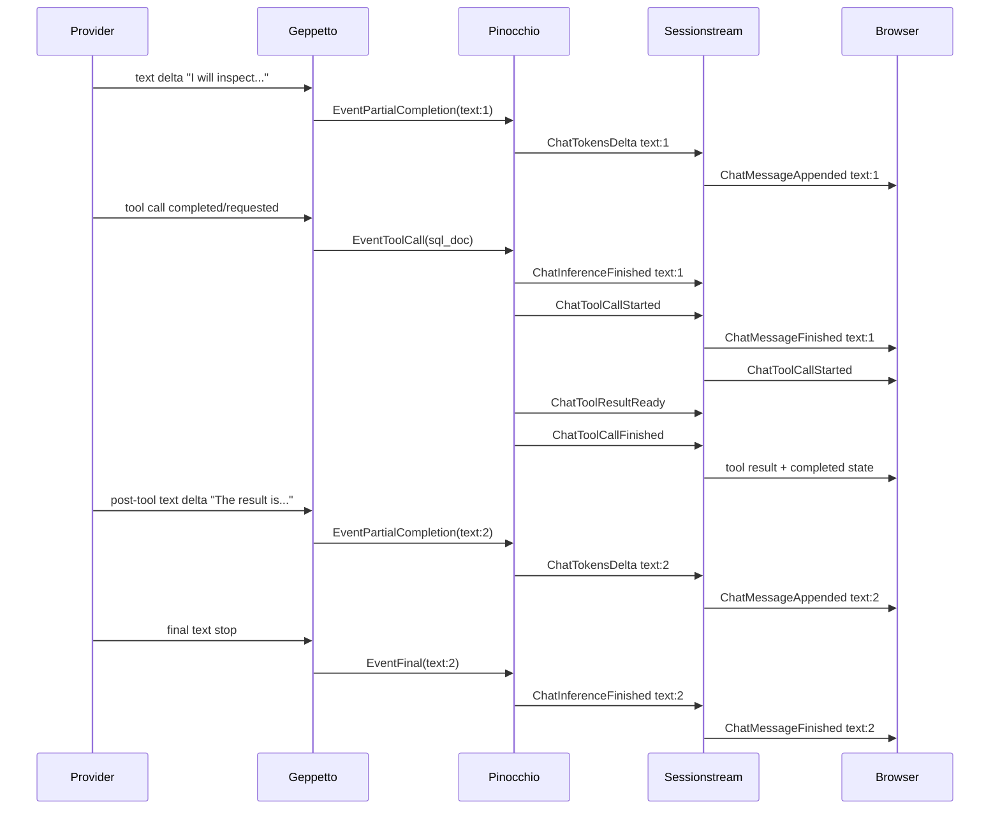
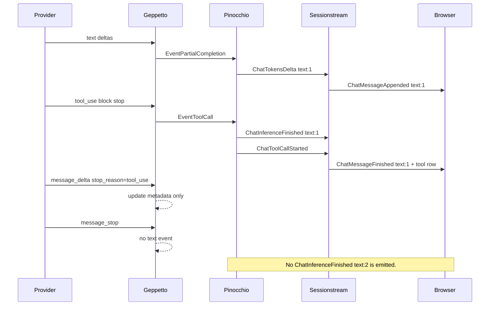
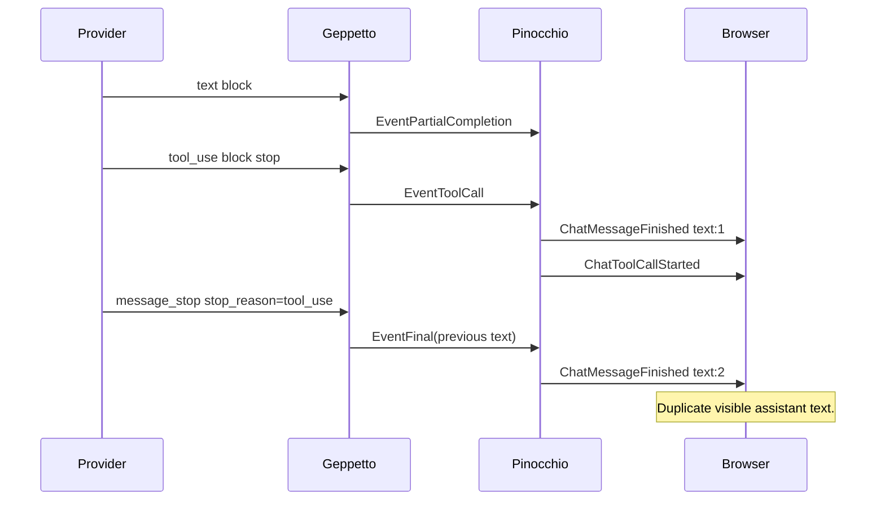

# Provider-to-Geppetto-to-Pinocchio event semantics guide

## 1. Executive summary

This guide explains how streaming provider events should become Geppetto events, how Geppetto events become Pinocchio chatapp events, and why the Haiku duplicate-message bug exposed a naming and boundary problem in the current system. The short version is that the system currently uses the name `ChatInferenceFinished` for something narrower than a whole inference run: it usually means "the current assistant text segment is finished." That is a workable legacy contract, but it becomes confusing once one assistant run can contain text, tool calls, tool results, reasoning, and more text.

A correct event stream must preserve three distinct concepts:

1. **Run lifecycle**: the assistant run begins and eventually becomes idle, stopped, or failed.
2. **Text segment lifecycle**: a contiguous visible assistant text segment begins when text deltas arrive and ends when a boundary appears.
3. **Tool lifecycle**: the model requests a tool, the host executes it, and the result becomes part of the transcript context.

The Haiku bug happened because an Anthropic `message_stop` with `stop_reason=tool_use` was treated like a second text finalizer. The tool-call boundary had already closed the preceding text segment. The message stop was only the provider envelope ending. Turning it into a Geppetto `EventFinal` made Pinocchio manufacture another `ChatInferenceFinished` for a new text segment that did not really exist.

The most important implementation rule is:

```text
A text-final event may close only an active text segment, or finalize text that has not already been emitted.
A provider envelope stop is not a text-final event.
```

This guide is written for a new intern who needs to understand the whole chain before changing provider adapters, Pinocchio chatapp runtime sinks, or frontend trace analysis.

## 2. Vocabulary: the three lifecycles that were conflated

A streaming LLM UI looks like one thing to a user: an assistant is answering. Internally it is several interleaved lifecycles.

### 2.1 Run lifecycle

The **run** is the user-visible assistant turn. In Pinocchio/CoinVault it starts when the user submits a prompt and the chatapp publishes `ChatInferenceStarted`. A run may include several provider calls if the model requests tools and the host loops back with tool results.

Current files:

- `../pinocchio/pkg/chatapp/runtime_inference.go:75-81` publishes `ChatInferenceStarted` before Geppetto starts producing events.
- `../pinocchio/pkg/chatapp/runtime_inference.go:140-153` has a fallback that publishes `ChatInferenceFinished` after the Geppetto session returns if the runtime sink has not already marked itself terminal.

The current system does not have a clean, separate backend event named `ChatRunFinished`. That absence is one reason the word `InferenceFinished` is overloaded.

### 2.2 Text segment lifecycle

A **text segment** is one contiguous visible assistant text row. In a tool-using assistant run, there may be more than one text segment:

```text
text segment 1
  -> tool call
  -> tool result
text segment 2
  -> final answer
```

Pinocchio represents text segments with IDs like:

```text
chat-msg-7:text:1
chat-msg-7:text:2
```

The segment logic lives in `../pinocchio/pkg/chatapp/runtime_sink.go`:

- `ensureTextSegmentID()` allocates or reuses the current segment (`runtime_sink.go:96-107`).
- `finishTextSegment()` closes an active segment and returns its accumulated text (`runtime_sink.go:139-150`).
- transcript-boundary events such as tool calls call `finishTextSegment()` before the tool event is published (`runtime_sink.go:73-85`).

### 2.3 Tool lifecycle

A **tool lifecycle** starts when the model requests a tool. It is not text, but it is a transcript boundary. If assistant text was streaming before the tool request, that text segment must be closed before rendering the tool row.

The tool plugin lives in `../pinocchio/pkg/chatapp/plugins/toolcall.go`:

- `EventToolCall` becomes `ChatToolCallStarted` (`toolcall.go:71-81`).
- `EventToolCallExecute` becomes `ChatToolCallUpdated` (`toolcall.go:83-91`).
- `EventToolResult` becomes `ChatToolResultReady` and `ChatToolCallFinished` (`toolcall.go:93-109`).

The runtime sink deliberately treats tool events as transcript boundaries:

```go
func isTranscriptBoundaryEvent(event gepevents.Event) bool {
    switch event.(type) {
    case *gepevents.EventToolCall,
         *gepevents.EventToolCallExecute,
         *gepevents.EventToolResult,
         *gepevents.EventToolCallExecutionResult:
        return true
    default:
        return false
    }
}
```

That boundary behavior is correct. The duplicate-message bug was not that tool calls close text. The bug was that provider message stop tried to close the same text again.

## 3. The correct canonical event model

Before discussing individual providers, it helps to define the model we want them all to implement.

### 3.1 Ideal semantic events

The ideal internal vocabulary would distinguish run events from text segment events:

| Concept | Better semantic name | Current approximate name |
|---|---|---|
| Assistant run started | `AssistantRunStarted` / `ChatRunStarted` | `ChatInferenceStarted` |
| Text segment delta | `AssistantTextDelta` / `ChatTextDelta` | `EventPartialCompletion` → `ChatTokensDelta` |
| Text segment finished | `AssistantTextSegmentFinished` | `EventFinal` or tool-boundary `finishTextSegment()` → `ChatInferenceFinished` |
| Tool call requested | `AssistantToolCallRequested` | `EventToolCall` → `ChatToolCallStarted` |
| Tool execution started | `ToolExecutionStarted` | `EventToolCallExecute` → `ChatToolCallUpdated` |
| Tool result ready | `ToolResultReady` | `EventToolResult` → `ChatToolResultReady` + `ChatToolCallFinished` |
| Assistant run finished | `AssistantRunFinished` / `ChatRunFinished` | no clean equivalent today |
| Assistant run stopped/failed | `AssistantRunStopped` / `ChatRunStopped` | `ChatInferenceStopped` |

The current names are not fatal, but they invite mistakes. `ChatInferenceFinished` sounds like run completion, yet the code often uses it as text-segment completion. Interns should internalize this immediately: **in current Pinocchio, `ChatInferenceFinished` usually means text row finished, not necessarily whole run finished.**

### 3.2 Correct sequence: text → tool → text → final

The ideal user transcript is:

```text
Assistant: I will inspect the schema.
Tool: sql_doc(...)
Tool result: ...
Assistant: The answer is ...
```

The event sequence should be:

```text
ChatInferenceStarted                 # run starts; legacy name

ChatTokensDelta text:1               # first text segment opens
ChatTokensDelta text:1
ChatInferenceFinished text:1         # close text segment because a tool boundary arrives

ChatToolCallStarted
ChatToolCallUpdated                  # optional execution marker
ChatToolResultReady
ChatToolCallFinished

ChatTokensDelta text:2               # second text segment opens only because real new text arrives
ChatTokensDelta text:2
ChatInferenceFinished text:2         # close second text segment at true final text boundary

ChatRunFinished                      # recommended future event; absent today
```

With today's event vocabulary, the last `ChatInferenceFinished text:2` is doing double duty: it closes the final text segment and implies the run is no longer actively streaming. That is acceptable only when `text:2` exists because real post-tool text deltas arrived.

### 3.3 Correct sequence: text → tool → final with no post-tool text

Some provider calls end with a tool request and do not produce final assistant prose until the next provider call. In that case the sequence should be:

```text
ChatInferenceStarted

ChatTokensDelta text:1
ChatTokensDelta text:1
ChatInferenceFinished text:1         # close text before tool

ChatToolCallStarted
ChatToolCallUpdated
ChatToolResultReady
ChatToolCallFinished

ChatRunFinished                      # recommended future event if the whole run is done
```

There must not be:

```text
ChatInferenceFinished text:2
```

No second text segment opened. No second text segment should be finished.

### 3.4 Practical invariant for current code

Current Pinocchio can be kept safe with this invariant:

```text
Emit ChatInferenceFinished only when:
  1. there is an active text segment to close, or
  2. a final event carries non-empty text that has not already been emitted as a segment.

Do not emit ChatInferenceFinished when:
  1. there is no active text segment,
  2. final text is empty, or
  3. the provider event is only a tool-use message envelope stop.
```

That invariant belongs in both provider adapters and the runtime sink. Provider adapters should not emit misleading text-final events. The runtime sink should be defensive in case a provider adapter does.

## 4. Current Pinocchio mapping from Geppetto events

The current Pinocchio mapping is compact and important. Every provider eventually flows through `runtimeEventSink.PublishEvent` in `../pinocchio/pkg/chatapp/runtime_sink.go`.

### 4.1 Text deltas

Current code path:

```text
Geppetto EventPartialCompletion
  -> runtimeEventSink.ensureTextSegmentID()
  -> ChatTokensDelta
  -> UI ChatMessageAppended
  -> Timeline ChatMessage upsert
```

Relevant code:

```go
case *gepevents.EventPartialCompletion:
    textMessageID, segment := s.ensureTextSegmentID()
    s.lastText = ev.Completion
    payload := newChatMessageDelta(textMessageID, ev.Delta, ev.Completion, ...)
    return s.engine.publish(..., EventTokensDelta, payload)
```

Evidence: `pinocchio-runtime-sink.lines.txt:33-44`.

### 4.2 Final text events

Current code path:

```text
Geppetto EventFinal
  -> runtimeEventSink.ensureTextSegmentID()
  -> ChatInferenceFinished
  -> UI ChatMessageFinished
  -> Timeline ChatMessage status=finished
```

Relevant code:

```go
case *gepevents.EventFinal:
    textMessageID, segment := s.ensureTextSegmentID()
    s.lastText = ev.Text
    s.terminal = true
    s.textActive = false
    payload := newChatMessageUpdate(textMessageID, "assistant", ev.Text, ev.Text, ...)
    return s.engine.publish(..., EventInferenceFinished, payload)
```

Evidence: `pinocchio-runtime-sink.lines.txt:45-57`.

This path is powerful and dangerous. It always allocates a text segment if none is active. That is useful for non-streaming providers that send only final text. It is wrong when an empty or provider-envelope-only final event arrives after a tool boundary.

### 4.3 Transcript boundaries

Current code path:

```text
Geppetto EventToolCall / EventToolResult / execution events
  -> runtimeEventSink.finishTextSegment() if text is active
  -> ChatInferenceFinished for the current text segment
  -> ToolCallPlugin handles the actual tool event
```

Relevant code:

```go
if isTranscriptBoundaryEvent(event) {
    if textMessageID, segment, text, ok := s.finishTextSegment(); ok {
        payload := newChatMessageUpdate(textMessageID, "assistant", text, text, ...)
        s.engine.publish(..., EventInferenceFinished, payload)
    }
}
return s.engine.handleFeatureRuntimeEvent(...)
```

Evidence: `pinocchio-runtime-sink.lines.txt:73-85` and `pinocchio-runtime-sink.lines.txt:213-220`.

This is the correct mechanism for `text -> tool`. It is also the reason provider adapters must not later send a second text final for the same provider message.

### 4.4 UI and timeline projection

Pinocchio's base projections are simple:

| Backend event | UI event | Timeline effect |
|---|---|---|
| `ChatTokensDelta` | `ChatMessageAppended` | Upsert streaming `ChatMessage`. |
| `ChatInferenceFinished` | `ChatMessageFinished` | Upsert finished `ChatMessage`. |
| `ChatInferenceStopped` | `ChatMessageStopped` | Upsert stopped/error `ChatMessage`. |

Evidence: `../pinocchio/pkg/chatapp/projections.go`, captured in `pinocchio-projections.lines.txt:1-120`.

The frontend is not expected to infer semantic correctness. If backend sends `ChatMessageFinished chat-msg-7:text:2`, the frontend will render it.

## 5. Provider-specific mappings today

The three provider families use different provider APIs. They should converge to the same Geppetto event semantics, but today they do not all do it cleanly.

## 5.1 OpenAI Chat Completions

### Provider shape

OpenAI-compatible Chat Completions streaming emits chunks with a `choices[]` array. Each choice delta may contain:

- assistant text content;
- reasoning/thinking text on some compatible providers;
- tool call deltas, often split across many chunks;
- a finish reason such as `tool_calls` or `stop`;
- optional usage in a final stream-options chunk.

### Current Geppetto mapping

Current code: `pkg/steps/ai/openai/engine_openai.go`.

The key mapping is:

```text
choice.delta.content
  -> message += delta
  -> EventPartialCompletion(delta, message)

choice.delta.reasoning
  -> EventThinkingPartial

choice.delta.tool_calls
  -> accumulated in ToolCallMerger

stream EOF
  -> publish EventToolCall for each merged tool call
  -> publish EventFinal(message)
```

Evidence:

- Text deltas become `EventPartialCompletion` at `geppetto-openai-chat-engine.lines.txt:291-331`.
- Reasoning deltas become `EventThinkingPartial` at `geppetto-openai-chat-engine.lines.txt:295-307`.
- Tool calls are accumulated during streaming at `geppetto-openai-chat-engine.lines.txt:309-312`.
- Merged tool calls are published after the stream completes at `geppetto-openai-chat-engine.lines.txt:381-391`.
- Final text is always published after tool calls at `geppetto-openai-chat-engine.lines.txt:417-433`.

### Current behavior under the canonical model

For a normal text-only answer, this maps well:

```text
OpenAI text delta -> EventPartialCompletion -> ChatTokensDelta
OpenAI stream EOF -> EventFinal -> ChatInferenceFinished
```

For a tool-call answer, the current mapping is less clean:

```text
OpenAI text delta, if any -> EventPartialCompletion
OpenAI tool deltas -> buffered
stream EOF -> EventToolCall(s)
stream EOF -> EventFinal(message)
```

This means a provider response that has both pre-tool text and tool calls can produce the same hazard seen in Claude:

```text
EventToolCall closes text segment via Pinocchio boundary
EventFinal(message) can try to close that same text again
```

Many OpenAI-compatible providers produce tool calls with no assistant prose in the same provider message, so the bug may not show. But the semantic risk exists. The safer rule is: if finish reason is `tool_calls` and all text has already been emitted before the tool event, the provider adapter should not publish a text `EventFinal` after publishing tool calls unless there is genuinely unflushed text that has not been closed.

## 5.2 OpenAI Responses API

### Provider shape

The Responses API emits typed SSE events such as:

- `response.output_item.added`
- `response.output_text.delta`
- `response.output_item.done`
- `response.function_call_arguments.delta`
- `response.output_item.done` with `type=function_call`
- `response.reasoning_text.delta`
- `response.reasoning_summary_text.delta`
- `response.completed`

This API is more structured than Chat Completions. Text, reasoning, and function calls are separate output items.

### Current Geppetto mapping

Current code: `pkg/steps/ai/openai_responses/streaming.go`.

The key mapping is:

```text
response.output_text.delta
  -> appendAssistantChunk(delta)
  -> EventPartialCompletion(delta, message)

response.output_item.done type=message
  -> backfill missing assistant text, if done payload carries text not seen as deltas

response.output_item.done type=function_call
  -> EventToolCall

response.reasoning_text.delta / summary delta
  -> EventThinkingPartial

response.completed / EOF
  -> EventFinal(message)
```

Evidence:

- `appendAssistantChunk` publishes `EventPartialCompletion` at `geppetto-openai-responses-streaming.lines.txt:120-126`.
- message item `done` backfills missing output text at `geppetto-openai-responses-streaming.lines.txt:486-516`.
- function-call `done` publishes `EventToolCall` at `geppetto-openai-responses-streaming.lines.txt:517-549`.
- text deltas map through `response.output_text.delta` at `geppetto-openai-responses-streaming.lines.txt:576-596`.
- final `EventFinal(message)` is published at `geppetto-openai-responses-streaming.lines.txt:805`.

### Current behavior under the canonical model

Responses gives us enough structure to do the right thing, but the current adapter still emits a final text event at the end of the provider response regardless of whether a tool-call boundary already closed the current text.

Ideal behavior should be item-aware:

```text
message item text deltas
  -> EventPartialCompletion
message item done
  -> if needed, backfill missing text only
function_call item done
  -> EventToolCall, after closing any active text via Pinocchio boundary
response.completed
  -> run/provider-call metadata only, not text final, if no active text remains
```

Again, the problem is not the existence of `response.completed`. The problem is treating provider response completion as text segment completion.

## 5.3 Anthropic Claude / Haiku

### Provider shape

Anthropic streaming uses a message envelope with content blocks:

```text
message_start
content_block_start index=0 text
content_block_delta index=0 text_delta
content_block_stop  index=0
content_block_start index=1 tool_use
content_block_delta index=1 input_json_delta
content_block_stop  index=1
message_delta stop_reason=tool_use
message_stop
```

For normal text-only answers, the message may end with `stop_reason=end_turn` instead of `tool_use`.

### Current Geppetto mapping after this ticket

Current code: `pkg/steps/ai/claude/content-block-merger.go`.

The current mapping is:

```text
message_start
  -> EventStart

content_block_delta text
  -> EventPartialCompletion(delta, fullText)

content_block_stop text
  -> EventPartialCompletion("", fullText)

content_block_stop tool_use
  -> EventToolCall

message_delta
  -> metadata only; no text event

message_stop with stop_reason=tool_use
  -> no event

message_stop with normal end_turn
  -> EventFinal(fullText)
```

Evidence:

- `message_start` maps to `EventStart` at `geppetto-claude-content-block-merger.lines.txt:150-166`.
- `message_delta` is now metadata-only at `geppetto-claude-content-block-merger.lines.txt:168-193`.
- `message_stop` suppresses final event for `tool_use` at `geppetto-claude-content-block-merger.lines.txt:195-229`.
- text deltas become `EventPartialCompletion` at `geppetto-claude-content-block-merger.lines.txt:263-269`.
- text content-block stop emits an empty-delta partial at `geppetto-claude-content-block-merger.lines.txt:290-294`.
- tool-use content-block stop emits `EventToolCall` at `geppetto-claude-content-block-merger.lines.txt:296-314`.

### Why this is correct for the Haiku duplicate

The provider did not send two text blocks. The tool call closed the first text segment through Pinocchio's transcript-boundary rule. Therefore `message_stop stop_reason=tool_use` must not publish another final text event. After commit `38af6ed`, it does not.

## 6. Sequence diagrams

### 6.1 Correct text → tool → text → final sequence



### 6.2 Correct text → tool → provider envelope stop sequence



### 6.3 Buggy sequence that caused the duplicate



## 7. Better names to reduce confusion

The current system can remain compatible while docs and internal names are clarified. For a future breaking API or compatibility alias layer, use names that separate run lifecycle from segment lifecycle.

### 7.1 Geppetto event names

| Current | Recommended semantic alias | Why |
|---|---|---|
| `EventTypeStart` / `EventPartialCompletionStart` | `RunStarted` or `TextStreamStarted` depending on intended meaning | Current comment says start/final are for text completion, but engines use start for provider run start. |
| `EventTypePartialCompletion` | `TextDelta` | It carries a delta and cumulative text, not a whole completion concept. |
| `EventTypeFinal` | `TextFinal` | It should mean final text segment, not provider response completed. |
| `EventTypeToolCall` | `ToolCallRequested` | More explicit: the model requested the tool; host execution has not necessarily begun. |
| `EventTypeInfo` with `thinking-started/ended` | typed `ReasoningStarted/ReasoningFinished` | Reduces stringly-typed plugin behavior. |

### 7.2 Pinocchio backend/UI event names

| Current | Recommended future name | Compatibility strategy |
|---|---|---|
| `ChatInferenceStarted` | `ChatRunStarted` | Keep old name as alias until clients migrate. |
| `ChatTokensDelta` | `ChatTextDelta` | Add alias or document as text-segment delta. |
| `ChatInferenceFinished` | `ChatTextSegmentFinished` | This is the most important rename; current name is misleading. |
| `ChatInferenceStopped` | `ChatRunStopped` / `ChatRunFailed` | Separate user stop from runtime failure in a future cleanup. |
| none | `ChatRunFinished` | Add a true run-level final event so `ChatInferenceFinished` no longer has to imply run completion. |

A migration does not need to be immediate. The minimum safe step is documentation and defensive guards. The better long-term step is to introduce new names while emitting legacy aliases during a transition period.

## 8. Documentation verification and improvement notes

I checked existing Pinocchio docs captured under `sources/`.

### 8.1 What is already correct

`pkg/doc/topics/chatapp-protobuf-plugins.md` already says:

```text
ChatInferenceFinished | ChatMessageFinished | Assistant text segment or final response finished.
```

Evidence: `pinocchio-chatapp-protobuf-plugins-doc.lines.txt:71-79`.

It also explains segment-aware transcript rows and shows multiple text/thinking segments under one parent assistant run. Evidence: `pinocchio-chatapp-protobuf-plugins-doc.lines.txt:87-110`.

That doc is directionally correct: it acknowledges that `ChatInferenceFinished` can mean a segment, not only a whole response.

### 8.2 What is still ambiguous

The phrase "Assistant text segment or final response finished" is too compressed. It should explicitly say:

```text
ChatInferenceFinished is a legacy name. In segment-aware chatapp flows, it closes one assistant text segment. It should not be emitted merely because a provider response envelope ended. Tool-call boundaries may emit ChatInferenceFinished to close active text before a tool row.
```

The tutorial `pkg/doc/tutorials/09-building-sessionstream-react-chat-apps.md` describes the simple flow:

```text
ChatTokensDelta
ChatInferenceFinished
```

That is useful for a text-only tutorial, but it does not explain the tool loop case. The tutorial should add a short section for:

```text
Text segment -> tool call -> optional next text segment
```

and warn that `ChatInferenceFinished` is a text segment finalizer in that context.

### 8.3 Documentation TODOs

Recommended doc updates in Pinocchio:

1. Expand `chatapp-protobuf-plugins.md` section "Base chatapp schema" with a note that `ChatInferenceFinished` is legacy naming for text segment finalization.
2. Add a diagram to `09-building-sessionstream-react-chat-apps.md` showing `text:1 -> tool -> text:2`.
3. Add a table titled "Provider envelope events are not transcript events" with examples:
   - Anthropic `message_stop stop_reason=tool_use` → no text final.
   - OpenAI Responses `response.completed` after function call → no text final if no active text.
   - OpenAI Chat Completions finish reason `tool_calls` → tool request, not text final.
4. Add a runtime sink comment around `EventFinal` handling explaining when it is allowed to allocate a new segment.

## 9. Implementation guidance

This section is the practical guide for changing the code safely.

### 9.1 Provider adapters should emit semantic Geppetto events

Provider adapters must not mechanically map every provider "done" event to Geppetto `EventFinal`. They must ask: what semantic thing ended?

Pseudocode:

```text
on provider text delta:
    emit EventPartialCompletion(delta, accumulatedText)

on provider text block done:
    if downstream needs a segment boundary marker:
        emit EventPartialCompletion(delta="", accumulatedText)

on provider tool call complete/requested:
    emit EventToolCall(id, name, args)

on provider response/message done:
    update usage/stop metadata
    if stop reason means normal text answer is complete:
        emit EventFinal(accumulatedText)
    if stop reason means tool call requested:
        emit no text final
```

### 9.2 Runtime sink should guard final text events

Even if provider adapters are fixed, Pinocchio should be defensive. Current `EventFinal` handling always calls `ensureTextSegmentID()`, which can manufacture a new text segment. A safer version would inspect whether text is active and whether final text is non-empty and new.

Pseudocode for a future Pinocchio guard:

```text
on EventFinal(ev):
    if textActive:
        finish active segment with ev.Text or lastText
        publish ChatInferenceFinished
        mark terminal
        return

    if ev.Text is non-empty and no text segment has ever been created:
        create one text segment
        publish ChatInferenceFinished
        mark terminal
        return

    if ev.Text is non-empty and ev.Text differs from the last closed segment:
        create a new text segment
        publish ChatInferenceFinished
        mark terminal
        return

    mark terminal if this is truly run-final metadata
    do not publish ChatInferenceFinished
```

The final branch needs a real run-level event eventually. Without one, the runtime has to choose between ignoring a run-level final and misusing a text-segment final.

### 9.3 Add provider-specific regression tests

The Claude regression test created in this ticket should become the pattern for all providers:

```text
text deltas
provider tool-call indication
tool call event
provider envelope stop with tool-call stop reason
assert no duplicate text final
```

Recommended new tests:

- OpenAI Chat Completions: content deltas plus `finish_reason=tool_calls` should not produce a duplicate text final after `EventToolCall`.
- OpenAI Responses: `output_text.delta`, then `function_call` item done, then `response.completed` should not produce duplicate text final.
- Pinocchio runtime sink: receiving `EventFinal("")` with no active text segment should not publish `ChatInferenceFinished`.
- Pinocchio runtime sink: receiving `EventFinal("new text")` with no prior segment should still publish a finished text segment for non-streaming compatibility.

## 10. Provider mapping tables

### 10.1 OpenAI Chat Completions mapping table

| Provider stream event | Current Geppetto event | Current Pinocchio consequence | Desired rule |
|---|---|---|---|
| `choices[].delta.content` | `EventPartialCompletion` | `ChatTokensDelta` | Correct. |
| reasoning delta fields | `EventThinkingPartial` plus info start/end | `ChatReasoning*` via plugin | Correct, subject to provider normalization. |
| `choices[].delta.tool_calls` | buffered until stream end | no immediate event | Acceptable but less live than possible. |
| stream end with merged tool calls | `EventToolCall` | closes active text, then `ChatToolCallStarted` | Correct boundary. |
| stream end always | `EventFinal(message)` | may create/finish a text segment | Should be conditional when finish reason is `tool_calls`. |

### 10.2 OpenAI Responses mapping table

| Provider stream event | Current Geppetto event | Current Pinocchio consequence | Desired rule |
|---|---|---|---|
| `response.output_text.delta` | `EventPartialCompletion` | `ChatTokensDelta` | Correct. |
| `response.output_item.done type=message` | backfill text through partials if missing | `ChatTokensDelta` for missing suffix | Correct if de-duplicated. |
| `response.output_item.done type=function_call` | `EventToolCall` | closes active text, starts tool row | Correct. |
| `response.reasoning_text.delta` / summary deltas | `EventThinkingPartial` | `ChatReasoning*` | Correct. |
| `response.completed` / EOF | `EventFinal(message)` | may create/finish text segment | Should be conditional when current output ended in function call and no unclosed text remains. |

### 10.3 Anthropic Claude mapping table

| Provider stream event | Current Geppetto event after this ticket | Current Pinocchio consequence | Desired rule |
|---|---|---|---|
| `message_start` | `EventStart` | mostly ignored by runtime sink | OK, but naming should clarify run vs text. |
| `content_block_delta text_delta` | `EventPartialCompletion` | `ChatTokensDelta` | Correct. |
| `content_block_stop text` | empty-delta `EventPartialCompletion` | updates active segment with final cumulative text | Works as segment finalization hint. |
| `content_block_stop tool_use` | `EventToolCall` | closes active text, starts tool row | Correct. |
| `message_delta stop_reason=tool_use` | metadata only | no transcript event | Correct. |
| `message_stop stop_reason=tool_use` | no event | no duplicate text final | Correct after commit `38af6ed`. |
| `message_stop stop_reason=end_turn` | `EventFinal(fullText)` | closes final text segment | Correct for text-only answer. |

## 11. How to verify with SQLite traces

When a duplicate appears, do not inspect only the frontend. Use the debug SQLite to follow the evidence.

### 11.1 Provider and Geppetto boundary

```sql
select
  g.record_id,
  g.stage,
  g.event_type,
  pe.provider_event_type,
  g.output_index,
  substr(coalesce(
    json_extract(pe.object_json,'$.delta.text'),
    json_extract(pe.object_json,'$.delta.stop_reason'),
    json_extract(pe.object_json,'$.delta.partial_json'),
    ''
  ),1,120) as payload
from geppetto_records g
left join geppetto_provider_events pe on pe.record_id = g.record_id
order by g.record_id;
```

Look for a pattern like:

```text
provider_routed_event message_stop
geppetto_publish_started final
```

If the stop reason was `tool_use`, that final event is suspicious.

### 11.2 Backend pipeline

```sql
select
  br.ordinal,
  p.event_name,
  json_extract(e.payload_json,'$.messageId') as message_id,
  substr(json_extract(e.payload_json,'$.content'),1,120) as content
from backend_pipeline p
join backend_records br on br.id = p.record_id
left join backend_pipeline_ui_events e
  on e.record_id = br.id
 and e.source = 'uiEvents'
where p.event_type = 'pinocchio.chatapp.v1.ChatMessageUpdate'
order by cast(br.ordinal as int);
```

A duplicate text bug usually appears as:

```text
ChatInferenceFinished chat-msg-*:text:1  same text
ChatToolCallStarted
ChatInferenceFinished chat-msg-*:text:2  same text
```

### 11.3 Browser delivery chain

```sql
select ordinal, pipeline_event, transport_fanout, frontend_parsed
from delivery_chain
order by cast(ordinal as integer);
```

If `transport_fanout=yes` and `frontend_parsed=yes`, the frontend received what the backend sent.

## 12. Near-term implementation plan

### Phase 1: Finish validating the Claude fix

1. Restart CoinVault using the workspace that includes local Geppetto.
2. Re-run the Haiku Playwright smoke.
3. Download a new debug SQLite.
4. Verify that `message_stop stop_reason=tool_use` no longer produces `geppetto_publish_started final` and no longer produces `ChatInferenceFinished text:2` before post-tool text deltas.

### Phase 2: Add Pinocchio defensive guard

Implement a runtime sink guard for empty/no-active `EventFinal` events. This reduces blast radius if another provider emits a misleading final event.

Candidate files:

```text
../pinocchio/pkg/chatapp/runtime_sink.go
../pinocchio/pkg/chatapp/chat_test.go or runtime_sink_test.go
```

### Phase 3: Audit OpenAI Chat Completions and Responses

Both OpenAI engines currently publish tool-call events and then publish `EventFinal(message)` at provider stream completion. Audit whether this can duplicate text in real tool-call responses.

Candidate files:

```text
pkg/steps/ai/openai/engine_openai.go
pkg/steps/ai/openai_responses/streaming.go
```

Provider-specific fix rule:

```text
If the provider stop/completion reason is a tool call and no unclosed post-tool text exists, do not publish text EventFinal.
```

### Phase 4: Improve naming and docs

Start with documentation and comments. Do not force a breaking API rename immediately.

1. Add explicit note to Pinocchio docs that `ChatInferenceFinished` is a legacy text-segment finalizer.
2. Add sequence diagrams for text/tool/text and text/tool/final.
3. Consider adding future events:
   - `ChatTextSegmentFinished`
   - `ChatRunFinished`
4. Keep compatibility aliases for existing frontends.

## 13. References

### Geppetto source

- `pkg/events/chat-events.go` — current event type vocabulary.
- `pkg/steps/ai/openai/engine_openai.go` — OpenAI Chat Completions streaming event conversion.
- `pkg/steps/ai/openai_responses/streaming.go` — OpenAI Responses streaming event conversion.
- `pkg/steps/ai/claude/content-block-merger.go` — Claude/Anthropic content-block merger and tool-use message-stop fix.
- `pkg/steps/ai/claude/content-block-merger_test.go` — regression coverage for Claude tool-use duplicate text finalization.

### Pinocchio source

- `../pinocchio/pkg/chatapp/runtime_inference.go` — run start and fallback finalization logic.
- `../pinocchio/pkg/chatapp/runtime_sink.go` — Geppetto event sink and text segment state machine.
- `../pinocchio/pkg/chatapp/projections.go` — backend event to UI/timeline projections.
- `../pinocchio/pkg/chatapp/plugins/toolcall.go` — tool-call runtime event mapping.
- `../pinocchio/pkg/chatapp/plugins/reasoning.go` — reasoning runtime event mapping.

### Pinocchio docs to update

- `../pinocchio/pkg/doc/topics/chatapp-protobuf-plugins.md`
- `../pinocchio/pkg/doc/tutorials/09-building-sessionstream-react-chat-apps.md`

The docs already contain the right ingredients: segment-aware message IDs and shared plugins. They need stronger language around the difference between provider/run completion and text-segment completion.
