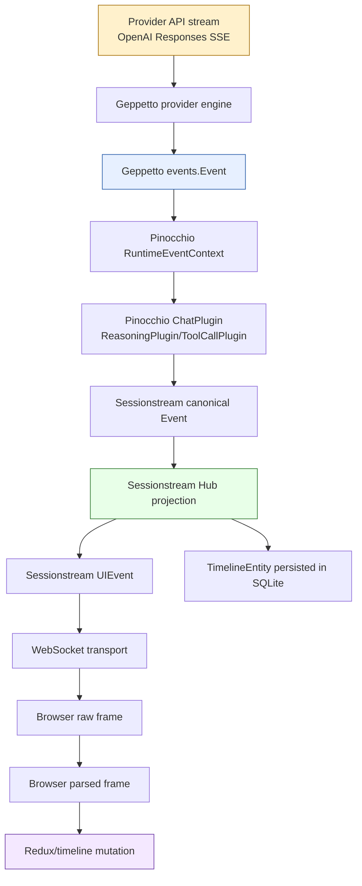
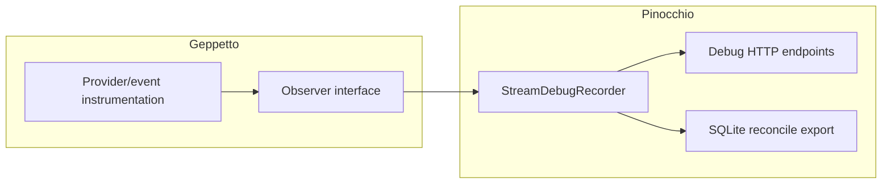

# Geppetto Provider/Event Observability Implementation Guide

## Executive summary

This ticket adds an observability layer to **Geppetto**, the inference/event engine that sits below Pinocchio and Sessionstream. We already instrumented Sessionstream and Pinocchio's browser side: we can record Hub pipeline events, WebSocket transport events, frontend raw/parsed frames, UI mutations, persisted timeline entities, and turn snapshots. That tells us what happened after Pinocchio translated Geppetto events into Sessionstream events.

However, several important questions remain invisible at that layer:

- What raw provider stream event did OpenAI Responses send?
- Did the provider event contain `response_id`, `item_id`, `output_index`, or `summary_index`?
- Did Geppetto preserve those identifiers in its `EventMetadata` or `EventInfo.Data`?
- Did Geppetto emit `thinking-ended` before or after `reasoning-summary`?
- Did Geppetto normalize high-frequency deltas correctly?
- Did Pinocchio lose metadata, or did Geppetto never publish it?

The goal of this ticket is to add **neutral Geppetto observer hooks** at the provider and event publishing layers, then let an application such as Pinocchio attach a recorder. Configuration must flow through **Glazed sections** and typed settings, not through `os.Getenv()` or hidden globals.

> [!summary]
> Add Geppetto-owned observer hooks and Glazed observability settings. Geppetto emits structured provider/event trace records; Pinocchio records them and exports them into the same SQLite reconciliation artifact used for Sessionstream/backend/frontend debugging.

## Reader prerequisites

A new intern should understand four systems before implementing this ticket:

1. **Geppetto**: builds provider requests, consumes provider streams, and emits normalized `events.Event` values.
2. **Pinocchio web-chat**: creates runtimes, translates Geppetto events through chat plugins, and publishes Sessionstream events.
3. **Sessionstream**: projects canonical events into UI events and durable timeline entities, then sends them over WebSockets.
4. **Browser debug layer**: records raw WebSocket frames, parsed frames, hydration snapshots, and UI mutations.

This guide explains each piece just enough to implement Geppetto observability safely.

## Current architecture: from provider stream to browser timeline

The existing flow looks like this:



We already have observability at these lower boxes:

- Sessionstream Hub observer: pipeline projection and fanout records.
- Sessionstream WebSocket observer: subscribe, snapshot, fanout, queue, write records.
- Pinocchio frontend debug recorder: raw WebSocket, parsed frames, snapshots, UI mutations.
- Pinocchio SQLite reconcile export: combines backend records, frontend records, timeline entities, and turns.

This ticket adds observability to the top half:

```text
Provider API stream -> Geppetto provider engine -> Geppetto event publishing
```

## Why Sessionstream observability is not enough

Sessionstream sees translated events like:

```text
ChatReasoningDelta
ChatReasoningFinished
ChatMessageAppended
ChatInferenceFinished
```

That is useful, but it hides provider-specific details. For example, OpenAI Responses may send events like:

```text
response.reasoning_summary_text.delta
response.reasoning_summary_part.done
response.output_item.done
response.reasoning_text.delta
response.completed
```

Those provider events may contain fields such as:

```json
{
  "type": "response.reasoning_summary_text.delta",
  "response_id": "resp_...",
  "item_id": "rs_...",
  "output_index": 0,
  "summary_index": 0,
  "delta": "..."
}
```

If Geppetto drops `item_id`, Pinocchio cannot later recover it. If Geppetto emits a final `reasoning-summary` without provider identity, Sessionstream will only see the Pinocchio-level message ID. That was enough to fix the duplicate thinking block, but not enough to prove exact provider item correlation.

## Motivating bug: duplicate thinking block

During `PINO-STREAM-DEBUG`, the browser showed two thinking blocks. The persisted Sessionstream timeline proved the backend had stored two entities:

```text
ChatMessage|chat-msg-1:thinking:1|created=4|last=700
ChatMessage|chat-msg-1:thinking:2|created=1659|last=1659
```

The root cause was in Pinocchio's `ReasoningPlugin`: a late `reasoning-summary` was treated as a new reasoning segment after `thinking-ended` had closed the first one. We fixed that in Pinocchio by reusing the most recent segment for summaries.

But one question remains: did the upstream provider send enough identity to correlate the summary to the original reasoning item? Sessionstream cannot answer that because the original Geppetto metadata is not persisted there.

Geppetto observability should make that answer obvious.

## Current Geppetto event contracts

### EventMetadata

Geppetto events carry `EventMetadata`:

```go
type EventMetadata struct {
    LLMInferenceData
    ID uuid.UUID `json:"message_id"`

    SessionID   string `json:"session_id,omitempty"`
    InferenceID string `json:"inference_id,omitempty"`
    TurnID      string `json:"turn_id,omitempty"`

    Extra map[string]interface{} `json:"extra,omitempty"`
}
```

File:

```text
geppetto/pkg/events/chat-events.go
```

This gives us a message/inference-level correlation object, but it is not the same as a provider reasoning item ID. It can correlate all events in an inference. It may not distinguish multiple provider output items inside that inference unless we explicitly add those values to `Extra` or `EventInfo.Data`.

### EventInfo

Geppetto uses `EventInfo` for lightweight named events:

```go
type EventInfo struct {
    EventImpl
    Message string                 `json:"message"`
    Data    map[string]interface{} `json:"data,omitempty"`
}
```

`reasoning-summary` is currently emitted as an `EventInfo`:

```go
e.publishEvent(ctx, events.NewInfoEvent(
    metadata,
    "reasoning-summary",
    map[string]any{"text": summaryBuf.String()},
))
```

File:

```text
geppetto/pkg/steps/ai/openai_responses/engine.go
```

This payload currently includes only `text`. It does not include provider item correlation fields.

### EventThinkingPartial

Live thinking/reasoning deltas are emitted as thinking partial events:

```go
e.publishEvent(ctx, events.NewThinkingPartialEvent(
    metadata,
    normalized,
    summaryBuf.String(),
))
```

These are high-frequency events. They are the main reason the observer implementation must be efficient, optional, and bounded.

## Current OpenAI Responses streaming path

The first implementation target is:

```text
geppetto/pkg/steps/ai/openai_responses/engine.go
```

Important provider event cases include:

```go
case "response.reasoning_summary_part.added":
    e.publishEvent(ctx, events.NewInfoEvent(metadata, "reasoning-summary-started", nil))

case "response.reasoning_summary_text.delta":
    normalized := streamhelpers.NormalizeReasoningSummaryDelta(summaryBuf.String(), v)
    summaryBuf.WriteString(normalized)
    currentReasoningSummary.WriteString(normalized)
    e.publishEvent(ctx, events.NewThinkingPartialEvent(metadata, normalized, summaryBuf.String()))

case "response.reasoning_summary_part.done":
    e.publishEvent(ctx, events.NewInfoEvent(metadata, "reasoning-summary-ended", nil))

case "response.reasoning_text.delta":
    thinkBuf.WriteString(streamhelpers.NormalizeReasoningDelta(thinkBuf.String(), d))
    currentReasoningText.WriteString(d)
    e.publishEvent(ctx, events.NewThinkingPartialEvent(metadata, d, thinkBuf.String()))

case "response.output_item.done":
    if typ == "reasoning" {
        e.publishEvent(ctx, events.NewInfoEvent(metadata, "thinking-ended", nil))
        // build persisted turn reasoning block
    }
```

At the end of the stream:

```go
if summaryBuf.Len() > 0 {
    metadata.Extra["reasoning_summary_text"] = summaryBuf.String()
    e.publishEvent(ctx, events.NewInfoEvent(metadata, "reasoning-summary", map[string]any{
        "text": summaryBuf.String(),
    }))
}
```

Notice the current distinction:

- `metadata.Extra` stores `reasoning_summary_text`, `thinking_text`, and token info.
- `EventInfo.Data` for final `reasoning-summary` only stores `text`.
- Sessionstream later sees only Pinocchio's translated `ReasoningUpdate`, not the original metadata.

## Design principle: observe seams, do not own application recording

Geppetto should expose generic hooks. It should not know about Pinocchio's HTTP debug endpoints or SQLite schema. The ownership split should match Sessionstream:



Rules:

- Geppetto owns neutral record types and observer hooks.
- Geppetto observer calls are best-effort and panic-safe.
- Geppetto never writes Pinocchio debug tables directly.
- Pinocchio owns recorder storage, endpoints, and SQLite exports.
- Configuration enters through Glazed typed settings.

## Configuration design: use Glazed sections, not environment variables

The user explicitly requested that configuration come from Glazed, not raw `os.Getenv()`.

Recommended design:

```text
geppetto/pkg/cli/bootstrap/inference_observability.go
```

New section:

```go
const InferenceObservabilitySectionSlug = "observability-settings"

type InferenceObservabilitySettings struct {
    TraceLevel      string `glazed:"geppetto-trace-level"`
    MaxRecords      int    `glazed:"geppetto-trace-max-records"`
    MaxPayloadBytes int    `glazed:"geppetto-trace-max-payload-bytes"`
    RedactProviderData bool `glazed:"geppetto-trace-redact-provider-data"`
}
```

Constructor:

```go
func NewInferenceObservabilitySection() (schema.Section, error) {
    return schema.NewSection(
        InferenceObservabilitySectionSlug,
        "Inference observability",
        schema.WithFields(
            fields.New(
                "geppetto-trace-level",
                fields.TypeString,
                fields.WithDefault("off"),
                fields.WithHelp("Geppetto trace level: off, events, provider, raw"),
            ),
            fields.New(
                "geppetto-trace-max-records",
                fields.TypeInteger,
                fields.WithDefault(100000),
                fields.WithHelp("Maximum Geppetto observer records retained by app recorders"),
            ),
            fields.New(
                "geppetto-trace-max-payload-bytes",
                fields.TypeInteger,
                fields.WithDefault(8192),
                fields.WithHelp("Maximum raw/provider payload bytes retained per Geppetto record"),
            ),
            fields.New(
                "geppetto-trace-redact-provider-data",
                fields.TypeBool,
                fields.WithDefault(true),
                fields.WithHelp("Redact provider raw payload bodies unless explicitly disabled"),
            ),
        ),
    )
}
```

### Why not InferenceSettings?

Do not put trace level into normal `InferenceSettings` initially. Inference settings represent model behavior: provider, model, max tokens, reasoning effort, timeout, etc. Observability is runtime instrumentation. Turning on raw provider frame capture through a model profile would be surprising and risky.

Correct layering:

```text
Profile / InferenceSettings -> what model request to run
Observability section       -> how much execution tracing to capture
```

### Why not existing debug-settings?

Geppetto already has:

```text
geppetto/pkg/cli/bootstrap/inference_debug.go
```

with:

```go
const InferenceDebugSectionSlug = "debug-settings"

type InferenceDebugSettings struct {
    PrintInferenceSettings bool `glazed:"print-inference-settings"`
}
```

This section is for "print resolved settings and exit" workflows. Runtime provider trace capture is larger and will grow. Use a new section instead of overloading `debug-settings`.

## Trace levels

Use one main level flag rather than many booleans:

| Level | Meaning | Captures |
|---|---|---|
| `off` | Disabled | Nothing |
| `events` | Geppetto-level events | Event type, info message, metadata summary, publish stage |
| `provider` | Provider events plus Geppetto events | Provider event type, provider object metadata, IDs, delta sizes, normalized sizes |
| `raw` | Maximum local debugging | Raw stream previews, provider objects, Geppetto events |

Internal type:

```go
type TraceLevel string

const (
    TraceOff      TraceLevel = "off"
    TraceEvents   TraceLevel = "events"
    TraceProvider TraceLevel = "provider"
    TraceRaw      TraceLevel = "raw"
)
```

Validation:

```go
func ParseTraceLevel(s string) (TraceLevel, error) {
    switch strings.TrimSpace(s) {
    case "", "off":
        return TraceOff, nil
    case "events":
        return TraceEvents, nil
    case "provider":
        return TraceProvider, nil
    case "raw":
        return TraceRaw, nil
    default:
        return "", fmt.Errorf("invalid geppetto trace level %q", s)
    }
}
```

## Observer package design

Add:

```text
geppetto/pkg/observability/observer.go
```

Types:

```go
package observability

import (
    "context"
    "encoding/json"
    "time"
)

type Stage string

const (
    StageProviderStreamConnected Stage = "provider_stream_connected"
    StageProviderRawFrame        Stage = "provider_raw_frame"
    StageProviderDecodedEvent    Stage = "provider_decoded_event"
    StageProviderRoutedEvent     Stage = "provider_routed_event"
    StageProviderNormalizeDelta  Stage = "provider_normalize_delta"

    StageGeppettoEventConstructed Stage = "geppetto_event_constructed"
    StageGeppettoPublishStarted   Stage = "geppetto_publish_started"
    StageGeppettoPublishDone      Stage = "geppetto_publish_done"
    StageGeppettoPublishError     Stage = "geppetto_publish_error"
)

type Record struct {
    Timestamp time.Time `json:"timestamp"`

    Provider string `json:"provider,omitempty"`
    Model    string `json:"model,omitempty"`

    SessionID   string `json:"sessionId,omitempty"`
    InferenceID string `json:"inferenceId,omitempty"`
    TurnID      string `json:"turnId,omitempty"`
    MessageID   string `json:"messageId,omitempty"`

    Stage     Stage  `json:"stage"`
    EventType string `json:"eventType,omitempty"`

    ResponseID   string `json:"responseId,omitempty"`
    ItemID       string `json:"itemId,omitempty"`
    OutputIndex  *int   `json:"outputIndex,omitempty"`
    SummaryIndex *int   `json:"summaryIndex,omitempty"`

    RawBytes      int             `json:"rawBytes,omitempty"`
    RawPreview    string          `json:"rawPreview,omitempty"`
    ObjectJSON    json.RawMessage `json:"objectJson,omitempty"`
    EventJSON     json.RawMessage `json:"eventJson,omitempty"`
    MetadataJSON  json.RawMessage `json:"metadataJson,omitempty"`

    DeltaLen           int `json:"deltaLen,omitempty"`
    NormalizedDeltaLen int `json:"normalizedDeltaLen,omitempty"`
    BufferLen          int `json:"bufferLen,omitempty"`

    Error string `json:"error,omitempty"`
}

type Observer interface {
    OnGeppettoRecord(ctx context.Context, rec Record)
}
```

Panic-safe notifier:

```go
func Notify(ctx context.Context, obs Observer, rec Record) {
    if obs == nil {
        return
    }
    if rec.Timestamp.IsZero() {
        rec.Timestamp = time.Now().UTC()
    }
    defer func() {
        _ = recover()
    }()
    obs.OnGeppettoRecord(ctx, rec)
}
```

This mirrors the Sessionstream pattern: observer failures must not break inference.

## Engine option design

The OpenAI Responses engine needs to accept an observer. Exact option names may differ depending on the engine constructor. The intended shape is:

```go
type EngineOption func(*Engine)

func WithObserver(obs observability.Observer) EngineOption {
    return func(e *Engine) {
        e.observer = obs
    }
}
```

Engine struct field:

```go
type Engine struct {
    // existing fields
    observer observability.Observer
}
```

Helper method:

```go
func (e *Engine) observe(ctx context.Context, rec observability.Record) {
    observability.Notify(ctx, e.observer, rec)
}
```

Do not write to stdout/stderr from the observer path except controlled app logs. This is high-frequency.

## Provider object extraction helpers

Add small helpers near OpenAI Responses engine or in an internal helper file:

```go
func stringFromMap(m map[string]any, key string) string {
    v, _ := m[key].(string)
    return v
}

func intPtrFromProviderNumber(v any) *int {
    if i, ok := intFromProviderNumber(v); ok {
        return &i
    }
    return nil
}

func providerRecordBase(metadata events.EventMetadata, reqBody requestBodyType, m map[string]any) observability.Record {
    return observability.Record{
        Provider: "openai_responses",
        Model: reqBody.Model,
        SessionID: metadata.SessionID,
        InferenceID: metadata.InferenceID,
        TurnID: metadata.TurnID,
        MessageID: metadata.ID.String(),
        ResponseID: stringFromMap(m, "response_id"),
        ItemID: stringFromMap(m, "item_id"),
        OutputIndex: intPtrFromProviderNumber(m["output_index"]),
        SummaryIndex: intPtrFromProviderNumber(m["summary_index"]),
    }
}
```

Also inspect nested provider objects:

```go
func itemIDFromProviderObject(m map[string]any) string {
    if v, ok := m["item_id"].(string); ok && v != "" {
        return v
    }
    if item, ok := m["item"].(map[string]any); ok {
        if v, ok := item["id"].(string); ok {
            return v
        }
    }
    return ""
}
```

## Instrumentation points in OpenAI Responses engine

### 1. Provider event decoded/routed

At the start of each provider event switch iteration:

```go
providerType, _ := m["type"].(string)
rec := providerRecordBase(metadata, reqBody, m)
rec.Stage = observability.StageProviderRoutedEvent
rec.EventType = providerType
rec.ObjectJSON = marshalRedactedProviderObject(m, obsConfig)
e.observe(ctx, rec)
```

If trace level is `events`, skip provider objects. If `provider`, include redacted/capped object JSON. If `raw`, include raw preview too.

### 2. Reasoning summary delta

Current code:

```go
case "response.reasoning_summary_text.delta":
    if v, ok := m["delta"].(string); ok && v != "" {
        normalized := streamhelpers.NormalizeReasoningSummaryDelta(summaryBuf.String(), v)
        summaryBuf.WriteString(normalized)
        currentReasoningSummary.WriteString(normalized)
        e.publishEvent(ctx, events.NewThinkingPartialEvent(metadata, normalized, summaryBuf.String()))
    }
```

Instrument around normalization:

```go
before := summaryBuf.Len()
normalized := streamhelpers.NormalizeReasoningSummaryDelta(summaryBuf.String(), v)

rec := providerRecordBase(metadata, reqBody, m)
rec.Stage = observability.StageProviderNormalizeDelta
rec.EventType = "response.reasoning_summary_text.delta"
rec.DeltaLen = len(v)
rec.NormalizedDeltaLen = len(normalized)
rec.BufferLen = before + len(normalized)
e.observe(ctx, rec)
```

Then publish as today.

### 3. Thinking ended

Current code:

```go
case "response.output_item.done":
    if typ == "reasoning" {
        e.publishEvent(ctx, events.NewInfoEvent(metadata, "thinking-ended", nil))
        // build reasoning turn block
    }
```

Instead, include provider identity in the info data:

```go
data := map[string]any{
    "provider": "openai_responses",
}
if id := itemIDFromProviderObject(m); id != "" {
    data["item_id"] = id
}
if responseID := currentResponseID; responseID != "" {
    data["response_id"] = responseID
}
if idx, ok := intFromProviderNumber(m["output_index"]); ok {
    data["output_index"] = idx
}

event := events.NewInfoEvent(metadata, "thinking-ended", data)
e.observe(ctx, geppettoEventRecord(metadata, event, "thinking-ended"))
e.publishEvent(ctx, event)
```

### 4. Final reasoning-summary

Current code:

```go
e.publishEvent(ctx, events.NewInfoEvent(metadata, "reasoning-summary", map[string]any{
    "text": summaryBuf.String(),
}))
```

Recommended:

```go
data := map[string]any{
    "text": summaryBuf.String(),
    "provider": "openai_responses",
}
if currentResponseID != "" {
    data["response_id"] = currentResponseID
}
if lastReasoningItemID != "" {
    data["item_id"] = lastReasoningItemID
}
if currentReasoningOutputIndex != nil {
    data["output_index"] = *currentReasoningOutputIndex
}
if currentReasoningSummaryIndex != nil {
    data["summary_index"] = *currentReasoningSummaryIndex
}

event := events.NewInfoEvent(metadata, "reasoning-summary", data)
e.observe(ctx, geppettoEventRecord(metadata, event, "reasoning-summary"))
e.publishEvent(ctx, event)
```

This is not just for debug records. Adding provider IDs to the public Geppetto event data makes correlation durable even if observers are disabled.

## Publishing observer design

Wrap `publishEvent` calls if possible. If the engine already has a central `publishEvent` method, instrument there.

Ideal pseudocode:

```go
func (e *Engine) publishEvent(ctx context.Context, ev events.Event) {
    e.observe(ctx, geppettoPublishRecord(ev, observability.StageGeppettoPublishStarted, nil))
    err := e.actualPublish(ctx, ev)
    if err != nil {
        e.observe(ctx, geppettoPublishRecord(ev, observability.StageGeppettoPublishError, err))
        return
    }
    e.observe(ctx, geppettoPublishRecord(ev, observability.StageGeppettoPublishDone, nil))
}
```

If `publishEvent` has no error return, still record before/after if possible.

## Redaction and bounds

High-frequency provider tracing can capture sensitive content. Defaults must be safe.

Rules:

- Never capture auth headers.
- Never capture request API keys.
- Raw frame capture only at `raw` level.
- Raw previews capped by `MaxPayloadBytes`.
- Provider JSON redacted by default unless user sets `--geppetto-trace-redact-provider-data=false`.
- Encrypted reasoning content should be replaced by marker and byte length:

```json
{
  "encrypted_content": "<redacted: 8192 bytes>"
}
```

Pseudocode:

```go
func redactProviderObject(m map[string]any, cfg Config) map[string]any {
    out := cloneMap(m)
    redactKeys(out, []string{
        "api_key",
        "authorization",
        "encrypted_content",
    })
    capLargeStrings(out, cfg.MaxPayloadBytes)
    return out
}
```

## Pinocchio integration

Pinocchio currently creates its debug recorder in:

```text
pinocchio/cmd/web-chat/main.go
```

Current pattern:

```go
var debugRecorder *appserver.StreamDebugRecorder
if s.DebugAPI {
    debugRecorder = appserver.NewStreamDebugRecorder(10000)
}
```

Add observability settings decode:

```go
obsSettings := &geppettobootstrap.InferenceObservabilitySettings{}
if err := parsed.DecodeSectionInto(
    geppettobootstrap.InferenceObservabilitySectionSlug,
    obsSettings,
); err != nil {
    return errors.Wrap(err, "decode geppetto observability settings")
}
```

Mount section in `NewCommand`:

```go
observabilitySection, err := geppettobootstrap.NewInferenceObservabilitySection()
if err != nil {
    return nil, errors.Wrap(err, "create geppetto observability section")
}

cmds.WithSections(
    profileSettingsSection,
    clientSection,
    redisLayer,
    observabilitySection,
)
```

Then pass settings into the runtime creation path. The exact location depends on runtime composer/resolver structure, but conceptually:

```go
runtimeComposer := newProfileRuntimeComposer(...).
    WithTurnStore(turnStore).
    WithGeppettoObservability(obsSettings, debugRecorder)
```

If the resolver creates engines, it should pass an observer option into engine construction only when:

```go
s.DebugAPI && debugRecorder != nil && obsSettings.TraceLevel != "off"
```

## Pinocchio recorder extension

Current recorder file:

```text
pinocchio/cmd/web-chat/app/debug_recorder.go
```

Add a third kind:

```go
const (
    DebugRecordKindPipeline  DebugRecordKind = "pipeline"
    DebugRecordKindTransport DebugRecordKind = "transport"
    DebugRecordKindGeppetto  DebugRecordKind = "geppetto"
)
```

Add DTO:

```go
type GeppettoDebugRecord struct {
    Stage string `json:"stage"`
    Provider string `json:"provider,omitempty"`
    Model string `json:"model,omitempty"`
    EventType string `json:"eventType,omitempty"`

    MessageID string `json:"messageId,omitempty"`
    InferenceID string `json:"inferenceId,omitempty"`
    TurnID string `json:"turnId,omitempty"`

    ResponseID string `json:"responseId,omitempty"`
    ItemID string `json:"itemId,omitempty"`
    OutputIndex *int `json:"outputIndex,omitempty"`
    SummaryIndex *int `json:"summaryIndex,omitempty"`

    DeltaLen int `json:"deltaLen,omitempty"`
    NormalizedDeltaLen int `json:"normalizedDeltaLen,omitempty"`
    BufferLen int `json:"bufferLen,omitempty"`

    Object any `json:"object,omitempty"`
    Event any `json:"event,omitempty"`
    Metadata any `json:"metadata,omitempty"`
    Error string `json:"error,omitempty"`
}
```

Add observer implementation:

```go
func (r *StreamDebugRecorder) OnGeppettoRecord(ctx context.Context, rec geppettoobs.Record) {
    if r == nil {
        return
    }
    out := DebugRecord{
        Kind: DebugRecordKindGeppetto,
        Timestamp: rec.Timestamp,
        SessionID: rec.SessionID,
        Geppetto: encodeGeppettoRecord(rec),
    }
    r.append(out)
}
```

## Debug endpoints

Existing endpoints:

```text
GET /api/debug/sessions/{id}/pipeline
GET /api/debug/sessions/{id}/transport
GET /api/debug/sessions/{id}/records
GET /api/debug/sessions/{id}/reconcile
POST /api/debug/sessions/{id}/reconcile/upload
```

Add:

```text
GET /api/debug/sessions/{id}/geppetto
```

Implementation mirrors pipeline/transport filtering:

```go
case "geppetto":
    kind = DebugRecordKindGeppetto
```

## SQLite reconcile export extension

Current SQLite builder:

```text
pinocchio/cmd/web-chat/app/debug_reconcile_db.go
```

Add tables:

```sql
CREATE TABLE geppetto_records (
    id INTEGER PRIMARY KEY AUTOINCREMENT,
    ts TEXT NOT NULL,
    provider TEXT,
    model TEXT,
    session_id TEXT,
    inference_id TEXT,
    turn_id TEXT,
    message_id TEXT,
    stage TEXT NOT NULL,
    event_type TEXT,
    response_id TEXT,
    item_id TEXT,
    output_index INTEGER,
    summary_index INTEGER,
    raw_bytes INTEGER,
    delta_len INTEGER,
    normalized_delta_len INTEGER,
    buffer_len INTEGER,
    error TEXT,
    raw_json TEXT NOT NULL
);
```

```sql
CREATE TABLE geppetto_provider_events (
    record_id INTEGER PRIMARY KEY REFERENCES geppetto_records(id),
    provider_event_type TEXT,
    response_id TEXT,
    item_id TEXT,
    output_index INTEGER,
    summary_index INTEGER,
    object_json TEXT
);
```

```sql
CREATE TABLE geppetto_emitted_events (
    record_id INTEGER PRIMARY KEY REFERENCES geppetto_records(id),
    geppetto_event_type TEXT,
    info_message TEXT,
    metadata_json TEXT,
    data_json TEXT,
    payload_json TEXT
);
```

Indexes:

```sql
CREATE INDEX idx_geppetto_records_session_stage ON geppetto_records(session_id, stage);
CREATE INDEX idx_geppetto_records_item ON geppetto_records(item_id);
CREATE INDEX idx_geppetto_records_event_type ON geppetto_records(event_type);
```

Views:

```sql
CREATE VIEW geppetto_reasoning_sequence AS
SELECT ts, stage, event_type, message_id, item_id, output_index, summary_index,
       delta_len, normalized_delta_len, buffer_len, error
  FROM geppetto_records
 WHERE event_type LIKE '%reasoning%' OR event_type LIKE '%summary%'
 ORDER BY ts, id;
```

```sql
CREATE VIEW geppetto_summary_without_item_id AS
SELECT *
  FROM geppetto_records
 WHERE event_type LIKE '%reasoning_summary%'
   AND COALESCE(item_id, '') = '';
```

```sql
CREATE VIEW geppetto_publish_errors AS
SELECT *
  FROM geppetto_records
 WHERE stage = 'geppetto_publish_error' OR COALESCE(error, '') != '';
```

Cross-layer view if `item_id` is propagated into Sessionstream payloads:

```sql
CREATE VIEW reasoning_provider_to_timeline AS
SELECT
    g.ts AS geppetto_ts,
    g.item_id,
    g.summary_index,
    br.ordinal AS sessionstream_ordinal,
    bp.event_name AS sessionstream_event,
    bpe.entity_id AS timeline_entity_id
FROM geppetto_records g
LEFT JOIN backend_records br
  ON br.session_id = g.session_id
LEFT JOIN backend_pipeline bp
  ON bp.record_id = br.id
LEFT JOIN backend_pipeline_entities bpe
  ON bpe.record_id = br.id
WHERE g.event_type LIKE '%reasoning%';
```

## Durable correlation fields in ReasoningUpdate

The observer records are optional. If we want durable correlation even when observers are off, extend Pinocchio's `ReasoningUpdate` protobuf to include provider metadata.

Current generated type has fields like:

```go
MessageId
ParentMessageId
Segment
Role
Chunk
Text
Content
Status
Streaming
Source
SegmentType
```

Recommended new fields:

```proto
string provider = 12;
string provider_response_id = 13;
string provider_item_id = 14;
int32 output_index = 15;
int32 summary_index = 16;
```

Then ReasoningPlugin maps `EventInfo.Data` into `ReasoningUpdate`:

```go
Provider: providerString(ev.Data),
ProviderResponseId: dataString(ev.Data, "response_id"),
ProviderItemId: dataString(ev.Data, "item_id"),
OutputIndex: dataInt32(ev.Data, "output_index"),
SummaryIndex: dataInt32(ev.Data, "summary_index"),
```

This is a separate Pinocchio schema change, but it is the durable half of the observability story.

## Testing plan

### Unit tests in Geppetto

Add tests around OpenAI Responses event handling:

1. `reasoning_summary_text.delta` observer record includes provider event type and normalized length.
2. final `reasoning-summary` event includes provider IDs when present.
3. observer panic does not fail inference.
4. trace level `off` records nothing.
5. trace level `events` records Geppetto events but not provider object JSON.
6. trace level `provider` records provider metadata but redacts large/sensitive fields.

Pseudocode:

```go
func TestResponsesObserverRecordsReasoningSummaryDelta(t *testing.T) {
    obs := &captureObserver{}
    eng := NewEngine(..., WithObserver(obs), WithObservabilityConfig(Config{Level: TraceProvider}))

    runFakeResponsesStream(eng, []map[string]any{
        {"type": "response.reasoning_summary_text.delta", "item_id": "rs_1", "delta": "hello"},
    })

    rec := obs.Find("response.reasoning_summary_text.delta")
    require.Equal(t, "rs_1", rec.ItemID)
    require.Equal(t, 5, rec.DeltaLen)
}
```

### Integration tests in Pinocchio

1. Start web-chat with `--debug-api --geppetto-trace-level provider`.
2. Send a reasoning prompt.
3. Fetch `/api/debug/sessions/{id}/geppetto`.
4. Verify records exist for provider events and Geppetto emitted events.
5. Upload frontend log and download SQLite.
6. Verify `geppetto_records` and views exist.

### Live smoke test

Use devctl-managed web-chat:

```bash
cd pinocchio/cmd/web-chat
devctl up
```

Then browser:

1. Click **Debug**.
2. Send a prompt that produces reasoning.
3. Wait for completion.
4. Click **Download SQLite**.
5. Query:

```sql
SELECT * FROM geppetto_reasoning_sequence LIMIT 20;
SELECT * FROM geppetto_summary_without_item_id;
SELECT * FROM delivery_chain LIMIT 20;
```

## Implementation sequence

### Step 1: Add Geppetto observability package

Files:

```text
geppetto/pkg/observability/observer.go
geppetto/pkg/observability/config.go
geppetto/pkg/observability/redact.go
```

Keep the package independent of Pinocchio.

### Step 2: Add Glazed observability section

File:

```text
geppetto/pkg/cli/bootstrap/inference_observability.go
```

Add tests for defaults and decode if this repo has section tests.

### Step 3: Instrument OpenAI Responses engine

File:

```text
geppetto/pkg/steps/ai/openai_responses/engine.go
```

Start with low-risk records:

- provider event routed;
- reasoning summary delta normalized;
- thinking-ended emitted;
- reasoning-summary emitted;
- publish error if available.

### Step 4: Preserve provider IDs in EventInfo.Data

Update `thinking-ended`, `reasoning-summary-started`, `reasoning-summary-ended`, and `reasoning-summary` event data to include provider IDs when known.

### Step 5: Wire Pinocchio settings

File:

```text
pinocchio/cmd/web-chat/main.go
```

Mount section and decode typed settings.

### Step 6: Add Pinocchio Geppetto recorder

File:

```text
pinocchio/cmd/web-chat/app/debug_recorder.go
```

Add `DebugRecordKindGeppetto`, DTOs, and observer adapter.

### Step 7: Extend debug HTTP routes

File:

```text
pinocchio/cmd/web-chat/app/server_debug.go
```

Add `GET /api/debug/sessions/{id}/geppetto`.

### Step 8: Extend SQLite reconcile export

File:

```text
pinocchio/cmd/web-chat/app/debug_reconcile_db.go
```

Add `geppetto_*` tables and views.

### Step 9: Validate with real browser session

Use devctl and Playwright. Save the downloaded SQLite under `/tmp` and query all chain views.

## Common pitfalls

### Pitfall: logging directly from Geppetto

Do not put high-frequency debug output into stdout/stderr. It will be noisy and may break tooling. Use observer records only.

### Pitfall: making observer errors affect inference

Observers must be best-effort. A panic or slow recorder should not break a user request.

### Pitfall: storing raw provider content by default

Raw provider streams can include user content, model output, encrypted reasoning payloads, or sensitive context. Default to redacted/capped data.

### Pitfall: putting trace level into model profiles

A model profile should not unexpectedly enable raw stream recording. Keep trace configuration in an app/runtime observability section.

### Pitfall: only adding observer records but not durable IDs

Observer records can be disabled. If provider IDs are useful for durable correlation, also put them into public event data and/or Pinocchio protobuf payloads.

## Review checklist

Before merging implementation:

- [ ] Geppetto observer interface is app-neutral.
- [ ] Observer notifications are panic-safe.
- [ ] Trace level defaults to `off`.
- [ ] Glazed section is mounted in Pinocchio; no raw `os.Getenv()` path.
- [ ] OpenAI Responses records include provider event type and IDs where available.
- [ ] Final `reasoning-summary` data includes provider IDs where available.
- [ ] Sensitive fields are redacted/capped.
- [ ] Pinocchio debug endpoints expose Geppetto records only when debug API is enabled.
- [ ] SQLite reconcile export includes Geppetto tables/views.
- [ ] Unit tests cover observer panic, trace-level filtering, and provider ID propagation.
- [ ] Live browser smoke proves provider -> Geppetto -> Sessionstream -> browser chain can be queried.

## Appendix: file reference map

### Geppetto files

```text
geppetto/pkg/events/chat-events.go
```
Defines `EventMetadata`, `EventInfo`, event interfaces, and existing metadata fields.

```text
geppetto/pkg/steps/ai/openai_responses/engine.go
```
First provider engine to instrument. Contains OpenAI Responses event switch and reasoning summary handling.

```text
geppetto/pkg/cli/bootstrap/inference_debug.go
```
Reference for Geppetto-owned Glazed debug settings section.

```text
geppetto/pkg/sections/sections.go
```
Shared Geppetto section factory. May include observability section for apps using `CreateGeppettoSections`.

### Pinocchio files

```text
pinocchio/cmd/web-chat/main.go
```
Mounts Glazed sections, decodes settings, builds runtime resolver, creates debug recorder.

```text
pinocchio/cmd/web-chat/app/debug_recorder.go
```
App-specific recorder for Sessionstream observers. Extend for Geppetto observer records.

```text
pinocchio/cmd/web-chat/app/server_debug.go
```
Debug HTTP route dispatcher. Add `/geppetto` route.

```text
pinocchio/cmd/web-chat/app/debug_reconcile_db.go
```
SQLite export builder. Add Geppetto tables and views.

```text
pinocchio/pkg/chatapp/plugins/reasoning.go
```
Maps Geppetto reasoning events into Sessionstream/Pinocchio `ReasoningUpdate` payloads. Candidate for provider ID propagation into durable timeline events.

### Sessionstream files for reference

```text
sessionstream/pkg/sessionstream/pipeline_observer.go
sessionstream/pkg/sessionstream/transport/ws/observer.go
```
These are the model for neutral observer APIs: framework-owned hooks, app-owned recording.

## Closing guidance

The core engineering rule is: **preserve evidence at each boundary**.

For Geppetto that means:

```text
raw provider stream
  -> decoded provider event
  -> normalized delta / buffers
  -> emitted Geppetto event
  -> published downstream event
```

Each boundary should produce a small structured record with stable correlation fields. Once Geppetto emits those records, Pinocchio can combine them with Sessionstream, frontend, timeline, and turn data in one SQLite artifact. That gives us the end-to-end forensic path we need for high-frequency streaming bugs.
