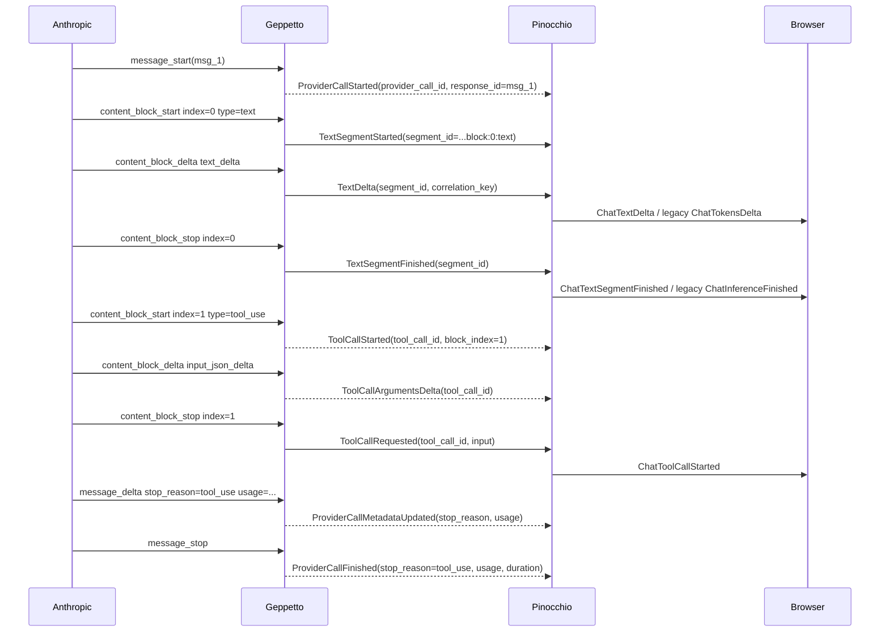

# Provider run and text segment event vocabulary design guide

## 1. Executive summary

The system currently uses names that collapse three separate lifecycles into one ambiguous word: **inference**. A user-visible chat run can include multiple provider calls. A provider call can include multiple text blocks, reasoning blocks, and tool calls. A text block can start, receive deltas, and finish independently of whether the provider call has ended. The current names `EventFinal` in Geppetto and `ChatInferenceFinished` in Pinocchio blur those boundaries. That blur caused the Claude/Haiku duplicate-message bug: an Anthropic `message_stop` event, which only closes the provider message envelope, was converted into a Geppetto `EventFinal`, which Pinocchio converted into a `ChatInferenceFinished` text row.

The clean design is to split the vocabulary into explicit lifecycles:

```text
Chat run lifecycle:        ChatRunStarted -> ChatRunFinished / ChatRunStopped
Provider call lifecycle:   ProviderCallStarted -> ProviderCallMetadataUpdated -> ProviderCallFinished
Text segment lifecycle:    TextSegmentStarted -> TextDelta -> TextSegmentFinished
Reasoning lifecycle:       ReasoningSegmentStarted -> ReasoningDelta -> ReasoningSegmentFinished
Tool lifecycle:            ToolCallStarted -> ToolCallArgumentsDelta -> ToolCallRequested/Finished -> ToolResultReady
```

The equally important part is identity. We should not rely on `metadata.Extra` heuristics to discover which provider object, text segment, or tool call a message belongs to. Each emitted event should carry a typed correlation envelope. That envelope should include stable internal IDs and provider-native IDs where available:

```text
run_id / inference_id
provider_call_id
provider_response_id
provider_item_id
content_block_index / output_index / choice_index
tool_call_id / tool_call_index
segment_id
correlation_key
parent_correlation_key
```

The recommended path is not to remove old events immediately. The first implementation should add explicit events and typed correlation fields while preserving compatibility projections. Pinocchio can continue to emit the old `ChatInferenceFinished` event name as a compatibility alias for `ChatTextSegmentFinished`, but code and docs should treat it as legacy. New code should not use provider envelope events such as Claude `message_stop`, OpenAI Responses `response.completed`, or Chat Completions EOF as text-segment finalizers.

## 2. Why this matters

The user sees a continuous assistant answer, but the runtime sees a structured stream. When that stream contains only text, it is tempting to model the world with two events: "started" and "finished." Tool calling breaks that model. The assistant may write one sentence, request a tool, wait for the host to execute the tool, then write another sentence. Reasoning streams add another independent axis: the model may emit internal or summarized reasoning alongside visible assistant text.

The old vocabulary makes the first text/tool boundary look like the end of the inference, even though it is only the end of a text segment. It also makes provider stop events look like text stop events, even though provider stop events are often metadata markers. Once those concepts share an event name, downstream consumers are forced to guess. Guessing shows up as code that says "if there is no active text segment, create one" or "if this event has a stop reason, maybe it is final text." That is the path to duplicate rows, missing metadata, and fragile SQLite debugging.

The new design makes the event stream self-describing. A text segment event is always about transcript text. A provider call event is always about provider API lifecycle and result metadata. A chat run event is always about the user-visible turn. Correlation IDs make the relationship between those layers explicit instead of implicit.

## 3. Current-state architecture

### 3.1 Geppetto has a small event vocabulary with overloaded names

The current Geppetto event constants live in `pkg/events/chat-events.go`. The file itself contains the warning sign: `EventTypeStart` through `EventTypeFinal` are commented as text-completion events, not whole-run events. The relevant constants are captured in `sources/geppetto-events-chat-event-types.lines.txt`.

Current text-related event structs live in `pkg/events/text_events.go`, captured in `sources/geppetto-events-text-events.lines.txt`:

- `EventPartialCompletionStart` uses event type `start`.
- `EventPartialCompletion` carries `Delta` and cumulative `Completion`.
- `EventFinal` carries final `Text`.
- `EventInterrupt` and `EventError` carry stopped/error information.
- `EventThinkingPartial` exists for reasoning deltas.

This vocabulary is compact, but it lacks the nouns we need:

```text
TextSegmentStarted
TextSegmentFinished
ProviderCallStarted
ProviderCallFinished
RunFinished
```

As a result, `EventFinal` is used as a final text segment in some code paths and as provider-call finalization in others.

### 3.2 Geppetto metadata already has run IDs but provider correlation is mostly Extra-based

`events.EventMetadata` already carries useful runtime-level identifiers:

```go
SessionID
InferenceID
TurnID
ID
Extra
```

Those fields are defined in `pkg/events/chat-events.go` and captured in `sources/geppetto-events-chat-event-types.lines.txt`. The problem is not that IDs are absent. The problem is that provider-specific identity is mostly passed through `Extra` maps. For OpenAI-compatible Chat Completions and Responses, there is good normalization code, but it still flows through map keys such as:

```text
provider
response_id
item_id
choice_index
stream_kind
correlation_key
tool_call_id
tool_call_index
```

Pinocchio then extracts those keys by name. That has worked, but it is not a durable API. Identity should be typed on the event payloads or a typed event correlation envelope, not inferred from generic metadata.

### 3.3 Geppetto observability already knows many correlation fields

The observability record structure in `pkg/observability/observer.go`, captured in `sources/geppetto-observability-record.lines.txt`, already has the right shape for many fields:

```go
Provider
Model
SessionID
InferenceID
TurnID
MessageID
ResponseID
ItemID
OutputIndex
SummaryIndex
ChoiceIndex
StreamKind
CorrelationKey
ToolCallID
ToolCallIndex
```

This is strong evidence that the system knows what identities matter. The design should promote those identities from trace metadata into first-class event correlation data.

### 3.4 OpenAI Chat Completions already builds normalized correlation keys

`pkg/steps/ai/openai/observability.go`, captured in `sources/geppetto-openai-chat-observability.lines.txt`, constructs normalized keys for OpenAI-compatible Chat Completions. The current form is roughly:

```text
<provider>-chat:<response_id>:choice:<choice_index>:reasoning
<provider>-chat:<response_id>:choice:<choice_index>:content
<provider>-chat:<response_id>:choice:<choice_index>:tool:<tool_call_id>
<provider>-chat:<response_id>:choice:<choice_index>:tool-index:<tool_call_index>
```

That is the right idea. Chat Completions lacks provider-native item IDs for every stream component, so the normalized key is essential. The important lesson is that this key should be carried by explicit events, not smuggled through a map.

### 3.5 OpenAI Responses already has item-level provider identity

`pkg/steps/ai/openai_responses/observability.go`, captured in `sources/geppetto-openai-responses-observability.lines.txt`, extracts:

```text
response_id
item_id
output_index
summary_index
correlation_key
```

The Responses API is structurally closer to the new model because it already exposes typed output items. A `response.output_text.delta` belongs to a message item. A `response.function_call_arguments.delta` belongs to a function-call item. A `response.completed` belongs to the provider response envelope. The new event vocabulary should mirror that distinction.

### 3.6 Claude currently exposes the bug most clearly

Claude streaming has provider message events and content block events:

```text
message_start
content_block_start text
content_block_delta text_delta
content_block_stop text
content_block_start tool_use
content_block_delta input_json_delta
content_block_stop tool_use
message_delta stop_reason=tool_use usage=...
message_stop
```

`pkg/steps/ai/claude/content-block-merger.go`, captured in `sources/geppetto-claude-content-block-merger.lines.txt`, is where those events are converted to Geppetto events. After the recent bug fix, `message_delta` updates metadata and emits no transcript event; `message_stop` after `tool_use` also emits no transcript event. That is directionally correct, but the implementation still lacks explicit provider-call and text-segment events.

The current text block stop path emits an empty-delta partial completion for a text block. That tells downstream consumers the cumulative text has stabilized, but it is not a clean "text segment finished" event. The current tool-use block stop path emits `EventToolCall`, which Pinocchio treats as a transcript boundary and uses to close any active text segment.

### 3.7 Pinocchio maps Geppetto EventFinal to ChatInferenceFinished

The critical transformation happens in `../pinocchio/pkg/chatapp/runtime_sink.go`, captured in `sources/pinocchio-runtime-sink.lines.txt`. The direct path is:

```text
Geppetto EventFinal
  -> runtimeEventSink.PublishEvent
  -> EventInferenceFinished
  -> ChatMessageUpdate status=finished, segment_type=text
```

The dangerous line is conceptually:

```go
textMessageID, segment := s.ensureTextSegmentID()
```

`ensureTextSegmentID()` creates a text segment if none is active. That is correct for non-streaming text-only final answers. It is wrong for lifecycle-only provider finalization. This is why Claude `message_stop` could manufacture `chat-msg-1:text:2` after a tool call.

### 3.8 Pinocchio also closes text on transcript boundaries

The same runtime sink has a second path that emits `EventInferenceFinished` without receiving `EventFinal`. Tool-related events are transcript boundaries. If text is active and a tool call arrives, Pinocchio calls `finishTextSegment()` and publishes a finished text update before forwarding the tool event to the tool plugin. This behavior is correct in the old model because tool rows must appear after the preceding assistant text row.

The new design should keep the idea but remove the guesswork. Instead of "tool events imply a text finish if active," Geppetto should be able to emit `TextSegmentFinished` before `ToolCallStarted` when the provider stream says the text content block stopped. Pinocchio can keep the boundary fallback for compatibility but should not depend on it for new providers.

### 3.9 Pinocchio protobufs already carry some provider correlation fields

`../pinocchio/proto/pinocchio/chatapp/v1/chat.proto`, captured in `sources/pinocchio-chat-proto-correlation-fields.lines.txt`, defines correlation fields on several messages:

- `ChatMessageUpdate` carries `provider`, `response_id`, `choice_index`, `stream_kind`, and `correlation_key`.
- `ReasoningUpdate` carries `provider`, `response_id`, `item_id`, `output_index`, `summary_index`, `choice_index`, `stream_kind`, and `correlation_key`.
- `ToolCallUpdate` and `ToolResultUpdate` carry `provider`, `response_id`, `choice_index`, `stream_kind`, `correlation_key`, and `tool_call_index`, plus the business-level `tool_call_id`.

This is good but incomplete. The next vocabulary should include IDs for run, provider call, segment, and parent relationships explicitly. It should not require reconstructing those relationships from message ID suffixes or metadata maps.

## 4. Problem statement and scope

The problem is not only a Claude bug. The Claude bug is a symptom of a larger vocabulary and identity problem.

The current system lacks first-class event concepts for:

1. **Provider calls.** A single user-visible run can call the provider multiple times during a tool loop. We need a stable `provider_call_id` and call index for each provider API call.
2. **Text segments.** A visible assistant text row is a segment, not an inference. We need explicit segment started/delta/finished events.
3. **Provider envelope metadata.** Stop reason, usage, duration, response ID, and finish class belong to provider-call lifecycle events or inference-result records, not to text finalization.
4. **Typed correlation.** Provider identity should not be extracted from generic maps when it is needed for routing, projection, or debugging.
5. **Compatibility aliases.** Old clients use `ChatInferenceStarted`, `ChatTokensDelta`, and `ChatInferenceFinished`. We need a migration path that does not break existing UI and SQLite tooling.

The scope of this ticket is design and implementation guidance for the clean vocabulary. The ticket does not itself implement the entire migration. It should give a future engineer a clear map of the changes and the IDs every message must carry.

## 5. Design principles

### Principle 1: Provider envelope events are not transcript events

Provider envelope events include:

```text
Claude message_delta/message_stop
OpenAI Responses response.completed
OpenAI Chat Completions stream EOF / final usage chunk
```

These events are allowed to update provider-call metadata. They are not allowed to create or finish a text segment.

### Principle 2: Text segment lifecycle must be explicit

A text segment starts because the provider started a text item/block or because a non-streaming final text response is being adapted. A text segment finishes because the provider text item/block ended or because the adapter creates a compatibility segment for non-streaming text. Tool calls do not have to guess whether text is active if the provider adapter emitted a `TextSegmentFinished` event at the correct time.

### Principle 3: Correlation is typed and repeated at every layer

Every event that affects browser-visible state should carry a typed correlation envelope. Consumers should be able to join:

```text
provider object -> Geppetto event -> Pinocchio backend event -> Sessionstream transport -> frontend frame -> timeline entity
```

without parsing human-readable message IDs or peeking into opaque metadata maps.

### Principle 4: Internal IDs and provider IDs serve different purposes

Provider-native IDs are valuable but inconsistent. OpenAI Responses has item IDs. Chat Completions often has only response IDs, choice indexes, and tool-call indexes. Claude has message IDs and content block indexes; tool-use blocks also have tool IDs. Therefore each event should carry both:

- provider-native IDs when available;
- normalized internal IDs that are always present.

### Principle 5: Compatibility should be explicit

If Pinocchio continues to emit `ChatInferenceFinished`, it should be documented and implemented as a compatibility alias for `ChatTextSegmentFinished`, not as the conceptual event name.

## 6. Proposed vocabulary

### 6.1 Geppetto event families

The new Geppetto vocabulary should separate provider lifecycle, transcript lifecycle, and execution lifecycle.

| Family | Event name | Meaning | Renders transcript? |
|---|---|---|---|
| Provider call | `ProviderCallStarted` | A provider API call/message/response started. | No |
| Provider call | `ProviderCallMetadataUpdated` | Stop reason, usage, response IDs, or provider-call metadata changed. | No |
| Provider call | `ProviderCallFinished` | The provider API call/message/response envelope ended. | No |
| Text | `TextSegmentStarted` | A visible assistant text segment began. | Usually yes, initializes row |
| Text | `TextDelta` | New visible assistant text arrived. | Yes |
| Text | `TextSegmentFinished` | The visible assistant text segment ended. | Yes |
| Reasoning | `ReasoningSegmentStarted` | A reasoning/summary segment began. | Maybe, depending on UI settings |
| Reasoning | `ReasoningDelta` | Reasoning text arrived. | Maybe |
| Reasoning | `ReasoningSegmentFinished` | Reasoning segment ended. | Maybe |
| Tool | `ToolCallStarted` | Provider started/identified a tool call. | Yes, tool row |
| Tool | `ToolCallArgumentsDelta` | Tool call arguments streamed. | Optional, useful for debugging/live UI |
| Tool | `ToolCallRequested` | Tool call is complete and ready for host execution. | Yes |
| Tool | `ToolExecutionStarted` | Host began executing the tool. | Yes |
| Tool | `ToolResultReady` | Host produced a result. | Yes |
| Run | `RunStarted` | Optional Geppetto run-level start if Geppetto owns a whole run. | No/summary |
| Run | `RunFinished` | Optional run-level finish if Geppetto owns a whole run. | No/summary |

The old events can remain during migration:

| Legacy event | Compatibility interpretation |
|---|---|
| `EventPartialCompletion` | Alias/source for `TextDelta`. |
| `EventFinal` | Deprecated; temporary alias for `TextSegmentFinished` only. |
| `EventStart` | Deprecated; ambiguous between provider call and text stream start. |
| `ChatInferenceFinished` | Pinocchio compatibility alias for `ChatTextSegmentFinished`. |

### 6.2 Correlation envelope API sketch

The core API addition should be a typed correlation struct. Names can be refined during implementation, but the fields should be explicit.

```go
package events

type Correlation struct {
    // Application/runtime scope.
    SessionID   string `json:"session_id,omitempty"`
    RunID       string `json:"run_id,omitempty"`       // Stable across one user-visible assistant run.
    InferenceID string `json:"inference_id,omitempty"` // Existing ID; may alias RunID initially.
    TurnID      string `json:"turn_id,omitempty"`

    // Provider-call scope.
    ProviderCallID    string `json:"provider_call_id,omitempty"`    // Internal stable ID per API call.
    ProviderCallIndex int32  `json:"provider_call_index,omitempty"` // 1-based or 0-based; choose and document.
    Provider          string `json:"provider,omitempty"`
    Model             string `json:"model,omitempty"`
    ResponseID        string `json:"response_id,omitempty"` // Provider-native response/message ID.

    // Provider item/block scope.
    ItemID            string `json:"item_id,omitempty"` // Responses item ID or provider-native block/item ID.
    OutputIndex       *int32 `json:"output_index,omitempty"`
    SummaryIndex      *int32 `json:"summary_index,omitempty"`
    ChoiceIndex       *int32 `json:"choice_index,omitempty"`
    ContentBlockIndex *int32 `json:"content_block_index,omitempty"` // Claude.

    // Transcript segment scope.
    SegmentID      string `json:"segment_id,omitempty"`
    SegmentIndex   int32  `json:"segment_index,omitempty"`
    SegmentType    string `json:"segment_type,omitempty"` // text, reasoning, tool_call, tool_result.
    StreamKind     string `json:"stream_kind,omitempty"`  // provider-normalized stream kind.

    // Tool scope.
    ToolCallID    string `json:"tool_call_id,omitempty"`
    ToolCallIndex *int32 `json:"tool_call_index,omitempty"`

    // Normalized join keys.
    CorrelationKey       string `json:"correlation_key,omitempty"`
    ParentCorrelationKey string `json:"parent_correlation_key,omitempty"`
}
```

Important rules:

- `ProviderCallID` is always set by Geppetto for provider-originated events, even if the provider has no response ID yet.
- `CorrelationKey` is always set for provider-originated text, reasoning, and tool streams.
- `SegmentID` is always set for segment lifecycle events.
- `ToolCallID` remains the business/tool identity used to route tool results. It is not a substitute for `ProviderCallID` or `SegmentID`.
- `metadata.Extra` may carry provider-specific debugging details, but routing and joins must not depend on it.

### 6.3 Text event API sketch

```go
type EventTextSegmentStarted struct {
    EventImpl
    Correlation Correlation `json:"correlation"`
    Text         string      `json:"text,omitempty"` // optional initial text, usually empty
}

type EventTextDelta struct {
    EventImpl
    Correlation Correlation `json:"correlation"`
    Delta       string      `json:"delta"`
    Text        string      `json:"text"` // cumulative text for compatibility/UI
    Sequence    int64       `json:"sequence,omitempty"`
}

type EventTextSegmentFinished struct {
    EventImpl
    Correlation Correlation `json:"correlation"`
    Text        string      `json:"text"`
    FinishReason string     `json:"finish_reason,omitempty"` // text_block_stop, nonstreaming_final, interrupted, etc.
}
```

`EventTextSegmentFinished` is the event that should become a Pinocchio `ChatTextSegmentFinished` backend event. During migration, Pinocchio may also emit the legacy event name `ChatInferenceFinished` for old consumers.

### 6.4 Provider-call event API sketch

```go
type EventProviderCallStarted struct {
    EventImpl
    Correlation Correlation `json:"correlation"`
    RequestID   string      `json:"request_id,omitempty"`
}

type EventProviderCallMetadataUpdated struct {
    EventImpl
    Correlation  Correlation `json:"correlation"`
    StopReason   string      `json:"stop_reason,omitempty"`
    StopSequence string      `json:"stop_sequence,omitempty"`
    Usage        *Usage      `json:"usage,omitempty"`
}

type EventProviderCallFinished struct {
    EventImpl
    Correlation Correlation `json:"correlation"`
    StopReason  string      `json:"stop_reason,omitempty"`
    FinishClass string      `json:"finish_class,omitempty"`
    Usage       *Usage      `json:"usage,omitempty"`
    DurationMs  *int64      `json:"duration_ms,omitempty"`
    HasToolCalls bool       `json:"has_tool_calls,omitempty"`
}
```

These events should be non-transcript events. They are for observability, durable inference metadata, and orchestration state. A frontend may display them in a debug pane, but they do not create assistant text rows.

### 6.5 Tool event API sketch

```go
type EventToolCallStarted struct {
    EventImpl
    Correlation Correlation `json:"correlation"`
    ToolCallID  string      `json:"tool_call_id"`
    ToolName    string      `json:"tool_name,omitempty"`
}

type EventToolCallArgumentsDelta struct {
    EventImpl
    Correlation Correlation `json:"correlation"`
    ToolCallID  string      `json:"tool_call_id"`
    Delta       string      `json:"delta"`
    Arguments   string      `json:"arguments"` // cumulative JSON argument buffer
    Sequence    int64       `json:"sequence,omitempty"`
}

type EventToolCallRequested struct {
    EventImpl
    Correlation Correlation `json:"correlation"`
    ToolCallID  string      `json:"tool_call_id"`
    ToolName    string      `json:"tool_name"`
    Input       string      `json:"input"`
}
```

The existing `EventToolCall` can be treated as `ToolCallRequested` during migration.

## 7. Correlation key design by provider

### 7.1 Global key rules

A normalized `correlation_key` should be stable, readable, and specific enough to join all stream fragments for the same logical object.

Rules:

1. Prefix with provider family: `claude`, `openai-chat`, `openai-responses`, or the OpenAI-compatible provider name.
2. Include provider call identity: `provider_call_id` or provider response ID.
3. Include item/block/choice identity for the stream object.
4. Include stream kind: `text`, `reasoning`, `reasoning_summary`, `tool_call`, `tool_args`, `provider_call`.
5. Include provider-native tool IDs when available; otherwise include a tool index.

### 7.2 Claude correlation keys

Claude has a message ID on `message_start`, content block indexes on block events, and tool-use IDs for tool blocks. Later events may not repeat the message ID, so the merger must copy the active `ProviderCallID` and `ResponseID` into correlation for subsequent events.

Recommended keys:

```text
claude:<provider_call_id>:provider-call
claude:<provider_call_id>:block:<content_block_index>:text
claude:<provider_call_id>:block:<content_block_index>:tool:<tool_call_id>
claude:<provider_call_id>:block:<content_block_index>:tool-index:<tool_call_index>
```

If `message.id` is known, use it as `response_id` and optionally in `provider_call_id` construction:

```text
provider_call_id = claude:msg_01ABC:call:1
```

If the provider message ID is not known yet, generate:

```text
provider_call_id = <inference_id>:provider-call:<call_index>
```

and attach `response_id` later when `message_start` arrives.

Claude text event fields should be:

| Event | Required correlation fields |
|---|---|
| `ProviderCallStarted` | `session_id`, `run_id`/`inference_id`, `turn_id`, `provider_call_id`, `provider_call_index`, `provider=claude`, `model`, `response_id` if known, `correlation_key=claude:<provider_call_id>:provider-call` |
| `TextSegmentStarted` | all provider-call fields, `content_block_index`, `segment_id`, `segment_index`, `segment_type=text`, `stream_kind=text`, `correlation_key=claude:<provider_call_id>:block:<index>:text` |
| `TextDelta` | same `segment_id` and `correlation_key`, plus sequence |
| `TextSegmentFinished` | same `segment_id` and `correlation_key` |
| `ToolCallStarted/Requested` | provider-call fields, `content_block_index`, `tool_call_id`, `tool_call_index`, `stream_kind=tool_call`, tool correlation key |
| `ProviderCallMetadataUpdated` | provider-call fields, stop reason/usage; no text segment fields required |
| `ProviderCallFinished` | provider-call fields, stop reason/usage/duration/finish class |

### 7.3 OpenAI Responses correlation keys

OpenAI Responses has strong provider-native item IDs. Recommended keys:

```text
openai-responses:<response_id>:item:<item_id>
openai-responses:<response_id>:output:<output_index>:text
openai-responses:<response_id>:item:<item_id>:summary:<summary_index>
openai-responses:<response_id>:item:<item_id>:tool
```

Prefer provider `item_id` when present. Use `output_index` as a fallback only when the provider event lacks `item_id`. Do not invent `item_id` for Chat Completions; use normalized keys there.

### 7.4 OpenAI-compatible Chat Completions correlation keys

Chat Completions usually lacks per-item IDs. Continue the current normalized shape:

```text
<provider>-chat:<response_id>:choice:<choice_index>:content
<provider>-chat:<response_id>:choice:<choice_index>:reasoning
<provider>-chat:<response_id>:choice:<choice_index>:tool:<tool_call_id>
<provider>-chat:<response_id>:choice:<choice_index>:tool-index:<tool_call_index>
```

The important addition is `provider_call_id`. Response IDs can be absent on early chunks or provider variants. A generated provider call ID gives every event a stable parent before response ID is available.

### 7.5 Why `metadata.Extra` is not enough

`metadata.Extra` is useful for provider-specific data, but it is not a contract. It is a `map[string]interface{}` with no schema, no compile-time guarantees, and no protobuf parity. The current Pinocchio runtime sink extracts keys like `response_id`, `choice_index`, `stream_kind`, and `correlation_key` from metadata maps. That is workable as a transition layer, but it should not be the primary design.

New events should expose correlation through typed fields. The migration adapter can still populate `metadata.Extra` for old consumers.

## 8. Correct provider mappings

### 8.1 Claude mapping



The key point: `message_stop` emits no text event.

### 8.2 OpenAI Responses mapping

```text
response.created / first event
  -> ProviderCallStarted

response.output_item.added type=message
  -> TextSegmentStarted or ReasoningSegmentStarted depending item/content type

response.output_text.delta
  -> TextDelta

response.output_item.done type=message
  -> TextSegmentFinished if the text item is complete

response.output_item.done type=function_call
  -> ToolCallRequested

response.completed
  -> ProviderCallFinished
  -> no text final unless a text item remained unclosed and the adapter explicitly closes it
```

### 8.3 OpenAI Chat Completions mapping

Chat Completions is less structured, but the same concepts apply.

```text
first chunk
  -> ProviderCallStarted

delta.content first non-empty content for a stream key
  -> TextSegmentStarted

delta.content
  -> TextDelta

delta.reasoning first non-empty reasoning for a stream key
  -> ReasoningSegmentStarted

delta.reasoning
  -> ReasoningDelta

delta.tool_calls[index].function.arguments
  -> ToolCallStarted / ToolCallArgumentsDelta

finish_reason=tool_calls
  -> TextSegmentFinished for active text streams, if not already closed
  -> ToolCallRequested for completed tool calls
  -> ProviderCallFinished(stop_reason=tool_calls)
  -> no extra text final

finish_reason=stop
  -> TextSegmentFinished for active text stream
  -> ProviderCallFinished(stop_reason=stop)
```

For Chat Completions, the provider adapter may need to synthesize segment started/finished based on deltas and finish reasons because the provider stream does not expose content block start/stop events.

## 9. Pinocchio chatapp vocabulary

### 9.1 New backend events

Pinocchio should add explicit backend event names:

```text
ChatRunStarted
ChatRunFinished
ChatRunStopped
ChatProviderCallStarted
ChatProviderCallMetadataUpdated
ChatProviderCallFinished
ChatTextSegmentStarted
ChatTextDelta
ChatTextSegmentFinished
ChatReasoningSegmentStarted
ChatReasoningDelta
ChatReasoningSegmentFinished
ChatToolCallStarted
ChatToolCallArgumentsDelta
ChatToolCallRequested
ChatToolResultReady
ChatToolCallFinished
```

Legacy names can remain:

```text
ChatInferenceStarted  -> compatibility alias for ChatRunStarted
ChatTokensDelta       -> compatibility alias for ChatTextDelta
ChatInferenceFinished -> compatibility alias for ChatTextSegmentFinished
ChatInferenceStopped  -> compatibility alias for ChatRunStopped or ChatTextSegmentStopped depending context
```

### 9.2 Protobuf payload additions

The current `ChatMessageUpdate` already has message text and several provider fields. The new design should add a common correlation message rather than repeatedly hand-copying fields across payload types.

```proto
message CorrelationInfo {
  string session_id = 1;
  string run_id = 2;
  string inference_id = 3;
  string turn_id = 4;

  string provider_call_id = 5;
  int32 provider_call_index = 6;
  string provider = 7;
  string model = 8;
  string response_id = 9;

  string item_id = 10;
  optional int32 output_index = 11;
  optional int32 summary_index = 12;
  optional int32 choice_index = 13;
  optional int32 content_block_index = 14;

  string segment_id = 15;
  int32 segment_index = 16;
  string segment_type = 17;
  string stream_kind = 18;

  string tool_call_id = 19;
  optional int32 tool_call_index = 20;

  string correlation_key = 21;
  string parent_correlation_key = 22;
}
```

Then define new event payloads:

```proto
message ChatTextSegmentStarted {
  CorrelationInfo correlation = 1;
  string message_id = 2;
  string parent_message_id = 3;
  string role = 4;
}

message ChatTextDelta {
  CorrelationInfo correlation = 1;
  string message_id = 2;
  string parent_message_id = 3;
  string chunk = 4;
  string text = 5;
  int64 sequence = 6;
}

message ChatTextSegmentFinished {
  CorrelationInfo correlation = 1;
  string message_id = 2;
  string parent_message_id = 3;
  string text = 4;
  string finish_reason = 5;
}

message ChatProviderCallFinished {
  CorrelationInfo correlation = 1;
  string stop_reason = 2;
  string finish_class = 3;
  Usage usage = 4;
  optional int64 duration_ms = 5;
  bool has_tool_calls = 6;
}
```

We can either add `CorrelationInfo` beside existing fields or first embed it while preserving existing scalar fields for compatibility. During migration, duplicate fields are acceptable. The important rule is that new code reads `correlation` first.

### 9.3 Runtime sink behavior

Pinocchio's runtime sink should become simpler with explicit events:

```go
func (s *runtimeEventSink) PublishEvent(event gepevents.Event) error {
    switch ev := event.(type) {
    case *events.EventTextSegmentStarted:
        return s.publishTextSegmentStarted(ev)

    case *events.EventTextDelta:
        return s.publishTextDelta(ev)

    case *events.EventTextSegmentFinished:
        return s.publishTextSegmentFinished(ev)

    case *events.EventProviderCallStarted:
        return s.publishProviderCallStarted(ev)

    case *events.EventProviderCallMetadataUpdated:
        return s.publishProviderCallMetadataUpdated(ev)

    case *events.EventProviderCallFinished:
        return s.publishProviderCallFinished(ev)

    case *events.EventFinal:
        return s.publishLegacyFinalAsTextSegmentFinished(ev)

    default:
        return s.engine.handleFeatureRuntimeEvent(...)
    }
}
```

The legacy `EventFinal` path should be guarded:

```go
func (s *runtimeEventSink) publishLegacyFinalAsTextSegmentFinished(ev *events.EventFinal) error {
    if !s.hasActiveText() && strings.TrimSpace(ev.Text) == "" {
        // lifecycle-only final; ignore as transcript
        return nil
    }
    // Existing compatibility behavior.
}
```

New explicit provider-call finished events must never call `ensureTextSegmentID()`.

## 10. SQLite and observability design

The debug SQLite export should make correlation visible without reconstructing state from string suffixes.

### 10.1 New tables

Add a provider-call result table:

```sql
create table geppetto_inference_results (
  id integer primary key,
  session_id text,
  run_id text,
  inference_id text,
  turn_id text,
  provider_call_id text,
  provider_call_index integer,
  provider text,
  model text,
  response_id text,
  stop_reason text,
  finish_class text,
  truncated integer,
  has_tool_calls integer,
  input_tokens integer,
  output_tokens integer,
  cached_tokens integer,
  cache_creation_input_tokens integer,
  cache_read_input_tokens integer,
  duration_ms integer,
  correlation_key text,
  metadata_json text
);
```

Add a segment table:

```sql
create table geppetto_segments (
  id integer primary key,
  session_id text,
  run_id text,
  inference_id text,
  turn_id text,
  provider_call_id text,
  segment_id text,
  segment_index integer,
  segment_type text,
  stream_kind text,
  provider text,
  model text,
  response_id text,
  item_id text,
  output_index integer,
  summary_index integer,
  choice_index integer,
  content_block_index integer,
  tool_call_id text,
  tool_call_index integer,
  correlation_key text,
  parent_correlation_key text,
  status text,
  text_len integer,
  started_record_id integer,
  finished_record_id integer
);
```

### 10.2 Verification queries

For Claude tool-use metadata:

```sql
select
  provider_call_index,
  provider,
  model,
  response_id,
  stop_reason,
  finish_class,
  input_tokens,
  output_tokens,
  cache_creation_input_tokens,
  cache_read_input_tokens,
  duration_ms
from geppetto_inference_results
where provider = 'claude'
order by provider_call_index;
```

Expected for a tool loop:

```text
provider_call_index  provider  stop_reason  finish_class          input_tokens  output_tokens
1                    claude    tool_use     tool_calls_pending    ...           ...
2                    claude    end_turn     completed             ...           ...
```

For text duplication:

```sql
select
  segment_id,
  provider_call_id,
  segment_index,
  stream_kind,
  correlation_key,
  status,
  text_len
from geppetto_segments
where segment_type = 'text'
order by started_record_id;
```

Expected:

```text
One row per actual provider text block or synthesized non-streaming text segment.
No row appears merely because message_stop happened.
```

## 11. Implementation plan

### Phase 1: Add typed correlation and new Geppetto events

Files:

```text
pkg/events/chat-events.go
pkg/events/text_events.go
pkg/events/provider_call_events.go   # new
pkg/events/correlation.go            # new
pkg/events/tool_events.go            # existing/new split as needed
```

Tasks:

1. Add `events.Correlation`.
2. Add `EventTextSegmentStarted`, `EventTextDelta`, `EventTextSegmentFinished`.
3. Add `EventProviderCallStarted`, `EventProviderCallMetadataUpdated`, `EventProviderCallFinished`.
4. Add compatibility helpers that can convert `EventPartialCompletion` and `EventFinal` into the new text events.
5. Add tests for JSON serialization and correlation preservation.

### Phase 2: Update Claude first

Files:

```text
pkg/steps/ai/claude/content-block-merger.go
pkg/steps/ai/claude/engine_claude.go
pkg/steps/ai/claude/content-block-merger_test.go
pkg/steps/ai/claude/observability_test.go
```

Claude is the best first provider because its event model naturally separates message envelopes from content blocks.

Pseudocode:

```go
case MessageStartType:
    call = newProviderCall(event.Message.ID, model)
    emit ProviderCallStarted(call.Correlation())

case ContentBlockStartType when text:
    seg = newTextSegment(call, event.Index)
    emit TextSegmentStarted(seg.Correlation())

case ContentBlockDeltaType when text_delta:
    seg.Append(delta)
    emit TextDelta(seg.Correlation(), delta, seg.Text())

case ContentBlockStopType when text:
    emit TextSegmentFinished(seg.Correlation(), seg.Text())

case ContentBlockStartType when tool_use:
    tool = newToolCall(call, event.Index, block.ID)
    emit ToolCallStarted(tool.Correlation())

case ContentBlockDeltaType when input_json_delta:
    tool.Append(delta)
    emit ToolCallArgumentsDelta(tool.Correlation(), delta, tool.Input()) // optional in UI

case ContentBlockStopType when tool_use:
    emit ToolCallRequested(tool.Correlation(), tool.ID, tool.Name, tool.Input())

case MessageDeltaType:
    call.UpdateStopReasonUsage(event)
    emit ProviderCallMetadataUpdated(call.Correlation(), usage, stopReason)

case MessageStopType:
    call.DurationMs = time.Since(start)
    emit ProviderCallFinished(call.Correlation(), stopReason, usage, duration)
```

No `message_stop` branch emits a text event.

### Phase 3: Update Pinocchio protobufs and runtime sink

Files:

```text
../pinocchio/proto/pinocchio/chatapp/v1/chat.proto
../pinocchio/pkg/chatapp/runtime_sink.go
../pinocchio/pkg/chatapp/runtime_inference.go
../pinocchio/pkg/chatapp/projections.go
../pinocchio/pkg/chatapp/plugins/reasoning.go
../pinocchio/pkg/chatapp/plugins/toolcall.go
```

Tasks:

1. Add `CorrelationInfo` message.
2. Add new text segment and provider-call payloads.
3. Regenerate Go and TypeScript protobufs.
4. Teach `runtimeEventSink` to consume new Geppetto events.
5. Keep legacy event names as projections for old UI code.
6. Add a defensive guard for legacy `EventFinal` with no active text and empty text.

### Phase 4: Update OpenAI Responses and Chat Completions

Files:

```text
pkg/steps/ai/openai_responses/streaming.go
pkg/steps/ai/openai_responses/observability.go
pkg/steps/ai/openai/engine_openai.go
pkg/steps/ai/openai/observability.go
```

Tasks:

1. Introduce provider-call IDs for each API request.
2. Emit provider-call lifecycle events.
3. Emit text segment events for content streams.
4. Emit reasoning segment events for reasoning streams.
5. Emit tool-call argument deltas and requested events.
6. Ensure provider final/EOF events only emit provider-call finished, not text finalization.

### Phase 5: Update SQLite debug export

Files:

```text
../pinocchio/cmd/web-chat/app/debug_reconcile_schema.go
../pinocchio/cmd/web-chat/app/debug_reconcile_geppetto.go
../pinocchio/cmd/web-chat/app/debug_reconcile_views.go
```

Tasks:

1. Add `geppetto_inference_results`.
2. Add `geppetto_segments`.
3. Populate from new observability records/events.
4. Add views that join provider events to Geppetto events, backend events, frontend frames, and timeline entities by `correlation_key` and `segment_id`.

### Phase 6: Update CoinVault frontend and trace browser

Files:

```text
../2026-03-16--gec-rag/web/src/ws/*
../2026-03-16--gec-rag/web/src/pb/external/pinocchio/chat_pb.ts
../2026-03-16--gec-rag/ttmp/.../SQLITE-TRACE-VERBS.../scripts/serve/trace_browser_app.js
```

Tasks:

1. Mirror regenerated Pinocchio chatapp TypeScript protobufs.
2. Preserve `CorrelationInfo` in frontend timeline entities.
3. Add trace browser pages for provider-call results and segment lifecycles.
4. Update tests to assert correlation IDs survive parsing and projection.

## 12. Testing strategy

### 12.1 Unit tests

Geppetto:

- Claude `message_delta` emits `ProviderCallMetadataUpdated` but no text event.
- Claude `message_stop` emits `ProviderCallFinished` but no text event.
- Claude text block stop emits `TextSegmentFinished`.
- Claude tool-use block stop emits `ToolCallRequested` with `tool_call_id`, `content_block_index`, `provider_call_id`, and `correlation_key`.
- OpenAI Responses `response.completed` emits `ProviderCallFinished`, not `TextSegmentFinished`.
- Chat Completions `finish_reason=tool_calls` emits provider-call finished and tool-call requested but no duplicate text finished.

Pinocchio:

- `EventTextSegmentStarted/Delta/Finished` produce `ChatTextSegment*` payloads with `CorrelationInfo` intact.
- Legacy `EventFinal("")` with no active text emits no `ChatInferenceFinished`.
- Legacy `EventFinal("text")` still works for non-streaming compatibility.
- Provider-call events do not call `ensureTextSegmentID()`.

### 12.2 Integration tests

Use fake provider streams for:

1. Claude text-only answer.
2. Claude text -> tool_use -> message_stop.
3. Claude text -> tool_use -> tool result -> text -> end_turn.
4. OpenAI Responses message item -> function call item -> completed.
5. Chat Completions content deltas -> tool_calls finish reason.

### 12.3 Browser and SQLite tests

For a Haiku tool run, the SQLite should show:

```text
geppetto_inference_results:
  call 1 stop_reason=tool_use finish_class=tool_calls_pending
  call 2 stop_reason=end_turn finish_class=completed

geppetto_segments:
  one text segment for each actual Claude text block
  no segment created by message_stop
```

The browser should show:

```text
assistant text
_tool row_
assistant text only if the provider sent post-tool text
```

No duplicate intro text should appear after a tool row.

## 13. Migration and compatibility notes

### 13.1 Compatibility aliases

Do not remove old event names immediately. Add new events and treat old names as aliases:

```text
EventPartialCompletion -> TextDelta
EventFinal             -> TextSegmentFinished (legacy only)
ChatTokensDelta        -> ChatTextDelta
ChatInferenceFinished  -> ChatTextSegmentFinished
```

### 13.2 Deprecation comments

Add comments near old constants:

```go
// Deprecated: EventTypeFinal is a legacy text-segment finalization event.
// It does not mean provider call finished or chat run finished. New providers
// should emit EventTextSegmentFinished and EventProviderCallFinished instead.
```

### 13.3 Guard old finalization path

Even after new events exist, old providers may emit `EventFinal`. Pinocchio should guard against lifecycle-only finals:

```go
if no active text && strings.TrimSpace(ev.Text) == "" {
    return nil
}
```

This defensive guard prevents a single upstream mistake from creating a browser-visible duplicate.

## 14. Risks and alternatives

### Alternative A: Keep old events and document the meanings

This is not enough. Documentation helps, but the type system still allows a provider envelope event to be represented as `EventFinal`. The next provider integration could repeat the same mistake.

### Alternative B: Only add Pinocchio defensive guards

A guard is useful, but it treats the symptom. It does not create a place for provider-call completion, provider usage, or per-call inference results. We still need explicit provider-call events or inference-result records.

### Alternative C: Use metadata checkpoints only

Metadata checkpoints would improve debugging but not transcript correctness. They also do not replace typed correlation on events. Use them only as optional deep tracing after the main event vocabulary is in place.

### Risk: too many events

The event stream will become more verbose. That is acceptable because the events represent real concepts. We can control UI noise by projecting only user-relevant events and keeping provider-call events in debug/inference-result views.

### Risk: migration churn across repos

This change touches Geppetto, Pinocchio, CoinVault, protobuf mirrors, and SQLite tooling. The phased plan preserves compatibility and lets us validate provider by provider.

## 15. New intern checklist

If you are implementing this ticket, follow this order:

1. Read `pkg/events/chat-events.go` and `pkg/events/text_events.go` to understand current legacy event names.
2. Read `../pinocchio/pkg/chatapp/runtime_sink.go` to see how `EventFinal` becomes `ChatInferenceFinished` today.
3. Read `pkg/steps/ai/claude/content-block-merger.go` and identify which Claude provider events are envelope events versus content block events.
4. Add typed `Correlation` and new Geppetto event structs.
5. Update Claude first because its provider stream has the cleanest block/envelope separation.
6. Add Pinocchio handlers for new text segment events.
7. Preserve legacy projections until CoinVault and other clients have migrated.
8. Add SQLite tables/views before relying on browser screenshots for validation.
9. Use correlation keys in tests; do not assert by substring-matching rendered text.

## 16. References

### Geppetto

- `pkg/events/chat-events.go`
- `pkg/events/text_events.go`
- `pkg/events/log_info_events.go`
- `pkg/observability/observer.go`
- `pkg/steps/ai/claude/content-block-merger.go`
- `pkg/steps/ai/claude/engine_claude.go`
- `pkg/steps/ai/openai/engine_openai.go`
- `pkg/steps/ai/openai/observability.go`
- `pkg/steps/ai/openai_responses/streaming.go`
- `pkg/steps/ai/openai_responses/observability.go`

### Pinocchio

- `../pinocchio/proto/pinocchio/chatapp/v1/chat.proto`
- `../pinocchio/pkg/chatapp/runtime_sink.go`
- `../pinocchio/pkg/chatapp/runtime_inference.go`
- `../pinocchio/pkg/chatapp/projections.go`
- `../pinocchio/pkg/chatapp/plugins/reasoning.go`
- `../pinocchio/pkg/chatapp/plugins/toolcall.go`
- `../pinocchio/cmd/web-chat/app/debug_reconcile_schema.go`
- `../pinocchio/cmd/web-chat/app/debug_reconcile_views.go`

### Captured evidence excerpts

This ticket stores line-numbered evidence under:

```text
ttmp/2026/05/08/GP-EVENT-VOCABULARY--split-provider-run-and-text-segment-event-vocabulary/sources/
```

Use those excerpts when reviewing or discussing the design without reopening every source file.
