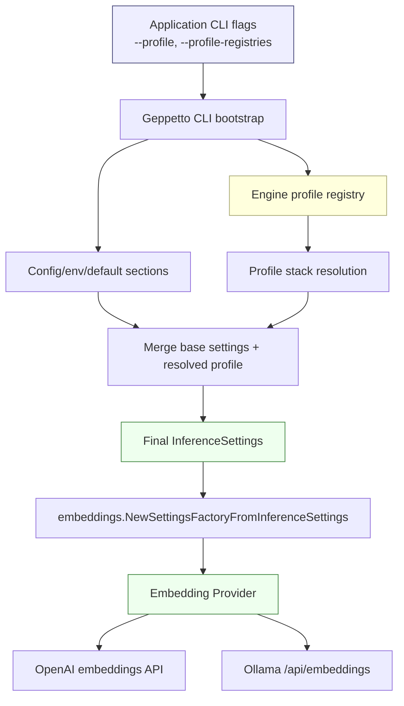
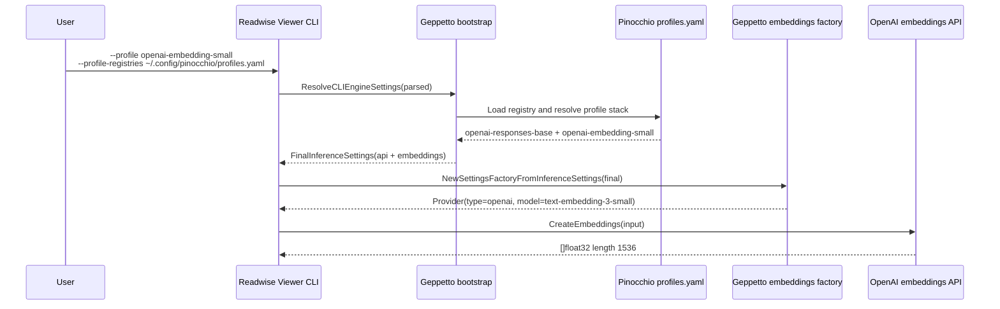

# Embedding Profiles Analysis Design and Implementation Guide

## Executive Summary

Geppetto already has two pieces that should meet in one coherent workflow: engine profiles for provider credentials and defaults, and an embeddings package that creates OpenAI or Ollama embedding providers. The failure that triggered this ticket was a Readwise Viewer vector-search command that used the existing Pinocchio profile registry and selected `gpt-5-low`, but still failed with `Error: no API key provided for OpenAI`.

The important diagnosis is that `gpt-5-low` is a chat profile, not an embedding profile. It stacks `openai-responses-base`, inherits the OpenAI API key, and configures `chat.engine: gpt-5`, but it does not configure `inference_settings.embeddings`. Embedding provider creation requires `embeddings.type`, `embeddings.engine`, and dimensions. Therefore the right design is not to teach each application how to manage keys. The right design is to add embedding profiles to the same Geppetto/Pinocchio profile registry model, where embedding profiles stack existing base profiles for credentials and add an `embeddings:` block for model-specific embedding settings.

The intended end state is that applications can run commands like:

```bash
readwise-viewer search \
  --mode vector \
  --q sqlite \
  --profile-registries ~/.config/pinocchio/profiles.yaml \
  --profile openai-embedding-small
```

or locally:

```bash
readwise-viewer search \
  --mode vector \
  --q sqlite \
  --profile-registries ~/.config/pinocchio/profiles.yaml \
  --profile ollama-nomic-embedding
```

without manually passing provider keys to Readwise Viewer. Readwise Viewer should resolve a Geppetto profile, receive final merged `InferenceSettings`, and call Geppetto's embedding provider factory. Geppetto should own the profile schema, merge semantics, defaults, documentation, and validation helpers that make this work predictably.

## Problem Statement

### Triggering command

A vector search was attempted with a profile registry and a chat profile:

```bash
./tmp/readwise-viewer-vectors search \
  --mode vector \
  --q sqlite \
  --profile-registries ~/.config/pinocchio/profiles.yaml \
  --profile gpt-5-low
```

The command failed with:

```text
Error: no API key provided for OpenAI
```

The user correctly clarified the architectural rule: provider keys should come from Geppetto/Pinocchio profiles, not from Readwise Viewer-specific flags or bespoke credential plumbing.

### Actual root cause

The selected profile is not an embedding profile. The relevant profile structure is:

```yaml
profiles:
  openai-responses-base:
    inference_settings:
      chat:
        api_type: openai-responses
      api:
        api_keys:
          openai-api-key: <redacted>

  gpt-5-low:
    stack:
      - profile_slug: openai-responses-base
    inference_settings:
      chat:
        engine: gpt-5
      inference:
        reasoning_effort: low
        reasoning_summary: concise
```

This profile is excellent for chat engine creation, but embedding provider creation is driven by `InferenceSettings.Embeddings`, not `InferenceSettings.Chat`. Without an `embeddings:` block, the embedding factory either sees defaults from base sections or incomplete configuration; if no OpenAI API key survives into the final settings, provider creation fails.

### Architectural constraint

Applications must not manage provider credentials themselves. A consumer application such as Readwise Viewer should be able to say:

1. Load the profile registry sources supplied by the user.
2. Resolve the selected profile and its stack.
3. Receive final merged `InferenceSettings`.
4. Ask Geppetto to construct an embedding provider from those settings.
5. Generate query/document embeddings.

The application may choose *which* profile to use and may validate that the resolved profile is embedding-capable, but it should not ask the user for provider keys directly.

## System Overview

### Component map



The profile system is already general enough to carry chat, model metadata, provider API keys, base URLs, inference defaults, and embeddings. The missing operational convention is to create explicit embedding profiles that stack the same credential/base profiles as chat profiles.

### Relevant repository files

| File | Why it matters |
|---|---|
| `pkg/cli/bootstrap/profile_selection.go` | Defines CLI-facing profile settings: `profile` and `profile-registries`. |
| `pkg/cli/bootstrap/profile_runtime.go` | Resolves profile settings from config/env/defaults/CLI and constructs the registry chain. |
| `pkg/cli/bootstrap/engine_settings.go` | Resolves base settings, resolves selected profile, merges them into final `InferenceSettings`. |
| `pkg/engineprofiles/types.go` | Defines `EngineProfileRegistry`, `EngineProfile`, stack references, and `InferenceSettings` payloads. |
| `pkg/engineprofiles/inference_settings_merge.go` | Defines how base and overlay `InferenceSettings` merge. This is what makes base profiles reusable. |
| `pkg/steps/ai/settings/settings-inference.go` | Defines `InferenceSettings`, including `API`, `Chat`, `Embeddings`, and YAML decoding behavior. |
| `pkg/embeddings/config/settings.go` | Defines `EmbeddingsConfig`: provider type, engine, dimensions, cache settings, API keys, base URLs. |
| `pkg/embeddings/settings_factory.go` | Converts `InferenceSettings` into `EmbeddingsConfig` and then into concrete providers. |
| `pkg/embeddings/openai.go` | OpenAI embedding provider implementation. |
| `pkg/embeddings/ollama.go` | Ollama embedding provider implementation. |
| `misc/profiles.yaml` | Example profile registry shipped with Geppetto. |
| `pkg/doc/topics/06-embeddings.md` | Current embedding package user documentation. |

### Current external profile registry

The user's active registry is:

```text
~/.config/pinocchio/profiles.yaml
```

A redacted subset for this ticket is stored at:

```text
sources/pinocchio-profiles-redacted-relevant-snippets.yaml
```

It already has reusable base profiles such as:

- `openai-responses-base`: OpenAI key and OpenAI Responses chat API type.
- `ollama-openai-base`: local Ollama OpenAI-compatible chat base URL.
- `gpt-5-low`: GPT-5 chat settings stacked on the OpenAI base.

It does not currently have dedicated embedding profiles.

## Key Data Structures and APIs

### Engine profile registry

Defined in `pkg/engineprofiles/types.go`:

```go
type EngineProfileRegistry struct {
    Slug                     RegistrySlug
    DefaultEngineProfileSlug EngineProfileSlug
    Profiles                 map[EngineProfileSlug]*EngineProfile
}

type EngineProfile struct {
    Slug              EngineProfileSlug
    DisplayName       string
    Description       string
    Stack             []EngineProfileRef
    InferenceSettings *settings.InferenceSettings
    Metadata          EngineProfileMetadata
    Extensions        map[string]any
}
```

A profile can stack another profile:

```yaml
profiles:
  child-profile:
    stack:
      - profile_slug: base-profile
    inference_settings:
      # child-specific overlay
```

The base profile carries common provider configuration. The child profile carries model- or use-case-specific configuration.

### Inference settings

Defined in `pkg/steps/ai/settings/settings-inference.go`:

```go
type InferenceSettings struct {
    API        *APISettings
    Chat       *ChatSettings
    OpenAI     *openai.Settings
    Client     *ClientSettings
    Claude     *claude.Settings
    Gemini     *gemini.Settings
    Ollama     *ollama.Settings
    Embeddings *config.EmbeddingsConfig
    Inference  *engine.InferenceConfig
    ModelInfo  *ModelInfo
}
```

The important sections for embeddings are:

```yaml
inference_settings:
  api:
    api_keys:
      openai-api-key: ...
    base_urls:
      ollama-base-url: http://localhost:11434
  embeddings:
    type: openai
    engine: text-embedding-3-small
    dimensions: 1536
```

### Embeddings config

Defined in `pkg/embeddings/config/settings.go`:

```go
type EmbeddingsConfig struct {
    Type            string            `glazed:"embeddings-type"`
    Engine          string            `glazed:"embeddings-engine"`
    Dimensions      int               `glazed:"embeddings-dimensions"`
    APIKeys         map[string]string `yaml:"api_keys,omitempty" glazed:"*-api-key"`
    BaseURLs        map[string]string `yaml:"base_urls,omitempty" glazed:"*-base-url"`
    CacheType       string            `glazed:"embeddings-cache-type"`
    CacheMaxSize    int64             `glazed:"embeddings-cache-max-size"`
    CacheMaxEntries int               `glazed:"embeddings-cache-max-entries"`
    CacheDirectory  string            `glazed:"embeddings-cache-directory"`
}
```

The CLI/default flag section is defined in `pkg/embeddings/config/flags/embeddings.yaml`.

### Embedding provider factory

Defined in `pkg/embeddings/settings_factory.go`:

```go
factory := embeddings.NewSettingsFactoryFromInferenceSettings(resolved.FinalInferenceSettings)
provider, err := factory.NewProvider()
vector, err := provider.GenerateEmbedding(ctx, text)
vectors, err := provider.GenerateBatchEmbeddings(ctx, texts)
```

`NewSettingsFactoryFromInferenceSettings` copies:

- `s.Embeddings.Type` into provider type.
- `s.Embeddings.Engine` into embedding model.
- `s.Embeddings.Dimensions` into expected vector dimensions.
- `s.Embeddings.Cache*` into provider cache configuration.
- `s.API.APIKeys` into embedding API keys.
- `s.API.BaseUrls` into embedding base URLs.

That is the critical bridge. If final merged `InferenceSettings` contains both `api` and `embeddings`, the application does not need to handle keys.

## Proposed Solution

### 1. Add embedding profiles to the registry

Add explicit embedding profiles to `~/.config/pinocchio/profiles.yaml` or to a shared Geppetto/Pinocchio registry file. These profiles should stack credential/base profiles and add only embedding-specific fields.

#### OpenAI embedding profile

```yaml
profiles:
  openai-embedding-small:
    stack:
      - profile_slug: openai-responses-base
    display_name: OpenAI text-embedding-3-small
    description: Embedding profile for semantic search and vector indexing using OpenAI text-embedding-3-small.
    inference_settings:
      embeddings:
        type: openai
        engine: text-embedding-3-small
        dimensions: 1536
        cache_type: file
        cache_directory: ./.geppetto/embeddings-cache/openai-text-embedding-3-small
```

This profile inherits:

```yaml
api:
  api_keys:
    openai-api-key: <from openai-responses-base>
```

and overlays:

```yaml
embeddings:
  type: openai
  engine: text-embedding-3-small
  dimensions: 1536
```

#### OpenAI large embedding profile

```yaml
profiles:
  openai-embedding-large:
    stack:
      - profile_slug: openai-responses-base
    display_name: OpenAI text-embedding-3-large
    description: Higher-dimensional OpenAI embedding profile for higher-recall semantic search experiments.
    inference_settings:
      embeddings:
        type: openai
        engine: text-embedding-3-large
        dimensions: 3072
        cache_type: file
        cache_directory: ./.geppetto/embeddings-cache/openai-text-embedding-3-large
```

#### Ollama local embedding profile

```yaml
profiles:
  ollama-nomic-embedding:
    display_name: Ollama nomic-embed-text embeddings
    description: Local embedding profile for private smoke tests and semantic-search development.
    inference_settings:
      api:
        base_urls:
          ollama-base-url: http://localhost:11434
      embeddings:
        type: ollama
        engine: nomic-embed-text
        dimensions: 768
        cache_type: file
        cache_directory: ./.geppetto/embeddings-cache/ollama-nomic-embed-text
```

#### Ollama small embedding profile

```yaml
profiles:
  ollama-all-minilm-embedding:
    display_name: Ollama all-minilm embeddings
    description: Fast local embedding profile for smoke tests and low-cost CI-like checks.
    inference_settings:
      api:
        base_urls:
          ollama-base-url: http://localhost:11434
      embeddings:
        type: ollama
        engine: all-minilm
        dimensions: 384
        cache_type: file
        cache_directory: ./.geppetto/embeddings-cache/ollama-all-minilm
```

### 2. Make embedding-capable profile selection explicit in docs and errors

A profile can be valid for chat but invalid for embeddings. Geppetto should document that distinction clearly and optionally expose helper validation.

Pseudo-API:

```go
func ValidateEmbeddingSettings(s *settings.InferenceSettings) error {
    if s == nil {
        return errors.New("inference settings are required")
    }
    if s.Embeddings == nil {
        return errors.New("selected profile is not embedding-capable: missing inference_settings.embeddings")
    }
    if s.Embeddings.Type == "" {
        return errors.New("selected profile is not embedding-capable: missing embeddings.type")
    }
    if s.Embeddings.Engine == "" {
        return errors.New("selected profile is not embedding-capable: missing embeddings.engine")
    }
    if s.Embeddings.Type == "openai" && (s.API == nil || s.API.APIKeys["openai-api-key"] == "") {
        return errors.New("selected OpenAI embedding profile has no openai-api-key; stack an OpenAI base profile")
    }
    if s.Embeddings.Type == "ollama" && s.Embeddings.Dimensions == 0 {
        return errors.New("selected Ollama embedding profile must set embeddings.dimensions")
    }
    return nil
}
```

The error should say what profile shape is missing, not ask users to pass an API key manually.

Better error:

```text
selected profile "gpt-5-low" is configured for chat but not embeddings; choose an embedding profile such as "openai-embedding-small" or add inference_settings.embeddings to this profile
```

### 3. Keep consumer applications small

Applications such as Readwise Viewer should not grow provider-specific credential handling. The desired consumer code remains:

```go
resolved, err := profilebootstrap.ResolveCLIEngineSettings(ctx, parsed)
if err != nil {
    return err
}
defer resolved.Close()

if err := embeddings.ValidateEmbeddingSettings(resolved.FinalInferenceSettings); err != nil {
    return err
}

factory := embeddings.NewSettingsFactoryFromInferenceSettings(resolved.FinalInferenceSettings)
provider, err := factory.NewProvider()
if err != nil {
    return err
}

vectors, err := provider.GenerateBatchEmbeddings(ctx, texts)
```

The application owns privacy choices, batching, cache integration, vector index metadata, and user workflow. Geppetto owns profile resolution, provider config interpretation, and provider construction.

## End-to-End Flow

### Successful OpenAI embedding resolution



### Failed chat-profile-as-embedding-profile resolution

```mermaid
sequenceDiagram
    participant User
    participant App
    participant Bootstrap
    participant Factory

    User->>App: --profile gpt-5-low
    App->>Bootstrap: ResolveCLIEngineSettings(parsed)
    Bootstrap-->>App: FinalInferenceSettings(chat=gpt-5, maybe api key, no embeddings intent)
    App->>Factory: NewSettingsFactoryFromInferenceSettings(final)
    Factory-->>App: Missing/incorrect embeddings provider configuration
    App-->>User: choose an embedding profile; gpt-5-low is a chat profile
```

## Implementation Plan

### Phase 1: Add example embedding profiles

Add example profiles to `misc/profiles.yaml` and/or a documentation fixture. Do not put real keys in repository files.

Suggested examples:

```yaml
profiles:
  openai-embedding-small:
    stack:
      - profile_slug: openai-responses-base
    inference_settings:
      embeddings:
        type: openai
        engine: text-embedding-3-small
        dimensions: 1536
        cache_type: file
        cache_directory: ./.geppetto/embeddings-cache/openai-text-embedding-3-small

  ollama-nomic-embedding:
    inference_settings:
      api:
        base_urls:
          ollama-base-url: http://localhost:11434
      embeddings:
        type: ollama
        engine: nomic-embed-text
        dimensions: 768
        cache_type: file
        cache_directory: ./.geppetto/embeddings-cache/ollama-nomic-embed-text
```

Acceptance criteria:

- The YAML decodes as an `EngineProfileRegistry`.
- Stack resolution preserves base profile API keys/base URLs.
- Merged `InferenceSettings` contains `API` and `Embeddings`.

### Phase 2: Add profile resolution tests for embeddings

Add tests near existing profile tests, likely under:

```text
pkg/cli/bootstrap/
pkg/engineprofiles/
```

Test pseudocode:

```go
func TestEmbeddingProfileStacksOpenAIBase(t *testing.T) {
    registry := loadTestRegistry(`
slug: test
profiles:
  openai-base:
    inference_settings:
      api:
        api_keys:
          openai-api-key: test-key
  openai-embedding-small:
    stack:
      - profile_slug: openai-base
    inference_settings:
      embeddings:
        type: openai
        engine: text-embedding-3-small
        dimensions: 1536
`)

    resolved := registry.ResolveEngineProfile(ctx, Resolve{ProfileSlug: "openai-embedding-small"})

    assert.Equal(t, "test-key", resolved.InferenceSettings.API.APIKeys["openai-api-key"])
    assert.Equal(t, "openai", resolved.InferenceSettings.Embeddings.Type)
    assert.Equal(t, "text-embedding-3-small", resolved.InferenceSettings.Embeddings.Engine)
    assert.Equal(t, 1536, resolved.InferenceSettings.Embeddings.Dimensions)
}
```

Also test Ollama:

```go
func TestEmbeddingProfileCanConfigureOllamaBaseURL(t *testing.T) {
    resolved := resolveProfile("ollama-nomic-embedding")
    assert.Equal(t, "http://localhost:11434", resolved.InferenceSettings.API.BaseUrls["ollama-base-url"])
    assert.Equal(t, "ollama", resolved.InferenceSettings.Embeddings.Type)
    assert.Equal(t, "nomic-embed-text", resolved.InferenceSettings.Embeddings.Engine)
    assert.Equal(t, 768, resolved.InferenceSettings.Embeddings.Dimensions)
}
```

### Phase 3: Add embedding settings validation helpers

Add a helper in the embeddings package or a small profile utility package. The function should validate final `InferenceSettings`, not raw YAML, because stack resolution and config/default merging must be included.

Candidate file:

```text
pkg/embeddings/settings_validation.go
```

Candidate API:

```go
func ValidateInferenceSettingsForEmbeddings(s *settings.InferenceSettings) error
```

Validation rules:

- `s != nil`
- `s.Embeddings != nil`
- `s.Embeddings.Type` is one of `openai`, `ollama`
- `s.Embeddings.Engine != ""`
- dimensions are non-zero for Ollama; OpenAI may default but explicit dimensions are preferred
- OpenAI requires `s.API.APIKeys["openai-api-key"]`
- Ollama should have either default or explicit `ollama-base-url`

### Phase 4: Improve factory errors

Current factory errors are provider-centric:

```text
no API key provided for OpenAI
```

That is technically true but not profile-aware. Add context either in Geppetto validation helpers or consumer commands:

```text
selected profile "gpt-5-low" is not embedding-capable: missing inference_settings.embeddings. Use an embedding profile such as openai-embedding-small, or stack your provider base profile and add an embeddings block.
```

The provider factory can remain low-level, but Geppetto should provide a higher-level helper for profile-backed callers.

### Phase 5: Document consumer integration

Update `pkg/doc/topics/06-embeddings.md` with a section titled something like "Using embeddings from engine profiles".

Include:

- OpenAI embedding profile example.
- Ollama embedding profile example.
- Explanation of chat profile vs embedding profile.
- Application integration snippet.
- Privacy warning for document embedding workflows.

### Phase 6: Add optional CLI inspection tooling

Useful future commands or helper outputs:

```bash
pinocchio profiles show openai-embedding-small --redact
pinocchio profiles validate-embeddings openai-embedding-small
geppetto embeddings test --profile openai-embedding-small --profile-registries ~/.config/pinocchio/profiles.yaml --text hello
```

If no such CLI exists yet, add this later. The design does not require it for the first implementation.

## Recommended Profile Shapes

### Base profile rules

Base profiles hold credentials and transport endpoints. They should avoid use-case-specific model choices unless the base is intentionally narrow.

Good base profile:

```yaml
profiles:
  openai-base:
    inference_settings:
      api:
        api_keys:
          openai-api-key: ${OPENAI_API_KEY}
```

Less reusable base profile:

```yaml
profiles:
  openai-gpt-5-base:
    inference_settings:
      api:
        api_keys:
          openai-api-key: ${OPENAI_API_KEY}
      chat:
        engine: gpt-5
```

### Chat profile rules

Chat profiles configure chat-specific behavior:

```yaml
profiles:
  gpt-5-low:
    stack:
      - profile_slug: openai-base
    inference_settings:
      chat:
        api_type: openai-responses
        engine: gpt-5
      inference:
        reasoning_effort: low
```

They should not be used for vector search unless they intentionally also configure embeddings.

### Embedding profile rules

Embedding profiles configure embedding-specific behavior:

```yaml
profiles:
  openai-embedding-small:
    stack:
      - profile_slug: openai-base
    inference_settings:
      embeddings:
        type: openai
        engine: text-embedding-3-small
        dimensions: 1536
```

A profile may support both chat and embeddings, but that should be deliberate and named clearly.

### Dual-purpose profile example

```yaml
profiles:
  readwise-semantic-workbench:
    stack:
      - profile_slug: openai-base
    inference_settings:
      chat:
        api_type: openai-responses
        engine: gpt-5-low
      embeddings:
        type: openai
        engine: text-embedding-3-small
        dimensions: 1536
        cache_type: file
        cache_directory: ./data/embeddings-cache
```

This is useful when one application always needs both chat and embeddings. For shared registries, separate chat and embedding profiles are usually easier to reason about.

## Consumer Application Contract

A consuming application should expose profile selection, not key selection.

### CLI flags

Applications should use Geppetto's profile settings section or equivalent flags:

```text
--profile <profile-slug>
--profile-registries <registry-path-or-url>
```

They should not add application-specific flags like:

```text
--openai-api-key
--embedding-api-key
--embedding-base-url
```

unless there is a very specific operational reason. Those values belong in the profile/config layer.

### Runtime validation

Before sending private text to a provider, applications should print or offer a dry-run of the selected provider metadata:

```text
profile: openai-embedding-small
provider: openai
model: text-embedding-3-small
dimensions: 1536
api-key-configured: true
base-url: default OpenAI
```

The value of the key must never be printed.

### Privacy workflow

Embedding workflows often send document text to a provider. Applications should default to dry-run for document batches and require explicit opt-in for live provider calls.

Recommended command pattern:

```bash
app embeddings batch-smoke --dry-run=true
app embeddings batch-smoke --dry-run=false --profile openai-embedding-small
```

## Testing Strategy

### Unit tests

Add tests for profile resolution and merge semantics:

- Base API keys survive profile stack resolution.
- Base URLs survive profile stack resolution.
- Child `embeddings` block overlays without deleting base `api` map.
- Chat-only profile fails embedding validation with a helpful error.
- OpenAI embedding profile without key fails validation with a profile-oriented error.
- Ollama embedding profile can validate without a key.

### Integration smoke tests

Local Ollama smoke:

```bash
ollama list
ollama pull nomic-embed-text

readwise-viewer embeddings test \
  --profile-registries ~/.config/pinocchio/profiles.yaml \
  --profile ollama-nomic-embedding \
  --text hello \
  --output json
```

OpenAI smoke:

```bash
readwise-viewer embeddings test \
  --profile-registries ~/.config/pinocchio/profiles.yaml \
  --profile openai-embedding-small \
  --text hello \
  --output json
```

Expected assertions:

- `actualDimensions == configuredDimensions`
- provider model matches selected profile
- no key values are printed

### Consumer vector search smoke

After a vector-capable Bleve index exists:

```bash
readwise-viewer search \
  --mode vector \
  --q "local-first databases" \
  --profile-registries ~/.config/pinocchio/profiles.yaml \
  --profile ollama-nomic-embedding \
  --index data/readwise.vector.bleve \
  --debug
```

## Failure Modes and Diagnostics

| Symptom | Likely cause | Good diagnostic |
|---|---|---|
| `no API key provided for OpenAI` | OpenAI embedding profile did not inherit `api.api_keys.openai-api-key`, or the profile is chat-only. | Show selected profile slug, whether `embeddings` exists, and whether OpenAI key is configured. |
| `no embeddings model specified` | Missing `inference_settings.embeddings.engine`. | Tell user to add `embeddings.engine`. |
| `no embeddings type specified` | Missing `inference_settings.embeddings.type`. | Tell user supported values are `openai` and `ollama`. |
| Dimension mismatch during indexing | Profile dimensions do not match actual provider output. | Print configured and actual dimensions; update profile. |
| Ollama HTTP error | Ollama not running or model missing. | Tell user to run `ollama serve` and `ollama pull <model>`. |
| Chat profile used for vector search | Profile has `chat` settings but no `embeddings` settings. | Tell user to select an embedding profile. |

## Design Decisions

### Decision 1: Reuse engine profiles for embeddings

Embedding provider configuration belongs in `InferenceSettings` because embeddings are another provider-backed AI operation. Reusing engine profiles avoids a second credential system.

### Decision 2: Add explicit embedding profiles instead of overloading chat profiles

A chat profile should not automatically imply an embedding model. GPT-5 chat and `text-embedding-3-small` are different APIs, models, dimensions, costs, and privacy implications. Separate profiles make intent clear.

### Decision 3: Stack base credential profiles

Provider credentials and base URLs should live in base profiles. Embedding profiles should stack those bases and add model/dimension/cache settings. This keeps keys centralized and avoids copy/paste secrets.

### Decision 4: Validate final merged settings

Validation should happen after stack resolution and base/default merging. Raw YAML validation cannot know whether a key comes from a stacked base profile.

### Decision 5: Keep provider factory low-level, add profile-aware helper errors above it

`SettingsFactory.NewProvider` can continue returning provider-centric errors. Profile-aware callers should use a validation helper that can say "the selected profile is not embedding-capable" before provider construction.

## Alternatives Considered

### Application-specific embedding key flags

Rejected. This duplicates credential handling, creates more secret surfaces, and violates the user's desired workflow.

### Automatically deriving embeddings from chat profiles

Rejected. Chat models and embedding models are distinct. A GPT-5 chat profile does not imply `text-embedding-3-small`, `text-embedding-3-large`, `nomic-embed-text`, or any particular vector dimension.

### One global embedding default profile hidden in Geppetto

Not sufficient. Different applications need different privacy and cost tradeoffs. A local Ollama profile is appropriate for private smoke tests; OpenAI profiles may be appropriate for quality experiments; each should be explicit.

### Embedding config only in app config files

Partially useful but not enough. App config can select a profile, but provider credentials and shared embedding profiles should remain reusable across apps through Geppetto/Pinocchio registries.

## Open Questions

- Should Geppetto ship standard profile names such as `openai-embedding-small`, or should Pinocchio/user registries own them?
- Should cache directories in shared profiles be relative to the calling application's working directory, the registry file, or the Geppetto config directory?
- Should `NewSettingsFactoryFromInferenceSettings` call validation internally or remain permissive and low-level?
- Should Geppetto expose a CLI command to validate that a profile is embedding-capable?
- Should OpenAI-compatible embedding endpoints be supported beyond OpenAI itself, and if so, should the provider type remain `openai` with `openai-base-url` or become a separate `openai-compatible` type?

## Intern Implementation Checklist

1. Read this guide end-to-end.
2. Read `pkg/engineprofiles/types.go` to understand registry/profile/stack objects.
3. Read `pkg/cli/bootstrap/engine_settings.go` to understand final `InferenceSettings` resolution.
4. Read `pkg/embeddings/settings_factory.go` to understand provider construction.
5. Add example embedding profiles to a test registry.
6. Add stack-resolution tests proving API keys and embedding settings merge.
7. Add `ValidateInferenceSettingsForEmbeddings` or equivalent.
8. Update embedding docs with profile-backed examples.
9. Test with an Ollama profile first because it does not require external credentials.
10. Test with an OpenAI profile only after confirming the key is loaded from the profile registry and never printed.

## References

### Files in this workspace

- `/home/manuel/workspaces/2026-05-23/add-embeddings-profiles/geppetto/pkg/cli/bootstrap/profile_selection.go`
- `/home/manuel/workspaces/2026-05-23/add-embeddings-profiles/geppetto/pkg/cli/bootstrap/profile_runtime.go`
- `/home/manuel/workspaces/2026-05-23/add-embeddings-profiles/geppetto/pkg/cli/bootstrap/engine_settings.go`
- `/home/manuel/workspaces/2026-05-23/add-embeddings-profiles/geppetto/pkg/engineprofiles/types.go`
- `/home/manuel/workspaces/2026-05-23/add-embeddings-profiles/geppetto/pkg/engineprofiles/inference_settings_merge.go`
- `/home/manuel/workspaces/2026-05-23/add-embeddings-profiles/geppetto/pkg/steps/ai/settings/settings-inference.go`
- `/home/manuel/workspaces/2026-05-23/add-embeddings-profiles/geppetto/pkg/embeddings/config/settings.go`
- `/home/manuel/workspaces/2026-05-23/add-embeddings-profiles/geppetto/pkg/embeddings/config/flags/embeddings.yaml`
- `/home/manuel/workspaces/2026-05-23/add-embeddings-profiles/geppetto/pkg/embeddings/settings_factory.go`
- `/home/manuel/workspaces/2026-05-23/add-embeddings-profiles/geppetto/pkg/embeddings/openai.go`
- `/home/manuel/workspaces/2026-05-23/add-embeddings-profiles/geppetto/pkg/embeddings/ollama.go`
- `/home/manuel/workspaces/2026-05-23/add-embeddings-profiles/geppetto/pkg/doc/topics/06-embeddings.md`
- `/home/manuel/workspaces/2026-05-23/add-embeddings-profiles/geppetto/misc/profiles.yaml`

### Ticket source snapshots

- `sources/pinocchio-profiles-redacted-relevant-snippets.yaml`

### Consumer project context

- `/home/manuel/code/wesen/2026-05-21--readwise-viewer/pkg/profilebootstrap/bootstrap.go`
- `/home/manuel/code/wesen/2026-05-21--readwise-viewer/cmd/readwise-viewer/cmds/embeddings.go`
- `/home/manuel/code/wesen/2026-05-21--readwise-viewer/cmd/readwise-viewer/cmds/search.go`
