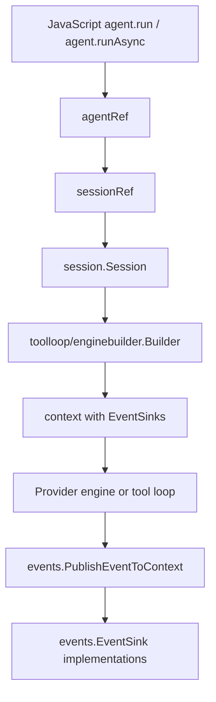
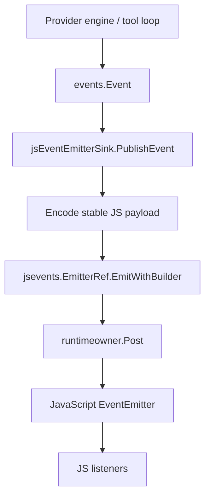

# Geppetto JS streaming events design and implementation guide

This document is an intern-ready design and implementation guide for exposing Geppetto inference streaming events to JavaScript through the go-go-goja EventEmitter framework. It explains the current system, the relevant files, the ownership model, the proposed JavaScript API, the Go implementation plan, and the tests needed to make the feature safe.

The design assumes the hard-cut Geppetto JavaScript API already exists. That API exposes Go-owned wrappers for `inferenceProfiles`, `engine`, `agent`, `turn`, `tool`, `toolRegistry`, `schema`, and `events`. The next step is to add `agent.runAsync(...)` as the non-blocking JavaScript execution method and deliver canonical Geppetto events to a JavaScript-created `EventEmitter` attached at agent-builder time.

## Executive summary

Geppetto already emits structured inference events through the Go-side `events.EventSink` interface. Provider engines, the tool loop, tool executors, and runner examples use that sink abstraction to publish text deltas, reasoning deltas, provider lifecycle events, tool call events, and errors. The current JavaScript binding also has an `events.collector()` object that implements `events.EventSink` and can call JavaScript callbacks through the runtime owner bridge.

The missing piece is a coherent JavaScript asynchronous execution contract. The first implementation should expose `agent.runAsync(turn, options?)`, return a promise/cancel handle, and route events through a builder-level `gp.agent().events(emitter)` sink. It should not expose `handle.on(...)` or per-run emitter options yet.

The proposed JavaScript API is:

```javascript
const gp = require("geppetto");
const EventEmitter = require("events");

const emitter = new EventEmitter();
emitter.on("event", ev => console.log(ev.type));
emitter.on("text-delta", ev => process.stdout.write(ev.delta));
emitter.on("tool-call-requested", ev => console.log(ev.toolCall));
emitter.on("stream-error", ev => console.error(ev.message));

const handle = agent.runAsync(turn, {
  timeoutMs: 120000,
  tags: { source: "js-stream-example" },
  events: emitter,
});

const result = await handle.promise;
console.log(result.text());
```

The implementation should adopt the JavaScript-created emitter through `go-go-goja/pkg/jsevents.Manager`, wrap it as a Geppetto `events.EventSink`, attach that sink to the session run, and emit both a general `event` event and type-specific event names such as `text-delta`, `provider-call-finished`, and `tool-result-ready`.

## Problem statement

The hard-cut JavaScript API made inference execution explicit: scripts build a `Turn`, pass it to synchronous `agent.run` or non-blocking `agent.runAsync`, and inspect a `RunResult`. That gives JavaScript a reliable final result, but it does not yet give JavaScript a reliable live event stream.

Live streaming matters for several concrete use cases:

- A JavaScript script wants to print provider text deltas as they arrive.
- A JS UI wants to render reasoning or tool-call progress before the final `Turn` exists.
- A test wants to assert that Geppetto emits canonical events during inference.
- A host wants one JavaScript API that works with Node-style `EventEmitter` semantics instead of a Geppetto-specific callback collector.

The design must satisfy three constraints:

1. JavaScript must not receive direct access to Go channels, goroutines, or mutable Go event objects.
2. Go code must never call JavaScript listeners from arbitrary inference goroutines.
3. The event API should fit the go-go-goja EventEmitter framework instead of inventing another callback system.

## Scope

This guide covers the design for Geppetto JavaScript streaming inference events. It does not implement the code.

In scope:

- adopting JavaScript-created `EventEmitter` values in Geppetto JS bindings,
- converting Geppetto `events.Event` values to stable JavaScript payloads,
- attaching the EventEmitter-backed sink through `gp.agent().events(emitter)`,
- fixing stream cancellation so it cancels the active inference handle,
- updating TypeScript declarations and examples,
- adding tests for event delivery, cancellation, and API compatibility.

Out of scope:

- changing provider event emission semantics,
- redesigning the Geppetto canonical event type system,
- adding durable event persistence,
- adding browser WebSocket transport,
- changing the registry-backed inference settings API,
- adding a new general-purpose JS event bus outside the inference API.

## Vocabulary

**Geppetto event** means a Go value implementing `pkg/events.Event`. Examples include `EventTextDelta`, `EventProviderCallFinished`, and `EventToolResultReady`.

**Event sink** means a Go value implementing `pkg/events.EventSink`:

```go
type EventSink interface {
    PublishEvent(event Event) error
}
```

**EventEmitter** means the Go-native Node-style emitter exposed by go-go-goja as `require("events")` and `require("node:events")`.

**Connected emitter** means a JavaScript-created EventEmitter that Go has adopted through `pkg/jsevents.Manager`. A connected emitter can be emitted to from Go background goroutines because emission is scheduled onto the runtime owner.

**Runtime owner** means the go-go-goja owner thread mechanism. Any operation that touches `goja.Runtime`, `goja.Value`, JavaScript callbacks, or JavaScript objects must run through this owner.

## Current-state architecture

### Geppetto already has canonical streaming events

Geppetto's event model is defined in `pkg/events`. The core interface is small and intentionally generic. `pkg/events/sink.go` defines `EventSink` as a destination for inference events, and the comments explicitly mention streaming deltas and final completions. The same file warns against treating partial streaming output as durable application state.

Canonical event type names are defined in `pkg/events/chat-events.go`. The important inference groups are:

- run lifecycle: `run-started`, `run-finished`, `run-stopped`, `run-failed`,
- provider lifecycle: `provider-call-started`, `provider-call-metadata-updated`, `provider-call-finished`,
- transcript text: `text-segment-started`, `text-delta`, `text-segment-finished`,
- reasoning: `reasoning-segment-started`, `reasoning-delta`, `reasoning-segment-finished`,
- tools: `tool-call-started`, `tool-call-arguments-delta`, `tool-call-requested`, `tool-execution-started`, `tool-result-ready`, `tool-call-finished`,
- generic errors and interrupts: `error`, `interrupt`.

The concrete event structs live in `pkg/events/canonical_events.go` and `pkg/events/canonical_tool_events.go`. For example, `EventTextDelta` carries `Delta`, accumulated `Text`, `Sequence`, metadata, and correlation. Tool events carry `ToolCallID`, `ToolName`, argument deltas, input strings, result strings, and status.

### Event sinks are injected through context

Geppetto event delivery is context-based. `pkg/events/context.go` defines:

```go
func WithEventSinks(ctx context.Context, sinks ...EventSink) context.Context
func GetEventSinks(ctx context.Context) []EventSink
func PublishEventToContext(ctx context.Context, event Event)
```

This means event producers do not need to know which UI, logger, JavaScript runtime, or message bus is listening. They publish into the context, and any sinks attached to that context receive the event.

The tool-loop engine builder attaches configured sinks to the run context. In `pkg/inference/toolloop/enginebuilder/builder.go`, `runner.RunInference` starts by copying the incoming context and then applying `events.WithEventSinks` when `r.eventSinks` is non-empty:

```go
runCtx := ctx
if len(r.eventSinks) > 0 {
    runCtx = events.WithEventSinks(runCtx, r.eventSinks...)
}
```

That runner then calls either `engine.RunInferenceWithResult(runCtx, r.eng, t)` for a single provider call or `loop.RunLoop(runCtx, t)` for a tool-calling loop. Both paths receive the event-enabled context.

### Sessions run inference asynchronously

`pkg/inference/session/session.go` owns the session-level asynchronous execution path. `Session.StartInference(ctx)` validates the latest appended turn, stamps session and inference IDs, builds a blocking runner, creates a cancellable run context, and starts a goroutine. The returned `ExecutionHandle` exposes `Cancel`, `Wait`, and `IsRunning`.

The important consequence for JavaScript streaming is that the provider and tool loop emit events from Go execution contexts that are not the JavaScript owner path. A JavaScript listener must not be called directly from those goroutines. Event forwarding must cross back to the runtime owner.

### The current JavaScript collector is a partial solution

`pkg/js/modules/geppetto/api_events.go` defines `jsEventCollector`. It implements `events.EventSink`, stores JavaScript callbacks by event type, and uses `moduleRuntime.callOnOwner` before invoking those callbacks.

The collector already includes useful event payload mapping:

- `type`, `timestampMs`, `sessionId`, `inferenceId`, `turnId`, `metaExtra`,
- `correlation` for correlated events,
- `delta`, `text`, `sequence`, and `finishReason` for text/reasoning events,
- `toolCall` and `toolResult` objects for tool events,
- `error` and `rawPayload` when available.

The collector has two limitations for the requested feature:

1. It is a Geppetto-specific callback object, not the go-go-goja EventEmitter framework.
2. `agent.runAsync()` creates a collector for its returned handle but does not attach the collector to the session's event sinks.

The second limitation is visible in `pkg/js/modules/geppetto/api_agent.go`: `start` creates `collector := newJSEventCollector(a.api)` and exposes `handle.on(...)`, but then calls `a.runSync(input, opts)` without adding the collector to `a.eventSinks` or passing it as a transient sink. No event producer can publish into that collector.

### go-go-goja already has the required EventEmitter framework

The go-go-goja module `modules/events/events.go` provides a Go-native subset of Node's `EventEmitter`. It is available as both `require("events")` and `require("node:events")`. The module supports:

- `on` / `addListener`,
- `once`,
- `off` / `removeListener`,
- `removeAllListeners`,
- `emit`,
- `listeners`,
- `rawListeners`,
- `listenerCount`,
- `eventNames`.

The `EventEmitter` implementation is not goroutine-safe. Its own comment states that all methods touching listeners or goja values must be called on the owning goja runtime goroutine.

The connected-emitter framework in `go-go-goja/pkg/jsevents` solves that ownership problem. JavaScript creates an EventEmitter, passes it to Go, and Go adopts it through `Manager.AdoptEmitterOnOwner(value)`. The returned `EmitterRef` can be held by background goroutines. Calls to `EmitterRef.Emit(...)` or `EmitWithBuilder(...)` schedule delivery through `runtimeowner.Post`, which runs the listener dispatch on the owner.

The developer guide in `go-go-goja/pkg/doc/17-connected-eventemitters-developer-guide.md` states the model directly:

- JavaScript creates and owns the EventEmitter object.
- Go adopts the emitter on the owner thread and stores an `EmitterRef`.
- Background goroutines call `EmitterRef.Emit(...)` or `EmitterRef.EmitWithBuilder(...)`.
- `EmitterRef` schedules listener delivery back onto the runtime owner.
- The returned connection object closes Go-side resources without removing JavaScript listeners.

That is the correct pattern for Geppetto streaming inference events.

## Current-state data flow

The current Go-side inference event path already looks like this:



The intended JavaScript EventEmitter path should add one sink implementation:



The boundary is the `EmitterRef`. Provider goroutines call `PublishEvent`, `PublishEvent` calls `EmitterRef.EmitWithBuilder`, and listener invocation happens later on the runtime owner.

## Proposed JavaScript API

### Primary API: builder-level emitter plus `runAsync`

The first implementation should support exactly one public JavaScript event-routing shape: attach a JavaScript-created EventEmitter when building the agent, then execute with `agent.runAsync(turn, options?)`.

```javascript
const gp = require("geppetto");
const EventEmitter = require("events");

const events = new EventEmitter();

events.on("event", ev => {
  // Receives every Geppetto event payload.
  console.log(ev.type, ev.sessionId, ev.inferenceId);
});

events.on("text-delta", ev => {
  process.stdout.write(ev.delta);
});

events.on("inference-error", ev => {
  console.error(ev.message || ev.error);
});

const agent = gp.agent()
  .inference(settings)
  .events(events)
  .build();

const handle = agent.runAsync(turn, {
  timeoutMs: 120000,
  tags: { source: "js-runasync-example" },
});

const result = await handle.promise;
```

This is the only first-pass public contract. Do not add `agent.runAsync(turn, { events })`, do not add `agent.stream(...)`, and do not add `handle.on(...)` as public API for this ticket. Those shapes can be reconsidered after the builder-level path is implemented and tested.

This shape matches the current Go implementation directly. The agent already stores `eventSinks` on `agentRef`, and `agentRef.buildSession()` already passes those sinks into `enginebuilder.WithEventSinks(...)`. If `.events(events)` adopts the JavaScript EventEmitter as an `events.EventSink` during builder setup, later `agent.run(...)` and `agent.runAsync(...)` reuse the existing EventSink path. `runAsync` is still necessary for live JavaScript callbacks because it returns control to the goja owner before the provider emits events.

The main tradeoff is lifetime. A builder-level emitter is attached to the agent, not one run. That is acceptable for the first implementation because JavaScript owns the EventEmitter and can remove listeners with `off(...)` or `removeAllListeners(...)`. If Geppetto stores a connected `EmitterRef`, it should eventually expose an `agent.close()` or sink close path for explicit cleanup. Until that exists, the emitter connection should be documented as runtime-lifetime or agent-lifetime.

### Why synchronous `run()` is not enough

`agent.run(turn)` remains the synchronous final-result API. It is invoked from JavaScript, enters Go, starts inference, waits for the `ExecutionHandle`, and returns a final `RunResult`. While that Go method is waiting, the JavaScript runtime owner is occupied by the original call. EventEmitter delivery from provider goroutines must be scheduled back onto that same owner. If the owner is blocked inside `agent.run`, listener callbacks cannot run until `agent.run` returns. At that point the events are no longer live streaming events from JavaScript's perspective.

That means builder-level `.events(emitter)` plus synchronous `run()` can be useful for Go-side sinks or after-the-fact event delivery, but it is not sufficient for live JavaScript streaming. The API therefore needs `runAsync`: a non-blocking execution method that starts inference, returns `{ promise, cancel, close? }`, and lets the owner process EventEmitter callbacks while inference is in flight.

### Deferred API shapes

The following shapes are intentionally out of scope for this first pass:

```javascript
agent.stream(turn);
agent.runAsync(turn, { events });
const handle = agent.runAsync(turn);
handle.on("text-delta", fn);
```

Per-run emitters are useful when one agent performs many concurrent or independent runs and each run needs isolated listeners. They require transient event sinks that are attached only to one session. That is a larger refactor because `agentRef.buildSession()` currently reads only `a.eventSinks`; it needs to accept additional per-run sinks.

`handle.on(...)` is also intentionally deferred. It looks ergonomic, but it is easy to implement incorrectly. If `runAsync(...)` starts the Go inference goroutine before returning the handle, early provider events can be emitted before `handle.on(...)` registers the listener. The builder-level emitter avoids that race because listeners are registered before the EventSink is attached and inference starts.

The first-pass handle should stay minimal:

```typescript
interface AgentAsyncHandle {
  promise: Promise<RunResult>;
  cancel(): void;
  close?(): void;
}
```

### Optional explicit connection API

A low-level explicit API may be useful for tests and advanced hosts:

```javascript
const emitter = new EventEmitter();
const sink = gp.events.fromEmitter(emitter, {
  emitAll: true,
  emitTypeSpecific: true,
  errorEventName: "stream-error",
});

const agent = gp.agent().inference(settings).events(sink).build();
```

This shape mirrors the connected-emitter guide: JavaScript creates an emitter, passes it to a Go-backed helper, and receives a connection/sink object. If implemented, the object should expose:

```typescript
interface EventEmitterSink {
  close(): void;
  emitter: EventEmitter;
  toJSON(): { id: string; closed: boolean };
}
```

This explicit helper is not required for the first implementation because `.events(emitter)` handles adoption internally.

## Event naming contract

Emit two events for each Geppetto event:

1. `event` — every event, with the full payload.
2. `<payload.type>` — type-specific event, such as `text-delta` or `tool-result-ready`.

Do not emit the canonical Geppetto `error` event as Node's special `error` event by default. Node EventEmitter treats unhandled `error` specially. go-go-goja mirrors that behavior. A streaming inference error should reject `handle.promise` and emit `stream-error`; a canonical Geppetto `EventTypeError` should emit:

- `event`, with `payload.type === "error"`,
- `inference-error`, with the same payload.

The default event mapping should be:

| Geppetto event | EventEmitter names |
|---|---|
| Any event | `event` |
| `text-delta` | `text-delta` |
| `text-segment-finished` | `text-segment-finished` |
| `reasoning-delta` | `reasoning-delta` |
| `tool-call-requested` | `tool-call-requested` |
| `tool-result-ready` | `tool-result-ready` |
| `provider-call-finished` | `provider-call-finished` |
| `error` | `inference-error` and `event` |
| Adapter/run failure | `stream-error` |
| Final result available | `stream-result` |
| Stream closed | `stream-close` |

The adapter should make this behavior configurable later, but the first implementation should keep the default safe and explicit.

## Event payload contract

Reuse the existing `jsEventCollector.encodeEventPayload` structure as the base contract. The first implementation should avoid a second payload schema unless there is a strong reason.

Common fields:

```typescript
interface StreamEvent {
  type: string;
  timestampMs: number;
  sessionId?: string;
  inferenceId?: string;
  turnId?: string;
  metaExtra?: Record<string, any>;
  correlation?: any;
  rawPayload?: string;
}
```

Text and reasoning fields:

```typescript
interface TextDeltaEvent extends StreamEvent {
  type: "text-delta" | "reasoning-delta";
  delta: string;
  text: string;
  sequence?: number;
  source?: string;
}

interface TextFinishedEvent extends StreamEvent {
  type: "text-segment-finished" | "reasoning-segment-finished";
  text: string;
  finishReason?: string;
  source?: string;
}
```

Tool fields:

```typescript
interface ToolEvent extends StreamEvent {
  toolCall?: {
    id: string;
    name?: string;
    input?: string;
    delta?: string;
    arguments?: string;
    sequence?: number;
    status?: string;
  };
  toolResult?: {
    id: string;
    name?: string;
    result: string;
    status?: string;
  };
}
```

Stream lifecycle fields:

```typescript
interface StreamLifecycleEvent {
  type: "stream-start" | "stream-result" | "stream-error" | "stream-close";
  timestampMs: number;
  sessionId?: string;
  inferenceId?: string;
  text?: string;
  message?: string;
  cancelled?: boolean;
}
```

The implementation should document that partial payloads are not durable application state. Scripts should use them for UI updates, logs, and progress. Final application state should come from `RunResult.outputTurn()` after the promise resolves.

## Required runtime integration

### Install the EventEmitter module

Geppetto's `pkg/js/runtime/runtime.go` currently builds a go-go-goja runtime with optional data-only default modules. When `IncludeDefaultModules` is true, `require("events")` is available. The tests in go-go-goja confirm that both `require("events")` and `require("node:events")` expose `EventEmitter`.

For Geppetto streaming, runtime construction should ensure the connected-emitter manager exists whenever EventEmitter-backed streaming is enabled. `jsevents.Install()` is safe to install by default because it only stores a per-runtime manager; it does not create emitters or connect host resources.

Recommended change in `pkg/js/runtime/runtime.go`:

```go
import "github.com/go-go-golems/go-go-goja/pkg/jsevents"

func NewRuntime(ctx context.Context, opts Options) (*gojengine.Runtime, error) {
    initializers := []gojengine.RuntimeInitializer{
        jsevents.Install(),
    }
    initializers = append(initializers, nonNilRuntimeInitializers(opts.RuntimeInitializers)...)
    builder = builder.WithRuntimeInitializers(initializers...)
}
```

For provider-hosted runtimes that do not use `pkg/js/runtime.NewRuntime`, the provider or host integration should either:

- install `jsevents.Install()` in the host runtime, or
- provide a Geppetto option that contains an already-created `*jsevents.Manager`.

### Pass a typed EventEmitter manager resolver into the Geppetto module

go-go-goja runtime modules register before runtime initializers run. That means `geppettoModuleSpec.RegisterRuntimeModule` cannot read the `jsevents.Manager` directly yet. Avoid leaking the whole runtime value bag into Geppetto. Instead, pass a narrow typed resolver that closes over `RuntimeModuleContext.Value(...)` and performs the lookup lazily when `.events(emitter)` is called.

Recommended addition to `pkg/js/modules/geppetto/module.go`:

```go
type Options struct {
    RuntimeOwner runtimeowner.RuntimeOwner
    EventEmitterManager *jsevents.Manager
    EventEmitterManagerResolver func() (*jsevents.Manager, bool)
    // existing fields...
}

type moduleRuntime struct {
    eventEmitterManager *jsevents.Manager
    eventEmitterManagerResolver func() (*jsevents.Manager, bool)
    // existing fields...
}
```

Recommended change in `pkg/js/runtime/runtime.go`:

```go
func (s geppettoModuleSpec) RegisterRuntimeModule(ctx *gojengine.RuntimeModuleContext, reg *require.Registry) error {
    opts := s.opts
    opts.RuntimeOwner = ctx.Owner
    opts.EventEmitterManagerResolver = func() (*jsevents.Manager, bool) {
        value, ok := ctx.Value(jsevents.RuntimeValueKey)
        if !ok { return nil, false }
        manager, ok := value.(*jsevents.Manager)
        return manager, ok && manager != nil
    }
    gp.Register(reg, opts)
    return nil
}
```

Then `moduleRuntime` can resolve the manager lazily without exposing arbitrary runtime values:

```go
func (m *moduleRuntime) getEventEmitterManager() (*jsevents.Manager, error) {
    if m.eventEmitterManager != nil { return m.eventEmitterManager, nil }
    if m.eventEmitterManagerResolver != nil {
        if manager, ok := m.eventEmitterManagerResolver(); ok && manager != nil {
            return manager, nil
        }
    }
    return nil, fmt.Errorf("geppetto events: connected EventEmitter manager is not installed")
}
```

This avoids ordering problems while keeping the dependency typed. The Geppetto module registration happens before runtime initializers, but JavaScript calls `.events(emitter)` after runtime creation, so the resolver can see the installed manager by the time adoption is needed.

## EventEmitter sink design

Add a new file:

```text
pkg/js/modules/geppetto/api_event_emitters.go
```

Define a sink that implements `events.EventSink` and owns one connected `EmitterRef`:

```go
type jsEventEmitterSink struct {
    api *moduleRuntime
    ref *jsevents.EmitterRef
    opts jsEventEmitterSinkOptions
    closed atomic.Bool
}

type jsEventEmitterSinkOptions struct {
    EmitAll bool
    EmitTypeSpecific bool
    ErrorEventName string
}
```

The sink should be created only on the runtime owner path, because `AdoptEmitterOnOwner` must inspect a `goja.Value`:

```go
func (m *moduleRuntime) newEventEmitterSinkFromValue(v goja.Value, opts jsEventEmitterSinkOptions) (*jsEventEmitterSink, error) {
    manager, err := m.jsEventManager()
    if err != nil {
        return nil, err
    }
    ref, err := manager.AdoptEmitterOnOwner(v)
    if err != nil {
        return nil, err
    }
    return &jsEventEmitterSink{api: m, ref: ref, opts: opts.withDefaults()}, nil
}
```

`PublishEvent` should map the event before scheduling emission:

```go
func (s *jsEventEmitterSink) PublishEvent(ev events.Event) error {
    if s == nil || ev == nil || s.closed.Load() {
        return nil
    }

    payload := s.api.encodeEventPayload(ev) // factor out from jsEventCollector if needed
    names := eventEmitterNamesForPayload(payload, s.opts)

    for _, name := range names {
        name := name
        payloadCopy := cloneJSONMap(payload)
        if err := s.ref.EmitWithBuilder(context.Background(), name, func(vm *goja.Runtime) ([]goja.Value, error) {
            return []goja.Value{s.api.toJSValueOn(vm, payloadCopy)}, nil
        }); err != nil {
            return err
        }
    }
    return nil
}
```

The existing `moduleRuntime.toJSValue` uses `m.vm`. Because `EmitWithBuilder` provides the owner-thread `*goja.Runtime`, it is cleaner to add:

```go
func toJSValueOn(vm *goja.Runtime, v any) goja.Value
```

Then update `m.toJSValue` to call `toJSValueOn(m.vm, v)`. This keeps event payload conversion usable inside `EmitWithBuilder` without relying on captured VM state outside the owner callback.

## Async execution design

`agent.runAsync` should not call the current `runSync` helper directly because it needs access to the active `ExecutionHandle` for cancellation. Introduce a lower-level helper that starts inference and returns the execution handle plus the turn snapshots needed to build a `RunResult`.

First-pass `runAsync` does not parse EventEmitter options. Event routing is configured only through builder-level `.events(emitter)`, which appends a sink to `agentRef.eventSinks`. `agentRef.buildSession()` already injects those sinks through `enginebuilder.WithEventSinks(...)`.

Add a helper that starts inference and exposes the handle:

```go
func (a *agentRef) startRun(input *turns.Turn, opts runOptions) (*session.ExecutionHandle, *turns.Turn, *turns.Turn, context.CancelFunc, error) {
    sr, err := a.buildSession()
    if err != nil { return nil, nil, nil, nil, err }

    inputSnapshot := input.Clone()
    seed := input.Clone()
    stampTurnRuntimeMetadata(seed, sr.runtimeMetadata)
    effective := seed.Clone()
    sr.session.Append(seed)

    ctx, cancel, err := sr.buildRunContext(opts)
    if err != nil { return nil, nil, nil, nil, err }

    handle, err := sr.session.StartInference(ctx)
    if err != nil {
        cancel()
        return nil, nil, nil, nil, err
    }

    return handle, inputSnapshot, effective, cancel, nil
}
```

Then `agent.runAsync` can set cancellation correctly:

```go
handleObj.cancel = func() {
    if h := getHandle(); h != nil {
        h.Cancel()
    }
    if cancel := getContextCancel(); cancel != nil {
        cancel()
    }
}

go func() {
    h, inputSnapshot, effective, cancel, err := a.startRun(input, opts)
    setHandle(h)
    setContextCancel(cancel)
    if err != nil { rejectOnOwner(err); return }
    defer cancel()

    out, err := h.Wait()
    if err != nil { rejectOnOwner(err); return }

    result := &runResultRef{inputTurn: inputSnapshot, effectiveTurn: effective, outputTurn: out.Clone()}
    resolveOnOwner(result)
}()
```

This fixes the current no-op cancellation behavior and ensures the EventEmitter sink is part of the event-enabled run context before inference starts. Adapter lifecycle events such as `stream-start` and `stream-close` are optional; the first test should assert canonical provider events, especially `text-delta`, before the returned promise resolves.

## API parsing design

Keep `parseRunOptions` strict and shared by `agent.run` and `agent.runAsync`. First-pass run options are still only:

```typescript
interface RunOptions {
  timeoutMs?: number;
  tags?: Record<string, any>;
}
```

Do not parse `events` or `emitter` from `runAsync` options in this ticket. The only EventEmitter input is builder-level `.events(value)`.

For builder-level `.events(value)`, extend `requireEventSink`:

```go
func (m *moduleRuntime) requireEventSink(v goja.Value) (events.EventSink, error) {
    if sink, ok := m.getRef(v).(events.EventSink); ok {
        return sink, nil
    }
    if sink, err := m.newEventEmitterSinkFromValue(v, defaultOptions); err == nil {
        return sink, nil
    }
    return nil, fmt.Errorf("expected event sink or EventEmitter")
}
```

The implementation should be careful not to accept arbitrary objects that happen to have `.on` or `.emit`. Use `jsevents.Manager.AdoptEmitterOnOwner`, which validates that the value is a go-go-goja `events.EventEmitter`.

## TypeScript declaration changes

Update both declaration files:

- `pkg/doc/types/geppetto.d.ts`
- `pkg/js/modules/geppetto/spec/geppetto.d.ts.tmpl`

Add a local EventEmitter-like type without depending on Node type packages:

```typescript
export interface EventEmitterLike {
  on(name: string | symbol, listener: (...args: any[]) => void): this;
  once(name: string | symbol, listener: (...args: any[]) => void): this;
  off(name: string | symbol, listener: (...args: any[]) => void): this;
  emit(name: string | symbol, ...args: any[]): boolean;
}

export interface AgentAsyncHandle {
  promise: Promise<RunResult>;
  cancel(): void;
  close(): void;
}

export interface Agent {
  run(turn: TurnWrapper, options?: RunOptions): RunResult;
  runAsync(turn: TurnWrapper, options?: RunOptions): AgentAsyncHandle;
}

export interface AgentBuilder {
  events(sink: EventEmitterLike | any): AgentBuilder;
}
```

Add `StreamEvent`, `TextDeltaEvent`, `ToolEvent`, and lifecycle event declarations if useful. Keep them small enough to maintain.

## Example JavaScript scripts

Add a focused example under `examples/js/geppetto`, for example:

```text
examples/js/geppetto/31_event_emitter_streaming.js
```

Example content:

```javascript
const gp = require("geppetto");
const EventEmitter = require("events");

const cfg = globalThis.GEPPETTO_EXAMPLE || {};
const settings = gp.inferenceProfiles.resolve(cfg.profile || "default");
const agent = gp.agent().inference(settings).build();

const turn = gp.turn()
  .system("Stream a concise answer.")
  .user("Write three short facts about event sinks.")
  .build();

const emitter = new EventEmitter();
const seen = [];

emitter.on("text-delta", ev => {
  seen.push(ev.type);
  if (ev.delta) process.stdout.write(ev.delta);
});

emitter.on("event", ev => {
  if (ev.type === "provider-call-finished") {
    console.log("\nprovider finished", JSON.stringify(ev.usage || null));
  }
});

emitter.on("stream-error", ev => {
  console.error("stream failed", ev.message);
});

const handle = agent.runAsync(turn, {
  timeoutMs: cfg.timeoutMs || 120000,
  events: emitter,
});

const result = await handle.promise;
console.log("\nfinal:", result.text());
console.log("events:", seen.length);
```

The existing Glazed runner can execute it:

```bash
go run ./cmd/examples/geppetto-js-run run \
  --script examples/js/geppetto/31_event_emitter_streaming.js \
  --profile-registries "$HOME/.config/pinocchio/profiles.yaml" \
  --profile default \
  --timeout-ms 120000
```

## Implementation plan

### Phase 1: Factor payload encoding

Move the payload mapping currently embedded in `jsEventCollector.encodeEventPayload` into a reusable helper.

Recommended file:

```text
pkg/js/modules/geppetto/api_event_payloads.go
```

Target API:

```go
func encodeEventPayload(ev events.Event) map[string]any
func eventEmitterNamesForPayload(payload map[string]any, opts jsEventEmitterSinkOptions) []string
```

Keep `jsEventCollector` working by calling the new helper.

Tests:

- `EventTextDelta` encodes `type`, `delta`, `text`, and `sequence`.
- `EventToolResultReady` encodes `toolResult`.
- `EventTypeError` maps to `inference-error` for type-specific emission.
- `rawPayload` is preserved when present.

### Phase 2: Add EventEmitter sink adapter

Add `api_event_emitters.go` with `jsEventEmitterSink` and manager lookup.

Tasks:

- Add typed `EventEmitterManager` / `EventEmitterManagerResolver` fields to `geppetto.Options`.
- Set `opts.EventEmitterManagerResolver` in `geppettoModuleSpec.RegisterRuntimeModule` so the manager can be resolved after `jsevents.Install()` runs.
- Install `jsevents.Install()` in `pkg/js/runtime.NewRuntime`, or document that host runtimes must install it and provide a typed manager/resolver.
- Implement `newEventEmitterSinkFromValue` using `manager.AdoptEmitterOnOwner`.
- Implement `PublishEvent` using `EmitterRef.EmitWithBuilder`.
- Implement `Close` for the sink and call `EmitterRef.Close`.

Tests:

- Create an owned runtime with `require("events")` available.
- Create a JavaScript EventEmitter.
- Adopt it through the Geppetto sink adapter.
- Publish a synthetic `EventTextDelta` from Go.
- Assert the JS listener receives both `event` and `text-delta` payloads.

### Phase 3: Extend builder-level `.events(...)`

Allow `gp.agent().events(emitter)` to adopt a JavaScript EventEmitter as a persistent agent-level sink. This is the only first-pass event-routing path because it uses the existing `agentRef.eventSinks -> buildSession -> enginebuilder.WithEventSinks` flow.

Tasks:

- Extend `requireEventSink` to accept EventEmitter values through `newEventEmitterSinkFromValue`.
- Ensure callers register listeners before calling `.events(emitter).build()` or before starting inference.
- Decide lifetime: builder-level emitter refs should close when the agent is no longer used only if there is an explicit `agent.close()` method. Without `agent.close()`, document that builder-level emitter refs live for the runtime lifetime.
- Consider adding `agent.close()` if persistent EventEmitter refs are introduced.
- Add `agent.runAsync(turn, options?)` and make `handle.cancel()` call the active `ExecutionHandle.Cancel()` and run context cancel function.

Tests:

- Builder-level emitter receives events for `agent.runAsync`.
- Builder-level emitter receives events for multiple runs from the same agent.
- `handle.cancel()` cancels a blocking test engine and rejects or resolves according to the chosen cancellation contract.

### Phase 4: Declarations, examples, and cleanup

Update the public surface so the first-pass API is builder-level `.events(emitter)` plus `agent.runAsync(turn, options?)`. Remove public `agent.stream` declarations and stale `handle.on` declarations.

Tasks:

- Update generated and checked-in TypeScript declarations.
- Update API docs and examples.
- Add examples that create `require("events")`, register listeners before `.events(emitter).build()`, and await `handle.promise`.
- Keep per-run emitter options and `handle.on(...)` out of declarations for now.

Tests:

- DTS parity still passes.
- Hard-cut surface tests confirm `agent.runAsync` exists and `agent.stream` is absent.

### Phase 5: Validation and ticket delivery

Update TypeScript declarations, API docs, examples, and the hard-cut public surface tests.

Files:

- `pkg/doc/types/geppetto.d.ts`
- `pkg/js/modules/geppetto/spec/geppetto.d.ts.tmpl`
- `pkg/doc/topics/13-js-api-reference.md`
- `pkg/doc/topics/14-js-api-user-guide.md`
- `examples/js/geppetto/README.md`
- `examples/js/geppetto/31_event_emitter_streaming.js`

Validation:

```bash
go test ./pkg/js/... ./cmd/examples/geppetto-js-run -count=1
go test -tags geppetto_js_hardcut_contract ./pkg/js/modules/geppetto -run TestHardCutPublicSurfaceContract -count=1
```

### Phase 6: Real provider validation

Run a real provider stream through the example runner and verify at least one streaming event arrives before the final result.

Command:

```bash
go run ./cmd/examples/geppetto-js-run run \
  --script examples/js/geppetto/31_event_emitter_streaming.js \
  --profile-registries "$HOME/.config/pinocchio/profiles.yaml" \
  --profile default \
  --timeout-ms 120000
```

Record:

- profile slug,
- model name from `settings.toJSON()` if available,
- count of `text-delta` events,
- final `result.text()`,
- any provider that emits only final text and no deltas.

## Pseudocode: full runAsync path

```text
JavaScript:
  emitter = new EventEmitter()
  emitter.on("text-delta", callback)
  agent = gp.agent().inference(settings).events(emitter).build()
  handle = agent.runAsync(turn, { timeoutMs })
  result = await handle.promise

Go agent builder:
  .events(value) calls requireEventSink(value)
  requireEventSink adopts go-go-goja EventEmitter through jsevents.Manager
  agentRef stores jsEventEmitterSink in eventSinks

Go agent.runAsync:
  require Turn wrapper
  parse normal run options
  create handle object with promise/cancel/close
  start goroutine:
      start session inference with builder-level sinks
      set cancel to ExecutionHandle.Cancel plus context cancel
      wait for execution handle
      if error: reject promise on runtime owner
      else: resolve promise on runtime owner with RunResult

Provider/tool loop:
  receives context containing jsEventEmitterSink
  publishes events through events.PublishEventToContext
  jsEventEmitterSink.PublishEvent receives events.Event
  jsEventEmitterSink schedules EventEmitter.emit on owner thread
  JavaScript listeners run on owner thread while runAsync promise is pending
```

## Testing guide for the intern

Start with unit tests that do not require a real provider. The fastest reliable test is a synthetic event sink test.

### Test 1: EventEmitter sink receives synthetic text delta

Goal: prove the adapter can adopt a JS EventEmitter and emit payloads through the runtime owner.

Pseudocode:

```go
func TestEventEmitterSinkPublishesTextDelta(t *testing.T) {
    rt := newJSRuntimeWithJSEvents(t)

    // On owner thread:
    //   const EventEmitter = require("events")
    //   globalThis.events = new EventEmitter()
    //   globalThis.seen = []
    //   events.on("event", ev => seen.push(["event", ev.type]))
    //   events.on("text-delta", ev => seen.push(["text", ev.delta]))

    sink := adopt globalThis.events through moduleRuntime
    sink.PublishEvent(events.NewTextDeltaEvent(meta, corr, "he", "he", 1))

    // Wait for owner Post to run.
    // Assert seen contains ["event", "text-delta"] and ["text", "he"].
}
```

### Test 2: builder-level `.events(emitter)` and `agent.runAsync` attach the sink

Goal: prove streaming events from an engine reach JS listeners.

Use a package-internal test engine:

```go
type emittingEngine struct{}
func (emittingEngine) RunInference(ctx context.Context, t *turns.Turn) (*turns.Turn, error) {
    meta := events.EventMetadata{SessionID: session.SessionIDFromContext(ctx), InferenceID: session.InferenceIDFromContext(ctx), TurnID: t.ID}
    corr := events.BuildProviderCallCorrelation("test", meta.InferenceID, "", 0, "")
    events.PublishEventToContext(ctx, events.NewTextDeltaEvent(meta, corr, "A", "A", 1))
    events.PublishEventToContext(ctx, events.NewTextDeltaEvent(meta, corr, "B", "AB", 2))
    turns.AppendBlock(t, turns.NewAssistantTextBlock("AB"))
    return t, nil
}
```

Expose an agent wrapper directly from Go test code or add a test-only helper. Then run JavaScript:

```javascript
const EventEmitter = require("events");
const emitter = new EventEmitter();
globalThis.deltas = [];
emitter.on("text-delta", ev => globalThis.deltas.push(ev.delta));
const handle = globalThis.testAgent.runAsync(gp.turn().user("x").build());
await handle.promise;
```

Assert that `deltas` is `['A', 'B']`.

### Test 3: Cancel reaches `ExecutionHandle.Cancel`

Use a blocking engine that waits on `ctx.Done()`:

```go
type blockingEngine struct{}
func (blockingEngine) RunInference(ctx context.Context, t *turns.Turn) (*turns.Turn, error) {
    <-ctx.Done()
    return nil, ctx.Err()
}
```

Run `agent.runAsync`, call `handle.cancel()`, and assert the promise rejects with a cancellation error or resolves according to the final chosen contract. The important assertion is that the engine sees context cancellation.

### Test 4: No arbitrary emitter-like objects

Pass `{ on() {}, emit() {} }` as `options.events`. The implementation should reject it because it is not a go-go-goja `EventEmitter` value. This prevents accidental use of objects that Go cannot safely adopt.

### Test 5: Existing `gp.events.collector()` remains compatible or is deprecated intentionally

If `gp.events.collector()` stays, verify it still works as a builder-level event sink. If it is replaced, update hard-cut tests and docs explicitly.

## Failure modes and design constraints

### Calling JavaScript from an inference goroutine

Do not call `goja.Callable` directly from `PublishEvent`. Provider engines and tool loops may publish events from goroutines created by `Session.StartInference`. Direct callback invocation from those goroutines violates the goja owner rule.

Correct path:

```go
EmitterRef.EmitWithBuilder(ctx, name, builder)
```

or, for the older collector:

```go
moduleRuntime.callOnOwner(ctx, "eventCollector.publish", fn)
```

### Accepting arbitrary emitter-like objects

Do not accept objects because they have `.on` and `.emit`. The connected-emitter framework validates Go-native EventEmitter values. This is necessary because Go needs an `EmitterRef`, not just a JavaScript method name.

Correct path:

```go
manager.AdoptEmitterOnOwner(value)
```

### Emitting Node `error` by default

Do not map Geppetto's canonical `error` event directly to EventEmitter's `error` name by default. Unhandled `error` is special in Node-style emitters. Use `inference-error` and `stream-error` unless the caller explicitly opts into Node `error` emission.

### Closing the connection too early

Do not close the per-run emitter ref before the final lifecycle event is scheduled. A safe order is:

1. emit final canonical events as they arrive,
2. resolve or reject the promise on the owner,
3. emit `stream-result` or `stream-error`,
4. emit `stream-close`,
5. close the per-run `EmitterRef`.

### Backpressure

EventEmitter delivery is asynchronous through `runtimeowner.Post`. The first implementation should treat event delivery as best-effort progress reporting. It should not block provider streaming on slow JavaScript listeners. If backpressure is needed later, design it as an explicit bounded queue with drop/error policy.

## API references

### JavaScript

```typescript
const EventEmitter = require("events");
const emitter = new EventEmitter();

emitter.on("event", (event: StreamEvent) => void);
emitter.on("text-delta", (event: TextDeltaEvent) => void);
emitter.on("inference-error", (event: StreamEvent) => void);
emitter.on("stream-error", (event: StreamLifecycleEvent) => void);

const agent = gp.agent()
  .inference(settings)
  .events(emitter)
  .build();

const handle = agent.runAsync(turn, {
  timeoutMs?: number;
  tags?: Record<string, any>;
});

handle.cancel(): void;
handle.close(): void;
// Optional later sugar only if late-listener semantics are documented.
handle.promise: Promise<RunResult>;
```

### Go

```go
type jsEventEmitterSink struct {
    api *moduleRuntime
    ref *jsevents.EmitterRef
    opts jsEventEmitterSinkOptions
}

func (m *moduleRuntime) newEventEmitterSinkFromValue(v goja.Value, opts jsEventEmitterSinkOptions) (*jsEventEmitterSink, error)
func (s *jsEventEmitterSink) PublishEvent(ev events.Event) error
func (s *jsEventEmitterSink) Close(ctx context.Context) error
```

### Files to modify

| File | Change |
|---|---|
| `pkg/js/modules/geppetto/module.go` | Add runtime values or EventEmitter manager access to module options/runtime. |
| `pkg/js/runtime/runtime.go` | Install `jsevents.Install()` and pass runtime values to Geppetto module options. |
| `pkg/js/modules/geppetto/api_events.go` | Reuse or move payload encoding; keep or deprecate collector. |
| `pkg/js/modules/geppetto/api_event_emitters.go` | New EventEmitter sink adapter. |
| `pkg/js/modules/geppetto/api_agent.go` | Implement runAsync, builder-level EventEmitter sink adoption, and cancellation. |
| `pkg/js/modules/geppetto/api_sessions.go` | No first-pass transient sinks; keep sessions using builder-level event sinks. |
| `pkg/doc/types/geppetto.d.ts` | Add EventEmitter stream option declarations. |
| `pkg/js/modules/geppetto/spec/geppetto.d.ts.tmpl` | Mirror declaration changes. |
| `pkg/js/modules/geppetto/module_hardcut_test.go` | Add EventEmitter stream tests. |
| `examples/js/geppetto/31_event_emitter_streaming.js` | Add real provider example. |

### Files to read first

| File | Why it matters |
|---|---|
| `pkg/js/modules/geppetto/api_agent.go` | Current async execution implementation and cancellation gap. |
| `pkg/js/modules/geppetto/api_events.go` | Existing event payload mapping and callback collector. |
| `pkg/inference/session/session.go` | Asynchronous inference lifecycle and `ExecutionHandle` creation. |
| `pkg/inference/session/execution.go` | `Cancel`, `Wait`, and `IsRunning` semantics. |
| `pkg/inference/toolloop/enginebuilder/builder.go` | Where `EventSinks` enter the run context. |
| `pkg/events/context.go` | Context-based event sink propagation. |
| `pkg/events/chat-events.go` | Canonical event type names. |
| `go-go-goja/modules/events/events.go` | EventEmitter implementation and owner-thread warning. |
| `go-go-goja/pkg/jsevents/manager.go` | Connected EventEmitter adoption and safe emission. |
| `go-go-goja/pkg/doc/17-connected-eventemitters-developer-guide.md` | Framework design rules. |

## Suggested implementation sequence for the intern

1. Read this design document once without editing code.
2. Open `sources/01-code-evidence.md` and inspect the excerpts for the files listed above.
3. Implement payload encoder extraction and tests.
4. Add `jsevents.Install()` to Geppetto runtime setup and add runtime values access to the module options.
5. Implement `jsEventEmitterSink` with a synthetic event unit test.
6. Implement `agent.runAsync` on top of a cancellable start helper and builder-level sinks.
7. Add JavaScript-level stream tests with a fake emitting engine.
8. Update TypeScript declarations and docs.
9. Add the real provider example and run it manually with a profile registry.
10. Run the full relevant validation suite.

Validation commands:

```bash
go test ./pkg/js/... ./cmd/examples/geppetto-js-run -count=1
go test -tags geppetto_js_hardcut_contract ./pkg/js/modules/geppetto -run TestHardCutPublicSurfaceContract -count=1
go test ./pkg/events ./pkg/inference/... -count=1
```

Before committing, run the repository hook or equivalent:

```bash
go test ./...
make lintmax
```

## Open questions

1. `handle.on(...)` is out of scope for the first pass; callers register listeners on an EventEmitter before passing it to the agent builder.
2. Per-run `agent.runAsync(turn, { events: emitter })` is deferred until concurrent-run isolation is needed.
3. Should Geppetto keep `gp.events.collector()` after EventEmitter support lands, or deprecate it in favor of `require("events")`?
4. Should canonical Geppetto `error` events ever emit Node's special `error` event by default, or should that always require an explicit opt-in?
5. Does every host path that registers Geppetto modules have access to `jsevents.Install()`, or do provider hosts need an explicit option to supply the manager?

## Recommended first-pass decisions

Use these decisions unless review changes them:

- Support `gp.agent().events(emitter).build()` in the first pass.
- Implement `agent.runAsync(turn, options?)` as the only non-blocking execution method for live JavaScript EventEmitter delivery. Synchronous `agent.run` cannot deliver live JS callbacks while it is waiting.
- Do not implement `agent.stream`, per-run `agent.runAsync(turn, { events: emitter })`, or `handle.on(type, fn)` in the first pass.
- Emit `event` and type-specific names for every Geppetto event.
- Map canonical Geppetto `error` to `inference-error`, not Node `error`.
- Adapter lifecycle events such as `stream-start`, `stream-result`, `stream-error`, and `stream-close` are optional and may be deferred.
- Install `jsevents.Install()` in `pkg/js/runtime.NewRuntime` by default.
- Pass a typed `EventEmitterManagerResolver` into Geppetto module options so the module can lazily resolve the manager without exposing arbitrary runtime values.
- Keep `gp.events.collector()` during the transition, but update docs to prefer EventEmitter for streaming.

## Conclusion

The Geppetto side already has structured streaming events and event sink injection. The go-go-goja side already has a Node-style EventEmitter and a connected-emitter manager that solves owner-thread delivery. The implementation should connect these two existing systems rather than inventing a new callback model.

The central implementation task is to build a Geppetto `events.EventSink` backed by a go-go-goja `jsevents.EmitterRef`, attach that sink through builder-level `.events(emitter)`, and execute with `agent.runAsync`. Once that adapter exists, JavaScript code can consume live inference events through standard EventEmitter patterns while Geppetto keeps the Go-owned wrapper and explicit-turn API model intact.
