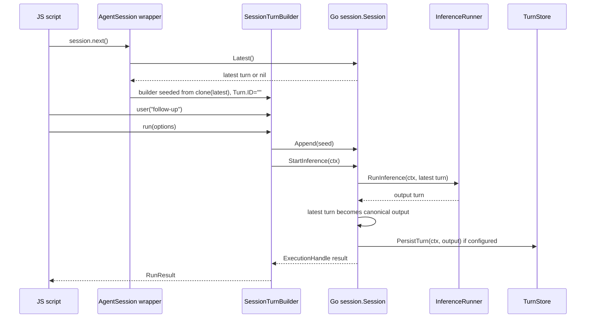

# Session-centered JavaScript API design and implementation guide

## Executive summary

This ticket revisits the Geppetto JavaScript API after the wrapper-first hard cutover and the initial turn-store work. The current JS API is explicit and turn-centered: JavaScript builds a `TurnWrapper`, passes it to `agent.run(turn)` or `agent.runAsync(turn)`, and manually constructs continuation turns with `gp.turn(result.outputTurn()).user(...).build()`. That model is safe, but it pushes conversation lifecycle, session identity, persistence grouping, resume, and forks onto every script author.

Geppetto already has a Go `session.Session` abstraction that represents exactly the thing the public JS API now needs: a long-lived multi-turn interaction with a stable `SessionID`, append-only turn snapshots, safe "clone latest + append user prompt" behavior, single-active-inference enforcement, and cancellable asynchronous execution. This guide proposes a deliberate hard cut from a public **turn-run** API to a public **session-centered** API.

Recommended public shape:

```js
const gp = require("geppetto");

const agent = gp.agent()
  .inference(settings)
  .events(events)
  .defaultStore()
  .build();

const session = agent.session()
  .id("chat-123")
  .resumeLatest()
  .build();

const first = session.next()
  .system("Be concise.")
  .user("Explain SQLite WAL.")
  .run();

const second = await session.next()
  .user("Now explain the tradeoffs for mobile apps.")
  .runAsync().promise;

const fork = session.fork()
  .id("chat-123-mobile-fork")
  .build();

const forkResult = fork.next()
  .user("Rewrite the answer for offline-first mobile apps.")
  .run();
```

The public JS API should no longer ask normal users to call `agent.run(turn)` or `gp.turn(result.outputTurn())`. Turns remain the durable internal data model and the readback/snapshot type, but sessions become the public execution model.

## Problem statement

The hard-cut JavaScript API intentionally removed legacy hidden chat helpers and made every agent execution accept an explicit `TurnWrapper`. That solved several correctness problems:

- no hidden conversation state inside agents;
- Go-owned wrappers instead of arbitrary JS maps;
- explicit input/effective/output turn traceability;
- stable EventEmitter integration through `agent.runAsync(turn)`;
- turn-store persistence through `enginebuilder.TurnPersister`.

However, after adding `gp.turn(existingTurn)`, it became clear that normal chat-like JavaScript code still wants a session abstraction. The current usage pattern is mechanically correct but ergonomically and semantically backwards for applications:

```js
const r1 = agent.run(gp.turn()
  .system("Be concise.")
  .user("Hello")
  .build());

const r2 = agent.run(gp.turn(r1.outputTurn())
  .user("Follow-up")
  .build());
```

This is still a session in practice: the second turn clones the previous output, appends a user block, receives a new turn id, gets the same conceptual session id, runs with the same agent configuration, and may persist into the same store. The API just makes the script author perform those steps manually.

The requested change is therefore not a small additive helper. It is a public API pivot:

- keep the underlying Turn model;
- keep Go-owned wrappers;
- keep explicit next-turn creation;
- but make `Session` the public JavaScript object that owns conversation lifecycle.

## Scope

### In scope

- A new session-centered JS API exposed from built agents.
- Session builders with chainable options instead of a large plain options object.
- Creating sessions from scratch, from an existing `TurnWrapper`, or by resuming the latest stored turn.
- Forking sessions from the latest turn or a selected historical turn.
- `session.next()` as the explicit "create the next derived turn" operation.
- Sync and async execution from the session turn builder.
- Stable session ids and one-active-run enforcement.
- Store/persistence integration with the current `gp.turnStores` wrappers.
- TypeScript declaration changes.
- Documentation and examples replacing turn-run examples with session-run examples.

### Out of scope for this ticket

- Importing Pinocchio's concrete SQLite store into Geppetto.
- Reintroducing hidden `agent.ask(...)` or agent-global chat state.
- Exposing arbitrary SQL or JS-defined persistence stores.
- Maintaining backwards compatibility with the public turn-run API. The user explicitly requested to kill the turn-based JS API and replace it with this.
- Removing the Go `turns.Turn` data model. The proposal is about the JavaScript execution API, not the internal representation.

## Terminology

- **Turn**: the canonical Geppetto data model for one complete context snapshot. A turn contains blocks such as system text, user text, assistant text, tool calls, tool results, reasoning, and metadata.
- **Session**: a long-lived multi-turn interaction. It has a stable session id, a list of turn snapshots, at most one active inference, and a configured runner builder.
- **Session turn builder**: a JS builder returned by `session.next()`. It constructs the next derived turn from the session's latest turn and can run it.
- **Base turn**: a `TurnWrapper` used to initialize a session. This enables resume and fork workflows.
- **Fork**: a new session initialized from another session's latest or selected turn. The fork gets a new session id but starts with the same contextual blocks.
- **Resume**: load a persisted turn from a `TurnStore` during session construction and use it as the session's base/latest turn.

## Current-state analysis

### Go already has the right session abstraction

`pkg/inference/session/session.go` defines `Session` as a long-lived multi-turn interaction. The comments are precise: a session owns a stable `SessionID`, append-only turn history, and a one-active-inference invariant (`session.go:21-34`). This is the conceptual center we should expose to JavaScript.

Important existing behavior:

- `NewSession()` and `NewSessionWithID(...)` construct stable session ids (`session.go:37-50`).
- `AppendNewTurnFromUserPrompts(...)` clones the latest turn, clears the copied `Turn.ID`, appends user prompts, assigns a new turn id, and appends the new turn to history (`session.go:63-102`).
- The code comment explicitly explains why the ID must be cleared: otherwise persistence/hydration keyed by `Turn.ID` could overwrite prior turns (`session.go:87-90`).
- `Append(...)` stamps `SessionID` metadata when absent and stores the turn in the session history (`session.go:180-185`).
- `StartInference(...)` validates state, rejects concurrent runs, stamps turn/inference metadata, builds a runner, starts a goroutine, and returns an `ExecutionHandle` (`session.go:189-281`).
- If the runner returns a different turn pointer, `StartInference(...)` copies it back into the latest session turn so the session's latest turn remains canonical (`session.go:269-276`).

This existing implementation is evidence that a JS session API can be thin and idiomatic rather than inventing a parallel session engine.

### EngineBuilder already separates session lifecycle from inference wiring

`pkg/inference/session/builder.go` defines two small interfaces:

```go
type EngineBuilder interface {
    Build(ctx context.Context, sessionID string) (InferenceRunner, error)
}

type InferenceRunner interface {
    RunInference(ctx context.Context, t *turns.Turn) (*turns.Turn, error)
}
```

The file comments state that the builder is responsible for wiring sinks, tools, middleware, snapshot hooks, persistence, and provider construction policy (`builder.go:9-19`). This is the right boundary: JS `Agent` owns the builder configuration; JS `Session` owns the long-lived conversation state and uses that builder for each inference.

### ExecutionHandle already maps to the JS async handle concept

`pkg/inference/session/execution.go` defines `ExecutionHandle` with `SessionID`, `InferenceID`, input turn, cancellation, `Wait()`, and `IsRunning()` (`execution.go:13-84`). The existing JS `agent.runAsync(...)` wraps this concept with a JS promise, `cancel()`, and `close()`.

A session-centered JS API can reuse the same shape:

```js
const handle = session.next().user("...").runAsync();
handle.cancel();
const result = await handle.promise;
```

### Current JS agents are configured correctly but execute turns directly

`pkg/js/modules/geppetto/api_agent.go` has `agentBuilderRef` and `agentRef` storing the agent-level runtime configuration: engine/settings, middleware, tools, loop options, EventEmitter values, run defaults, and persistence selection (`api_agent.go:30-62`).

The current public agent object exposes direct turn execution:

- `agent.run(turn, options?)` requires a Go-owned `TurnWrapper` (`api_agent.go:280-292`).
- `agent.runAsync(turn, options?)` also requires a `TurnWrapper` (`api_agent.go:294-307`).

Under the hood, `agentRef.buildSession(...)` already constructs a `sessionRef` from the agent configuration (`api_agent.go:342-359`). Today that session is temporary and per-run. The session-centered design should promote that temporary implementation detail into a long-lived JS wrapper.

### Current JS turn builder already mirrors session.next semantics

`pkg/js/modules/geppetto/api_turn_builder.go` implements `gp.turn(base?)`. With a base turn, it requires a Go-owned `TurnWrapper`, clones it, clears the copied `Turn.ID`, and returns a builder (`api_turn_builder.go:24-39`). Builder methods are immutable and append blocks by cloning builder state (`api_turn_builder.go:47-116`).

That is exactly the logic `session.next()` needs, but it should be scoped to a session and followed by `run()` / `runAsync()` instead of returning a raw public turn to pass into `agent.run(...)`.

### Turn-store wrappers are already host-owned and compatible with sessions

`pkg/js/modules/geppetto/api_turn_store.go` defines the host-facing `TurnStore` capability with `PersistTurn`, `ListTurns`, `LoadLatestTurn`, and `Close` (`api_turn_store.go:12-20`). It also exposes `gp.turnStores.default()` and `gp.turnStores.get(name)` (`api_turn_store.go:65-88`).

`pkg/js/modules/geppetto/module.go` exposes storage-related options on module configuration: `DefaultPersister`, `EnableStorage`, `DefaultTurnStore`, and named `TurnStores` (`module.go:37-58`).

Provider config is already gated by `enableStorage` and `turns` settings. `pkg/js/modules/geppetto/provider/provider.go` defines `Config.EnableStorage`, `Config.Turns`, `TurnsConfig`, and `StorageHostServices` (`provider.go:17-43`). `applyConfigStorageOptions(...)` rejects `turns` without `enableStorage`, requires host storage capabilities when enabled, and installs host-provided stores into module options (`provider.go:196-225`).

This means session resume and default persistence do not require a new storage concept; they require new session-level ergonomics over the existing stores.

### Current TypeScript surface is turn-centered

`pkg/doc/types/geppetto.d.ts` currently exposes:

- `TurnWrapper` and `TurnBuilder` (`geppetto.d.ts:129-140`);
- `turn(base?: TurnWrapper): TurnBuilder` (`geppetto.d.ts:142-149`);
- `TurnStore`, `TurnStoreSnapshot`, and `turnStores` (`geppetto.d.ts:151-183`);
- `RunResult` with `inputTurn()`, `effectiveTurn()`, and `outputTurn()` (`geppetto.d.ts:190-198`).

The new public declaration should keep `TurnWrapper` and `TurnStore` as data/snapshot types, but replace public `turn(...)` and direct `Agent.run(turn)` execution with session builders and session turn builders.

## Gap analysis

The gap is not in the inference engine; it is in the public JavaScript ownership model.

Current API responsibilities:

| Responsibility | Current owner | Problem |
|---|---|---|
| Stable session id | Script author via metadata/run tags | Easy to forget, inconsistent names (`sessionID`, `sessionId`) |
| Latest turn history | Script author | Manual `result.outputTurn()` plumbing |
| Next-turn ID clearing | `gp.turn(existingTurn)` | Correct but exposed as low-level turn manipulation |
| One active run | Temporary Go session per run | Does not protect multi-run JS conversation object |
| Resume latest | Script author using `store.loadLatest(...)` | Repeated boilerplate, ambiguous missing-history behavior |
| Fork | Script author using `base: latestTurn` idea manually | No first-class shortcut or provenance rules |
| Persistence selection | Agent builder | Good, but session should inherit/override it |
| EventEmitter runAsync | Agent builder + runAsync | Good, but should be session-run based |

The session-centered API should move these responsibilities into `AgentSession` while preserving explicit `next()` as the boundary where new conversational turns are created.

## Proposed public API

### High-level entrypoint

Agents remain the object that owns model/runtime configuration. A built agent creates sessions:

```js
const agent = gp.agent()
  .name("support-assistant")
  .inference(settings)
  .events(events)
  .defaultStore()
  .build();

const session = agent.session()
  .id("ticket-123")
  .resumeLatest()
  .build();
```

A session owns conversation state. A session turn builder creates and runs the next turn:

```js
const result = session.next()
  .user("What is the current status?")
  .run();
```

### TypeScript sketch

```ts
export interface Agent {
  name: string;
  session(): SessionBuilder;
}

export interface AgentBuilder {
  name(name: string): AgentBuilder;
  inference(settings: InferenceSettings): AgentBuilder;
  engine(engine: Engine): AgentBuilder;
  middleware(middleware: any): AgentBuilder;
  goMiddleware(name: string, options?: Record<string, any>): AgentBuilder;
  tool(registry: ToolRegistryBuilder): AgentBuilder;
  goTool(name: string): AgentBuilder;
  toolLoop(options?: Record<string, any>): AgentBuilder;
  events(sink: any | EventEmitterLike): AgentBuilder;

  // Agent-level default for sessions created from this agent.
  store(store: TurnStore): AgentBuilder;
  defaultStore(): AgentBuilder;
  persist(enabled?: boolean): AgentBuilder;
  runDefaults(options?: RunOptions): AgentBuilder;

  build(): Agent;
}

export interface SessionBuilder {
  id(id: string): SessionBuilder;
  name(name: string): SessionBuilder;

  // Initialize session history from an existing Go-owned turn.
  base(turn: TurnWrapper): SessionBuilder;

  // Storage and persistence override/inheritance.
  store(store: TurnStore): SessionBuilder;
  defaultStore(): SessionBuilder;
  persist(enabled?: boolean): SessionBuilder;

  // Resume from store during build.
  resumeLatest(query?: TurnStoreQuery & { required?: boolean }): SessionBuilder;
  resumeNone(): SessionBuilder;

  // Optional defaults.
  metadata(key: string, value: any): SessionBuilder;
  runDefaults(options?: RunOptions): SessionBuilder;

  build(): AgentSession;
}

export interface AgentSession {
  id(): string;
  name(): string;

  next(): SessionTurnBuilder;
  fork(options?: { at?: number | TurnWrapper }): SessionBuilder;

  latestTurn(): TurnWrapper | null;
  turns(): TurnWrapper[];
  turn(index: number): TurnWrapper | null;
  turnCount(): number;

  isRunning(): boolean;
  cancel(): void;
  close(): void;
}

export interface SessionTurnBuilder {
  system(text: string): SessionTurnBuilder;
  user(text: string | ((message: MessageBuilder) => MessageBuilder)): SessionTurnBuilder;
  assistant(text: string): SessionTurnBuilder;
  metadata(key: string, value: any): SessionTurnBuilder;

  run(options?: RunOptions): RunResult;
  runAsync(options?: RunOptions): AgentAsyncHandle;
}
```

### Intentionally absent in the new public surface

These should be removed from docs, DTS, examples, and hard-cut public surface tests:

- `gp.turn(...)` as a top-level public builder.
- `agent.run(turn, options?)`.
- `agent.runAsync(turn, options?)`.
- `agent.ask(...)`.
- `agent.system(...)`.
- `session.ask(...)` in the first pass.
- JS plain-object turn/session/store import.

`TurnWrapper` remains visible because results, snapshots, stores, and forks need a stable Go-owned turn value. The shift is that turns are no longer the normal execution input.

## Usage examples

### New session from scratch

```js
const session = agent.session()
  .id("chat-001")
  .build();

const result = session.next()
  .system("Be concise and cite assumptions.")
  .user("Explain Geppetto sessions.")
  .run();
```

### Multi-turn continuation

```js
const r1 = session.next()
  .user("Remember the token ALPHA_GEPPETTO.")
  .run();

const r2 = session.next()
  .user("What token did you just remember?")
  .run();
```

The script does not manually call `gp.turn(r1.outputTurn())`. `session.next()` performs the same safe operation: clone latest, clear copied turn id, append new blocks, then run.

### Async session run with EventEmitter

```js
const events = new (require("events"))();
events.on("text-delta", ev => process.stdout.write(ev.delta));

const agent = gp.agent()
  .inference(settings)
  .events(events)
  .build();

const session = agent.session().id("async-chat").build();
const handle = session.next()
  .user("Stream a short answer.")
  .runAsync({ timeoutMs: 120000 });

const result = await handle.promise;
```

### Resume latest from a store

```js
const store = gp.turnStores.default();

const session = agent.session()
  .id("chat-123")
  .store(store)
  .resumeLatest()
  .build();

const result = session.next()
  .user("Continue from where we left off.")
  .run();
```

`resumeLatest()` means:

1. Query the configured store for the latest turn using the session id and phase `final` by default.
2. If found, clone that turn into the session as the latest/base turn.
3. If not found, start empty unless `{ required: true }` was supplied.
4. The first `next()` clones that base, clears the copied `Turn.ID`, appends new blocks, and runs under the session's id.

### Strict resume

```js
const session = agent.session()
  .id("must-exist")
  .defaultStore()
  .resumeLatest({ required: true })
  .build();
```

If the store has no latest final turn for `must-exist`, `build()` throws.

### Create a session from an existing turn

```js
const base = previousResult.outputTurn();

const session = agent.session()
  .id("new-session-from-existing-context")
  .base(base)
  .build();
```

Semantics:

- `base` must be a Go-owned `TurnWrapper`.
- The session history starts with a clone of `base`.
- The imported base preserves its `Turn.ID` as the historical source snapshot.
- The session retags the imported clone with the new session id for in-memory ownership and records fork/import provenance in metadata.
- The first `session.next()` clears the copied id for the new derived turn.

### Fork from latest

```js
const fork = session.fork()
  .id("chat-123-mobile-fork")
  .build();

const result = fork.next()
  .user("Now answer for offline-first mobile constraints.")
  .run();
```

Default `session.fork()` behavior:

- base = `session.latestTurn()`;
- agent config = same agent as the source session;
- store/persistence config = inherited from the source session;
- session id = generated unless overridden with `.id(...)`;
- active inference is not copied;
- history starts from a cloned base turn.

### Fork from an older turn

```js
const alternative = session.fork({ at: 0 })
  .id("chat-123-alt-from-first-answer")
  .build();
```

or:

```js
const alternative = session.fork({ at: storedSnapshot.turn })
  .id("chat-123-alt-from-store")
  .build();
```

## Runtime semantics

### `session.next()` lifecycle



### Identity rules

| Operation | Turn blocks copied? | Base `Turn.ID` preserved? | New session id applied? | Use case |
|---|---:|---:|---:|---|
| `session.base(turn)` | yes | yes | yes, with provenance | create/resume/fork history seed |
| `session.resumeLatest()` | yes | yes | already same session id; normalize if missing | app restart/resume |
| `session.latestTurn()` | yes, clone returned | yes | unchanged | inspection/fork input |
| `session.next()` | yes | no, clears copied id | yes | create a new derived turn |
| `turn.clone()` | yes | yes | unchanged | exact snapshot copy |

The important invariant is that every newly run conversational turn gets a new `Turn.ID`, while imported historical context can preserve its source id.

### Session metadata rules

When a session imports a base turn from another session, the wrapper should not lose provenance. Recommended metadata behavior:

1. Read existing `sessionID` and `turnID` from the base clone.
2. Set the clone's current `sessionID` metadata to the new JS session id.
3. Store provenance under new Geppetto metadata keys, for example:
   - `forkedFromSessionID`
   - `forkedFromTurnID`
   - `forkedAtMs`
4. Do not persist the imported base automatically. Persist only successful newly run turns unless an explicit future API asks to save imported history.

This keeps store queries intuitive (`sessionId` matches the fork session for future turns) while preserving traceability.

### One-active-run rule

JS sessions should mirror Go `session.Session`: one active inference at a time. If a script calls `session.next().runAsync()` while another run is still active, the API should reject with a clear error that maps to `ErrSessionAlreadyActive`.

Synchronous `run()` should keep the existing owner-thread deadlock fix. The session wrapper can reuse the same `runBlockingOnOwner(...)` pattern currently used by `agent.run(...)`, but it should operate on the session's latest appended turn rather than a caller-supplied turn.

### Store and persistence rules

There are three persistence layers:

1. **Agent default**: configured on `gp.agent()` and inherited by sessions.
2. **Session override**: configured on `agent.session().store(...)`, `.defaultStore()`, or `.persist(false)`.
3. **Turn-store readback**: used by `.resumeLatest(...)` and optional user calls to `store.list(...)`.

Recommended precedence:

```text
session.persist(false)        => no persistence
session.store(store)          => use that store
session.defaultStore()        => use host default store
agent store/default/persist   => inherited by session
module DefaultPersister       => final fallback
```

`resumeLatest()` requires a readable `TurnStore`. A write-only `DefaultPersister` is not enough. If no readable store exists, `build()` should throw `resumeLatest requires a readable TurnStore`.

## Proposed Go implementation architecture

### New JS wrapper refs

Add a new file:

- `pkg/js/modules/geppetto/api_session.go`

Core internal types:

```go
type sessionBuilderRef struct {
    api   *moduleRuntime
    agent *agentRef

    id   string
    name string

    base *turns.Turn
    baseSource string // "explicit", "resume", "fork"

    storeMode persistMode
    store     *turnStoreRef
    resumeMode resumeMode
    resumeQuery TurnStoreQuery
    resumeRequired bool

    metadata map[string]any
    runDefaults runOptions
}

type agentSessionRef struct {
    api   *moduleRuntime
    agent *agentRef
    sess  *session.Session

    name string
    storeMode persistMode
    store *turnStoreRef
    runDefaults runOptions

    closed bool
}

type sessionTurnBuilderRef struct {
    api     *moduleRuntime
    session *agentSessionRef
    turn    *turns.Turn
    options runOptions
}
```

### Agent changes

Replace public run methods with session creation:

```go
func (m *moduleRuntime) newAgentObject(ref *agentRef) *goja.Object {
    o := m.vm.NewObject()
    m.attachRef(o, ref)
    m.mustSet(o, "name", ref.name)
    m.mustSet(o, "session", func(call goja.FunctionCall) goja.Value {
        return m.newSessionBuilderObject(newSessionBuilderFromAgent(ref))
    })
    return o
}
```

Remove or hide:

- `agent.run`
- `agent.runAsync`

If tests need a lower-level helper during migration, keep it unexported in Go tests, not as public JS API.

### Session builder build flow

Pseudocode:

```go
func (b *sessionBuilderRef) build() (*agentSessionRef, error) {
    sessionID := b.id
    if sessionID == "" { sessionID = uuid.NewString() }

    sr, err := b.agent.buildSessionWithID(sessionID, b.selectedPersister())
    if err != nil { return nil, err }

    jsSession := &agentSessionRef{api: b.api, agent: b.agent, sess: sr.session, ...}

    if b.resumeMode == resumeLatest {
        store := b.readableStore()
        if store == nil { return nil, fmt.Errorf("resumeLatest requires a readable TurnStore") }
        q := b.resumeQuery
        if q.SessionID == "" && q.ConvID == "" { q.SessionID = sessionID }
        if q.Phase == "" { q.Phase = "final" }
        snap, err := store.store.LoadLatestTurn(b.api.runtimeContext(), q)
        if err != nil { return nil, err }
        if snap == nil && b.resumeRequired { return nil, fmt.Errorf("no stored turn for session %q", sessionID) }
        if snap != nil && snap.Turn != nil { jsSession.importBase(snap.Turn, "resume") }
    }

    if b.base != nil { jsSession.importBase(b.base, "base") }

    return jsSession, nil
}
```

Open design choice: if both `.base(turn)` and `.resumeLatest()` are set, the implementation should reject the builder as ambiguous unless a future API explicitly supports layered imports.

### Session `next()` flow

```go
func (s *agentSessionRef) nextBuilder() (*sessionTurnBuilderRef, error) {
    if s.closed { return nil, fmt.Errorf("session is closed") }
    if s.sess.IsRunning() { return nil, session.ErrSessionAlreadyActive }

    base := s.sess.Latest()
    seed := &turns.Turn{}
    if base != nil {
        seed = base.Clone()
        seed.ID = ""
    }
    stampSessionID(seed, s.sess.SessionID)
    applySessionDefaults(seed, s.metadata)

    return &sessionTurnBuilderRef{api: s.api, session: s, turn: seed}, nil
}
```

### Session turn builder `run()` flow

```go
func (b *sessionTurnBuilderRef) run(options runOptions) (*runResultRef, error) {
    if len(b.turn.Blocks) == 0 { return nil, session.ErrSessionEmptyTurn }

    inputSnapshot := b.turn.Clone()
    b.session.sess.Append(b.turn)

    // For sync run, preserve current JS owner-thread behavior.
    result, err := b.session.runBlockingOnOwner(options)
    if err != nil { return nil, err }

    return resultWithSessionSnapshots(inputSnapshot, ...), nil
}
```

The exact implementation should avoid duplicating too much of `agentRef.runBlockingOnOwner(...)` and `agentRef.startAsync(...)`. Prefer extracting shared helpers that take a `sessionRef` or `agentSessionRef`.

### Fork implementation

```go
func (s *agentSessionRef) fork(call goja.FunctionCall) goja.Value {
    b := newSessionBuilderFromAgent(s.agent)
    b.storeMode = s.storeMode
    b.store = s.store
    b.runDefaults = s.runDefaults

    at := parseForkAt(call.Arguments)
    switch x := at.(type) {
    case nil:
        b.base = s.sess.Latest().Clone()
    case int:
        b.base = s.sess.GetTurn(x)
    case *turnRef:
        b.base = x.turn.Clone()
    }
    b.baseSource = "fork"
    return m.newSessionBuilderObject(b)
}
```

## Public API migration plan

This ticket is a hard cut. Do not add backwards-compatibility shims unless the user changes the requirement.

### Remove from public JS surface

- Top-level `gp.turn` export.
- `Agent.run(...)` and `Agent.runAsync(...)` methods.
- Examples that teach direct turn execution.

### Keep as public data types

- `TurnWrapper` from results, stores, and session inspection.
- `RunResult.inputTurn()`, `effectiveTurn()`, and `outputTurn()` for traceability.
- `TurnStore` and `TurnStoreSnapshot` for storage readback.

### Rewrite examples

Current examples to update or replace:

- `examples/js/geppetto/28_agent_from_registry_profile.js`
- `examples/js/geppetto/29_tools_schema_multimodal_turn.js`
- `examples/js/geppetto/30_real_provider_multiturn.js`
- `examples/js/geppetto/31_event_emitter_run_async.js`
- `examples/js/geppetto/32_event_emitter_progress_summary.js`
- `examples/js/geppetto/33_event_emitter_multiturn_run_async.js`
- `examples/js/geppetto/34_turn_store_persistence.js`
- `examples/js/geppetto/hardcut/*.js`

New examples should include:

1. `30_real_provider_session_multiturn.js`
2. `31_session_event_emitter_run_async.js`
3. `32_session_fork.js`
4. `33_session_resume_latest.js`
5. `34_session_turn_store_persistence.js`

## Decision records

### Decision: Make sessions the public execution model

- **Context:** The current turn-first API is correct but makes normal multi-turn scripts manually manage latest turns, session ids, persistence grouping, and forks.
- **Options considered:** Keep turn-first and add helpers; add `agent.ask(...)`; expose `agent.session()` with explicit `next()`; expose only `gp.session(...)` top-level.
- **Decision:** Use `agent.session()` as the public execution model, with explicit `session.next()`.
- **Rationale:** Agents already own runtime configuration. Sessions should be created from agents so they inherit engine, tools, events, persistence, and run defaults. `next()` keeps turn creation explicit without making the user manipulate `TurnWrapper` values directly.
- **Consequences:** JS examples and DTS need a hard cut. Tests should ensure `agent.run` and top-level `gp.turn` are absent. Internal Go turns remain unchanged.
- **Status:** proposed.

### Decision: Do not expose `agent.ask(...)` in the first pass

- **Context:** A session-centered API could become very chat-like with `session.ask("...")` or `agent.ask("...")`.
- **Options considered:** Add `agent.ask`, add `session.ask`, or require `session.next().user(...).run()`.
- **Decision:** Require `session.next().user(...).run()` in the first pass.
- **Rationale:** `next()` is the explicit boundary where a new turn snapshot is derived. It supports system/user/assistant/metadata/multimodal blocks and avoids hiding when context is copied.
- **Consequences:** The API is slightly more verbose than chat helpers, but safer and more expressive. Convenience aliases can be evaluated later.
- **Status:** proposed.

### Decision: Preserve base turn identity but create new ids for next turns

- **Context:** Forking and resume need to import an existing turn, but new derived turns must not overwrite persisted snapshots.
- **Options considered:** Always clear IDs on import; preserve IDs on import but clear on next; preserve IDs everywhere.
- **Decision:** Preserve imported base `Turn.ID`; clear copied `Turn.ID` only when `session.next()` derives a new turn.
- **Rationale:** Imported base is historical evidence. A new derived turn is a new persisted snapshot and needs a new id. This matches Go `AppendNewTurnFromUserPrompts(...)` behavior.
- **Consequences:** Tests must cover base import, fork, resume, and next-turn ID behavior separately.
- **Status:** proposed.

### Decision: Retag imported base turns to the new session while storing provenance

- **Context:** Forking from another session creates ambiguity: should the imported base keep its original session metadata or belong to the new fork session?
- **Options considered:** Keep original metadata unchanged; overwrite session metadata only; overwrite session metadata and store origin metadata.
- **Decision:** Overwrite current `sessionID` metadata to the new session id and store origin metadata.
- **Rationale:** Session history inspection should show the fork's session id consistently, while provenance remains available for debugging and persistence analysis.
- **Consequences:** New metadata keys are needed. The source turn wrapper must not be mutated; only the imported clone is retagged.
- **Status:** proposed.

### Decision: `resumeLatest()` is non-strict by default

- **Context:** App startup often wants to resume if possible but start fresh if no history exists.
- **Options considered:** Missing history throws by default; missing history starts empty by default; separate `resumeLatestOrCreate` naming.
- **Decision:** `resumeLatest()` starts empty when nothing is found; `resumeLatest({ required: true })` throws.
- **Rationale:** This keeps the common startup path simple while supporting strict workflows.
- **Consequences:** Docs must make this explicit to avoid silent surprises.
- **Status:** proposed.

### Decision: `session.fork()` returns a builder

- **Context:** Fork needs convenient defaults but also needs overrides for id, store, persistence, and base selection.
- **Options considered:** `session.fork(id)` returns a built session; `session.fork(options)` returns a built session; `session.fork()` returns `SessionBuilder`.
- **Decision:** `session.fork()` returns a `SessionBuilder` preseeded from the source session.
- **Rationale:** This matches the rest of the builder-first API and allows overrides before construction.
- **Consequences:** Users write `session.fork().id("...").build()`, which is explicit but ergonomic.
- **Status:** proposed.

## Implementation phases

### Phase 1: Add internal session wrappers without exposing them broadly

Files:

- `pkg/js/modules/geppetto/api_session.go` (new)
- `pkg/js/modules/geppetto/api_types.go`
- `pkg/js/modules/geppetto/api_agent.go`

Tasks:

1. Add `sessionBuilderRef`, `agentSessionRef`, and `sessionTurnBuilderRef`.
2. Add `agent.session()` to built agent objects.
3. Implement `SessionBuilder.id`, `name`, `base`, `store`, `defaultStore`, `persist`, `resumeLatest`, `resumeNone`, `metadata`, `runDefaults`, and `build`.
4. Implement `AgentSession.next`, `latestTurn`, `turns`, `turn`, `turnCount`, `isRunning`, `cancel`, `close`, and `fork`.
5. Implement `SessionTurnBuilder.system`, `user`, `assistant`, `metadata`, `run`, and `runAsync`.
6. Keep tests focused on new wrappers before deleting old public methods.

### Phase 2: Share run machinery between agent and session paths

Files:

- `pkg/js/modules/geppetto/api_agent.go`
- `pkg/js/modules/geppetto/api_sessions.go`
- `pkg/js/modules/geppetto/api_owner_bridge.go`

Tasks:

1. Extract shared sync run helper that operates on an existing `sessionRef` / `session.Session`.
2. Extract shared async run helper that returns the existing JS async handle shape.
3. Preserve owner-thread behavior for sync JS tools/middleware.
4. Preserve run-scoped EventEmitter sink adoption and close behavior.
5. Ensure both sync and async session runs update `AgentSession` latest history.

### Phase 3: Hard cut the public turn-run surface

Files:

- `pkg/js/modules/geppetto/module.go`
- `pkg/js/modules/geppetto/api_agent.go`
- `pkg/js/modules/geppetto/api_turn_builder.go`
- `pkg/js/modules/geppetto/module_hardcut_test.go`
- `pkg/js/modules/geppetto/hardcut_contract_test.go`
- `pkg/js/modules/geppetto/dts_parity_test.go`

Tasks:

1. Remove top-level `gp.turn` export.
2. Remove public `agent.run` and `agent.runAsync` methods.
3. Keep `newTurnObject`, `turnRef`, and encoding helpers internally if session/store/results still need them.
4. Update public surface contract tests.
5. Add tests proving `gp.turn`, `agent.run`, and `agent.runAsync` are absent.

### Phase 4: Update TypeScript declarations and generated templates

Files:

- `pkg/doc/types/geppetto.d.ts`
- `pkg/js/modules/geppetto/spec/geppetto.d.ts.tmpl`

Tasks:

1. Add `SessionBuilder`, `AgentSession`, and `SessionTurnBuilder` declarations.
2. Remove `export function turn(...)` from public declarations.
3. Remove `Agent.run(...)` and `Agent.runAsync(...)` declarations.
4. Keep `TurnWrapper` as result/store/session inspection type.
5. Run `go test ./pkg/js/modules/geppetto -run TestGeneratedDTSMatchesRuntimeExportSurface -count=1`.

### Phase 5: Rewrite docs and examples

Files:

- `pkg/doc/topics/13-js-api-reference.md`
- `pkg/doc/topics/14-js-api-user-guide.md`
- `pkg/doc/tutorials/05-js-api-getting-started.md`
- `examples/js/geppetto/*.js`
- `examples/js/geppetto/README.md`

Tasks:

1. Replace turn-run examples with session-run examples.
2. Add fork and resume examples.
3. Update real-provider smoke wrappers to run session examples.
4. Keep final-output smoke assertions provider-tolerant.

### Phase 6: Integrate with Pinocchio turn-store adapter

Files likely in Pinocchio, plus Geppetto provider tests:

- Pinocchio xgoja host services implementation.
- Pinocchio DSN opener / turn-store adapter.
- `pkg/js/modules/geppetto/provider/provider_test.go` for config contract.

Tasks:

1. Implement `GeppettoTurnStores(...)` host capability with DSN-backed stores.
2. Add an integration test that creates a session with `resumeLatest()`, runs a turn, persists it, creates a new session with the same id, resumes, and continues.
3. Add a fork test that forks from a persisted latest turn and persists under a new session id.

## Testing strategy

### Unit tests for session creation

- `agent.session().build()` creates a generated non-empty session id.
- `.id("x")` uses exactly `x`.
- `.base(turn)` requires a Go-owned `TurnWrapper`.
- `.base({ blocks: [] })` rejects plain JS objects.
- Imported base does not mutate the source turn wrapper.
- Imported base preserves base `Turn.ID` but retags session metadata on the imported clone.

### Unit tests for `next()`

- Empty session `next().user("hi").run()` sends a single user turn.
- Non-empty session `next().user("follow-up").run()` includes previous assistant context.
- `next()` clears copied `Turn.ID` and run assigns a new id.
- `latestTurn()` after run returns output turn, not input turn.
- `turns()` returns clones; mutating returned wrappers cannot mutate session history.

### Unit tests for concurrency and cancellation

- `session.isRunning()` is true while async run is blocked.
- Calling `session.next().runAsync()` during an active run rejects with a clear active-run error.
- `session.cancel()` cancels the active `ExecutionHandle`.
- `handle.cancel()` and `handle.close()` still cancel.
- Runtime close cancels in-flight session async runs.

### Unit tests for EventEmitter integration

- Session `runAsync()` emits provider/text/tool events through builder-level `.events(emitter)`.
- EventEmitter refs remain run-scoped and close after promise settlement.
- Multi-turn session `runAsync()` preserves events across multiple runs.

### Unit tests for stores and resume

- `agent.session().defaultStore().resumeLatest().build()` loads latest stored turn.
- Missing latest with default resume starts empty.
- Missing latest with `{ required: true }` throws.
- `resumeLatest()` without readable store throws.
- Session persistence inherits agent store unless overridden.
- `.persist(false)` disables inherited persistence.

### Unit tests for forks

- `session.fork().build()` uses latest turn as base.
- `session.fork({ at: 0 })` uses the requested history turn.
- `session.fork({ at: turnWrapper })` uses an explicit Go-owned turn.
- Fork has a different generated id unless `.id(...)` is supplied.
- Fork does not share mutable history with source session.
- First fork `next().run()` persists under fork session id.

### Public surface tests

- Top-level exports include `agent`, `inferenceProfiles`, `engine`, `turnStores`, `schema`, `tool`, `toolRegistry`.
- Top-level exports do not include `turn`.
- Built agent exposes `session` but not `run` or `runAsync`.
- Session exposes `next`, `fork`, inspection, cancellation, and close methods.

### Real-provider smoke tests

- Real provider two-turn session example proves the second run can answer about the first assistant output.
- EventEmitter session multi-turn smoke proves `session.next().runAsync()` receives live events and final output.
- Storage-enabled smoke waits for Pinocchio adapter: create session, persist, resume, continue.

## Risks and mitigations

### Risk: Reintroducing hidden chat magic

Mitigation: require `session.next()` and explicit `.user(...)` / `.system(...)` calls. Do not add `agent.ask(...)` in this pass.

### Risk: Confusing turn identity semantics

Mitigation: document the identity table, test base/resume/fork/next separately, and keep `TurnWrapper.clone()` as exact-copy semantics.

### Risk: Fork metadata ambiguity

Mitigation: retag imported base clone to the fork session id and store origin metadata. Never mutate the source wrapper.

### Risk: Too much code duplication between agent and session run paths

Mitigation: extract shared helpers for sync/async session execution before removing direct agent run methods.

### Risk: Store-backed resume depends on pending Pinocchio adapter

Mitigation: implement all Geppetto-side session API with fake stores first, then add Pinocchio/xgoja integration in the turn-store adapter phase.

### Risk: Hard cut breaks existing examples and docs

Mitigation: update all examples in the same implementation commit and keep hard-cut public surface tests strict.

## Alternatives considered

### Alternative 1: Keep turn-first and add `sessionId` helpers

Rejected because it keeps the burden on scripts. It does not solve manual latest-turn plumbing, resume, or fork ergonomics.

### Alternative 2: Add `agent.ask(...)`

Rejected for the first pass because it hides the boundary where a new turn snapshot is derived. It is convenient, but it conflicts with the wrapper-first explicitness that made the hard cut safer.

### Alternative 3: Top-level `gp.session(agent)`

Rejected because sessions should naturally inherit agent configuration. `agent.session()` is clearer and prevents sessions from being built without an agent.

### Alternative 4: Keep both `agent.run(turn)` and sessions

Rejected because the user explicitly requested killing the turn-based public API. Keeping both would increase docs/tests/examples complexity and invite continued turn-first usage.

## Open questions

1. Should `SessionTurnBuilder` expose a `previewTurn()` method for tests/debugging, or would that reintroduce too much turn-first public surface?
2. What exact metadata keys should store fork provenance (`forkedFromSessionID`, `forkedFromTurnID`, etc.)?
3. Should `session.close()` close only the JS wrapper or also close its store when the store was inherited? Initial recommendation: do not close shared stores from sessions; only close session wrapper state.
4. Should `resumeLatest()` default phase be hard-coded to `final`, or should it inherit from provider `turns.phase` when configured?
5. Should `session.fork({ at: number })` index into all turns or only completed/output turns? Initial recommendation: all session turns, because session history contains canonical output turns after completion.

## File reference map

| File | Why it matters |
|---|---|
| `pkg/inference/session/session.go` | Existing Go session lifecycle, history, next-turn ID semantics, run/cancel behavior. |
| `pkg/inference/session/builder.go` | Boundary between session lifecycle and inference runner construction. |
| `pkg/inference/session/execution.go` | Existing cancellable/waitable execution handle used by JS async APIs. |
| `pkg/js/modules/geppetto/api_agent.go` | Current JS agent builder, direct turn-run methods, EventEmitter/run/persistence plumbing to refactor. |
| `pkg/js/modules/geppetto/api_turn_builder.go` | Current continuation builder semantics to migrate into `session.next()`. |
| `pkg/js/modules/geppetto/api_turn_store.go` | Current host-backed TurnStore wrapper API needed for session resume/persistence. |
| `pkg/js/modules/geppetto/module.go` | Module export surface and host options. |
| `pkg/js/modules/geppetto/provider/provider.go` | xgoja provider config and storage host capability gate. |
| `pkg/doc/types/geppetto.d.ts` | Public TypeScript surface to hard-cut from turns to sessions. |
| `pkg/doc/topics/13-js-api-reference.md` | Main JS API reference to rewrite around sessions. |
| `examples/js/geppetto` | Runnable examples that must migrate from turn-run to session-run. |

## References

- `pkg/inference/session/session.go:21-34` — `Session` owns stable id, turn history, and one-active-run invariant.
- `pkg/inference/session/session.go:63-102` — clone latest, clear copied `Turn.ID`, append user prompts, append history.
- `pkg/inference/session/session.go:189-281` — async `StartInference` lifecycle and canonical output update.
- `pkg/inference/session/builder.go:9-19` — `EngineBuilder` and `InferenceRunner` contracts.
- `pkg/inference/session/execution.go:13-84` — cancellable/waitable execution handle.
- `pkg/js/modules/geppetto/api_agent.go:30-62` — JS agent configuration state.
- `pkg/js/modules/geppetto/api_agent.go:280-307` — current direct public turn-run methods to remove.
- `pkg/js/modules/geppetto/api_agent.go:342-359` — current per-run session construction path.
- `pkg/js/modules/geppetto/api_turn_builder.go:24-39` — current base-turn continuation ID semantics.
- `pkg/js/modules/geppetto/api_turn_store.go:12-20` — host-facing turn-store capability.
- `pkg/js/modules/geppetto/provider/provider.go:17-43` — provider storage config and host capability.
- `pkg/js/modules/geppetto/provider/provider.go:196-225` — storage config gating and option installation.
