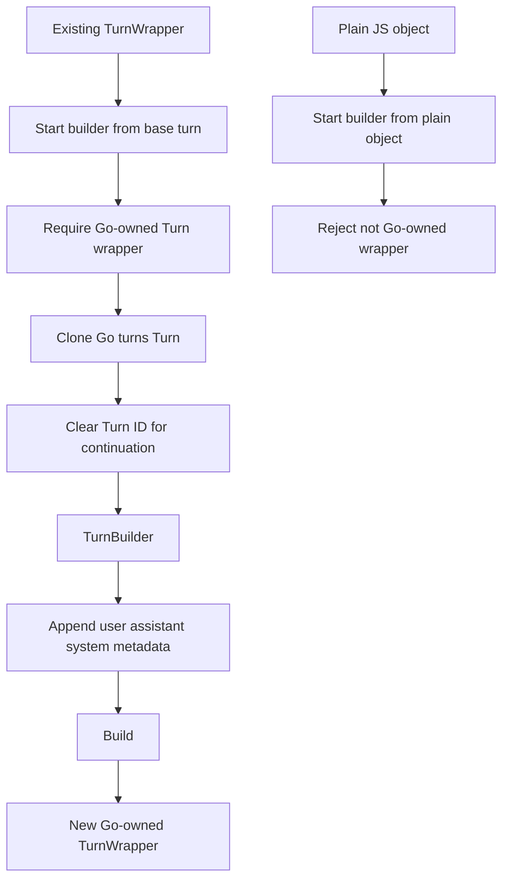

# JavaScript Turn append API design and implementation guide

## Executive summary

The hard-cut Geppetto JavaScript API made agent execution explicit: `agent.run(turn)` and `agent.runAsync(turn)` require a Go-owned `Turn` wrapper. That is the right execution contract, but the current turn ergonomics are still incomplete. JavaScript can build a fresh turn with `gp.turn().system(...).user(...).build()`, and a built turn can only `toJSON()` or `clone()`. It cannot be used directly as the base for the next turn.

This ticket designs the missing continuation API: a way to start from an existing Go-owned turn, append one or more blocks, and get a new Go-owned turn out. The preferred API is builder-based:

```js
const nextTurn = gp.turn(previousTurn)
  .assistant(result.text())
  .user("Now answer the follow-up.")
  .build();
```

The design keeps the existing wrapper-first rules:

- `gp.turn(existingTurn)` accepts only a Go-owned `Turn` wrapper, not a plain JS turn-shaped object.
- Append operations clone before mutation, so historical turns are never mutated in place.
- Appending creates a continuation turn and clears the previous `Turn.ID` by default, matching the Go session rule that a newly appended prompt must not overwrite persistence/hydration keyed by the old turn ID.
- `TurnWrapper` may also get convenience methods such as `appendUser(...)`, but those should delegate to the same builder path.

## Problem statement

The explicit-turn API deliberately removed hidden conversation state. That means JavaScript authors must include prior context when they want a multi-turn provider call. Today they must reconstruct prior blocks manually:

```js
const turn2 = gp.turn()
  .system(system)
  .user(firstPrompt)
  .assistant(firstAnswer)
  .user(secondPrompt)
  .build();
```

That is acceptable for a deterministic smoke test, but it is not ergonomic for real scripts. The natural operation is: "take this output turn, append the user's next message, and run again." The API should support that operation without reintroducing `agent.ask()` or hidden session state.

The missing capability is therefore not a chat API. It is a pure value transformation:

```text
old Turn wrapper + appended blocks -> new Turn wrapper
```

## Scope

In scope:

- Add a JS-facing continuation builder: `gp.turn(existingTurn)`.
- Add immutable append operations for system/user/assistant/metadata using the existing builder method names.
- Preserve Go-owned wrapper validation.
- Define turn ID semantics for continuation turns.
- Update TypeScript declarations, docs, examples, and tests.

Out of scope:

- `agent.ask(...)`, `agent.system(...)`, `gp.chat(...)`, or hidden agent transcript state.
- JS mutation of existing `TurnWrapper` objects.
- A full timeline or turn-store API. Storage is covered by `GP-JS-TURNSTORE-2026-06-02`.
- Arbitrary plain-object import of turns. A later import/serde API can be designed separately if needed.

## Current-state evidence

### Current JS turn builder only starts from an empty turn

`pkg/js/modules/geppetto/api_turn_builder.go` defines `turnBuilder` as:

```go
func (m *moduleRuntime) turnBuilder(call goja.FunctionCall) goja.Value {
    return m.newTurnBuilderObject(&turnBuilderRef{api: m, turn: &turns.Turn{}})
}
```

The call arguments are ignored. The builder can append blocks and metadata, then `build()` returns a `TurnWrapper`.

### Built turns expose only `toJSON` and `clone`

The same file defines `newTurnObject(...)` with only two methods:

```go
m.mustSet(o, "toJSON", func(goja.FunctionCall) goja.Value { ... })
m.mustSet(o, "clone", func(goja.FunctionCall) goja.Value { ... })
```

That means a script can copy or inspect a turn, but cannot start a builder from it.

### The Go turn type already supports clone-before-append

`pkg/turns/types.go` defines `Turn.Clone()`. It deep-copies the block slice and block payload maps, and clones metadata/data wrappers. This is the right primitive for immutable JS append semantics.

### The Go session layer already encodes the continuation ID rule

`pkg/inference/session/session.go` has `AppendNewTurnFromUserPrompts(...)`. When it clones the latest turn to preserve conversation context, it clears the cloned `Turn.ID`:

```go
seed = base.Clone()
seed.ID = ""
```

The comment explains why: each appended prompt is a new turn, and retaining the previous ID would overwrite prior turns in hydration/persistence keyed by `Turn.ID`. The JS continuation API should follow the same rule by default.

### Existing examples demonstrate the ergonomic gap

`examples/js/geppetto/30_real_provider_multiturn.js` currently reconstructs the second turn manually by repeating the first user prompt and appending the first assistant answer. That works as a smoke test, but it is exactly the kind of boilerplate the continuation API should remove.

## Proposed public API

### Primary API: `gp.turn(existingTurn?)`

Change `gp.turn()` so it accepts an optional base turn wrapper:

```ts
export function turn(base?: TurnWrapper): TurnBuilder;
```

Usage:

```js
const first = gp.turn()
  .system(system)
  .user("First question")
  .build();

const firstResult = agent.run(first);

const second = gp.turn(firstResult.outputTurn())
  .user("Follow-up question")
  .build();

const secondResult = agent.run(second);
```

This is the preferred shape because it keeps all append methods in one builder type. A caller does not need to learn a second API for appending to existing turns.

### Builder methods remain the same

`TurnBuilder` keeps the existing methods:

```ts
interface TurnBuilder {
  system(text?: string): TurnBuilder;
  user(text?: string | ((message: MessageBuilder) => void)): TurnBuilder;
  assistant(text?: string): TurnBuilder;
  metadata(key: string, value: unknown): TurnBuilder;
  build(): TurnWrapper;
}
```

The method names are already correct. The missing piece is only the optional base argument to `gp.turn(...)`.

### Optional convenience methods on built turns

After the base-builder behavior is in place, `TurnWrapper` can expose convenience methods that return built turns directly:

```ts
interface TurnWrapper {
  toJSON(): TurnJSON;
  clone(): TurnWrapper;
  appendSystem(text?: string): TurnWrapper;
  appendUser(text?: string | ((message: MessageBuilder) => void)): TurnWrapper;
  appendAssistant(text?: string): TurnWrapper;
  withMetadata(key: string, value: unknown): TurnWrapper;
}
```

These are optional. They should be implemented only if they do not create ambiguity. The canonical API should remain `gp.turn(existing).user(...).build()` because it composes multiple append operations in one fluent chain.

## Semantics

### Wrapper-only base turns

`gp.turn(base)` must accept only a Go-owned `TurnWrapper` or a trusted Go `*turns.Turn` reference. Passing a plain object should throw a `GoError` or `TypeError`:

```js
gp.turn({ blocks: [] }); // error: expected Go-owned Turn wrapper
```

This preserves the hard-cut contract and avoids a hidden import API.

### Immutable append

Appending must not mutate the base wrapper:

```js
const base = gp.turn().user("one").build();
const next = gp.turn(base).assistant("two").build();

base.toJSON().blocks.length; // 1
next.toJSON().blocks.length; // 2
```

Implementation should use `turn.Clone()` before every append, as the current builder already does.

### Continuation clears turn ID by default

When a builder starts from an existing built turn, the copied turn should clear `Turn.ID` by default. This matches `session.AppendNewTurnFromUserPrompts(...)` and prevents durable stores from overwriting an earlier turn under the same ID.

Recommended behavior:

| Operation | Turn.ID behavior |
|---|---|
| `turn.clone()` | preserves ID, because clone means exact copy. |
| `gp.turn(turn).build()` with no appended blocks | clears ID, because it is a continuation-builder result. |
| `gp.turn(turn).user(...).build()` | clears ID. |
| `gp.turn().user(...).build()` | no ID until run/session stamps one. |

If an exact clone is needed, users already have `turn.clone()`.

### Metadata append is still clone-based

`metadata(key, value)` should continue to clone the turn, set a canonical metadata key, and return a new builder. If metadata should preserve the previous turn ID for a specialized use case, that should be a separate explicit method or option later, not the default.

## Architecture



The implementation should be small because the current builder already has most of the machinery:

1. `turnBuilder(call)` inspects `call.Arguments[0]`.
2. If no argument is present, it behaves exactly as it does today.
3. If a base argument is present, it calls `requireTurnRef`.
4. It clones the turn, clears `ID`, and creates a `turnBuilderRef` from that clone.
5. Existing builder methods handle appends and `build()`.

Pseudocode:

```go
func (m *moduleRuntime) turnBuilder(call goja.FunctionCall) goja.Value {
    if len(call.Arguments) == 0 || isUndefinedOrNull(call.Arguments[0]) {
        return m.newTurnBuilderObject(&turnBuilderRef{api: m, turn: &turns.Turn{}})
    }

    base, err := m.requireTurnRef(call.Arguments[0])
    if err != nil {
        panic(m.vm.NewGoError(err))
    }
    next := base.turn.Clone()
    next.ID = ""
    return m.newTurnBuilderObject(&turnBuilderRef{api: m, turn: next})
}
```

## Example: replacing manual multi-turn reconstruction

Current example style:

```js
const turn2 = gp.turn()
  .system(system)
  .user(firstPrompt)
  .assistant(text1)
  .user(secondPrompt)
  .build();
```

With the proposed API:

```js
const result1 = agent.run(turn1);

const turn2 = gp.turn(result1.outputTurn())
  .user(secondPrompt)
  .build();

const result2 = agent.run(turn2);
```

This makes the API easier without hiding state. The previous context is still a visible `TurnWrapper`; the caller explicitly chooses it as the base.

## Decision records

### DR-1: Prefer `gp.turn(existingTurn)` over mutable `turn.append(...)`

Status: proposed.

Options:

1. `gp.turn(existingTurn).user(...).build()`.
2. `existingTurn.appendUser(...).appendAssistant(...)` returning a new `TurnWrapper` each time.
3. Mutating `existingTurn.user(...)` in place.

Decision: choose option 1 as the primary API. Option 2 may be added as convenience later. Reject option 3.

Rationale: the builder shape already exists, supports multi-step append chains, and keeps built turns as stable values. Mutating built turns would make run traceability and persistence much harder to reason about.

### DR-2: Reject plain JS turn-shaped objects

Status: proposed.

Decision: `gp.turn(existing)` should require a trusted Go-owned turn wrapper.

Rationale: accepting plain objects would create an implicit import/serde API without validation rules. The hard-cut API deliberately rejects structural lookalikes for domain objects.

### DR-3: Clear `Turn.ID` when continuing from an existing turn

Status: proposed.

Decision: `gp.turn(existingTurn)` clears the copied `Turn.ID` before returning the builder.

Rationale: the Go session API already does this when appending prompts to a cloned prior turn. A continuation turn is a new turn with prior context, not the same persisted turn.

## Implementation plan

### Phase 1: Runtime API

Files:

- `pkg/js/modules/geppetto/api_turn_builder.go`
- `pkg/js/modules/geppetto/module_hardcut_test.go` or new `api_turn_builder_test.go`

Tasks:

1. Update `turnBuilder(call)` to accept optional base.
2. Add helper `isNilJSValue(v goja.Value)` if useful.
3. Clear copied `Turn.ID` for base turns.
4. Keep `turn.clone()` preserving ID.
5. Add tests:
   - `gp.turn(existing).user(...).build()` appends to base blocks.
   - base turn is unchanged.
   - base turn ID is cleared in the continuation result.
   - `turn.clone()` preserves ID.
   - `gp.turn({ blocks: [] })` rejects plain objects.
   - multimodal user builder still works from a base turn.

### Phase 2: TypeScript declarations

Files:

- `pkg/doc/types/geppetto.d.ts`
- `pkg/js/modules/geppetto/spec/geppetto.d.ts.tmpl`
- `pkg/js/modules/geppetto/dts_parity_test.go` if needed

Tasks:

1. Change `turn(): TurnBuilder` to `turn(base?: TurnWrapper): TurnBuilder`.
2. Document continuation ID semantics in comments.
3. Add optional `TurnWrapper` append convenience methods only if implemented.

### Phase 3: Docs and examples

Files:

- `pkg/doc/topics/13-js-api-reference.md`
- `pkg/doc/topics/14-js-api-user-guide.md`
- `pkg/doc/tutorials/05-js-api-getting-started.md`
- `examples/js/geppetto/30_real_provider_multiturn.js`
- possible new `examples/js/geppetto/34_turn_append_continuation.js`

Tasks:

1. Replace manual multi-turn reconstruction examples with `gp.turn(result.outputTurn()).user(...).build()` where appropriate.
2. Add a short section: "Continuing from an existing turn".
3. Explain that `agent` remains stateless and the base turn is explicit.
4. Explain that continuation clears `Turn.ID` to avoid persistence overwrites.

### Phase 4: Validation

Commands:

```bash
go test ./pkg/js/modules/geppetto -count=1
go test ./pkg/js/... ./cmd/examples/geppetto-js-run -count=1
go test -tags geppetto_js_hardcut_contract ./pkg/js/modules/geppetto -run TestHardCutPublicSurfaceContract -count=1
```

If examples are updated:

```bash
go run ./cmd/examples/geppetto-js-run run \
  --script examples/js/geppetto/30_real_provider_multiturn.js \
  --profile-registries "$HOME/.config/pinocchio/profiles.yaml" \
  --profile default \
  --timeout-ms 120000
```

## Risks and mitigations

- Risk: clearing `Turn.ID` surprises callers expecting exact clone semantics. Mitigation: document the difference between `turn.clone()` and `gp.turn(turn).build()`.
- Risk: users ask for plain object import. Mitigation: keep this ticket focused; design `gp.turn.fromJSON(...)` separately if needed.
- Risk: convenience append methods on `TurnWrapper` create two canonical APIs. Mitigation: start with `gp.turn(existing)` only; add convenience methods only after docs settle.
- Risk: appending assistant output from `result.text()` loses non-text assistant blocks. Mitigation: recommend using `result.outputTurn()` as the base, not rebuilding from `result.text()` unless text-only behavior is intended.

## Open questions

1. Should `gp.turn(existing).build()` with no appended blocks clear the ID, or should ID clearing happen only after the first append? This guide recommends clearing immediately because calling the builder means creating a continuation value.
2. Should there be an explicit `.newID()` / `.preserveID()` option for advanced persistence workflows?
3. Should `TurnWrapper` convenience methods be included in the first implementation or deferred until the builder API is proven?

## References

- `pkg/js/modules/geppetto/api_turn_builder.go` — current JS turn builder and built turn wrapper.
- `pkg/turns/types.go` — `Turn.Clone()` semantics.
- `pkg/inference/session/session.go` — `AppendNewTurnFromUserPrompts(...)` continuation and ID-clearing behavior.
- `examples/js/geppetto/30_real_provider_multiturn.js` — current manual reconstruction that the continuation API should simplify.
- `pkg/js/modules/geppetto/api_agent.go` — explicit-turn-only agent execution contract.
