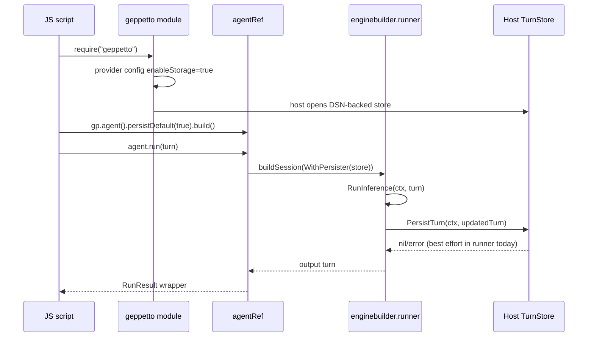

# JavaScript turn store persistence design and implementation guide

## Executive summary

Geppetto already has the critical hook needed for JavaScript turn persistence: `geppettomodule.Options.DefaultPersister` is copied into each JS agent session and then into `enginebuilder.WithPersister(...)`. The enginebuilder runner invokes that persister after a successful run. Pinocchio already has the concrete SQLite turn-store implementation and the CLI `--turns-dsn` / `--turns-db` wiring.

The missing piece is a clean integration contract for xgoja hosts and JavaScript authors: a host can opt into default turn persistence from provider/module configuration, and JS can explicitly choose a configured store when needed. This guide proposes a wrapper-first API that keeps Geppetto storage-agnostic at its core while making Pinocchio-style turn storage easy to wire by default.

Recommended shape:

```js
const gp = require("geppetto");

const store = gp.turnStores.default();
const agent = gp.agent()
  .inference(settings)
  .persistTo(store)       // explicit override; defaults may also be host-configured
  .build();

const result = agent.run(turn, { tags: { sessionId: "session-123" } });
store.list({ sessionId: "session-123", phase: "final", limit: 20 });
```

Provider configuration should support a host-mediated version of Pinocchio's `--turns-dsn` convention:

```json
{
  "enableStorage": true,
  "turns": {
    "dsn": "file:/tmp/pinocchio-turns.sqlite?_journal_mode=WAL&_busy_timeout=5000",
    "phase": "final",
    "default": true
  }
}
```

## Problem statement

The hard-cut Geppetto JS API now supports explicit Go-owned turns and agent runs, but there is no JS-visible storage API. That means xgoja applications that want durable conversations must currently build their own Go-side `DefaultPersister` or stay in Pinocchio-specific command paths.

The user-facing concern is specific: make Pinocchio's `--turns-dsn`-style turn storage easy to wire by default through module/provider configuration, likely gated by an `enableStorage` flag, and also expose it through the JS API for explicit use.

## Scope

In scope:

- Default turn persistence for `agent.run(...)` and `agent.runAsync(...)` through module options.
- Provider configuration fields for enabling a host-supplied turn store.
- JS wrappers for default/configured turn stores.
- JS read APIs useful for resume/debugging: `list(...)`, `loadLatest(...)`, and `close()`.
- A Go adapter from a concrete host store to `enginebuilder.TurnPersister`.
- Documentation and tests that prove Geppetto remains storage-backend-agnostic.

Out of scope:

- Owning Pinocchio's timeline/sessionstream database in Geppetto.
- Exposing arbitrary SQL to JS.
- Replacing Pinocchio's existing CLI `--turns-dsn` flags.
- Hidden chat state or implicit append semantics; JS runs still receive explicit `Turn` wrappers.

## Current-state architecture and evidence

### Geppetto JS module already has a default persister hook

`geppetto/pkg/js/modules/geppetto/module.go` defines module options. Lines 36-54 include `DefaultPersister enginebuilder.TurnPersister`, and `moduleRuntime` stores it at lines 101-102. `newRuntime(...)` copies `opts.DefaultPersister` into `m.defaultPersister` at lines 125-130.

```text
Options.DefaultPersister -> moduleRuntime.defaultPersister
```

### JS agents pass the default persister into sessions

`geppetto/pkg/js/modules/geppetto/api_agent.go` builds sessions through `agentRef.buildSession(...)`. Lines 273-286 show the bridge from JS agent config into the lower-level builder:

- `snapshotHook: a.api.defaultSnapshotHook`
- `persister: a.api.defaultPersister`

`geppetto/pkg/js/modules/geppetto/api_sessions.go` then applies `enginebuilder.WithPersister(...)` when `b.persister != nil` at lines 44-46.

```text
agent.run(turn)
  -> agentRef.startRun(...)
  -> agentRef.buildSession(...)
  -> builderRef.buildSession(...)
  -> enginebuilder.WithPersister(defaultPersister)
```

### Enginebuilder best-effort persists successful final turns

`geppetto/pkg/inference/toolloop/enginebuilder/builder.go` defines `TurnPersister` at lines 23-29. The runner records session/inference metadata at lines 174-183 and 220-233, then invokes persistence at lines 236-238 when `err == nil`, the persister is present, and an updated turn exists.

This is the right persistence seam for JS agents because both synchronous and async JS agent runs pass through the same session runner.

### Pinocchio already owns CLI turn persistence setup

`pinocchio/pkg/cmds/cmdlayers/helpers.go` exposes CLI helper fields:

- `TimelineDSN` / `TimelineDB` at lines 26-27.
- `TurnsDSN` / `TurnsDB` at lines 28-29.
- CLI field docs for `turns-dsn` and `turns-db` at lines 108-117.

`pinocchio/pkg/cmds/run/context.go` carries these values in `PersistenceSettings` at lines 41-46 and wires them through `WithPersistenceSettings(...)` at lines 154-159.

`pinocchio/pkg/cmds/chat_persistence.go` contains a concrete CLI persister. `cliTurnStorePersister.PersistTurn(...)` serializes a `turns.Turn` to YAML, extracts runtime and inference metadata, and calls `store.Save(...)` at lines 38-77. `openCLITurnStore(...)` opens the SQLite store from `TurnsDSN` or `TurnsDB` at lines 148-182.

### Pinocchio's turn store API is useful but should not be imported blindly into Geppetto

`pinocchio/pkg/persistence/chatstore/turn_store.go` defines:

```go
type TurnStore interface {
    Save(ctx context.Context, convID, sessionID, turnID, phase string, createdAtMs int64, payload string, opts TurnSaveOptions) error
    List(ctx context.Context, q TurnQuery) ([]TurnSnapshot, error)
    LoadLatestTurn(ctx context.Context, convID, phase string) (*TurnSnapshot, error)
    Close() error
}
```

This API is good evidence for what JS needs, but importing Pinocchio into Geppetto would invert ownership. Prefer a small Geppetto-side adapter interface and let Pinocchio/xgoja hosts supply concrete implementations.

## Proposed solution

### Design principle

Geppetto should define a minimal turn storage *capability*, not a SQLite store. Pinocchio or an xgoja host can implement that capability with the existing SQLite turn store.

```text
JS script
  -> require("geppetto")
  -> gp.turnStores.default()        (Go-owned wrapper)
  -> agent.persistTo(store).build() (explicit)
  -> enginebuilder.TurnPersister    (existing Geppetto seam)
  -> host-provided Pinocchio store  (SQLite, DSN, lifecycle)
```

### Go API sketch

Add a small host-facing capability to `pkg/js/modules/geppetto`:

```go
type TurnStore interface {
    PersistTurn(ctx context.Context, t *turns.Turn) error
    ListTurns(ctx context.Context, q TurnStoreQuery) ([]TurnStoreSnapshot, error)
    LoadLatestTurn(ctx context.Context, q TurnStoreLatestQuery) (*TurnStoreSnapshot, error)
    Close() error
}

type TurnStoreQuery struct {
    ConvID    string
    SessionID string
    Phase     string
    SinceMs   int64
    Limit     int
}

type TurnStoreSnapshot struct {
    ConvID      string
    SessionID   string
    TurnID      string
    Phase       string
    RuntimeKey  string
    InferenceID string
    CreatedAtMs int64
    Turn        *turns.Turn
}

type Options struct {
    // Existing:
    DefaultPersister enginebuilder.TurnPersister

    // New:
    DefaultTurnStore TurnStore
    TurnStores       map[string]TurnStore
    EnableStorage    bool
}
```

Implementation note: `TurnStore` can embed or wrap `enginebuilder.TurnPersister`, but read APIs should stay separate from the existing persister because `enginebuilder.TurnPersister` intentionally only writes final turns.

### Provider config sketch

Extend `pkg/js/modules/geppetto/provider/provider.go` `Config` and JSON schema:

```go
type Config struct {
    // Existing profile/tool flags...
    EnableStorage bool `json:"enableStorage,omitempty"`
    Turns *TurnsConfig `json:"turns,omitempty"`
}

type TurnsConfig struct {
    DSN     string `json:"dsn,omitempty"`
    DB      string `json:"db,omitempty"`
    Default bool   `json:"default,omitempty"`
    Phase   string `json:"phase,omitempty"`
    Readonly bool  `json:"readonly,omitempty"`
}
```

Host services should resolve storage because `providerapi.ModuleContext.Host` is the host injection seam. `go-go-goja/pkg/xgoja/providerapi/module.go` lines 13-19 show module factories receive config and host services. `geppetto/pkg/js/modules/geppetto/provider/provider.go` already requires provider-specific host services at lines 27-29 and calls `host.GeppettoOptions(ctx.Context, cfg)` at lines 62-69.

Add an optional host method without breaking existing hosts by using a second interface assertion:

```go
type StorageHostServices interface {
    GeppettoTurnStores(ctx context.Context, cfg Config) (geppettomodule.StorageOptions, error)
}
```

Provider behavior:

```go
opts, err := host.GeppettoOptions(ctx.Context, cfg)
if cfg.EnableStorage {
    storageHost, ok := ctx.Host.(StorageHostServices)
    if !ok { return error("enableStorage requires GeppettoTurnStores host capability") }
    storage, err := storageHost.GeppettoTurnStores(ctx.Context, cfg)
    opts.DefaultTurnStore = storage.Default
    if cfg.Turns.Default { opts.DefaultPersister = storage.Default }
}
```

### JS API sketch

Expose a wrapper-first namespace:

```ts
interface TurnStoresNamespace {
  default(): TurnStore;
  get(name: string): TurnStore;
}

interface TurnStore {
  name(): string;
  list(query: TurnStoreQuery): TurnSnapshot[];
  loadLatest(query: { convId?: string; sessionId?: string; phase?: string }): TurnSnapshot | null;
  close(): void;
}

interface AgentBuilder {
  persistTo(store: TurnStore | null): AgentBuilder;
  persistDefault(enabled?: boolean): AgentBuilder;
}
```

Use Go-owned wrappers just like current `Turn` wrappers. Do not accept arbitrary JS objects as stores unless they were registered by Go host code.

### JS examples

Default storage through provider configuration:

```js
const gp = require("geppetto");

const settings = gp.inferenceProfiles.resolve("default");
const agent = gp.agent()
  .inference(settings)
  .persistDefault(true)
  .build();

const turn = gp.turn()
  .metadata("sessionID", "demo-session")
  .user("Answer with one sentence.")
  .build();

const result = agent.run(turn);
console.log(result.text());

const latest = gp.turnStores.default().loadLatest({ sessionId: "demo-session", phase: "final" });
console.log(latest.turn.toJSON());
```

Explicit store selection:

```js
const durable = gp.turnStores.get("durable");
const scratch = gp.turnStores.get("scratch");

const agent = gp.agent()
  .inference(settings)
  .persistTo(durable)
  .build();

agent.run(turn);
console.log(scratch.list({ sessionId: "dev", limit: 5 }));
```

### Sequence diagram



## Decision records

### DR-1: Keep concrete SQLite setup in host/Pinocchio code

Status: proposed.

Context: Pinocchio already has a SQLite turn store, DSN helpers, and CLI flags. Geppetto is a lower-level inference and JS binding module.

Options:

1. Import Pinocchio's `chatstore` into Geppetto.
2. Move `chatstore` into Geppetto.
3. Define a minimal Geppetto turn-store capability and let hosts implement it.

Decision: choose option 3 for the JS module API. Consider moving a reusable store package later only if multiple non-Pinocchio hosts need the concrete SQLite implementation.

Rationale: avoids dependency inversion, keeps Geppetto provider-agnostic, and still supports Pinocchio's `--turns-dsn` behavior through host services.

### DR-2: Default persistence is opt-in at provider/module config

Status: proposed.

Decision: require `enableStorage: true` before provider config opens DSN-backed storage. If `turns.default` is true, install the store as `DefaultPersister`.

Rationale: storage has filesystem/security/lifecycle implications. xgoja hosts should choose whether package config may open files.

### DR-3: Use Go-owned wrappers for stores and snapshots

Status: proposed.

Decision: `gp.turnStores.default()` and `gp.turnStores.get(name)` return Go-owned wrappers. `agent.persistTo(...)` requires that wrapper.

Rationale: this matches the hard-cut JS API's wrapper-first philosophy and avoids arbitrary JS maps masquerading as persistence implementations.

### DR-4: Preserve explicit turn execution

Status: proposed.

Decision: storage APIs must not reintroduce hidden chat state. `agent.run(turn)` and `agent.runAsync(turn)` still require an explicit `Turn` wrapper.

Rationale: durable storage should make turns discoverable/resumable, not mutate the execution model.

## Implementation plan

### Phase 1: Add Geppetto turn-store wrapper types

Files:

- `geppetto/pkg/js/modules/geppetto/module.go`
- `geppetto/pkg/js/modules/geppetto/api_types.go`
- new `geppetto/pkg/js/modules/geppetto/api_turn_store.go`

Tasks:

1. Define host-facing store interfaces and snapshot structs.
2. Add `Options.DefaultTurnStore`, `Options.TurnStores`, and `Options.EnableStorage`.
3. Store these fields in `moduleRuntime`.
4. Add `turnStoreRef` Go-owned wrapper.
5. Add `gp.turnStores.default()` and `gp.turnStores.get(name)` exports.
6. Add unit tests requiring wrappers and rejecting arbitrary JS objects.

### Phase 2: Wire stores into agent builders

Files:

- `geppetto/pkg/js/modules/geppetto/api_agent.go`
- `geppetto/pkg/js/modules/geppetto/api_sessions.go`

Tasks:

1. Add `persister enginebuilder.TurnPersister` or `turnStore TurnStore` field to `agentBuilderRef` and `agentRef`.
2. Add `.persistTo(store)` and `.persistDefault(enabled?)` methods.
3. Resolve builder persister precedence:
   - explicit `.persistTo(store)` wins;
   - `.persistDefault(true)` uses `DefaultTurnStore` or `DefaultPersister`;
   - `DefaultPersister` remains the fallback for host-global default behavior.
4. Ensure both `run` and `runAsync` use the selected persister via existing `buildSession` path.

Pseudocode:

```go
func (b *agentBuilderRef) persistTo(call goja.FunctionCall) goja.Value {
    if null { b.persistMode = persistDisabled; return o }
    store := requireTurnStoreRef(call.Arguments[0])
    b.persistMode = persistExplicit
    b.persister = store
    return o
}

func (a *agentRef) buildSession(sinks []events.EventSink) (*sessionRef, error) {
    p := a.api.defaultPersister
    if a.persistMode == persistExplicit { p = a.persister }
    if a.persistMode == persistDisabled { p = nil }
    b := &builderRef{persister: p, ...}
    return b.buildSession()
}
```

### Phase 3: Extend provider config

Files:

- `geppetto/pkg/js/modules/geppetto/provider/provider.go`
- `geppetto/pkg/js/modules/geppetto/provider/provider_test.go`

Tasks:

1. Add `enableStorage` and `turns` config schema fields.
2. Define optional storage host interface.
3. If storage config is present without `enableStorage`, return a clear error.
4. If `enableStorage` is true and host lacks storage services, return a clear error.
5. Test config decoding and host wiring.

### Phase 4: Add Pinocchio host adapter

Files likely in Pinocchio:

- `pinocchio/pkg/cmds/chat_persistence.go`
- xgoja host package that implements Geppetto provider host services
- tests beside the xgoja provider host

Tasks:

1. Reuse `openCLITurnStore(...)` or extract shared DSN-open logic.
2. Implement `geppettomodule.TurnStore` by adapting `chatstore.TurnStore`.
3. Serialize with `turns/serde` as the existing CLI persister does.
4. Map `TurnStoreQuery` to `chatstore.TurnQuery`.
5. Decode `TurnSnapshot.Payload` back into a Go-owned `turns.Turn` wrapper.
6. Ensure store close is tied to xgoja runtime/module lifetime.

### Phase 5: Docs and examples

Files:

- `geppetto/pkg/doc/topics/13-js-api-reference.md`
- `geppetto/pkg/doc/topics/14-js-api-user-guide.md`
- `geppetto/pkg/doc/types/geppetto.d.ts`
- `geppetto/examples/js/geppetto/34_turn_store_persistence.js`

Tasks:

1. Document provider config.
2. Document JS store APIs and result shapes.
3. Add examples for default persistence and explicit readback.
4. Add a real-provider smoke only when a profile and writable DB are available.

## Testing strategy

Unit tests:

- `gp.turnStores.default()` returns a wrapper when host configured storage.
- `gp.turnStores.default()` throws a clear error when no default store exists.
- `agent.persistTo({})` rejects arbitrary JS objects.
- `agent.persistTo(store).run(turn)` calls `PersistTurn(...)` once with an output turn.
- `agent.persistTo(null)` disables a host default persister.
- `runAsync` persistence fires after successful completion.
- Failed runs do not persist final turns, matching current enginebuilder behavior.

Provider tests:

- `enableStorage=false` plus `turns` config errors.
- `enableStorage=true` plus no storage host errors.
- `enableStorage=true` plus host storage installs default store and default persister.

Integration tests:

- Pinocchio/xgoja host opens a temporary SQLite store from `turns.db` config.
- JS runs an agent, reads latest stored turn, and sees matching `sessionID`, `turnID`, `runtimeKey`, and `inferenceID`.

## Risks and mitigations

- Risk: Geppetto importing Pinocchio creates an undesirable dependency cycle. Mitigation: keep the concrete SQLite adapter in Pinocchio or a neutral storage package.
- Risk: storage config can unexpectedly open files. Mitigation: require `enableStorage: true` and host service support.
- Risk: write failures are currently best-effort in enginebuilder. Mitigation: document current semantics and consider a future strict persistence mode if callers need failure propagation.
- Risk: `convID` and `sessionID` semantics are inconsistent. Mitigation: define JS query names and host adapter mapping explicitly; use session ID as default conversation ID for Pinocchio compatibility.
- Risk: store close races with in-flight `runAsync`. Mitigation: tie store lifetime to runtime lifetime and close only after owner/runtime teardown or explicit JS `close()` when no active runs use the store.

## Open questions

1. Should persistence write failures become visible to JS through `result.persistenceError()` or an EventEmitter event, or remain best-effort as they are today?
2. Should Geppetto expose a DSN opener directly (`gp.turnStores.sqlite(...)`) if no Pinocchio host is present, or should all concrete store creation remain host-owned?
3. Should `loadLatest` use `sessionId` or `convId` as its primary key in JS docs? Pinocchio's current `loadLatestCLIFinalTurn` calls `LoadLatestTurn(ctx, sessionID, "final")`, even though the lower-level store parameter is named `convID`.

## References

- `geppetto/pkg/js/modules/geppetto/module.go` — module options include `DefaultPersister` and provider/runtime configuration.
- `geppetto/pkg/js/modules/geppetto/api_agent.go` — JS agent builder and run paths; default persister enters session construction.
- `geppetto/pkg/js/modules/geppetto/api_sessions.go` — builder applies `enginebuilder.WithPersister(...)`.
- `geppetto/pkg/inference/toolloop/enginebuilder/builder.go` — `TurnPersister` interface and best-effort final turn persistence.
- `geppetto/pkg/js/modules/geppetto/provider/provider.go` — xgoja provider config and host service seam.
- `go-go-goja/pkg/xgoja/providerapi/module.go` — module context includes JSON config and host services.
- `pinocchio/pkg/cmds/cmdlayers/helpers.go` — CLI exposes `--turns-dsn` and `--turns-db`.
- `pinocchio/pkg/cmds/run/context.go` — persistence settings propagated through command run context.
- `pinocchio/pkg/cmds/chat_persistence.go` — concrete CLI turn-store persister and SQLite opener.
- `pinocchio/pkg/persistence/chatstore/turn_store.go` — existing Pinocchio turn store interface.
