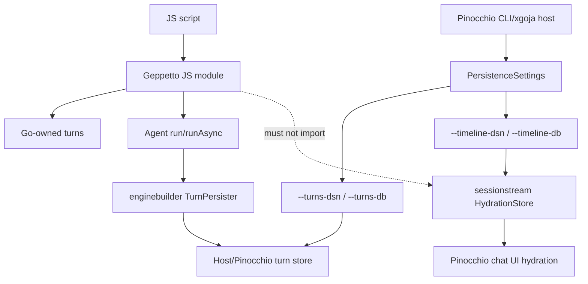

# Timeline storage ownership and integration boundary guide

## Executive summary

Timeline storage is probably not a Geppetto concern. Geppetto should expose inference turns, event sinks, run metadata, and optional final-turn persistence hooks. Pinocchio should continue to own timeline/sessionstream storage because timeline snapshots are UI/application state: visible messages, tool/reasoning entities, hydration, continuation display, and chat application behavior.

This ticket should harden that boundary instead of moving timeline APIs into Geppetto. The implementation work belongs mostly in Pinocchio and xgoja host wiring: document how `--timeline-dsn` / `--timeline-db` relate to `--turns-dsn` / `--turns-db`, ensure the two stores can be configured together, and provide an xgoja host capability that can hydrate a Pinocchio timeline from Geppetto turn events without making Geppetto depend on sessionstream.

Recommended direction:

```text
Geppetto JS module
  owns: Turn wrappers, Agent runs, EventEmitter events, final-turn persister hook
  does not own: UI timeline schema, sessionstream hydration DB, chat application replay

Pinocchio/xgoja host
  owns: --timeline-dsn, --timeline-db, sessionstream HydrationStore,
        chatapp RunnerOptions, UI hydration snapshots, turn-store resume policy
```

## Problem statement

The storage discussion has two related but different concerns:

1. Durable turn storage: persist and query final Geppetto turns, Pinocchio `--turns-dsn` style.
2. Durable timeline storage: persist UI/application timeline snapshots, Pinocchio `--timeline-dsn` style.

The first concern has a natural Geppetto integration seam through `enginebuilder.TurnPersister`. The second concern should remain at the Pinocchio/sessionstream layer, because the timeline is not just a model turn. It represents UI-visible state and application-specific entities. If Geppetto absorbs timeline storage, it risks coupling the JS module to Pinocchio's UI model and turning the lower-level inference package into an application framework.

## Scope

In scope:

- Clarify the Geppetto/Pinocchio ownership boundary for timeline storage.
- Propose xgoja host/provider seams for enabling timeline persistence alongside turn persistence.
- Document how `--timeline-dsn` and `--turns-dsn` should compose.
- Provide intern-ready implementation steps for Pinocchio-side integration.
- Define tests that prevent accidental Geppetto dependency on Pinocchio/sessionstream.

Out of scope:

- Adding `gp.timeline(...)` to Geppetto now.
- Moving sessionstream types into Geppetto.
- Replacing Pinocchio's existing chatapp runner or hydration store.
- Designing a general event-sourcing framework.

## Current-state architecture and evidence

### Pinocchio exposes both timeline and turn storage flags

`pinocchio/pkg/cmds/cmdlayers/helpers.go` defines helper settings with both storage concerns:

- `TimelineDSN` and `TimelineDB` at lines 26-27.
- `TurnsDSN` and `TurnsDB` at lines 28-29.

The CLI field definitions make the split explicit:

- `timeline-dsn` / `timeline-db` are described as durable timeline snapshots at lines 96-105.
- `turns-dsn` / `turns-db` are described as durable turn snapshots at lines 108-117.

`pinocchio/pkg/cmds/run/context.go` keeps those values together in `PersistenceSettings` at lines 41-46 and accepts them through `WithPersistenceSettings(...)` at lines 154-159.

### Pinocchio already has separate open paths for timeline and turn stores

`pinocchio/pkg/cmds/chat_persistence.go` has two separate open functions:

- `openCLISessionstreamHydrationStore(...)` opens timeline/sessionstream hydration storage from `TimelineDSN` or `TimelineDB` at lines 91-120.
- `openCLITurnStore(...)` opens the SQLite turn store from `TurnsDSN` or `TurnsDB` at lines 148-182.

This is good architecture: timeline and turn storage are related but not the same resource.

### Pinocchio interactive chat wires both stores into application state

`pinocchio/pkg/cmds/cmd.go` passes helper settings into `run.PersistenceSettings` at lines 362-367. Later, the chat path opens both stores at lines 1432-1441:

```text
openCLISessionstreamHydrationStore(rc.Persistence, reg)
openCLITurnStore(rc.Persistence)
```

The interactive runner then uses both:

- `chatapp.NewRunner(commandRunnerOptionsWithPersistence(..., hydrationStore, turnStore))` at line 1465.
- `commandRunnerOptionsWithPersistence(...)` passes `HydrationStore` and `TurnStore` into `chatapp.RunnerOptions` at lines 526-532.
- `pinui.NewChatAppBackend(..., pinui.WithTurnPersister(turnPersister))` at lines 1472-1476 wires final-turn persistence.

### Timeline hydration is application/UI state, not just inference output

`pinocchio/pkg/cmds/cmd.go` appends `snapshotFromTurnForHydration(...)` when entering continuation mode at lines 1520-1525. The comment explains that this hydrates bobatea directly so prior exchange is visible without replaying through the backend or issuing a second provider call.

That is UI behavior. It belongs in Pinocchio's chat application layer, not in Geppetto's inference/module layer.

### Geppetto's JS module has no timeline API and should stay storage-neutral

Geppetto's JS module currently exposes explicit turns and agents. `geppetto/pkg/js/modules/geppetto/api_turn_builder.go` has an immutable builder style for turns and only exposes built turn methods `toJSON()` and `clone()` at lines 105-121. `api_agent.go` exposes `agent.run(...)` and `agent.runAsync(...)` for explicit turns at lines 223-254.

The only storage-like Geppetto seam is lower-level final-turn persistence through `DefaultPersister` in `module.go` and `enginebuilder.TurnPersister` in `enginebuilder/builder.go`. There is no need to add timeline semantics to the JS public API for the first storage integration.

## Proposed boundary

### Ownership table

| Concern | Owner | Why |
|---|---|---|
| Go-owned `Turn` wrappers | Geppetto | Core inference payload and JS API contract. |
| `agent.run(turn)` / `agent.runAsync(turn)` | Geppetto | Core inference execution. |
| Final-turn persister hook | Geppetto | Already in `enginebuilder.TurnPersister`; backend-independent. |
| SQLite turn-store implementation | Pinocchio or neutral package | Existing implementation is Pinocchio-owned and CLI-specific. |
| `--turns-dsn` / `--turns-db` flags | Pinocchio | CLI/user workflow. |
| `--timeline-dsn` / `--timeline-db` flags | Pinocchio | Timeline/sessionstream is application/UI state. |
| Sessionstream `HydrationStore` | Pinocchio/sessionstream | UI hydration and timeline schema. |
| `gp.timeline(...)` JS API | Not now | Would couple Geppetto to application timeline semantics. |

### Architecture diagram



### Provider/config strategy

The Geppetto provider can accept storage-related config only for host mediation. It should not implement timeline storage itself.

Recommended package config shape:

```json
{
  "enableStorage": true,
  "turns": {
    "dsn": "file:/tmp/turns.sqlite?_journal_mode=WAL&_busy_timeout=5000",
    "default": true
  },
  "timeline": {
    "dsn": "file:/tmp/timeline.sqlite?_journal_mode=WAL&_busy_timeout=5000",
    "owner": "pinocchio"
  }
}
```

Semantics:

- `turns` may install `geppettomodule.Options.DefaultPersister` and a JS-visible `gp.turnStores.default()` wrapper.
- `timeline` is accepted only if the host implements a Pinocchio/sessionstream host capability.
- The Geppetto module should not expose `gp.timeline` unless a later ticket explicitly designs a host-owned wrapper namespace.
- If the Geppetto provider sees `timeline` config but the host does not provide timeline services, it should error with: `geppetto provider timeline config requires host timeline services`.

### Host service sketch

Add optional interfaces in the provider package. Keep them host-facing, not JS-facing:

```go
type StorageHostServices interface {
    GeppettoTurnStores(ctx context.Context, cfg Config) (geppettomodule.StorageOptions, error)
}

type TimelineHostServices interface {
    GeppettoTimelineStorage(ctx context.Context, cfg Config) (TimelineStorageHandle, error)
}

type TimelineStorageHandle interface {
    Close() error
}
```

The timeline handle does not need to cross into JS yet. It exists so a Pinocchio xgoja host can open/close resources consistently when module config asks for both `turns` and `timeline`.

### Pinocchio integration plan

Pinocchio should factor the duplicated CLI/xgoja setup into reusable functions:

```go
type StorageConfig struct {
    TimelineDSN string
    TimelineDB  string
    TurnsDSN    string
    TurnsDB     string
}

type OpenedStorage struct {
    HydrationStore sessionstream.HydrationStore
    TurnStore      chatstore.TurnStore
    Close          func()
}

func OpenStorage(ctx context.Context, cfg StorageConfig, reg *sessionstream.SchemaRegistry) (*OpenedStorage, error) {
    hydration, closeHydration, err := openCLISessionstreamHydrationStore(...)
    turnStore, closeTurns, err := openCLITurnStore(...)
    return &OpenedStorage{..., Close: compose(closeHydration, closeTurns)}, nil
}
```

The current CLI path can keep calling existing helpers, but xgoja host code can use the same helper to avoid DSN behavior drift.

## API recommendations

### Do not add `gp.timeline(...)` now

A tempting API is:

```js
const timeline = gp.timeline.default();
timeline.snapshots({ sessionId });
```

Do not add this in the first pass. The timeline contains application-specific UI entities, hydration behavior, and chat runner state. A generic Geppetto API would either be too weak to be useful or too tightly coupled to Pinocchio.

### Add docs-only provider boundary for timeline config

If package config supports a `timeline` stanza, document it as host-owned:

```ts
interface GeppettoProviderConfig {
  enableStorage?: boolean;
  turns?: {
    dsn?: string;
    db?: string;
    default?: boolean;
    phase?: "final" | string;
  };
  timeline?: {
    dsn?: string;
    db?: string;
    owner?: "pinocchio";
  };
}
```

JS scripts should not receive a timeline wrapper by default. The useful JS-level API remains turn-store readback and explicit runs.

## Decision records

### DR-1: Timeline remains Pinocchio/sessionstream-owned

Status: proposed.

Context: Timeline snapshots are consumed by Pinocchio's chat runner and UI hydration. Geppetto has no current sessionstream dependency and should remain focused on inference turns and providers.

Decision: do not add timeline storage types or `gp.timeline` to Geppetto in this ticket.

Consequences:

- Geppetto stays reusable outside Pinocchio.
- Pinocchio keeps full control over UI timeline schema and migration.
- xgoja hosts can still configure timeline resources through host services.

### DR-2: Turn storage and timeline storage remain separate even when opened together

Status: proposed.

Context: Pinocchio opens turn storage and timeline storage through separate helpers. The CLI exposes separate flags.

Decision: keep separate config blocks and handles: `turns` and `timeline`.

Consequences:

- Users can enable only final-turn storage, only timeline storage, or both.
- Bugs in one store do not imply ownership confusion in the other.
- Tests can validate each path independently.

### DR-3: Provider accepts timeline config only as a host-mediated capability

Status: proposed.

Decision: if provider config contains `timeline`, require an xgoja host capability. Do not silently ignore timeline config.

Rationale: silent ignoring would make storage bugs hard to diagnose. Host-mediated setup makes file/network permission decisions explicit.

## Implementation plan

### Phase 1: Document and assert the boundary

Files:

- `geppetto/pkg/js/modules/geppetto/provider/provider.go`
- `geppetto/pkg/doc/topics/13-js-api-reference.md`
- `geppetto/pkg/doc/topics/14-js-api-user-guide.md`
- Pinocchio docs/help pages if present

Tasks:

1. Add comments to provider config explaining `turns` vs `timeline` ownership.
2. Document that `timeline` config is host-owned and not a JS API.
3. Add a regression test in Geppetto that no public `gp.timeline` export exists unless a future ticket changes the contract.

### Phase 2: Extract Pinocchio storage open helpers

Files:

- `pinocchio/pkg/cmds/chat_persistence.go`
- possibly new `pinocchio/pkg/persistence/runtime_storage.go`
- `pinocchio/pkg/cmds/chat_persistence_test.go`

Tasks:

1. Extract a shared config type from `run.PersistenceSettings` or convert between them.
2. Compose close functions safely.
3. Preserve current behavior:
   - no DSN/DB returns nil store and no-op cleanup;
   - DB path creates parent directories;
   - DSN wins over DB path;
   - SQLite DSN helpers preserve WAL/busy timeout behavior.
4. Keep existing CLI tests passing.

### Phase 3: Implement xgoja host capability for Pinocchio

Files depend on where Pinocchio hosts xgoja packages. Search for the host implementing `provider.HostServices`.

Tasks:

1. Implement `GeppettoTurnStores(...)` for the first storage ticket.
2. Implement `GeppettoTimelineStorage(...)` to open `sessionstream.HydrationStore` when provider config includes `timeline`.
3. Register close hooks with runtime lifetime.
4. Log DSN/source metadata without printing secrets.

Pseudocode:

```go
func (h *Host) GeppettoTimelineStorage(ctx context.Context, cfg provider.Config) (provider.TimelineStorageHandle, error) {
    if cfg.Timeline == nil { return nil, nil }
    settings := run.PersistenceSettings{
        TimelineDSN: cfg.Timeline.DSN,
        TimelineDB: cfg.Timeline.DB,
    }
    store, closeFn, err := openCLISessionstreamHydrationStore(settings, h.SchemaRegistry)
    if err != nil { return nil, err }
    h.runtimeCloser.Add(closeFn)
    return timelineHandle{store: store, close: closeFn}, nil
}
```

### Phase 4: Make combined CLI/xgoja behavior testable

Tests:

- `--timeline-db` opens hydration store without turn store.
- `--turns-db` opens turn store without hydration store.
- both flags open both stores and cleanup closes both.
- provider config with `timeline` and no host capability errors.
- provider config with timeline host capability opens and closes timeline storage.
- Geppetto package does not import Pinocchio or sessionstream packages.

A simple dependency regression can run in Geppetto:

```bash
go list -deps ./pkg/js/modules/geppetto | rg 'pinocchio|sessionstream' && exit 1 || exit 0
```

### Phase 5: User docs and examples

Docs should show this mental model:

```text
Use --turns-dsn when you need durable final turns for resume/debug/replay.
Use --timeline-dsn when you need durable interactive UI timeline hydration.
Use both when a Pinocchio/xgoja app needs both model-level and UI-level persistence.
```

Example CLI:

```bash
pinocchio run prompt.yaml \
  --session-id demo \
  --turns-db ~/.pinocchio/turns.sqlite \
  --timeline-db ~/.pinocchio/timeline.sqlite \
  --chat
```

Example package config:

```json
{
  "packages": {
    "geppetto": {
      "enableStorage": true,
      "turns": { "db": "/home/me/.pinocchio/turns.sqlite", "default": true },
      "timeline": { "db": "/home/me/.pinocchio/timeline.sqlite", "owner": "pinocchio" }
    }
  }
}
```

## Testing strategy

Geppetto tests:

- Provider rejects timeline config when host lacks timeline storage capability.
- Public surface contract confirms no `gp.timeline` export.
- Dependency check confirms no `pinocchio` or `sessionstream` imports in `pkg/js/modules/geppetto`.

Pinocchio tests:

- Existing `TestOpenCLISessionstreamHydrationStore_*` and `TestOpenCLITurnStore_*` stay green.
- New combined-open tests cover both stores and cleanup ordering.
- xgoja provider host tests cover timeline config.
- Resume tests continue to load from turn store, not timeline store.

Manual validation:

```bash
pinocchio run ./prompt.yaml \
  --session-id storage-demo \
  --turns-db /tmp/storage-demo-turns.sqlite \
  --timeline-db /tmp/storage-demo-timeline.sqlite \
  --chat
```

Then verify:

- final turn rows exist in turn store;
- timeline snapshots exist in timeline DB;
- restarting with `--resume --session-id storage-demo --turns-db ...` loads the latest final turn;
- interactive UI hydration still uses timeline snapshots for visible state.

## Risks and mitigations

- Risk: Users expect `timeline` provider config to be available from JS. Mitigation: document that timeline config is host-owned; expose only when a future ticket defines a Pinocchio-specific module.
- Risk: Turn store and timeline store drift in session ID semantics. Mitigation: centralize session ID derivation in Pinocchio helpers and test both stores with the same `--session-id`.
- Risk: Runtime lifecycle leaks DB handles. Mitigation: make xgoja host storage handles register cleanup with runtime lifetime; test close calls.
- Risk: Storage errors become hard to diagnose. Mitigation: reject unsupported config early and log store source/type at debug level.
- Risk: Geppetto accidentally imports Pinocchio to reuse helpers. Mitigation: add dependency regression tests and keep adapters host-side.

## Open questions

1. Should Pinocchio provide a separate xgoja module such as `require("pinocchio/timeline")` for timeline inspection, instead of extending `require("geppetto")`?
2. Should timeline config be accepted in the Geppetto provider config at all, or should it live in a Pinocchio package config block next to Geppetto?
3. Should `--resume` ever consult timeline storage, or should it remain strictly turn-store based as it is now?

## References

- `pinocchio/pkg/cmds/cmdlayers/helpers.go` — CLI fields for `timeline-dsn`, `timeline-db`, `turns-dsn`, and `turns-db`.
- `pinocchio/pkg/cmds/run/context.go` — `PersistenceSettings` carries both timeline and turn storage configuration.
- `pinocchio/pkg/cmds/chat_persistence.go` — separate open paths for sessionstream hydration store and turn store.
- `pinocchio/pkg/cmds/cmd.go` — interactive chat path opens both stores and uses hydration snapshots.
- `pinocchio/pkg/persistence/chatstore/turn_store.go` — Pinocchio turn-store interface.
- `geppetto/pkg/js/modules/geppetto/module.go` — Geppetto module options and default persister hook.
- `geppetto/pkg/js/modules/geppetto/api_agent.go` — explicit JS agent run APIs.
- `geppetto/pkg/js/modules/geppetto/api_turn_builder.go` — explicit Go-owned turn wrappers.
