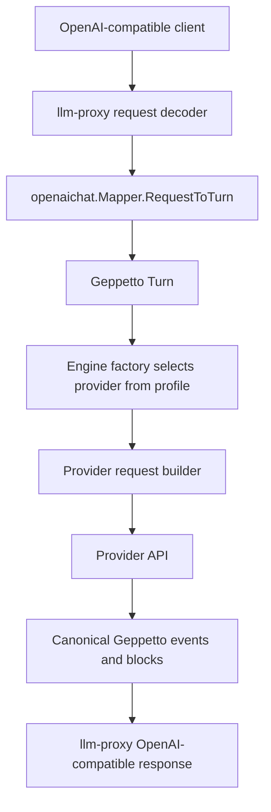
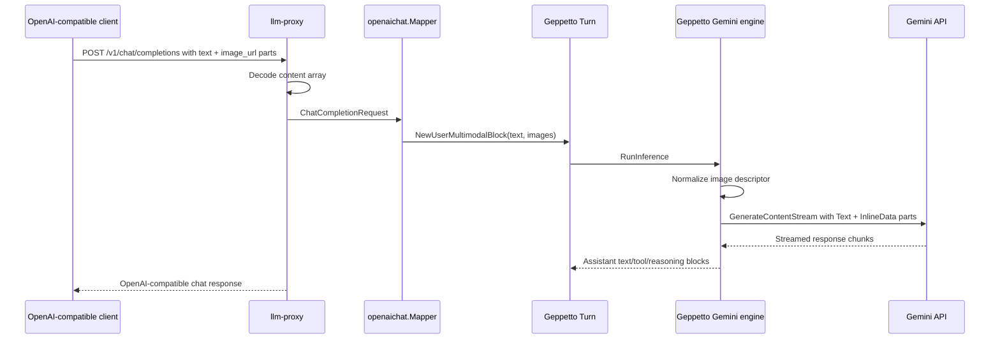

# Image Input Support Intern Guide

## Executive summary

This guide explains how image input should work across `llm-proxy` and Geppetto's provider backends. Geppetto already has a canonical multimodal user block shape, and two backends already understand it well enough to send images to providers. The missing work is not a new top-level conversation model. The missing work is consistent parsing, normalization, provider mapping, and smoke testing.

The most important current facts are these:

- Geppetto's canonical image input shape already exists in `turns.NewUserMultimodalBlock`. It stores text under `PayloadKeyText` and image descriptors under `PayloadKeyImages`.
- Geppetto OpenAI Responses has the strongest current image support. It maps image URL, data URL, inline bytes/base64 plus media type, `file_id`, and detail values into `input_image` content parts.
- Geppetto OpenAI Chat has partial image support. It maps image descriptors into Chat Completions `image_url` parts.
- Geppetto Claude has partial image support. It maps inline base64 image content with media type into Claude image content blocks, but it does not map arbitrary image URLs.
- Geppetto Gemini's modern SDK path does not yet map `PayloadKeyImages`; it currently maps text, reasoning, tool calls, and function responses.
- `llm-proxy` currently rejects OpenAI-compatible `messages[].content` arrays, so images cannot enter Geppetto through the proxy even when a backend could handle them.

The target design is a narrow, reviewable implementation:

1. Keep Geppetto's canonical `PayloadKeyImages` shape as the internal representation.
2. Teach `llm-proxy` to accept OpenAI-compatible Chat content arrays on user messages.
3. Normalize image parts into Geppetto image descriptor maps.
4. Add a shared image normalization helper in Geppetto so providers do not each parse URLs, data URLs, bytes, and base64 strings differently.
5. Add Gemini `InlineData` image support in the modern Gemini adapter.
6. Add fixture tests and direct provider smokes before proxy smokes.

## Problem statement and scope

The user-facing request is to understand image input for both `llm-proxy` and Geppetto's four main provider backends: OpenAI Chat, OpenAI Responses, Claude, and Gemini. The implementation goal is to make an OpenAI-compatible Chat request with image content flow through `llm-proxy`, become a Geppetto multimodal turn, and then be translated correctly for the selected provider.

The scope includes:

- OpenAI-compatible Chat Completions content-array parsing in `llm-proxy`.
- Geppetto canonical image descriptors on user turns.
- Provider request construction for OpenAI Chat, OpenAI Responses, Claude, and Gemini.
- Image URL, data URL, inline bytes/base64, media type, detail, and provider-specific file references where supported.
- Fixture tests for parsing and provider mapping.
- Smoke scripts that archive request/response artifacts under a ticket workspace.

The scope does not include:

- Automatic remote image downloading in `llm-proxy` or Geppetto.
- Provider file-upload orchestration for every backend.
- Image generation output.
- Audio/video support, except where Gemini's `Part` type can represent those in the same `InlineData` mechanism.
- Arbitrary non-user role image input in the first phase.

The first phase should support images only on user messages. That is the common provider shape and avoids unclear semantics around assistant image replay, tool result images, and system prompt images.

## Current-state architecture

### Core representation: Geppetto turns and blocks

Geppetto represents conversation state as a `turns.Turn` containing `turns.Block` values. The relevant block constructor already exists:

```go
// NewUserMultimodalBlock creates a user block with text and optional images.
// images is a slice of maps with keys:
//   - "media_type" (string) for inline content
//   - either "url" (string), "content" ([]byte/base64), or provider-specific "file_id" (string)
//   - optional "detail" for providers that support image detail selection
func NewUserMultimodalBlock(text string, images []map[string]any) Block {
    payload := map[string]any{PayloadKeyText: text}
    if len(images) > 0 {
        payload[PayloadKeyImages] = images
    }
    return Block{Kind: BlockKindUser, Role: RoleUser, Payload: payload}
}
```

Source: `pkg/turns/helpers_blocks.go:24-40`.

This is the right internal representation to keep. It is already provider-neutral, uses the existing block model, and gives providers enough information to choose their own request shape. The implementation should improve normalization around this representation rather than inventing a second image model.

### Request flow without images

The current proxy and provider flow is:



Image support needs to change only two parts of this sequence in the first implementation:

1. `llm-proxy` must decode and map OpenAI-compatible content arrays into `turns.NewUserMultimodalBlock`.
2. Provider request builders must map `PayloadKeyImages` consistently.

The rest of the runtime path remains the same.

## Current backend support matrix

| Layer / backend | Current image input support | Evidence | Main gap |
|---|---|---|---|
| `llm-proxy` Chat Completions | Not supported | `ContentString` rejects JSON arrays with `unsupported_content_shape` in `llm-proxy/pkg/openaichat/types.go:121-130`. | Accept OpenAI Chat content arrays and map user image parts into Geppetto image descriptors. |
| `llm-proxy` Completions | Not applicable for images | Completions is a prompt-string API in this prototype. | Keep text-only unless a separate compatibility extension is requested. |
| Geppetto OpenAI Chat | Partial support | `pkg/steps/ai/openai/helpers.go:237-266` builds text and `image_url` parts from `PayloadKeyImages`. | Normalize input, add tests for URL/data URL/inline content, and decide provider behavior for missing media type. |
| Geppetto OpenAI Responses | Strongest support today | `pkg/steps/ai/openai_responses/helpers.go:604-637` maps `PayloadKeyImages` to `input_image`; tests cover URL, inline bytes, multiple images, detail. | Extract reusable normalization so Responses is not the only robust implementation. |
| Geppetto Claude | Partial support | `pkg/steps/ai/claude/helpers.go:235-248` maps inline image content to Claude image blocks. | No generic URL support; needs normalized inline-only behavior and clear errors/skips for URL images. |
| Geppetto Gemini modern path | Not supported yet | `pkg/steps/ai/gemini/modern_adapter.go:241-253` maps user/system/other blocks only as text. | Add `InlineData` mapping for inline images and possibly `FileData` for Gemini file URIs. |

## llm-proxy request parsing

### Current behavior

`llm-proxy` accepts Chat message content only when it is a JSON string. If content is a JSON array, validation fails:

```go
func (m ChatMessage) ContentString() (string, error) {
    var s string
    if err := json.Unmarshal(m.Content, &s); err == nil {
        return s, nil
    }
    var arr []json.RawMessage
    if err := json.Unmarshal(m.Content, &arr); err == nil {
        return "", FieldError{Field: "content", Message: "message content arrays are not supported in this prototype", Code: "unsupported_content_shape"}
    }
    return "", FieldError{Field: "content", Message: "message content must be a string", Code: "unsupported_content_shape"}
}
```

Source: `llm-proxy/pkg/openaichat/types.go:121-130`.

The mapper then calls `ContentString` for user messages and always appends `turns.NewUserTextBlock`:

```go
case "user":
    text, _ := msg.ContentString()
    turns.AppendBlock(t, turns.NewUserTextBlock(text))
```

Source: `llm-proxy/pkg/openaichat/mapper.go:29-31`.

This is the first blocker. Even if a selected Geppetto provider can send images, no image can pass through the proxy today because the request is rejected before it reaches the mapper.

### Target OpenAI-compatible input shape

The first phase should support the standard Chat Completions content-array shape:

```json
{
  "model": "gemini-3-flash-preview",
  "messages": [
    {
      "role": "user",
      "content": [
        { "type": "text", "text": "What is in this image?" },
        {
          "type": "image_url",
          "image_url": {
            "url": "data:image/png;base64,iVBORw0KGgo=",
            "detail": "auto"
          }
        }
      ]
    }
  ]
}
```

The parser should also tolerate the compact form that some clients use:

```json
{ "type": "image_url", "image_url": "https://example.com/image.png" }
```

The mapper should produce one user multimodal block:

```go
turns.NewUserMultimodalBlock("What is in this image?", []map[string]any{
    {
        "url":        "data:image/png;base64,iVBORw0KGgo=",
        "media_type": "image/png",
        "detail":     "auto",
    },
})
```

If the content array contains multiple text parts, concatenate them with newlines unless the project decides to preserve text segments separately. A single user block with one text payload is consistent with the current Geppetto block model and provider helpers.

### Proposed llm-proxy types

Add explicit content-part types next to `ChatMessage`:

```go
type ChatContentPart struct {
    Type     string                  `json:"type"`
    Text     string                  `json:"text,omitempty"`
    ImageURL ChatContentPartImageURL `json:"image_url,omitempty"`
}

type ChatContentPartImageURL struct {
    URL    string `json:"url,omitempty"`
    Detail string `json:"detail,omitempty"`
}
```

Because `image_url` may be either an object or a string in real client payloads, use a custom unmarshal helper or parse it from `json.RawMessage` instead of relying only on a static struct.

Add a method that returns both text and image descriptors:

```go
func (m ChatMessage) ContentParts() (text string, images []map[string]any, ok bool, err error)
```

Expected behavior:

- If content is a JSON string, return text and no images.
- If content is a JSON array, parse `text` and `image_url` parts.
- If the role is not `user`, reject image parts in phase one.
- If an image URL is a data URL, extract `media_type` when possible.
- Preserve `detail` when present and non-empty.
- Return `unsupported_content_part` for unknown content part types.

The mapper then becomes:

```go
case "user":
    text, images, _, err := msg.ContentParts()
    if err != nil { return nil, err }
    if len(images) > 0 {
        turns.AppendBlock(t, turns.NewUserMultimodalBlock(text, images))
    } else {
        turns.AppendBlock(t, turns.NewUserTextBlock(text))
    }
```

## Shared Geppetto image normalization

Provider implementations currently parse image maps independently. That is why OpenAI Responses has robust handling while Claude and OpenAI Chat are narrower, and Gemini has no handling in the modern path.

Introduce a small provider-neutral helper package or helper file in Geppetto, for example:

```text
pkg/steps/ai/imageparts
```

or, if a new package is too much for the first patch:

```text
pkg/steps/ai/streamhelpers/image_parts.go
```

The helper should define a normalized struct:

```go
type ImagePart struct {
    MediaType string
    URL       string
    Data      []byte
    FileID    string
    FileURI   string
    Detail    string
}
```

Normalization should accept the map shape already documented by `NewUserMultimodalBlock`:

```go
func NormalizeImageMap(img map[string]any) (ImagePart, bool, error)
```

It should support these keys:

| Key | Meaning |
|---|---|
| `url` | Public or provider-readable image URL. |
| `image_url` | Alias used by OpenAI-compatible request shapes. |
| `content` | Inline image bytes, base64 string, or full data URL string. |
| `media_type` | MIME type such as `image/png`, required for inline raw/base64 content. |
| `detail` | OpenAI detail hint: `auto`, `low`, `high`; preserve only for providers that support it. |
| `file_id` | OpenAI Responses file reference. |
| `file_uri` | Gemini file URI, usually a provider-side URI rather than arbitrary HTTP URL. |

Pseudocode:

```go
func NormalizeImageMap(img map[string]any) (ImagePart, bool, error) {
    p := ImagePart{Detail: normalizeDetail(img["detail"])}

    if s := firstString(img["url"], img["image_url"]); s != "" {
        if media, data, ok := parseDataURL(s); ok {
            p.MediaType = media
            p.Data = data
            return p, true, nil
        }
        p.URL = s
        return p, true, nil
    }

    if s := firstString(img["file_id"]); s != "" {
        p.FileID = s
        return p, true, nil
    }

    if s := firstString(img["file_uri"]); s != "" {
        p.FileURI = s
        p.MediaType = firstString(img["media_type"])
        return p, true, nil
    }

    if raw, ok := img["content"]; ok && raw != nil {
        if s, ok := raw.(string); ok && strings.HasPrefix(strings.TrimSpace(s), "data:") {
            p.MediaType, p.Data = decodeDataURL(s)
            return p, true, nil
        }
        p.MediaType = firstString(img["media_type"])
        if p.MediaType == "" { return ImagePart{}, false, ErrMissingMediaType }
        p.Data = decodeBytesOrBase64(raw)
        return p, len(p.Data) > 0, nil
    }

    return ImagePart{}, false, nil
}
```

The helper should not download remote URLs. Remote URL handling is provider-specific:

- OpenAI Chat can accept URL/data URL through `image_url`.
- OpenAI Responses can accept URL/data URL through `input_image.image_url`.
- Claude's current API helper supports base64 image content, not generic URL image sources.
- Gemini's `google.golang.org/genai` supports inline bytes through `InlineData` and provider-side file URIs through `FileData`; arbitrary HTTP URL support should be confirmed before mapping `url` to `FileData`.

## Provider mapping details

### OpenAI Chat backend

Current support is in `pkg/steps/ai/openai/helpers.go:237-266`. If a block has `PayloadKeyImages`, it constructs a multi-content message:

```go
parts := []ChatMessagePart{{Type: chatMessagePartTypeText, Text: text}}
for _, img := range imgs {
    mediaType, _ := img["media_type"].(string)
    url, _ := img["url"].(string)
    // content can be []byte or base64 string
    imageURL := url
    if imageURL == "" && base64Content != "" {
        imageURL = fmt.Sprintf("data:%s;base64,%s", mediaType, base64Content)
    }
    parts = append(parts, ChatMessagePart{Type: chatMessagePartTypeImageURL, ImageURL: &ChatMessageImageURL{URL: imageURL}})
}
```

Recommended changes:

- Replace local parsing with shared normalization.
- Accept `image_url` alias as well as `url`.
- Preserve valid detail values instead of always using `auto`.
- Add tests for URL, data URL, inline bytes, inline base64, and multiple images.
- Decide whether missing media type on inline content should be an error or should skip the image. The safer behavior for intern implementation is to return an explicit error in fixture tests, because silent image drops are hard to debug.

### OpenAI Responses backend

Current support is in `pkg/steps/ai/openai_responses/helpers.go:604-637`. It already maps images into `responsesContentPart{Type: "input_image"}` and supports these shapes:

- `url` or `image_url`.
- `content` as data URL.
- `content` as bytes/base64 plus `media_type`.
- `file_id`.
- `detail` with normalization.

The existing tests in `helpers_test.go` cover:

- `TestBuildInputItemsFromTurn_UserMessageWithImageURL`.
- `TestBuildInputItemsFromTurn_UserMessageWithInlineImageBytes`.
- `TestBuildInputItemsFromTurn_UserMessageWithMixedTextAndMultipleImages`.

Recommended changes:

- Keep behavior as the baseline contract.
- Move the map parsing into the shared helper without changing output behavior.
- Add a regression test proving the helper does not change Responses image output.
- Keep `file_id` support provider-specific to Responses.

### Claude backend

Current support is in `pkg/steps/ai/claude/helpers.go:235-248`. It appends Claude image content when a user block has inline `content` plus `media_type`:

```go
if imgs, ok := b.Payload[turns.PayloadKeyImages].([]map[string]any); ok && len(imgs) > 0 {
    for _, img := range imgs {
        mediaType, _ := img["media_type"].(string)
        if raw, ok := img["content"]; ok && raw != nil {
            var base64Content string
            switch rv := raw.(type) {
            case []byte:
                base64Content = base64.StdEncoding.EncodeToString(rv)
            case string:
                base64Content = rv
            }
            if base64Content != "" {
                parts = append(parts, api.NewImageContent(mediaType, base64Content))
            }
        }
    }
}
```

Claude's local API model has `api.NewImageContent(mediaType, base64Data)`. The implementation should continue to send inline base64 content through that path.

Recommended changes:

- Use shared normalization for inline content.
- Decode data URLs into media type and bytes/base64 before creating Claude image content.
- Reject or skip plain remote URLs with a clear test. Do not silently send an HTTP URL as base64 data.
- Add fixture tests for inline bytes, inline base64, and data URL.

### Gemini backend

The modern Gemini path currently ignores images. `buildModernGeminiContentsFromTurn` maps user/system/other blocks only to text:

```go
case turns.BlockKindUser, turns.BlockKindSystem, turns.BlockKindOther:
    content.Role = string(moderngenai.RoleUser)
    if txt, ok := blockText(b); ok {
        content.Parts = append(content.Parts, moderngenai.NewPartFromText(txt))
    }
```

Source: `pkg/steps/ai/gemini/modern_adapter.go:241-246`.

The modern SDK supports inline data through `Part.InlineData`:

```go
type Part struct {
    FileData   *FileData `json:"fileData,omitempty"`
    InlineData *Blob     `json:"inlineData,omitempty"`
    Text       string    `json:"text,omitempty"`
}

type Blob struct {
    Data     []byte `json:"data,omitempty"`
    MIMEType string `json:"mimeType,omitempty"`
}
```

Source: `/home/manuel/go/pkg/mod/google.golang.org/genai@v1.58.0/types.go:1328-1431`.

Recommended implementation:

```go
case turns.BlockKindUser, turns.BlockKindSystem, turns.BlockKindOther:
    content.Role = string(moderngenai.RoleUser)
    if txt, ok := blockText(b); ok {
        content.Parts = append(content.Parts, moderngenai.NewPartFromText(txt))
    }
    for _, img := range imagesFromBlock(b) {
        norm, ok, err := imageparts.NormalizeImageMap(img)
        if err != nil { return nil, err }
        if !ok { continue }
        switch {
        case len(norm.Data) > 0:
            content.Parts = append(content.Parts, &moderngenai.Part{
                InlineData: &moderngenai.Blob{MIMEType: norm.MediaType, Data: norm.Data},
            })
        case norm.FileURI != "":
            content.Parts = append(content.Parts, moderngenai.NewPartFromURI(norm.FileURI, norm.MediaType))
        case norm.URL != "":
            return nil, fmt.Errorf("gemini image url requires inline content or provider file_uri")
        }
    }
```

Do not map arbitrary `https://...` URLs to `FileData.FileURI` unless the team confirms Gemini API accepts them for the selected backend. The SDK comment says `FileData.FileURI` is a URI pointing to stored data, especially Google Cloud Storage. Treat that as provider-side file reference behavior, not generic web fetching.

## End-to-end target flow

The desired successful path through `llm-proxy` and Gemini is:



The same Geppetto turn should also work with OpenAI Responses and Claude where provider constraints allow it. The purpose of the shared representation is that the proxy does not need provider-specific image logic beyond preserving the client's content parts.

## Decision records

### Decision: Keep `PayloadKeyImages` as the canonical image representation

- **Context:** Geppetto already has `NewUserMultimodalBlock`, and providers already consume `PayloadKeyImages` in multiple places.
- **Options considered:** Keep `PayloadKeyImages`; add a new `BlockKindImage`; store OpenAI content arrays directly in turn payloads.
- **Decision:** Keep `PayloadKeyImages` on user blocks as the canonical phase-one representation.
- **Rationale:** It requires the least migration, matches existing provider helpers, and keeps text plus images in one user message.
- **Consequences:** Image descriptors remain map-based unless a later phase introduces typed payload structs. Tests must enforce the accepted map keys.
- **Status:** proposed

### Decision: Add shared normalization before expanding provider-specific behavior

- **Context:** Responses, OpenAI Chat, and Claude currently parse image maps differently.
- **Options considered:** Patch each provider independently; add shared normalization; move all content parts into a new canonical typed block model.
- **Decision:** Add shared normalization for the existing map shape.
- **Rationale:** It reduces duplicated parsing while keeping the provider-specific request builders simple and reviewable.
- **Consequences:** Providers still decide what to do with normalized URL, inline data, file IDs, and file URIs. Unsupported shapes should return clear errors in tests.
- **Status:** proposed

### Decision: Accept OpenAI Chat content arrays only for user messages in phase one

- **Context:** OpenAI-compatible clients send images in user content arrays, but assistant/system/tool image semantics need provider-specific replay rules.
- **Options considered:** Support content arrays for all roles immediately; support only user content arrays; continue rejecting arrays.
- **Decision:** Support text and image content arrays for user messages first.
- **Rationale:** User image input is the main product requirement and maps cleanly to `NewUserMultimodalBlock`.
- **Consequences:** Non-user image parts should return a clear validation error until replay semantics are designed.
- **Status:** proposed

### Decision: Gemini should support inline data first, file URIs second, generic URLs later

- **Context:** The modern Gemini SDK exposes `InlineData` and `FileData`. The `FileData` comment describes provider-side stored data, not arbitrary public HTTP fetching.
- **Options considered:** Map all URLs to `FileData`; require inline content only; support inline content plus explicit `file_uri`.
- **Decision:** Implement inline `content`/data URL support first and explicit `file_uri` support if needed. Do not map generic `url` to Gemini `FileData` without a live API test.
- **Rationale:** Inline image bytes are unambiguous and testable. Generic URL behavior can vary by backend and account configuration.
- **Consequences:** `llm-proxy` users targeting Gemini may need to send data URLs in phase one.
- **Status:** proposed

## Implementation plan

### Phase 1: Write parser and mapper tests in llm-proxy

Files:

```text
/home/manuel/workspaces/2026-06-04/llm-proxy/llm-proxy/pkg/openaichat/types.go
/home/manuel/workspaces/2026-06-04/llm-proxy/llm-proxy/pkg/openaichat/types_test.go
/home/manuel/workspaces/2026-06-04/llm-proxy/llm-proxy/pkg/openaichat/mapper.go
/home/manuel/workspaces/2026-06-04/llm-proxy/llm-proxy/pkg/openaichat/mapper_test.go
```

Tasks:

1. Add content part parsing for strings and arrays.
2. Preserve existing string-only tests.
3. Replace the current `TestDecodeChatCompletionRejectsUnsupportedContentArray` with positive tests for text-only arrays and text-plus-image arrays.
4. Add negative tests for unknown part types, missing image URLs, and image parts on non-user roles.
5. Assert mapper output uses `turns.NewUserMultimodalBlock` semantics when images exist.

### Phase 2: Add shared Geppetto image normalization

Files:

```text
/home/manuel/workspaces/2026-06-04/llm-proxy/geppetto/pkg/steps/ai/<chosen-helper-location>/image_parts.go
/home/manuel/workspaces/2026-06-04/llm-proxy/geppetto/pkg/steps/ai/<chosen-helper-location>/image_parts_test.go
```

Tasks:

1. Normalize `url`, `image_url`, data URL, inline bytes, inline base64, `file_id`, `file_uri`, `media_type`, and `detail`.
2. Decode data URLs into media type and bytes.
3. Return explicit errors for inline content without media type.
4. Keep the helper provider-neutral; do not mention OpenAI, Claude, or Gemini in the normalized struct except through generic fields.

### Phase 3: Refactor OpenAI Responses to use shared normalization

Files:

```text
pkg/steps/ai/openai_responses/helpers.go
pkg/steps/ai/openai_responses/helpers_test.go
```

Tasks:

1. Preserve existing behavior exactly.
2. Keep `file_id` and `detail` mapping.
3. Run existing helper tests.

### Phase 4: Refactor OpenAI Chat image mapping

Files:

```text
pkg/steps/ai/openai/helpers.go
pkg/steps/ai/openai/helpers_test.go
```

Tasks:

1. Use shared normalization.
2. Preserve URL and data URL output as `image_url` parts.
3. Add fixture tests for multiple image shapes.

### Phase 5: Refactor Claude image mapping

Files:

```text
pkg/steps/ai/claude/helpers.go
pkg/steps/ai/claude/helpers_test.go
```

Tasks:

1. Use shared normalization.
2. Support inline bytes, base64 strings, and data URLs.
3. Return a clear error or skip with diagnostic behavior for plain URLs. Prefer an explicit error in tests if provider request construction should not silently lose images.

### Phase 6: Add Gemini image mapping

Files:

```text
pkg/steps/ai/gemini/modern_adapter.go
pkg/steps/ai/gemini/modern_adapter_test.go
```

Tasks:

1. Extend user block mapping to append image parts after text parts.
2. Map inline content to `&moderngenai.Part{InlineData: &moderngenai.Blob{MIMEType, Data}}`.
3. Optionally map explicit `file_uri` to `moderngenai.NewPartFromURI`.
4. Reject generic URLs until live API behavior is confirmed.
5. Add fixture tests for inline image bytes/data URLs.

### Phase 7: Add direct provider smokes and then proxy smokes

Direct Geppetto smokes should run before proxy smokes. Each smoke should archive artifacts under the ticket workspace.

Suggested scripts:

```text
scripts/01-geppetto-image-smoke/main.go
scripts/02-llm-proxy-image-smoke.py
scripts/artifacts/<backend>-image-summary.json
scripts/artifacts/<backend>-image-request.json
scripts/artifacts/<backend>-image-response.json
scripts/artifacts/<backend>-image-events.ndjson
scripts/artifacts/<backend>-image-turn.yaml
```

Smoke matrix:

| Smoke | Input | Expected result |
|---|---|---|
| OpenAI Responses image URL | Public URL or data URL | Provider request contains `input_image`; response completes. |
| OpenAI Chat image URL | Public URL or data URL | Provider request contains `image_url`; response completes if model supports vision. |
| Claude inline image | Base64 or bytes + media type | Provider request contains Claude image block; response completes on vision model. |
| Gemini inline image | Data URL or bytes + media type | Provider request contains `InlineData`; response completes. |
| `llm-proxy` image chat | OpenAI-compatible content array | Proxy maps to multimodal turn and selected backend receives image part. |

## Test strategy

### Unit tests

- `llm-proxy/pkg/openaichat/types_test.go`: parsing strings, arrays, image URL object, image URL string, data URLs, invalid part types.
- `llm-proxy/pkg/openaichat/mapper_test.go`: content arrays become Geppetto multimodal blocks.
- Shared Geppetto image helper tests: URL, data URL, bytes, base64, missing media type, detail normalization.
- Provider helper tests: each provider receives the expected request shape from the same canonical block.

### Integration tests without live provider calls

Use existing request-building helpers where possible. For providers that expose request structs before HTTP calls, assert JSON payload shape. This catches mapping bugs without requiring credentials.

### Live smokes

Use a small checked-in test image or generated 1x1 PNG. Do not use private images. Store only small image fixtures and redacted request artifacts. Do not store provider API keys or bearer tokens.

### Secret scan

After generating artifacts, run a scan like:

```bash
rg -n "AIza|GEMINI_API_KEY|GOOGLE_API_KEY|GENAI_API_KEY|OPENAI_API_KEY|ANTHROPIC_API_KEY|Authorization: Bearer" \
  ttmp/2026/06/05/2026-06-05-geppetto-llm-proxy-image-input--geppetto-and-llm-proxy-image-input-support/scripts \
  pkg/steps/ai llm-proxy/pkg || true
```

## Risks and open questions

- Gemini generic URL handling needs live verification. Inline data is safe to implement first.
- Claude URL images need a policy. The current Claude helper supports base64 image blocks, not generic remote URLs.
- The map-based image descriptor is flexible but weakly typed. Shared normalization and tests must define the actual supported contract.
- Large inline data URLs can make logs and artifacts huge. Smoke artifacts should use a tiny image fixture and should redact or summarize large payloads when needed.
- `llm-proxy` streaming does not need image-specific response logic for phase one, but request artifacts must prove images were sent to the provider.
- Some provider models are text-only. Smoke scripts must distinguish model capability errors from adapter bugs.

## Intern checklist

Before editing code:

1. Read `pkg/turns/helpers_blocks.go:24-40`.
2. Read `llm-proxy/pkg/openaichat/types.go:60-130` and `mapper.go:20-45`.
3. Read `pkg/steps/ai/openai_responses/helpers.go:604-637` and the image tests in `helpers_test.go`.
4. Read `pkg/steps/ai/openai/helpers.go:237-266`.
5. Read `pkg/steps/ai/claude/helpers.go:235-248`.
6. Read `pkg/steps/ai/gemini/modern_adapter.go:241-253`.
7. Read the SDK fields in `/home/manuel/go/pkg/mod/google.golang.org/genai@v1.58.0/types.go:1328-1431`.

Before opening a PR:

1. Run focused Geppetto tests for provider helpers.
2. Run `go test ./... -count=1` in `llm-proxy`.
3. Run direct Geppetto image smokes.
4. Run proxy image smokes only after direct provider behavior is understood.
5. Update ticket artifacts, diary, and changelog.
6. Run `docmgr doctor --ticket 2026-06-05-geppetto-llm-proxy-image-input --stale-after 30`.

## References

Repository files:

- `/home/manuel/workspaces/2026-06-04/llm-proxy/geppetto/pkg/turns/helpers_blocks.go`
- `/home/manuel/workspaces/2026-06-04/llm-proxy/geppetto/pkg/steps/ai/openai_responses/helpers.go`
- `/home/manuel/workspaces/2026-06-04/llm-proxy/geppetto/pkg/steps/ai/openai_responses/helpers_test.go`
- `/home/manuel/workspaces/2026-06-04/llm-proxy/geppetto/pkg/steps/ai/openai/helpers.go`
- `/home/manuel/workspaces/2026-06-04/llm-proxy/geppetto/pkg/steps/ai/claude/helpers.go`
- `/home/manuel/workspaces/2026-06-04/llm-proxy/geppetto/pkg/steps/ai/gemini/modern_adapter.go`
- `/home/manuel/workspaces/2026-06-04/llm-proxy/llm-proxy/pkg/openaichat/types.go`
- `/home/manuel/workspaces/2026-06-04/llm-proxy/llm-proxy/pkg/openaichat/mapper.go`

API references:

- OpenAI Chat Completions create API: `https://platform.openai.com/docs/api-reference/chat/create`
- OpenAI Responses create API: `https://platform.openai.com/docs/api-reference/responses/create`
- Anthropic Messages API: `https://docs.anthropic.com/en/api/messages`
- Gemini Go SDK package: `https://pkg.go.dev/google.golang.org/genai`

Ticket artifacts:

- `analysis/01-evidence-and-gap-matrix.md`
- `reference/01-investigation-diary.md`
- `scripts/01-evidence-line-anchors.md`
